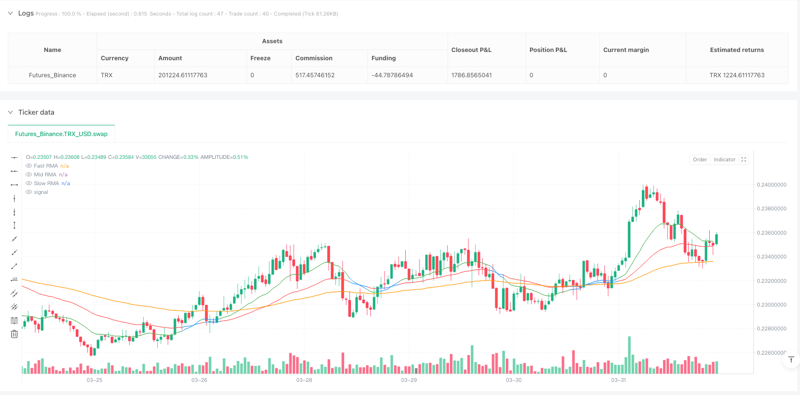
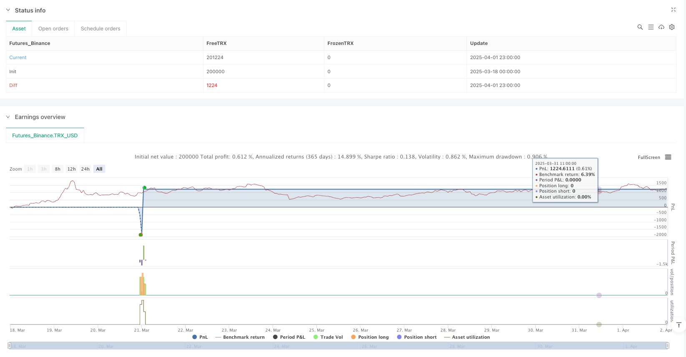

> Name

Dynamic-Threshold-Triple-Running-Moving-Average-Trend-Trading-Strategy
> Author

ianzeng123

> Strategy Description





[trans]
# Overview
The dynamic threshold triple running moving average trend trading strategy is a quantitative trading method based on a multi-level moving average system. This strategy uses three running moving averages (RMA) of different periods to determine the market trend direction and identify trading opportunities. At the same time, this strategy also combines the Relative Strength Index (RSI) and candle chart structure analysis to provide higher probability entry signals. The strategy is specifically designed with a dynamic threshold system that automatically adjusts according to different market types (Forex, Gold and Cryptocurrencies), allowing it to adapt to the volatility characteristics of different asset classes.
# Strategy principle
The core of this strategy is the three-layer RMA system and dynamic threshold judgment mechanism:
1. **Triple RMA System**:
   - Fast RMA (default 9 periods): sensitive to price changes and captures short-term momentum
   - Medium speed RMA (default 21 periods): filter market noise and confirm the mid-term trend
   - Slow RMA (default 50 periods): represents the overall market structure and bias
2. **Judgement of trend direction**:
   - Bullish structure: Fast RMA > Medium RMA > Slow RMA
   - Bearish structure: Fast RMA < Medium RMA < Slow RMA
3. **Dynamic Threshold System**:
   - Set corresponding weekly thresholds according to different market types: foreign exchange (0.12%), gold (0.15%), cryptocurrency (0.25%)
   - Determine whether the market is in an obvious trend by calculating the percentage distance between the fast RMA and the medium RMA
4. **Admission conditions**:
   - Bull signal: Bullish RMA structure + closing price crosses above medium speed RMA + RSI > 50 + current closing price breaks above the previous candle high
   - Short signal: Bearish RMA structure + closing price below medium speed RMA + RSI < 50 + current closing price breaks through the low of the previous candle
5. **Take profit and stop loss settings**:
   - Take Profit: Set to slow RMA position
   - Stop loss: calculated based on user-defined pips
#Strategic advantage
1. **Adaptive Market Type**:
   - The market type selector allows the strategy to automatically adjust threshold parameters based on the volatility characteristics of the traded asset
   - Provides specially optimized parameter settings for different volatility markets such as foreign exchange, gold and cryptocurrencies
2. **Multi-level confirmation mechanism**:
   - Combines triple moving averages, RSI momentum confirmations and price structure breakouts to provide high-quality trading signals
   - Effectively reduce false signals and low-probability transactions through multiple condition screening
3. **Quantification of trend strength**:
   - Dynamically assess trend strength through RMA distance percentage instead of using fixed parameters
   - Ability to flexibly adjust under different volatility environments to avoid frequent trading in consolidating markets
4. **Visualized trend status**:
   - Dynamically adjust the RMA line color according to the trend status to visually display the market status
   - When the market is in a strong trend, the fast RMA is displayed in green and the medium-speed RMA is displayed in red, helping traders to quickly identify the market environment.
5. **Reasonable stop-profit and stop-loss mechanism**:
   - Using slow RMA as the profit-taking target is in line with the market characteristics of trend reversion to the mean.
   - Allows users to flexibly set stop loss points to balance risk and retracement control
#Strategy risk
1. **False signals in volatile markets**:
   - Despite the dynamic threshold system, false signals can still be generated in volatile markets
   - Continuous losing transactions may occur in the early stage of trend conversion, affecting the stability of the capital curve
2. **Parameter sensitivity**:
   - RMA length and threshold parameter settings have a significant impact on strategy performance
   - Optimal parameters may be very different under different time periods and market conditions and require continuous monitoring and adjustment
3. **Fixed Stop Loss Risk**:
   - The strategy uses a fixed number of pips to set the stop loss, which may not be enough to protect funds in market conditions with sudden increases in volatility
   - Failure to consider market-specific structural locations (such as support and resistance levels) to optimize stop loss placement
4. **Depends on historical backtest parameters**:
   - Preset market type thresholds are based on historical data and may not apply to future market conditions
   - Market characteristics change over time, and fixed thresholds may not be able to continuously adapt
5. **Signal hysteresis**:
   - RMA-based systems are inherently lagging and may miss the best entry points in rapidly reversing markets
   - In extreme market events, strategies may not have time to adjust positions and suffer large losses.
# Strategy optimization direction
1. **Adaptive threshold optimization**:
   - Implement truly adaptive threshold calculation rather than based on preset market type selection
   - You can dynamically adjust the trend judgment threshold by calculating the average true volatility (ATR) and price ratio of the last N periods
2. **Enhanced stop loss mechanism**:
   - Introducing ATR-based dynamic stop loss to match stop loss levels with current market volatility
   - Consider adding a trailing stop function to lock in some profits when the trend develops favorably
3. **Market status classification optimization**:
   - Add clear judgment logic for range market/trend market to avoid generating wrong signals in consolidation market
   - Market status classification can be optimized by detecting the parallelism of RMA lines and trend strength indicators such as ADX
4. **Time filter**:
   - Add time filtering function to avoid trading during important economic data releases or periods of insufficient liquidity
   - Implement intraday/weekly optimization time window screening to adapt to the best trading periods in different markets
5. **Partial Profit Locked**:
   - Implement a stepped take-profit strategy to lock in profits in batches when the price reaches a specific moving distance
   - This can improve the overall risk-reward ratio, especially when trading long-term trends
6. **Filter Tuning**:
   -Add trading volume confirmation conditions to ensure there is sufficient market participation when the signal occurs
   - Consider introducing a market volatility filter to reduce positions or suspend trading in unusually high volatility environments
# Summarize
The dynamic threshold triple running moving average trend trading strategy is a well-structured quantitative trading system that provides an intelligent market adaptation mechanism through a three-layer RMA system and dynamic threshold judgment. This strategy combines the advantages of trend following, momentum confirmation and price structure analysis and is optimized for the volatility characteristics of different asset classes.
The main advantage of the strategy is its multi-level confirmation mechanism and market adaptability, which can effectively reduce false signals and maintain stability under different market conditions. However, it also faces risks such as false signals in the volatile market and parameter sensitivity.
This strategy has great room for improvement by implementing improvements such as adaptive threshold calculation, enhanced stop loss mechanism, and market status classification optimization. Especially combined with ATR's dynamic stop loss and profit locking functions, risk management capabilities can be significantly improved, allowing the strategy to remain robust in various market environments.
For quantitative investors pursuing trend trading, this strategy provides a solid framework that can be further customized and optimized based on personal risk appetite and money management principles. ||
# Overview

The Dynamic Threshold Triple Running Moving Average Trend Trading Strategy is a quantitative trading method based on a multi-layered moving average system. This strategy utilizes three Running Moving Averages (RMAs) of different periods to determine market trend direction and identify trading opportunities. Additionally, the strategy incorporates the Relative Strength Index (RSI) and candlestick structure analysis to provide higher probability entry signals. The strategy features a dynamic threshold system that automatically adjusts according to different market types (Forex, Gold, and Cryptocurrency), allowing it to adapt to the volatility characteristics of various asset classes.

# Strategy Principle

The core of this strategy is a three-layer RMA system and dynamic threshold detection mechanism:

1. **Triple RMA System**:
   - Fast RMA (default 9 periods): Highly responsive to price changes, captures short-term momentum
   - Mid RMA (default 21 periods): Filters market noise, confirms intermediate trends
   - Slow RMA (default 50 periods): Represents overall market structure and bias

2. **Trend Direction Determination**:
   - Bullish Structure: Fast RMA > Mid RMA > Slow RMA
   - Bearish Structure: Fast RMA < Mid RMA < Slow RMA

3. **Dynamic Threshold System**:
   - Sets appropriate weekly thresholds based on market type: Forex (0.12%), Gold (0.15%), Cryptocurrency (0.25%)
   - Determines whether the market is in a significant trend by calculating the percentage distance between Fast RMA and Mid RMA

4. **Entry Conditions**:
   - Long Signal: Bullish RMA structure + Close price crosses above Mid RMA + RSI > 50 + Current close breaks previous candle's high
   - Short Signal: Bearish RMA structure + Close price crosses below Mid RMA + RSI < 50 + Current close breaks previous candle's low

5. **Take Profit and Stop Loss Setup**:
   - Take Profit: Set at the Slow RMA level
   - Stop Loss: Calculated based on user-defined points

# Strategy Advantages

1. **Adaptive Market Type**:
   - Through the market type selector, the strategy can automatically adjust threshold parameters based on the volatility characteristics of the trading asset
   - Provides specially optimized parameter settings for markets with different volatility profiles such as Forex, Gold, and Cryptocurrency

2. **Multi-layered Confirmation Mechanism**:
   - Combines triple moving averages, RSI momentum confirmation, and price structure breakouts to provide high-quality trading signals
   - Effectively reduces false signals and low-probability trades through multiple condition filtering

3. **Trend Strength Quantification**:
   - Dynamically assesses trend strength through RMA distance percentage, rather than using fixed parameters
   - Flexibly adjusts in different volatility environments, avoiding frequent trading in consolidating markets

4. **Visualization of Trend Status**:
   - Dynamically adjusts RMA line colors according to trend status, intuitively displaying market conditions
   - When the market is in a strong trend, the Fast RMA displays in green and the Mid RMA in red, helping traders quickly identify market environment

5. **Rational Take Profit and Stop Loss Mechanism**:
   - Uses Slow RMA as the take profit target, consistent with the mean-reverting characteristics of market trends
   - Allows users to flexibly set stop loss points, balancing risk and drawdown control

# Strategy Risks

1. **False Signals in Oscillating Markets**:
   - Despite having a dynamic threshold system, false signals may still occur in severely oscillating markets
   - May experience consecutive losing trades during early trend transitions, affecting the stability of the equity curve

2. **Parameter Sensitivity**:
   - RMA lengths and threshold parameter settings significantly impact strategy performance
   - Optimal parameters may vary greatly across different timeframes and market conditions, requiring continuous monitoring and adjustment

3. **Fixed Stop Loss Risk**:
   - The strategy uses fixed points to set stop losses, which may be insufficient to protect capital in market conditions where volatility suddenly increases
   - Does not consider market-specific structural positions (such as support and resistance levels) to optimize stop loss placement

4. **Reliance on Historical Backtesting Parameters**:
   - Preset market type thresholds are based on historical data and may not be applicable to future market conditions
   - Market characteristics change over time, and fixed thresholds may not continuously adapt

5. **Signal Lag**:
   - RMA-based systems inherently have a certain lag, potentially missing optimal entry points in rapidly reversing markets
   - During extreme market events, the strategy may not adjust positions quickly enough, suffering significant losses

# Strategy Optimization Directions

1. **Adaptive Threshold Optimization**:
   - Implement truly adaptive threshold calculations, rather than selection based on preset market types
   - Can dynamically adjust trend determination thresholds by calculating the ratio of Average True Range (ATR) to price over the most recent N periods

2. **Enhanced Stop Loss Mechanism**:
   - Introduce ATR-based dynamic stop losses to match stop loss levels with current market volatility
   - Consider adding trailing stop functionality to lock in partial profits when trends develop favorably

3. **Market State Classification Optimization**:
   - Add explicit logic for range/trend market determination to avoid generating false signals in consolidating markets
   - Can optimize market state classification by detecting RMA line parallelism and trend strength indicators like ADX

4. **Time Filter**:
   - Add time filtering functionality to avoid trading during important economic data releases or periods of insufficient liquidity
   - Implement intraday/weekly optimized time window screening to adapt to the best trading sessions for different markets

5. **Partial Profit Locking**:
   - Implement a stepped take-profit strategy to lock in profits in batches when price reaches specific movement distances
   - This can improve overall risk-reward ratio, especially in long-term trend trading

6. **Filter Tuning**:
   - Add volume confirmation conditions to ensure sufficient market participation when signals occur
   - Consider introducing market volatility filters to reduce position size or pause trading in abnormally high volatility environments

# Summary

The Dynamic Threshold Triple Running Moving Average Trend Trading Strategy is a well-structured quantitative trading system that provides an intelligent market adaptation mechanism through a three-layer RMA system and dynamic threshold judgment. The strategy combines the advantages of trend following, momentum confirmation, and price structure analysis, and is optimized for the volatility characteristics of different asset classes.

The main advantages of the strategy lie in its multi-layered confirmation mechanism and market adaptability, effectively reducing false signals and maintaining stability under different market conditions. However, it also faces risks such as false signals in oscillating markets and parameter sensitivity.

There is significant room for improvement through implementing adaptive threshold calculations, enhancing stop loss mechanisms, and optimizing market state classification. Particularly, dynamic stop losses and profit locking features based on ATR can significantly improve risk management capabilities, maintaining strategy robustness across various market environments.

For quantitative investors pursuing trend trading, this strategy provides a solid framework that can be further customized and optimized according to individual risk preferences and capital management principles.[/trans]


> Source (PineScript)

``` pinescript
/*backtest
start: 2025-03-18 00:00:00
end: 2025-04-02 00:00:00
period: 1h
basePeriod: 1h
exchanges: [{"eid":"Futures_Binance","currency":"TRX_USD"}]
*/

//@version=5
strategy("RMA Strategy - Weekly Dynamic Thresholds", overlay=true, default_qty_type=strategy.percent_of_equity, default_qty_value=100)

// === User Inputs ===
fastLen = input.int(9, title="Fast RMA")
midLen = input.int(21, title="Mid RMA")
slowLen = input.int(50, title="Slow RMA")
rsiLen = input.int(8, title="RSI Length")
slPoints = input.float(10, title="Stop Loss (Points)")

// === Weekly Threshold Inputs ===
forexThreshold = input.float(0.12, title="Forex Weekly Avg RMA Distance (%)", step=0.01)
goldThreshold = input.float(0.15, title="Gold Weekly Avg RMA Distance (%)", step=0.01)
cryptoThreshold = input.float(0.25, title="Crypto Weekly Avg RMA Distance (%)", step=0.01)

// === Select Current Market Type ===
marketType = input.string("FOREX", title="Asset Class", options=["FOREX", "GOLD", "CRYPTO"])

// === Use appropriate threshold based on selected market
weeklyThreshold = marketType == "FOREX" ? forexThreshold :
                  marketType == "GOLD" ? goldThreshold :
                  cryptoThreshold  // Default to crypto if somehow not matched

// === RMA Calculations ===
fastRMA = ta.rma(close, fastLen)
midRMA = ta.rma(close, midLen)
slowRMA = ta.rma(close, slowLen)

// === RSI Calculation ===
rsi = ta.rsi(close, rsiLen)

// === Trend Structure ===
bullish = fastRMA > midRMA and midRMA > slowRMA
bearish = fastRMA < midRMA and midRMA < slowRMA

// === Candle Break Conditions ===
longCandleBreak = close > high[1]
shortCandleBreak = close < low[1]

// === Distance and Trend Strength Check ===
distance = math.abs(fastRMA - midRMA)
distancePct = distance / midRMA * 100
isTrending = distancePct >= weeklyThreshold

// === Entry Conditions ===
longSignal = bullish and ta.crossover(close, midRMA) and rsi > 50 and longCandleBreak
shortSignal = bearish and ta.crossunder(close, midRMA) and rsi < 50 and shortCandleBreak

// === TP and SL Setup ===
takeProfitPriceLong = slowRMA
stopLossPriceLong = close - slPoints * syminfo.mintick

takeProfitPriceShort = slowRMA
stopLossPriceShort = close + slPoints * syminfo.mintick

// === Trade Execution ===
if (longSignal)
    strategy.entry("Long", strategy.long)
    strategy.exit("TP/SL Long", from_entry="Long", limit=takeProfitPriceLong, stop=stopLossPriceLong)

if (shortSignal)
    strategy.entry("Short", strategy.short)
    strategy.exit("TP/SL Short", from_entry="Short", limit=takeProfitPriceShort, stop=stopLossPriceShort)

// === Highlight RMAs Based on Trending Strength ===
fastColor = isTrending ? color.green : color.blue
midColor = isTrending ? color.red : color.blue
slowColor = color.orange

// === Plot RMAs ===
plot(fastRMA, color=fastColor, title="Fast RMA")
plot(midRMA, color=midColor, title="Mid RMA")
plot(slowRMA, color=slowColor, title="Slow RMA")

```

> Detail

https://www.fmz.com/strategy/491034

> Last Modified

2025-04-18 09:14:24
