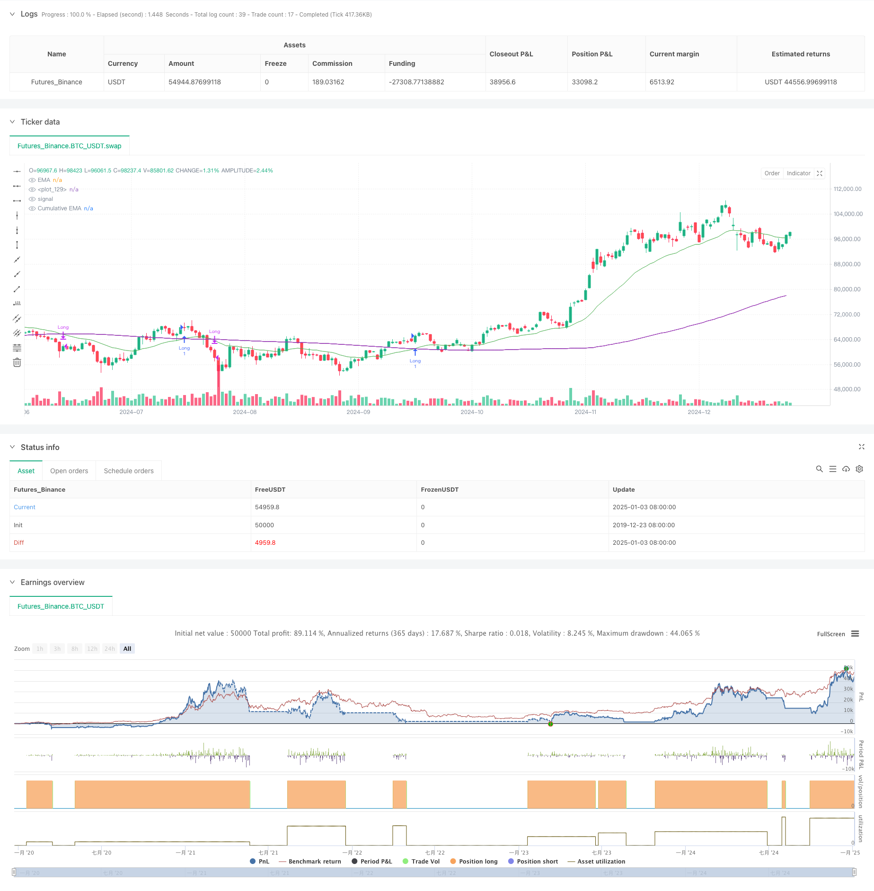

> Name

Dynamic-Trading-Theory-Exponential-Moving-Average-and-Cumulative-Volume-Period-Crossover-Strategy
> Author

ChaoZhang

> Strategy Description



[trans]
#### Overview
This strategy is a trading system that combines the Exponential Moving Average (EMA) and the Cumulative Volume Period (CVP). It captures turning points in market trends by analyzing the intersection of an exponential moving average of price with cumulative volume-weighted price. The strategy has a built-in time filter that can limit the trading period and supports automatic closing of positions at the end of the trading period. The strategy provides two different exit methods: reverse cross exit and customized CVP exit, making it highly flexible and adaptable.
#### Strategy Principle
The core logic of the strategy is based on the following key calculations:
1. Calculate the average price (AVWP): multiply the arithmetic mean of the highest, lowest and closing prices by the trading volume.
2. Calculate the cumulative trading volume period value: accumulate the volume-weighted price within the set period and divide it by the cumulative trading volume.
3. Calculate the EMA of the closing price and the EMA of the CVP respectively.
4. A long signal is generated when the price EMA crosses the EMA of CVP upwards; a short signal is generated when the price EMA crosses the EMA of CVP downwards.
5. The exit signal can be an inverse cross signal or a cross signal based on a custom CVP period.
#### Strategic Advantages
1. The signal system is robust: it combines price trends and trading volume information to more accurately judge market trends.
2. Strong adaptability: The EMA cycle and CVP cycle can be adjusted to adapt to different market environments.
3. Improved risk management: Built-in time filters can avoid operations during periods that are not suitable for trading.
4. Flexible exit mechanism: Two different exit methods are provided, and the appropriate exit method can be selected according to market characteristics.
5. Good visualization: The strategy provides a clear graphical interface, including signal markers and trend area filling.
#### Strategy Risk
1. Lagging risk: EMA itself has a certain lag, which may cause a slight delay in entry and exit timing.
2. Risk of market shock: False signals may occur in a volatile market.
3. Parameter sensitivity: Different parameter combinations may lead to large differences in strategy performance.
4. Liquidity risk: In low-liquidity markets, CVP calculations may not be accurate enough.
5. Time zone dependence: The strategy uses New York time as a time filter, and you need to pay attention to the differences in trading hours of different markets.
#### Strategy optimization direction
1. Introduce volatility filter: strategy parameters can be adjusted according to market volatility to improve the adaptability of the strategy.
2. Optimized time filter: Multiple time windows can be added to control trading periods more precisely.
3. Increase trading volume quality assessment: introduce trading volume analysis indicators to filter low-quality trading volume signals.
4. Dynamic parameter adjustment: Develop an adaptive parameter system to automatically adjust the EMA and CVP cycles according to market conditions.
5. Add market sentiment indicators: Combine with other technical indicators to confirm trading signals.
#### Summary
This is a quantitative trading strategy with complete structure and clear logic. By combining the advantages of EMA and CVP, a trading system that can both capture trends and focus on risk control is created. The strategy is highly customizable and suitable for use in different market environments. Through the implementation of optimization suggestions, there is room for further improvement in the performance of the strategy. ||
#### Overview
This strategy is a trading system that combines Exponential Moving Average (EMA) and Cumulative Volume Period (CVP). It captures market trend reversal points by analyzing the crossover between price EMA and cumulative volume-weighted price. The strategy includes a built-in time filter for limiting trading sessions and supports automatic position closing at the end of trading periods. It offers two different exit methods: reverse crossover exit and custom CVP exit, providing strong flexibility and adaptability.

#### Strategy Principle
The core logic of the strategy is based on the following key calculations:
1. Calculate Average Price (AVWP): Multiply the arithmetic mean of high, low, and close prices with volume.
2. Calculate Cumulative Volume Period value: Sum up volume-weighted prices over the set period and divide by cumulative volume.
3. Calculate EMA of closing price and EMA of CVP separately.
4. Generate long signals when price EMA crosses above CVP's EMA; generate short signals when price EMA crosses below CVP's EMA.
5. Exit signals can be either reverse crossover signals or signals based on custom CVP periods.

#### Strategy Advantages
1. Robust Signal System: Combines price trend and volume information for more accurate market direction judgment.
2. High Adaptability: Can adapt to different market environments by adjusting EMA and CVP periods.
3. Complete Risk Management: Built-in time filter prevents trading during unsuitable periods.
4. Flexible Exit Mechanism: Provides two different exit methods to choose based on market characteristics.
5. Good Visualization: Strategy provides clear graphical interface including signal markers and trend area filling.

#### Strategy Risks
1. Lag Risk: EMA has inherent lag, which may cause slight delays in entry and exit timing.
2. Oscillation Risk: May generate false signals in sideways markets.
3. Parameter Sensitivity: Different parameter combinations may lead to significant performance variations.
4. Liquidity Risk: CVP calculations may be inaccurate in low liquidity markets.
5. Time Zone Dependency: Strategy uses New York time for time filtering, requiring attention to different market trading hours.

#### Strategy Optimization Directions
1. Introduce Volatility Filter: Adjust strategy parameters based on market volatility to improve adaptability.
2. Optimize Time Filter: Add multiple time windows for more precise trading session control.
3. Add Volume Quality Assessment: Introduce volume analysis indicators to filter low-quality volume signals.
4. Dynamic Parameter Adjustment: Develop adaptive parameter system to automatically adjust EMA and CVP periods based on market conditions.
5. Add Market Sentiment Indicators: Combine with other technical indicators to confirm trading signals.

#### Summary
This is a quantitative trading strategy with complete structure and clear logic. By combining the advantages of EMA and CVP, it creates a trading system that can both capture trends and focus on risk control. The strategy is highly customizable and suitable for use in different market environments. Through the implementation of optimization suggestions, there is room for further performance improvement.[/trans]


> Source (PineScript)

``` pinescript
/*backtest
start: 2019-12-23 08:00:00
end: 2025-01-04 08:00:00
period: 1d
basePeriod: 1d
exchanges: [{"eid":"Futures_Binance","currency":"BTC_USDT"}]
*/

//@version=5
// © sapphire_edge 

// # ========================================================================= #
// #                  
// #        _____                   __    _              ______    __         
// #      / ___/____ _____  ____  / /_  (_)_______     / ____/___/ /___ ____ 
// #      \__ \/ __ `/ __ \/ __ \/ __ \/ / ___/ _ \   / __/ / __  / __ `/ _ \
// #     ___/ / /_/ / /_/ / /_/ / / / / / /  /  __/  / /___/ /_/ / /_/ /  __/
// #    /____/\__,_/ .___/ .___/_/ /_/_/_/   \___/  /_____/\__,_/\__, /\___/ 
// #              /_/   /_/                                     /____/       
// #                                      
// # ========================================================================= #

strategy(shorttitle="⟡Sapphire⟡ EMA/CVP", title="[Sapphire] EMA/CVP Strategy", initial_capital= 50000, currency= currency.USD,default_qty_value = 1,commission_type= strategy.commission.cash_per_contract,overlay= true )

// # ========================================================================= #
// #                       // Settings Menu //
// # ========================================================================= #

// --------------------    Main Settings    -------------------- //
groupEMACVP = "EMA / Cumulative Volume Period"
tradeDirection = input.string(title='Trade Direction', defval='LONG', options=['LONG', 'SHORT'], group=groupEMACVP)
emaLength = input.int(25, title='EMA Length', minval=1, maxval=200, group=groupEMACVP)
cumulativePeriod = input.int(100, title='Cumulative Volume Period', minval=1, maxval=200, step=5, group=groupEMACVP)
exitType = input.string(title="Exit Type", defval="Crossover", options=["Crossover", "Custom CVP" ], group=groupEMACVP)
cumulativePeriodForClose = input.int(50, title='Cumulative Period for Close Signal', minval=1, maxval=200, step=5, group=groupEMACVP)
showSignals = input.bool(true, title="Show Signals", group=groupEMACVP)
signalOffset = input.int(5, title="Signal Vertical Offset", group=groupEMACVP)

// --------------------    Time Filter Inputs    -------------------- //
groupTimeOfDayFilter = "Time of Day Filter"
useTimeFilter1  = input.bool(false, title="Enable Time Filter 1", group=groupTimeOfDayFilter)
startHour1      = input.int(0, title="Start Hour (24-hour format)", minval=0, maxval=23, group=groupTimeOfDayFilter)
startMinute1    = input.int(0, title="Start Minute", minval=0, maxval=59, group=groupTimeOfDayFilter)
endHour1        = input.int(23, title="End Hour (24-hour format)", minval=0, maxval=23, group=groupTimeOfDayFilter)
endMinute1      = input.int(45, title="End Minute", minval=0, maxval=59, group=groupTimeOfDayFilter)
closeAtEndTimeWindow = input.bool(false, title="Close Trades at End of Time Window", group=groupTimeOfDayFilter)

// --------------------    Trading Window    -------------------- //
isWithinTradingWindow(startHour, startMinute, endHour, endMinute) =>
    nyTime            = timestamp("America/New_York", year, month, dayofmonth, hour, minute)
    nyHour            = hour(nyTime)
    nyMinute          = minute(nyTime)
    timeInMinutes     = nyHour * 60 + nyMinute
    startInMinutes    = startHour * 60 + startMinute
    endInMinutes      = endHour * 60 + endMinute
    timeInMinutes    >= startInMinutes and timeInMinutes <= endInMinutes

timeCondition =  (useTimeFilter1 ? isWithinTradingWindow(startHour1, startMinute1, endHour1, endMinute1) : true)

// Check if the current bar is the last one within the specified time window
isEndOfTimeWindow() =>
    nyTime            = timestamp("America/New_York", year, month, dayofmonth, hour, minute)
    nyHour            = hour(nyTime)
    nyMinute          = minute(nyTime)
    timeInMinutes     = nyHour * 60 + nyMinute
    endInMinutes      = endHour1 * 60 + endMinute1
    timeInMinutes == endInMinutes

// Logic to close trades if the time window ends
if timeCondition and closeAtEndTimeWindow and isEndOfTimeWindow()
    strategy.close_all(comment="Closing trades at end of time window")

// # ========================================================================= #
// #                       // Calculations //
// # ========================================================================= #

avgPrice = (high + low + close) / 3
avgPriceVolume = avgPrice * volume

cumulPriceVolume = math.sum(avgPriceVolume, cumulativePeriod)
cumulVolume = math.sum(volume, cumulativePeriod)
cumValue = cumulPriceVolume / cumulVolume

cumulPriceVolumeClose = math.sum(avgPriceVolume, cumulativePeriodForClose)
cumulVolumeClose = math.sum(volume, cumulativePeriodForClose)
cumValueClose = cumulPriceVolumeClose / cumulVolumeClose

emaVal = ta.ema(close, emaLength)
emaCumValue = ta.ema(cumValue, emaLength)

// # ========================================================================= #
// #                       // Signal Logic //
// # ========================================================================= #

// Strategy Entry Conditions
longEntryCondition = ta.crossover(emaVal, emaCumValue) and tradeDirection == 'LONG'
shortEntryCondition = ta.crossunder(emaVal, emaCumValue) and tradeDirection == 'SHORT'

// User-Defined Exit Conditions
longExitCondition = false
shortExitCondition = false

if exitType == "Crossover"
    longExitCondition := ta.crossunder(emaVal, emaCumValue)
    shortExitCondition := ta.crossover(emaVal, emaCumValue)

if exitType == "Custom CVP"
    emaCumValueClose = ta.ema(cumValueClose, emaLength)
    longExitCondition := ta.crossunder(emaVal, emaCumValueClose)
    shortExitCondition := ta.crossover(emaVal, emaCumValueClose)

// # ========================================================================= #
// #                       // Strategy Management //
// # ========================================================================= #

// Strategy Execution
if longEntryCondition and timeCondition
    strategy.entry('Long', strategy.long)
    label.new(bar_index, high - signalOffset, "◭", style=label.style_label_up, color = color.rgb(119, 0, 255, 20), textcolor=color.white)

if shortEntryCondition and timeCondition
    strategy.entry('Short', strategy.short)
    label.new(bar_index, low + signalOffset, "⧩", style=label.style_label_down, color = color.rgb(255, 85, 0, 20), textcolor=color.white)

if strategy.position_size > 0 and longExitCondition
    strategy.close('Long')

if strategy.position_size < 0 and shortExitCondition
    strategy.close('Short')

// # ========================================================================= #
// #                         // Plots and Charts //
// # ========================================================================= #

plot(emaVal, title='EMA', color=color.new(color.green, 25))
plot(emaCumValue, title='Cumulative EMA', color=color.new(color.purple, 35))
fill(plot(emaVal), plot(emaCumValue), color=emaVal > emaCumValue ? #008ee6 : #d436a285, title='EMA and Cumulative Area', transp=70)

```

> Detail

https://www.fmz.com/strategy/477531

> Last Modified

2025-01-06 11:45:38
