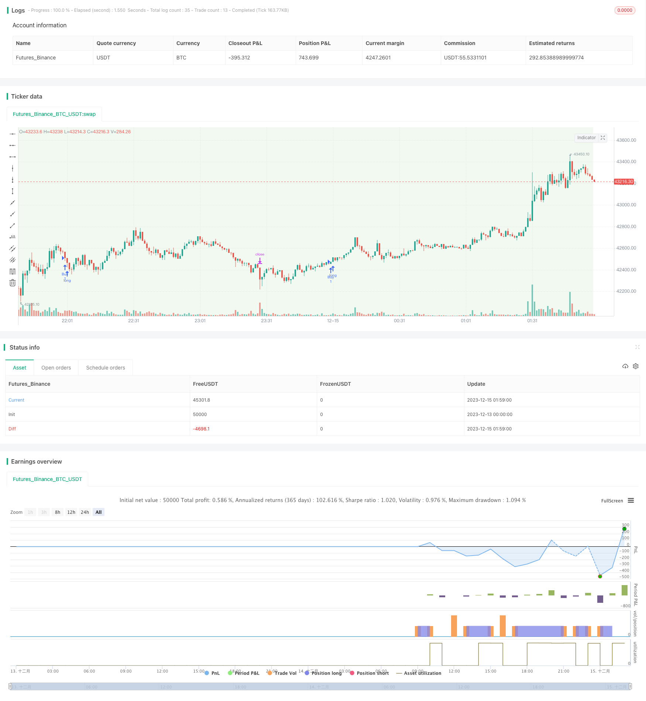

> Name

Dynamic-Trailing-Stop-Loss-Strategy
> Author

ChaoZhang

> Strategy Description


[trans]

## Overview
This strategy determines the trend direction based on the daily line, and then uses the new high or low formed by the 15-minute K-line as the stop loss position or trailing stop loss position to achieve a strategy of dynamically adjusting the stop loss to lock in more profits.
## Strategy Principle
1. Use the daily K-line closing price to compare with the highest and lowest price of the previous day to determine the trend direction. If the closing price is higher than the previous day's highest price, it is defined as an uptrend; if the closing price is lower than the previous day's lowest price, it is defined as a downtrend.
2. In an upward trend, when the closing price of the 15-minute K-line is higher than the highest price of the previous 15-minute K-line, go long; in a downward trend, when the closing price of the 15-minute K-line is lower than the lowest price of the previous 15-minute K-line, go short.
3. After going long, the lowest price of the previous 15-minute K-line is used as the stop loss level. After shorting, the highest price of the previous 15-minute K-line is used as the stop loss level.
4. When the 15-minute K-line reaches a new high or low again, adjust the stop loss position. When going long, adjust to a new low and when going short, adjust to a new high to achieve dynamic tracking stop loss.
## Advantage Analysis
The biggest advantage of this strategy is that it can dynamically adjust the stop loss position, which ensures risk control while locking in profits to the greatest extent and reducing the probability of the stop loss being hit.
The specific advantages are as follows:
1. Based on trend calculation, you can judge the market trend in time and choose the correct trading direction.
2. 15-minute level trading allows you to enter and exit the market frequently and capture more opportunities.
3. Dynamically adjust the stop loss strategy to reduce the risk of the stop loss being hit based on new highs or new lows.
4. Set the stop loss position reasonably to avoid unnecessary losses to the greatest extent.
## Risk Analysis
The main risk of this strategy comes from errors in trend judgment. The specific risk points are as follows:
1. Misjudgment of daily trend may lead to wrong trading direction.
2. If the market fluctuates violently in the short term, the 15-minute stop loss level is more likely to be breached.
3. Improper identification of trend turning points may lead to losses.
The corresponding solutions are as follows:
1. Add other time period indicators for comprehensive judgment to avoid errors based on a single period alone.
2. Assess market volatility and appropriately relax the stop loss range when volatility is large.
3. Add a trend turning point judgment mechanism to close positions promptly before the turning point.
## Optimization direction
There is still room for further optimization of this strategy:
1. Add other cycle indicator judgments and optimize trend control.
2. Test different stop loss ratio settings and select the optimal parameters.
3. Increase quantity and energy indicators to avoid erroneous transactions caused by deviations in quantity and energy.
4. Add a trend turning mechanism and optimize the exit point.
5. Evaluate and increase the Trailing Stop interval value to further reduce the probability of stop loss being hit.
## Summarize
The overall operating effect of this strategy is good, the idea is clear and easy to understand, and it has the advantages of dynamic adjustment of stop loss, frequent trading, and following the trend. It can effectively control risks and lock in profits. It is worthy of further testing and optimization application. However, there is still some room for improvement. It is recommended to start from the aspects of comprehensive judgment from multiple angles, optimizing parameter settings, and increasing trend turning judgment to further enhance the stability and profitability of the strategy.
||

## Overview  

This strategy determines the trend direction based on daily candlesticks, and uses the new high or low points formed by 15-minute candlesticks as stop loss price or trailing stop loss price, so as to dynamically adjust stop loss and lock in more profits.

## Strategy Logic  

1. Compare closing price of daily candlesticks with highest and lowest price of previous daily candlestick to determine the trend direction. If closing price is higher than previous day's highest price, it is defined as an uptrend. If closing price is lower than previous day's lowest price, it is defined as a downtrend.

2. When in an uptrend, go long when the closing price of the 15-minute candlestick is higher than the highest price of the previous 15-minute candlestick. When in a downtrend, go short when the closing price of the 15-minute candlestick is lower than the lowest price of the previous 15-minute candlestick.  

3. Set the lowest price of the previous 15-minute candlestick as the stop loss price after going long. Set the highest price of the previous 15-minute candlestick as the stop loss price after going short.

4. When the 15-minute candlestick makes a new high or low again, adjust the stop loss price accordingly. Adjust to the new low after going long. Adjust to the new high after going short. This realizes dynamic trailing stop loss.

## Advantage Analysis

The biggest advantage of this strategy is that it can dynamically adjust the stop loss price. While ensuring risk control, it maximizes profit taking and reduces the probability of stop loss being hit.

Specifically advantages include:

1. Trend operation based judgments can timely determine market trends and choose the right trading direction.  

2. 15-minute timeframe trading allows frequent entries and exits to capture more opportunities.

3. Dynamic stop loss adjustment based on new highs or lows reduces risks of stop loss being hit.  

4. Reasonable stop loss positioning largely avoids unnecessary losses.

## Risk Analysis  

The main risk of this strategy comes from errors in trend judgments. Specific risks include:

1. Incorrect daily trend judgment may lead to wrong trade direction.

2. Prices may fluctuate violently in the short term, increasing probability of 15-minute stop loss being hit.

3. Improper identification of trend reversal points may lead to losses.

Corresponding solutions:

1. Add indicators from other timeframes for comprehensive judgments to avoid reliance on just one timeframe.

2. Evaluate market volatility and relax stop loss range appropriately during high volatility. 

3. Add trend reversal point identification mechanism to close positions timely before reversals.


## Optimization Directions

There is still room for further optimization:  

1. Add other timeframe indicators to optimize trend capturing.

2. Test different stop loss ratio settings to find optimal parameters.

3. Add volume indicators to avoid errors from volume divergence. 

4. Add trend reversal mechanisms to optimize exit points.

5. Evaluate widening Trailing Stop price intervals to further reduce risks of stop loss being hit.


## Summary

The overall performance of this strategy is good. The logic is clear and easy to understand. It has advantages like dynamic stop loss adjustment, frequent trading, and trading along trends. It can effectively control risks and lock in profits, and is worth further testing and optimization. But there is still room for improvement. It is recommended to improve from aspects like comprehensive judgment from multiple angles, parameter optimization, adding trend reversal identification mechanisms, etc, to further strengthen the stability and profitability of the strategy.

[/trans]


> Source (PineScript)

``` pinescript
/*backtest
start: 2023-12-13 00:00:00
end: 2023-12-15 02:00:00
period: 1m
basePeriod: 1m
exchanges: [{"eid":"Futures_Binance","currency":"BTC_USDT"}]
*/

//@version=5
strategy("Anand's Strategy", overlay=true)

// Get the high and low of the previous day's candle
prev_high = request.security(syminfo.tickerid, "D", high[2])
prev_low = request.security(syminfo.tickerid, "D", low[2])

// var float prev_high = na
// var float prev_low = na

prev_close = request.security(syminfo.tickerid, "D", close[1])


getDayIndexedHighLow(_bar) =>
    _indexed_high = request.security(syminfo.tickerid, "D", high[_bar])
    _indexed_low = request.security(syminfo.tickerid, "D", low[_bar])
    [_indexed_high, _indexed_low]

var index = 2

while index >= 0
    [indexed_high_D, indexed_low_D] =  getDayIndexedHighLow(index)
  
    if prev_close > indexed_high_D or prev_close < indexed_low_D
        prev_high := indexed_high_D
        prev_low := indexed_low_D
        break
    // Decrease the index to move to the previous 15-minute candle
    index := index - 1


// Determine the trade direction based on the candle criterion
trade_direction = prev_close > prev_high ? 1 : (prev_close < prev_low ? -1 : 0)

// Get the current close from 15-minute timeframe
current_close = request.security(syminfo.tickerid, "15", close[1])
prev_high_15m = request.security(syminfo.tickerid, "15", high[2])
prev_low_15m = request.security(syminfo.tickerid, "15", low[2])

// var float prev_high_15m = na
// var float prev_low_15m = na

getIndexedHighLow(_bar) =>
    _indexed_high = request.security(syminfo.tickerid, "15", high[_bar])
    _indexed_low = request.security(syminfo.tickerid, "15", low[_bar])
    [_indexed_high, _indexed_low]


// Loop through previous 15-minute candles until the condition is met
var  i = 2

while i >= 2
    [indexed_high_15m, indexed_low_15m] =  getIndexedHighLow(i)
  
    if current_close > indexed_high_15m or current_close < indexed_low_15m
        prev_high_15m := indexed_high_15m
        prev_low_15m := indexed_low_15m
        break
    // Decrease the index to move to the previous 15-minute candle
    i := i - 1


buy_condition = trade_direction == 1 and current_close > prev_high_15m
stop_loss_buy = prev_low_15m

// Sell Trade Criteria in Negative Trend
sell_condition = trade_direction == -1 and current_close < prev_low_15m
stop_loss_sell = prev_high_15m


// Trailing Stop Loss for Buy Trade
// Custom Trailing Stop Function for Buy Trade
var float trail_stop_buy = na
trailing_buy_condition = buy_condition and current_close > trail_stop_buy
if trailing_buy_condition
    trail_stop_buy := current_close

// Custom Trailing Stop Function for Sell Trade
var float trail_stop_sell = na
trailing_sell_condition = sell_condition and current_close < trail_stop_sell
if trailing_sell_condition
    trail_stop_sell := current_close

// Take Buy Trade with Stop Loss
if (buy_condition)
    strategy.entry("Buy", strategy.long)
    strategy.exit("Buy Stop Loss", "Buy", stop=stop_loss_buy)

// Take Sell Trade with Stop Loss
if (sell_condition)
    strategy.entry("Sell", strategy.short)
    strategy.exit("Sell Stop Loss", "Sell", stop=stop_loss_sell)

// Set the background color based on the trade direction
bgcolor(trade_direction == 1 ? color.new(color.green, 90) : trade_direction == -1 ? color.new(color.red, 90) : na)
```

> Detail

https://www.fmz.com/strategy/436142

> Last Modified

2023-12-21 15:58:54
