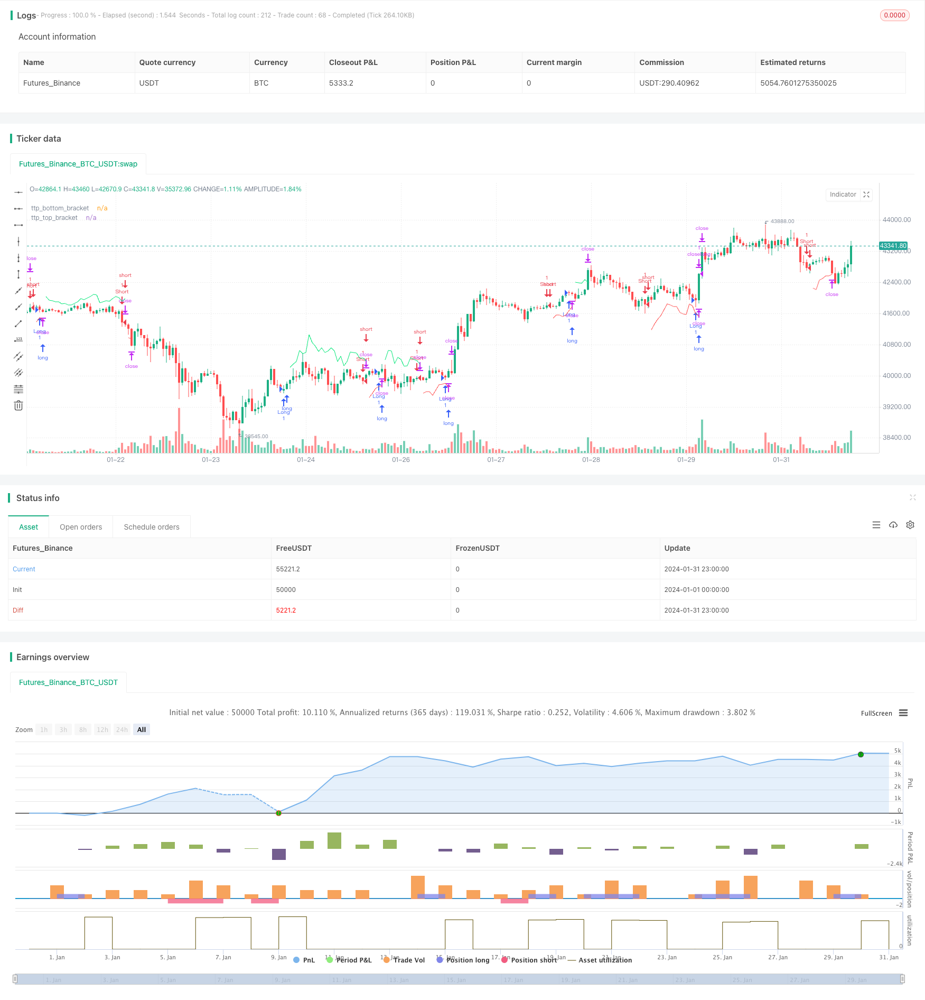

> Name

Dynamic-Trailing-Take-Profit-Trading-Strategy
> Author

ChaoZhang

> Strategy Description


[trans]
### Overview
This article mainly introduces a quantitative trading strategy called "Dynamic Position Profit Tracking Trading Strategy". By setting a dynamic exit take-profit line based on the ATR indicator, this strategy can quickly take profit within 1-2 K lines after a sudden favorable price trend, preventing the price from turning around again and causing losses.
### Strategy Principles
The trading logic of this strategy is very simple and clear. Specifically, it includes the following steps:
1. Use moving average crossovers in the form of 14-period SMA and 28-period SMA as long and short signals. When the 14-period moving average crosses the 28-period moving average, go long and buy; when the 14-period moving average crosses below the 28-period moving average, go short and sell.
2. Calculate the ATR indicator and multiply it with a multiplier to obtain the take-profit position for dynamic exit. For example, if the ATR length is set to 7 and the multiplier is 1.5, the resulting dynamic take-profit channel width will be 1.5 times the 7-period ATR.
3. When the position direction is long, add the high point to the width of the dynamic take-profit channel to get the long take-profit line. When the position direction is short, subtract the width of the dynamic take-profit channel from the low point to get the short take-profit line.
4. Once the price exceeds the dynamic take profit line, take profit and exit immediately. This can capture profits within 1-2 candlesticks after a sudden super strong move in price.
Through the above steps, this strategy achieves a simple but efficient position profit tracking and quick profit taking effect. The ATR channel provides the ability to dynamically adjust the take-profit line, and the newly added 1BAR condition ensures that the take-profit line is only activated under sudden favorable market conditions. This can effectively reduce the situation of taking profit and leaving the market prematurely.
### Advantage Analysis
"Dynamic Position Profit Tracking Trading Strategy" has the following advantages:
1. The ideas are simple and clear, easy to understand and implement, and suitable for beginners to learn.
2. Through dynamic ATR profit taking, you can automatically track position profits and avoid profit nodeList.
3. Add 1BAR high and low point conditions so that the take profit is only activated after a super strong market occurs to reduce false moves.
4. Different ATR lengths and multipliers can be set to adjust the take-profit strength.
5. You can quickly take profit and leave the market to capture favorable market conditions.
6. Strong scalability, other stop-profit and stop-loss strategies can be easily implemented based on this framework.
### Risk Analysis
This strategy also has some risks, mainly including:
1. ATR suddenly enlarges, which may cause the take-profit to leave the market prematurely.
2. Unable to effectively filter market noise and easily misled by false breakthroughs.
3. Making decisions based solely on moving average crossovers cannot effectively judge complex market conditions.
4. Without a stop-loss mechanism, losses cannot be effectively controlled.
5. The default risk parameter settings may not be suitable for all varieties and need to be optimized.
In order to reduce the above risks, the following aspects can be optimized:
1. Add a filtering mechanism and combine it with other indicators to filter out false signals.
2. Add stop-loss strategies and strictly control single losses.
3. Use the Walk Forward Analysis method to optimize parameters.
4. Optimize parameter combinations for different varieties.
5. Add machine learning algorithms to achieve smarter decision-making.
### Optimization direction
Based on risk analysis, the optimization directions of this strategy mainly include:
1. **Add signal filtering**: After entering the signal, you can add filtering of other indicators, such as combining MACD, Bollinger Bands and other indicators to avoid being misled by noise.
2. **Add stop loss line**: Add stop loss line settings based on ATR or trailing stop loss to control single losses.
3. **Parameter Optimization**: Optimize the settings of parameters such as ATR length and ATR multiplier through machine learning and other methods.
4. **Risk Adjustment**: Adjust position management and risk parameters according to the characteristics of different trading varieties.
5. **Model Fusion**: Integrate this strategy with other models such as machine learning and neural networks to improve the accuracy of decision-making.
6. **Inject external intervention**: Add manual intervention nodes and manually determine the stop-profit and stop-loss positions at critical moments.
Through optimization in the above directions, the income stability of this strategy can be greatly improved.
### Summarize
"Dynamic Position Profit Tracking Trading Strategy" is overall a very practical and efficient profit-taking strategy. Its thinking is clear and easy to understand. It can automatically track profits through dynamic take-profit and quickly stop profits in super strong market conditions. At the same time, this strategy also has some risks, which can be improved by adding signal filtering, adding stop losses, parameter optimization, etc. to adapt it to a more complex market environment. Overall, this strategy provides us with a very good strategic framework and is worthy of further research and application.
||

### Overview

This article mainly introduces a quantitative trading strategy called "Dynamic Trailing Take Profit Trading Strategy". This strategy sets a dynamic take profit line based on the ATR indicator to realize fast profit taking within 1-2 candles after a sudden favorable price move, avoiding losses when prices turn around again.

### Principles  

The trading logic of this strategy is very simple and clear. Specifically, it includes the following steps:

1. Use the crossover of 14-period SMA and 28-period SMA as the signal for long and short. When 14-period SMA goes above 28-period SMA, go long. When 14-period SMA goes below 28-period SMA, go short.  

2. Calculate the ATR indicator and multiply it by a factor to obtain the dynamic take profit position. For example, set ATR length to 7, multiplier to 1.5, then the width of the dynamic take profit channel is 1.5 times the 7-period ATR.

3. When the position direction is long, add the high price and the dynamic take profit channel width to obtain the long take profit line. When position direction is short, subtract the dynamic take profit channel width from the low price to obtain the short take profit line.  

4. Once the price exceeds this dynamic take profit line, take profit to exit immediately. This can capture profits within 1-2 bars after a sudden strong price move.

Through the above steps, this strategy achieves a simple but efficient effect of profit trailing and fast profit taking. The ATR channel provides the dynamic adjustment capability for the take profit line, while the newly added 1 bar condition ensures that the take profit line is triggered only under sudden favorable market conditions. This can effectively reduce premature exit due to take profit.


### Advantages  

The "Dynamic Trailing Take Profit Trading Strategy" has the following advantages:

1. The idea is simple and clear, easy to understand and implement, suitable for beginners to learn.  

2. Dynamic ATR take profit can automatically trail profits and avoid leaving profits on the table.

3. Adding 1 bar high/low condition prevents take profit from triggering on smaller moves.

4. ATR length and multiplier can be adjusted to tune the degree of profit taking.  

5. Can exit fast to capture favorable price moves.

6. Highly extensible, easy to implement other stop loss/take profit strategies based on this framework.


### Risk Analysis   

There are also some risks with this strategy:

1. Sudden ATR expansion may cause premature take profit exit.  

2. Cannot effectively filter out market noise, prone to false signal.

3. Rely solely on SMA crossover for decision making, ineffective for complex market situations. 

4. No stop loss mechanism to effectively limit losses.

5. Default parameter may not suit all products, optimization needed.

To reduce the above risks, we can optimize from the following aspects:

1. Add filter rules based on other indicators to remove false signals.  

2. Add stop loss strategies to strictly control loss per trade.

3. Optimize parameters using Walk Forward Analysis.

4. Separately optimize parameters for different products. 

5. Increase machine learning models for smarter decisions.


### Optimization Directions   

Based on the risk analysis, the optimization directions mainly include:  

1. **Add signal filter**: Add filter rules based on indicators like MACD, Bollinger Band etc. after signal to avoid noise.

2. **Add stop loss line**: Add stop loss line based on ATR or trailing stop to control per trade loss.

3. **Parameter optimization**: Optimize parameters like ATR Length, ATR Multiplier using machine learning.

4. **Risk tuning**: Tune position sizing, risk parameters based on different products.  

5. **Model fusion**: Combine this strategy with machine learning, neural networks to improve accuracy.  

6. **Manual intervention**: Allow manual override of take profit/stop loss levels at critical moments.

With optimization in above directions, profitability and stability of the strategy can be greatly improved.


### Conclusion  

In summary, the “Dynamic Trailing Take Profit Trading Strategy” is a very practical and efficient take profit strategy. It has a clear and easy to understand idea. Through dynamic take profit, it can automatically trail profits and exit fast during strong trends. Meanwhile, this strategy also has some risks. It can be improved by adding signal filters, stop loss, optimizing parameters etc. to adapt to more complex market environments. Overall, this strategy provides a very good framework worthy of further research and application.

[/trans]

> Strategy Arguments


|Argument|Default|Description|
|----|----|----|
|v_input_int_1|7|ATR Length|
|v_input_float_1|1.5|ATR Multiplier|


> Source (PineScript)

``` pinescript
/*backtest
start: 2024-01-01 00:00:00
end: 2024-01-31 23:59:59
period: 1h
basePeriod: 15m
exchanges: [{"eid":"Futures_Binance","currency":"BTC_USDT"}]
*/

// This Pine Script™ code is subject to the terms of the Mozilla Public License 2.0 at https://mozilla.org/MPL/2.0/
// © Peter_O

//@version=5
strategy("TrailingTakeProfit example", overlay=true, margin_long=100, margin_short=100, default_qty_value = 1, initial_capital = 100)

longCondition = ta.crossover(ta.sma(close, 14), ta.sma(close, 28))
shortCondition = ta.crossunder(ta.sma(close, 14), ta.sma(close, 28))

if longCondition
    strategy.entry("Long", strategy.long, comment="long", alert_message="long")
if shortCondition
    strategy.entry("Short", strategy.short, comment="short", alert_message="short")

atr_length=input.int(7, title="ATR Length")
atr_multiplier = input.float(1.5, title="ATR Multiplier")
atr_multiplied = atr_multiplier * ta.atr(atr_length)
ttp_top_bracket = strategy.position_size>0 ? high[1]+atr_multiplied : na
ttp_bottom_bracket = strategy.position_size<0 ? low[1]-atr_multiplied : na

plot(ttp_top_bracket, title="ttp_top_bracket", color=color.lime, style=plot.style_linebr, offset=1)
plot(ttp_bottom_bracket, title="ttp_bottom_bracket", color=color.red, style=plot.style_linebr, offset=1)

strategy.exit("closelong", from_entry="Long", limit=ttp_top_bracket, alert_message = "closelong")
strategy.exit("closeshort", from_entry="Short", limit=ttp_bottom_bracket, alert_message = "closeshort")

// var table alertsDisplayTable = table.new(position.top_right, 1, 5, color.black)
// if barstate.islastconfirmedhistory
//     table.cell(alertsDisplayTable, 0, 0, "TradingConnector-compatible alerts sent", text_color=color.white)
//     table.cell(alertsDisplayTable, 0, 1, "at Long Entry: long", text_color=color.white)
//     table.cell(alertsDisplayTable, 0, 2, "at Short Entry: short", text_color=color.white)
//     table.cell(alertsDisplayTable, 0, 3, "at Long Exit: closelong", text_color=color.white)
//     table.cell(alertsDisplayTable, 0, 4, "at Short Exit: closeshort", text_color=color.white)

```

> Detail

https://www.fmz.com/strategy/442930

> Last Modified

2024-02-27 14:43:17
