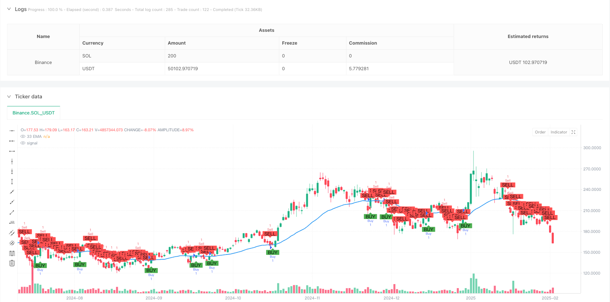
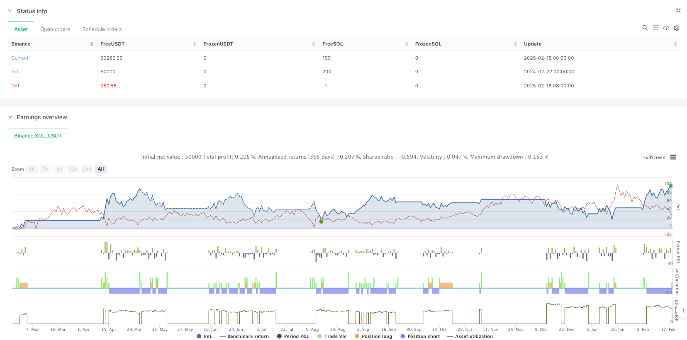

> Name

Dynamic Trend Breakthrough Exponential Moving Average Crossover Strategy-Dynamic-Trend-Breakthrough-Exponential-Moving-Average-Crossover-Strategy
> Author

ianzeng123

> Strategy Description





[trans]
#### Overview
This strategy is a trend following trading system based on the 33-period exponential moving average (EMA). It identifies market trend changes through the cross relationship between price and EMA, and sets take-profit and stop-loss positions based on the high and low points of fluctuations, thereby achieving dynamic tracking of trends and risk control.
#### Strategy Principle
The core logic of the strategy is to determine the trend direction by observing the cross relationship between price and the 33-period EMA. When the closing price breaks upward and stands above the EMA, a long signal is triggered; when the closing price breaks downward and falls below the EMA, a short signal is triggered. The strategy uses the 14-period high and low points as a reference for fluctuations, and sets the highest point as long order take-profit and the lowest point as long order stop-loss; accordingly, the lowest point is set as short order take-profit and the highest point is set as short order stop-loss. This design not only ensures the grasp of trends, but also provides reasonable risk control.
#### Strategic Advantages
1. Clear signals: Use EMA crossover as a trading signal, and the judgment criteria should be objective and clear to avoid subjective assumptions.
2. Dynamic management: Dynamically adjust the stop-profit and stop-loss positions through fluctuations in high and low points to adapt to the characteristics of market fluctuations.
3. Risk controllable: Each transaction has a clear stop loss position, which can effectively control risks.
4. Trend following: Through the trend characteristics of EMA, the medium and long-term trends can be better grasped.
5. Parameter optimization: Key parameters can be adjusted to facilitate optimization according to different market characteristics.
#### Strategy Risk
1. Loss in a volatile market: In a volatile market, frequent crosses may lead to continuous stop losses.
2. Lagging risk: EMA has a certain lag and may miss important price points in the early stages of the trend.
3. Risk of false breakthrough: Short-term price fluctuations may cause false breakthroughs and lead to false signals.
4. Stop loss range: Use the fluctuation extreme value as the stop loss point. In some cases, the stop loss range may be larger.
#### Strategy optimization direction
1. Introduce trend filtering: You can add longer-period moving averages or trend indicators to filter out trading signals that shock the market.
2. Improve entry timing: Combine with RSI and other swing indicators to enter the market at a better price position.
3. Optimize stop loss settings: Consider using ATR to dynamically adjust the stop loss distance to make risk control more flexible.
4. Increase trading volume confirmation: Add trading volume analysis to improve signal reliability.
5. Improve the exit mechanism: design more detailed exit conditions, such as introducing trailing stop loss.
#### Summary
This is a trend following strategy with complete structure and clear logic. It is very practical to capture the trend through EMA cross and use the high and low points of fluctuations to manage risks. Although there are some inherent limitations, the stability and profitability of the strategy can be further improved through the suggested optimization directions. The overall design concept of the strategy is in line with the core principles of quantitative trading and is a trading system worthy of in-depth study and practice. ||
#### Overview
This strategy is a trend-following trading system based on the 33-period Exponential Moving Average (EMA). It identifies market trend changes through price-EMA crossover relationships and combines swing highs and lows for setting profit targets and stop losses, achieving dynamic trend tracking and risk control.

#### Strategy Principles
The core logic relies on observing the crossover relationship between price and 33-period EMA to determine trend direction. Buy signals are triggered when the closing price breaks above and stabilizes above the EMA, while sell signals are triggered when the closing price breaks and remains below the EMA. The strategy uses 14-period highs and lows as volatility references, setting swing highs as profit targets and swing lows as stop losses for long positions, and vice versa for short positions. This design ensures both trend capture and reasonable risk control.

#### Strategy Advantages
1. Clear Signals: Using EMA crossovers as trading signals provides objective and clear judgment criteria, avoiding subjective bias.
2. Dynamic Management: Dynamically adjusts profit targets and stop losses based on swing points, adapting to market volatility characteristics.
3. Risk Control: Each trade has a defined stop loss position, enabling effective risk management.
4. Trend Following: Effectively captures medium to long-term trends through EMA's trending characteristics.
5. Parameter Optimization: Key parameters can be adjusted to optimize for different market characteristics.

#### Strategy Risks
1. Consolidation Losses: Frequent crossovers in sideways markets may lead to consecutive stop losses.
2. Lag Risk: EMA has inherent lag, potentially missing important price levels at trend beginnings.
3. False Breakout Risk: Short-term price fluctuations may cause false breakouts, leading to incorrect signals.
4. Stop Loss Range: Using volatility extremes as stop points may result in large stop loss distances in some cases.

#### Strategy Optimization Directions
1. Trend Filtering: Add longer-period moving averages or trend indicators to filter out consolidation market signals.
2. Entry Timing Improvement: Incorporate oscillators like RSI for better entry price positions.
3. Stop Loss Optimization: Consider using ATR for dynamic stop loss adjustment, making risk control more flexible.
4. Volume Confirmation: Add volume analysis to improve signal reliability.
5. Exit Mechanism Enhancement: Design more detailed exit conditions, such as implementing trailing stops.

#### Summary
This is a well-structured trend-following strategy with clear logic. It captures trends through EMA crossovers and manages risk using swing points, demonstrating good practicality. While it has some inherent limitations, the suggested optimization directions can further enhance strategy stability and profitability. The overall design philosophy aligns with core quantitative trading principles, making it a trading system worthy of in-depth study and implementation.[/trans]


> Source (PineScript)

``` pinescript
/*backtest
start: 2024-02-22 00:00:00
end: 2025-02-19 08:00:00
period: 1d
basePeriod: 1d
exchanges: [{"eid":"Binance","currency":"SOL_USDT"}]
*/

// This Pine Script™ code is subject to the terms of the Mozilla Public License 2.0 at https://mozilla.org/MPL/2.0/
// © GlenMabasa

//@version=6
strategy("33 EMA Crossover Strategy", overlay=true)

// Input for the EMA length
ema_length = input.int(33, title="EMA Length")

// Calculate the 33-day Exponential Moving Average
ema_33 = ta.ema(close, ema_length)

// Plot the 33 EMA
plot(ema_33, color=color.blue, title="33 EMA", linewidth=2)

// Buy condition: Price crosses and closes above the 33 EMA
buy_condition = ta.crossover(close, ema_33) and close > ema_33

// Sell condition: Price crosses or closes below the 33 EMA
sell_condition = ta.crossunder(close, ema_33) or close < ema_33

// Swing high and swing low calculations
swing_high_length = input.int(14, title="Swing High Lookback")
swing_low_length = input.int(14, title="Swing Low Lookback")
swing_high = ta.highest(high, swing_high_length) // Previous swing high
swing_low = ta.lowest(low, swing_low_length)    // Previous swing low

// Profit target and stop loss for buys
buy_profit_target = swing_high
buy_stop_loss = swing_low

// Profit target and stop loss for sells
sell_profit_target = swing_low
sell_stop_loss = swing_high

// Plot buy and sell signals
plotshape(series=buy_condition, title="Buy Signal", location=location.belowbar, color=color.green, style=shape.labelup, text="BUY")
plotshape(series=sell_condition, title="Sell Signal", location=location.abovebar, color=color.red, style=shape.labeldown, text="SELL")

// Strategy logic for backtesting
if (buy_condition)
    strategy.entry("Buy", strategy.long)
    strategy.exit("Take Profit/Stop Loss", "Buy", limit=buy_profit_target, stop=buy_stop_loss)

if (sell_condition)
    strategy.entry("Sell", strategy.short)
    strategy.exit("Take Profit/Stop Loss", "Sell", limit=sell_profit_target, stop=sell_stop_loss)
```

> Detail

https://www.fmz.com/strategy/483066

> Last Modified

2025-02-27 17:05:44
