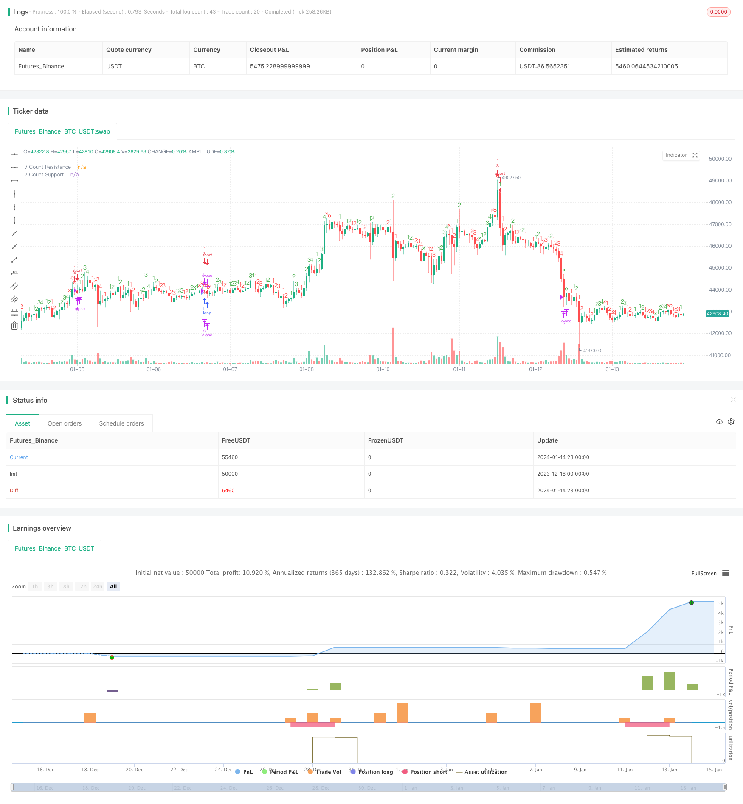

> Name

Dynamic Trend Tracking Reversal Strategy Dynamic-Trend-Tracking-Reversal-Strategy
> Author

ChaoZhang

> Strategy Description


 [trans]

## Overview
The dynamic trend following reversal strategy is a short-term quantitative trading strategy based on the JD Sequential indicator. This strategy tracks the highs and lows of prices in real time to determine the direction and strength of the current trend, thereby efficiently capturing market reversal points and timing entry and exit. Compared with the traditional JD Sequential strategy, this strategy has made the following improvements:
1. Use high points and low points to determine trends, rather than closing prices, to capture price changes faster.
2. The maximum counter number is 7 instead of 9, which can generate trading signals faster.
3. Added support resistance line and 5 count reversal as stop loss options.
This strategy is suitable for use in short-term time periods such as 5 minutes and 15 minutes, and can effectively capture short-term price fluctuations and reversal opportunities.
## Strategy Principle
The core logic of the dynamic trend following reversal strategy is based on the JD Sequential indicator, which determines whether the price has continuously hit higher highs or lower lows by comparing the highs and lows of the current cycle with the previous two cycles, thereby giving a sequential count of 1-7. A trading signal is generated when the count reaches 7.
Specifically, the following variables are defined in the policy:
- sp_up: true when the high price exceeds the previous high price of the second period
- sp_dn: true when the low price is lower than the previous low price of the second period
- sp_ct: record the current count, if sp_up or sp_dn is true, then +1 count, the maximum is 7
- sp_com: true when the count is equal to 7
- sp_usr: mid-price when count is 7 and sp_up, as upward resistance
- sp_dsr: mid price when count is 7 and sp_dn, as downside support
The logic of generating trading signals is:
- Long position signal: sp_com is true and sp_dn is true, indicating that the count is completed and is in a downward trend
- Short position signal: sp_com is true and sp_up is true, indicating that the count is completed and is in an upward trend
The stop loss logic is:
- Stop loss for long position: count reverses to 5 (sp_up is true) or price crosses above sp_usr
- Short stop loss: count reverses to 5 (sp_dn is true) or price breaks below sp_dsr
This strategy determines the direction and strength of the trend by comparing high and low points in real time, and uses a counter to time entry, which can effectively capture short-term reversal opportunities. At the same time, set a stop loss line to control risks.
## Advantage Analysis
Compared with the traditional JD Sequential strategy, the dynamic trend following reversal strategy has the following advantages:
1. Faster signal generation. Using high and low comparisons can capture trends faster than closing prices, and 7 counts can generate signals faster than 9 counts.
2. Add a stop loss mechanism. Adding 5-count reversal and support-resistance stop-loss allows for better risk control. 
3. Flexible configuration. You can choose whether to add a stop loss and display a partial count.
4. Suitable for short-term. High-frequency signals combined with appropriate stop losses are especially suitable for short-term time periods.
The main advantage of this strategy is that it responds quickly and can effectively capture large fluctuations caused by short-term emergencies. At the same time, compared to completely manual trading, algorithmic signal generation and stop loss can reduce the emotional impact of traders, thereby improving stability.
## Risk Analysis
Dynamic trend following reversal strategies also have certain risks:
1. High-frequency trading increases transaction costs. Higher transaction frequency will incur more fees and slippage costs.
2. Easily generate false signals. In a volatile market, the comparison of high and low points may frequently trigger trading signals, making it easy to get trapped.  
3. Stop loss is too aggressive. Hard stop loss is easy to be taken out instantly, so you can consider shifting the stop loss in time.
In order to reduce the above risks, the following aspects can be optimized:
1. Adjust the position size to reduce the amount of funds occupied by a single transaction.
2. Suspend trading during volatile market conditions to avoid invalid transactions.
3. Use trailing stop loss or range breakout stop loss to reduce the probability of being trapped.
## Strategy optimization direction
There is still a lot of room for optimization in the dynamic trend following reversal strategy. The main directions include: 
1. Multi-time period combination. The main trend direction can be determined in a higher time period to avoid trading against the main trend.
2. Combined with other indicators. It can be combined with volatility indicators, trading volume indicators, etc. to improve the quality of signals.
3. Machine learning filtering. Use machine learning algorithms to assist in judging trading signals and reduce erroneous transactions.
4. Parameter optimization. Parameters such as the number of counting cycles, trading time periods, and position ratios can be optimized to fit different market conditions.
5. Increase risk control mechanisms. Add richer risk control methods such as trailing stop loss and position control to further limit risks.
6. Backtest and accumulate data. Expand the backtest sample size and time span to test parameter stability.
## Summarize
The dynamic trend tracking reversal strategy determines the direction and strength of the trend by comparing high and low points in real time, and uses the 7-count rule of the JD Sequential indicator to generate trading signals to capture short-term reversal opportunities at high frequency. Compared with the traditional JD strategy, this strategy has made improvements such as using high and low point judgments, shortening the counting period, and adding a stop-loss mechanism, so that more timely trading signals can be obtained.
The main advantage of this strategy is that it responds quickly and is suitable for short-term capture of reversals. It also has risks such as frequent transactions and aggressive stop losses. Future optimization directions include parameter adjustment, risk control mechanism enhancement, multi-time period combination, etc. Through continuous optimization and iteration, this strategy is expected to become a powerful tool for efficiently capturing short-term reversal signals.
||

## Overview

The Dynamic Trend Tracking Reversal Strategy is a short-term quantitative trading strategy based on the JD Sequential indicator. By tracking price highs and lows in real-time, this strategy determines the current trend direction and momentum to efficiently capture market reversal points for entry and exit timing. Compared to traditional JD Sequential strategies, this strategy makes the following enhancements:  

1. Use price highs and lows instead of close prices to determine trends, which can capture price changes faster.
2. The maximum counter number is 7 instead of 9, enabling faster trade signal generation.  
3. Add options for support/resistance lines and 5-count reversals as stop loss.

This strategy is suitable for short-term time frames such as 5-min and 15-min charts, which can effectively capture short-term price fluctuations and reversal opportunities.

## Strategy Logic   

The core logic of the Dynamic Trend Tracking Reversal Strategy is based on the JD Sequential indicator. By comparing the current period's high and low prices with those of the previous two periods, this indicator determines if successive higher highs or lower lows have occurred, and generates a sequential count from 1 to 7. When the count accumulates to 7, trading signals are generated.
 
Specifically, the following variables are defined in the strategy:
 
- sp_up: true when the current high price exceeds the high price 2 periods ago 
- sp_dn: true when the current low price drops below the low price 2 periods ago
- sp_ct: the current count, increments by 1 each time sp_up or sp_dn is true, with a maximum of 7   
- sp_com: true when count equals 7
- sp_usr: the mid-price at count 7 and sp_up, serving as upside resistance
- sp_dsr: the mid-price at count 7 and sp_dn, serving as downside support
 
The logic for trade signal generation is:
 
- Long signal: sp_com is true and sp_dn is true, indicating count completion and a downtrend
- Short signal: sp_com is true and sp_up is true, indicating count completion and an uptrend
 
The stop loss logic is:  

- Long SL: count reversal to 5 (sp_up true) or price crossing above sp_usr
- Short SL: count reversal to 5 (sp_dn true) or price crossing below sp_dsr
 
By comparing highs/lows in real-time to determine trend direction and strength, alongside count-based timing for entry, this strategy can effectively capture short-term reversal opportunities. Stop loss lines are also configured to control risks.  

## Advantage Analysis   

Compared to traditional JD Sequential strategies, the Dynamic Trend Tracking Reversal Strategy has the following advantages:
 
1. Faster signal generation. Using high/low comparison is faster than close prices in capturing trends, and a 7 count generates signals faster than 9 counts. 
2. Enhanced stop loss mechanism. The additions of 5-count reversals and support/resistance stop loss allows better risk control.
3. Flexible configurations. Options to include stop loss and display partial counts add flexibility.  
4. Suitable for short-term trading. The high-frequency signals combined with proper stop loss fit short-term time frames well.
 
The key advantage of this strategy is its swift response, which can effectively capture large fluctuations caused by short-term events. Also, algorithmic signal generation and stop loss mechanization can reduce emotional interference from traders, improving consistency.  

## Risk Analysis

The Dynamic Trend Tracking Reversal Strategy also carries some risks:
 
1. Increased trading costs from high frequency trading. More trades lead to higher commission fees and slippage costs.
2. Prone to false signals. Comparing highs and lows in ranging markets may frequently trigger unwarranted trades and losses. 
3. Potentially aggressive stops. Hard stops are vulnerable to spikes and must be adjusted in a timely manner.
 
To mitigate the above risks, the strategy can be optimized in the following aspects:
 
1. Reduce position sizing to lower capital usage per trade.  
2. Halt trading during choppy/ranging markets to avoid ineffective trades.  
3. Employ trailing stops or breakout stops to reduce chances of being trapped.

## Optimization Directions  

There is ample room for the Dynamic Trend Tracking Reversal Strategy to be further optimized, mainly in the following directions:
  
1. Multi-timeframe combinations. Determine the major trend direction on higher timeframes to avoid trading against it.  

2. Combinations with other indicators. Incorporate volatility metrics, volume data etc. to improve signal quality.
 
3. Machine learning for additional validation. Utilize AI/ML algorithms as auxiliary judgment on trade signals to reduce erroneous trades.  

4. Parameter tuning. Optimize parameters like count periods, trading sessions, position sizing etc. to fit different market conditions.
   
5. Expand risk control mechanisms. Introduce more sophisticated risk management techniques like adaptive stops, position sizing etc. to further restrict risks.

6. Strategy evaluation through backtesting. Expand sample sizes and timeframes for backtests to gauge parameter robustness.  

## Conclusion

The Dynamic Trend Tracking Reversal Strategy captures short-term reversal opportunities through real-time comparison of price highs and lows to determine trend direction and strength, alongside the 7-count rules within the JD Sequential indicator for trade timing. Compared to traditional JD strategies, this strategy makes enhancements like using highs/lows instead of close prices, shortened count periods, additional stop loss mechanisms etc., enabling faster signal generation.
 
The key strength of this strategy lies in its swift response suitable for short-term reversal trading. At the same time, risks like high trading frequencies and aggressive stops do exist. Future optimization directions include parameter tuning, enhancement of risk controls, multi-timeframe combinations etc. Through continual optimizations and iterations, this strategy has the potential to become a powerful tool for efficiently capturing short-term reversal signals.  

[/trans]

> Strategy Arguments


|Argument|Default|Description|
|----|----|----|
|v_input_1|true|Include S/R Crosses Into Stop Loss|
|v_input_2|true|Show Count 1-4|


> Source (PineScript)

``` pinescript
/*backtest
start: 2023-12-16 00:00:00
end: 2024-01-15 00:00:00
period: 1h
basePeriod: 15m
exchanges: [{"eid":"Futures_Binance","currency":"BTC_USDT"}]
*/

// @NeoButane 7 Dec. 2018
// JD Aggressive Sequential Setup
// Not based off official Tom DeMarke documentation. As such, I have named the indicator JD instead oF TD to reflect this, and as a joke.
//
// Difference vs. TD Sequential: faster trade exits and a unique entry. Made for low timeframes.
// - Highs or lows are compared instead of close.
// - Mirrors only the Setup aspect of TD Sequential (1-9, not to 13)
// - Count maxes out at 7 instead of 9. Also part of the joke if I'm going to be honest here

// v1 - Release - Made as a strategy, 7 count
//    . S/R on 7 count
//   .. Entry on 7 count
//  ... Exit on 5 count or S/R cross

//@version=3
title = "JD Aggressive Sequential Setup"
vers  = " 1.0 [NeoButane]"
total = title + vers
strategy(total, total, 1, 0)

xx        = input(true, "Include S/R Crosses Into Stop Loss")
show_sp   = input(true, "Show Count 1-4")
sp_ct     = 0
inc_sp(x) => nz(x) == 7 ? 1 : nz(x) + 1
sp_up     = high > high[2]
sp_dn     = low < low[2]
sp_col    = sp_up ? green : red
sp_comCol = sp_up ? red : green
sp_ct    := sp_up ? (nz(sp_up[1]) and sp_col == sp_col[1] ? inc_sp(sp_ct[1]) : 1) : sp_dn ? (nz(sp_dn[1]) and sp_col == sp_col[1] ? inc_sp(sp_ct[1]) : 1) : na
sp_com    = sp_ct == 7
sp_sr     = valuewhen(sp_ct == 5, close, 0)
sp_usr    = valuewhen(sp_ct == 7 and sp_up, sma(hlc3, 2), 0)
sp_usr   := sp_usr <= sp_usr[1] * 1.0042 and sp_usr >= sp_usr[1] * 0.9958 ? sp_usr[1] : sp_usr
sp_dsr    = valuewhen(sp_ct == 7 and sp_dn, sma(hlc3, 2), 0)
sp_dsr   := sp_dsr <= sp_dsr[1] * 1.0042 and sp_dsr >= sp_dsr[1] * 0.9958 ? sp_dsr[1] : sp_dsr
locc = location.abovebar
plotchar(show_sp and sp_ct == 1, 'Setup: 1', '1', locc, sp_col, editable=false)
plotchar(show_sp and sp_ct == 2, 'Setup: 2', '2', locc, sp_col, editable=false)
plotchar(show_sp and sp_ct == 3, 'Setup: 3', '3', locc, sp_col, editable=false)
plotchar(show_sp and sp_ct == 4, 'Setup: 4', '4', locc, sp_col, editable=false)
plotshape(sp_ct == 5, 'Setup: 5', shape.xcross, locc, sp_comCol, 0, 0, '5', sp_col)
plotshape(sp_ct == 6, 'Setup: 6', shape.circle, locc, sp_comCol, 0, 0, '6', sp_col)
plotshape(sp_ct == 7, 'Setup: 7', shape.circle, locc, sp_comCol, 0, 0, '7', sp_col)
// plot(sp_sr, "5 Count Support/Resistance", gray, 2, 6)
plot(sp_usr, "7 Count Resistance", maroon, 2, 6)
plot(sp_dsr, "7 Count Support", green, 2, 6)

long  = (sp_com and sp_dn)
short = (sp_com and sp_up)
sl_l  = xx ? crossunder(close, sp_dsr) or (sp_ct == 5 and sp_up) or short : (sp_ct == 5 and sp_up) or short
sl_s  = xx ? crossover(close, sp_usr) or (sp_ct == 5 and sp_dn) or long : (sp_ct == 5 and sp_dn) or long

strategy.entry('L', 1, when = long)
strategy.close('L', when = sl_l)
strategy.entry('S', 0, when = short)
strategy.close('S', when = sl_s)
```

> Detail

https://www.fmz.com/strategy/438948

> Last Modified

2024-01-16 15:35:18
