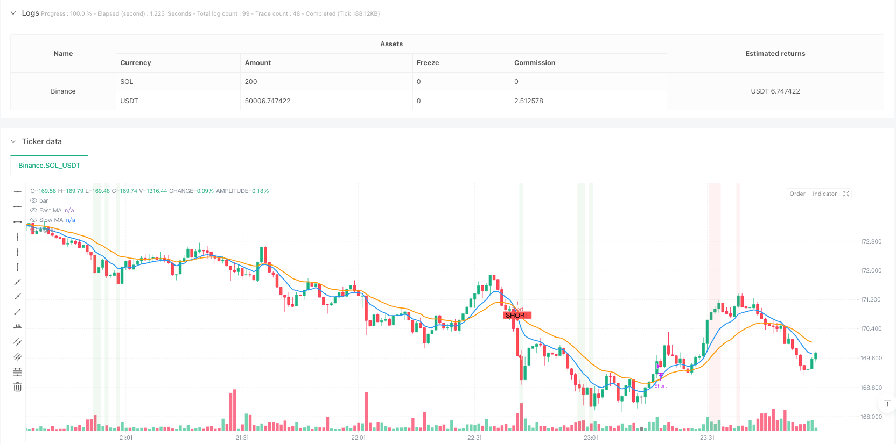
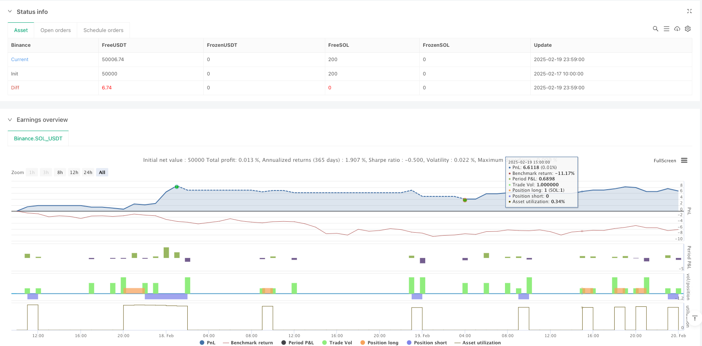

> Name

Dynamic-Volatility-Adjusted-EMA-Trend-Trading-Strategy-with-Smart-Stop-Loss-System
> Author

ianzeng123

> Strategy Description





[trans]
#### Overview
This strategy is an intelligent trading system based on trend tracking and momentum trading, mainly designed for short-term and fast trading scenarios. The core of the strategy uses a combined judgment system of exponential moving average (EMA) crossover, relative strength index (RSI) and average true range (ATR), and is equipped with a percentage-based intelligent stop-loss mechanism. This strategy is particularly suitable for chart trading with shorter periods such as 1 minute and 5 minutes, and can adapt to different market environments by dynamically adjusting parameters.
#### Strategy Principle
The strategy uses three core technical indicators to build a trading signal system:
1. Fast and slow exponential moving average (EMA) crossover system - using a combination of 9-period and 21-period EMA, and judging the trend direction through golden crosses and dead crosses
2. RSI overbought and oversold filter - use 14-period RSI and set 70 and 30 as overbought and oversold thresholds to avoid entering the market under extreme circumstances
3. ATR volatility confirmation mechanism - Use ATR to measure market volatility and ensure that transactions are only executed when the breakthrough is of sufficient strength
The trading logic is clearly designed: long entry requires the fast line to cross the slow line, RSI below 70, and the price to exceed the ATR multiple for confirmation; short entry requires the fast line to cross the slow line, RSI to be above 30, and the price to fall below the ATR multiple for confirmation. The system is equipped with a 1% dynamic stop loss position to effectively control risks.
#### Strategic Advantages
1. Cross-validation of multiple technical indicators to improve signal reliability
2. Dynamic parameter adaptive system, suitable for different time periods
3. ATR-based volatility filtering mechanism to reduce false signals
4. Intelligent stop-loss system to strictly control the risk of each transaction
5. Complete visualization system, including clear graphic marks and background prompts
#### Strategy Risk
1. A volatile market may produce frequent trading signals and increase transaction costs.
2. Fixed percentage stops may not be suitable for all market environments
3. Risk of slippage may occur during periods of high volatility
4. Parameter optimization requires continuous monitoring and adjustment
To reduce risk, it is recommended to:
- Adjust the stop loss percentage according to the characteristics of different varieties
- Added trend strength confirmation mechanism
- Monitor market fluctuations in real time
- Establish a complete fund management system
#### Strategy optimization direction
1. Introduce an adaptive stop-loss mechanism and dynamically adjust the stop-loss ratio according to market fluctuations
2. Add trend strength filter to improve the quality of trading signals
3. Develop an intelligent time filtering system to avoid low liquidity periods
4. Integrate trading volume indicators to enhance signal reliability
5. Develop a dynamic parameter optimization system to realize self-adjustment of strategies
#### Summary
This strategy builds a complete trading system through the synergy of multiple technical indicators. While maintaining flexibility, the system ensures transaction security through strict risk control. Although there are certain limitations, through continuous optimization and improvement, this strategy has good application value and development potential. ||
#### Overview
This strategy is an intelligent trading system based on trend following and momentum trading, specifically designed for short-term and rapid trading scenarios. The strategy core employs a combination of Exponential Moving Average (EMA) crossovers, Relative Strength Index (RSI), and Average True Range (ATR), coupled with a percentage-based smart stop-loss mechanism. It is particularly suitable for trading on shorter timeframe charts like 1-minute and 5-minute, with dynamic parameter adjustments to adapt to different market conditions.

#### Strategy Principles
The strategy utilizes three core technical indicators to construct its trading signal system:
1. Fast/Slow EMA Crossover System - Uses 9-period and 21-period EMA combination, identifying trends through golden and death crosses
2. RSI Overbought/Oversold Filter - Employs 14-period RSI, with 70 and 30 as thresholds to avoid extreme condition entries
3. ATR Volatility Confirmation Mechanism - Utilizes ATR to measure market volatility, ensuring trades are only executed when breakouts show sufficient strength

The trading logic is clearly defined: long entries require fast EMA crossing above slow EMA, RSI below 70, and price confirmation above ATR multiplier; short entries require fast EMA crossing below slow EMA, RSI above 30, and price confirmation below ATR multiplier. The system includes a 1% dynamic stop-loss mechanism for effective risk control.

#### Strategy Advantages
1. Multiple technical indicator cross-validation improves signal reliability
2. Dynamic parameter adaptation system suits different timeframes
3. ATR-based volatility filtering mechanism reduces false signals
4. Smart stop-loss system strictly controls risk per trade
5. Complete visualization system including clear graphical markers and background alerts

#### Strategy Risks
1. Ranging markets may generate frequent trading signals, increasing transaction costs
2. Fixed percentage stop-loss may not suit all market environments
3. Slippage risk during high volatility periods
4. Parameters require continuous monitoring and adjustment

To mitigate risks, it is recommended to:
- Adjust stop-loss percentages based on instrument characteristics
- Add trend strength confirmation mechanisms
- Monitor market volatility in real-time
- Establish comprehensive money management systems

#### Strategy Optimization Directions
1. Introduce adaptive stop-loss mechanism to dynamically adjust stop-loss percentages based on market volatility
2. Add trend strength filters to improve trading signal quality
3. Develop smart time filtering system to avoid low liquidity periods
4. Integrate volume indicators to enhance signal reliability
5. Develop dynamic parameter optimization system for strategy self-adjustment

#### Summary
This strategy constructs a complete trading system through the synergistic effect of multiple technical indicators. While maintaining flexibility, the system ensures trading safety through strict risk control. Although certain limitations exist, through continuous optimization and improvement, the strategy demonstrates good application value and development potential.[/trans]


> Source (PineScript)

``` pinescript
/*backtest
start: 2025-02-17 10:00:00
end: 2025-02-20 00:00:00
period: 1m
basePeriod: 1m
exchanges: [{"eid":"Binance","currency":"SOL_USDT"}]
*/

// This Pine Script™ code is subject to the terms of the Mozilla Public License 2.0 at https://mozilla.org/MPL/2.0/
// © DBate

//@version=6
strategy("Enhanced Scalping Strategy with Stop Loss", overlay=true)

// Input parameters
fastMA_length = input.int(9, title="Fast MA Length", minval=1)
slowMA_length = input.int(21, title="Slow MA Length", minval=1)
RSI_length = input.int(14, title="RSI Length", minval=1)
RSI_overbought = input.int(70, title="RSI Overbought")
RSI_oversold = input.int(30, title="RSI Oversold")
ATR_multiplier = input.float(1.5, title="ATR Multiplier")
ATR_length = input.int(14, title="ATR Length", minval=1)
stopLossPercent = input.float(1.0, title="Stop Loss %", minval=0.1) / 100  // Convert percentage to decimal

// Timeframe-specific adjustments
is1m = timeframe.period == "1"
is5m = timeframe.period == "5"

// Adjust input parameters based on timeframe
fastMA_length := is1m ? 9 : is5m ? 12 : fastMA_length
slowMA_length := is1m ? 21 : is5m ? 26 : slowMA_length
RSI_length := is1m ? 14 : is5m ? 14 : RSI_length

// Moving Averages
fastMA = ta.ema(close, fastMA_length)
slowMA = ta.ema(close, slowMA_length)

// RSI Calculation
rsi = ta.rsi(close, RSI_length)

// ATR Calculation for volatility filter
atr = ta.atr(ATR_length)

// Trade state variables
var bool inLongTrade = false
var bool inShortTrade = false
var float entryPrice = na
var float stopLossLevel = na

// Long and Short Conditions with added filters
longCondition = ta.crossover(fastMA, slowMA) and rsi < RSI_overbought and close > fastMA + ATR_multiplier * atr
shortCondition = ta.crossunder(fastMA, slowMA) and rsi > RSI_oversold and close < fastMA - ATR_multiplier * atr

// Ensure previous trades are closed before entering new ones
if (longCondition)
    strategy.close("Short")
    strategy.entry("Long", strategy.long)
    entryPrice := close
    stopLossLevel := close * (1 - stopLossPercent)  // 1% below entry for long trades
    inLongTrade := true
    inShortTrade := false

if (shortCondition)
    strategy.close("Long")
    strategy.entry("Short", strategy.short)
    entryPrice := close
    stopLossLevel := close * (1 + stopLossPercent)  // 1% above entry for short trades
    inShortTrade := true
    inLongTrade := false

// Stop Loss Exits
stopLossLongCondition = inLongTrade and close <= stopLossLevel
stopLossShortCondition = inShortTrade and close >= stopLossLevel

// Exit Conditions (Moving Average crossover or Stop Loss)
exitLongCondition = inLongTrade and (ta.crossunder(fastMA, slowMA) or stopLossLongCondition)
exitShortCondition = inShortTrade and (ta.crossover(fastMA, slowMA) or stopLossShortCondition)

// Reset trade state on exit
if (exitLongCondition)
    strategy.close("Long")
    inLongTrade := false
    inShortTrade := false

if (exitShortCondition)
    strategy.close("Short")
    inShortTrade := false
    inLongTrade := false

// Plot buy and sell signals
plotshape(longCondition, title="Long Signal", location=location.belowbar, color=color.green, style=shape.labelup, text="LONG")
plotshape(shortCondition, title="Short Signal", location=location.abovebar, color=color.red, style=shape.labeldown, text="SHORT")

// Plot moving averages
plot(fastMA, title="Fast MA", color=color.blue, linewidth=2)
plot(slowMA, title="Slow MA", color=color.orange, linewidth=2)

// Background color for overbought/oversold RSI
bgcolor(rsi > RSI_overbought ? color.new(color.red, 90) : na, title="Overbought Background")
bgcolor(rsi < RSI_oversold ? color.new(color.green, 90) : na, title="Oversold Background")

// Alerts
alertcondition(longCondition, title="Long Alert", message="Buy Signal")
alertcondition(shortCondition, title="Short Alert", message="Sell Signal")
alertcondition(exitLongCondition, title="Exit Long Alert", message="Exit Long Signal")
alertcondition(exitShortCondition, title="Exit Short Alert", message="Exit Short Signal")

```

> Detail

https://www.fmz.com/strategy/483054

> Last Modified

2025-02-21 11:11:26
