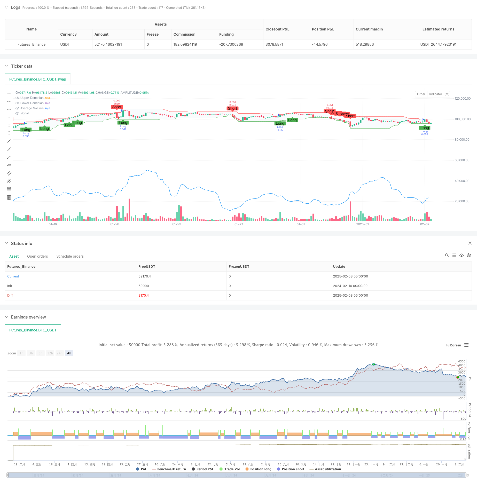

> Name

Dynamic Volume-Enhanced-Donchian-Channel-Trend-Breakout-Strategy
> Author

ChaoZhang

> Strategy Description



[trans]
#### Overview
This strategy is a trend breakout trading strategy that combines Donchian Channel and volume analysis. It captures turning points in market trends through dynamic support and resistance breakthroughs, combined with volume confirmation. The core of this strategy is to verify the effectiveness of price breakthroughs through amplification of trading volume, thereby improving the success rate of transactions.
#### Strategy Principle
The strategy operates based on two main technical indicators:
1. Donchian Channel: Tracks the highest and lowest prices within a specific cycle to form dynamic support and resistance levels.
2. Volume Moving Average (Volume SMA): used to confirm the validity of price breakthroughs.
Trading signal generation logic:
- Long conditions: the price breaks through the upper track and the current trading volume is greater than the average trading volume
- Short selling conditions: the price falls below the lower track and the current trading volume is greater than the average trading volume
- Closing conditions: Automatic closing based on reverse channel breakthrough
#### Strategic Advantages
1. Objective and quantifiable: strategies are based on clear mathematical indicators to reduce subjective judgments
2. Dynamic adaptation: the channel will adjust with market fluctuations to adapt to different market environments
3. Risk control: Have clear entry and exit conditions
4. Volume confirmation: Improve the reliability of breakthrough signals through volume analysis
5. Full automation: The strategy logic is clear and easy to implement programmatically
#### Strategy Risk
1. False breakthrough risk: The market may have a false breakthrough leading to losses.
2. Slippage risk: You may face larger slippage during periods of high volatility
3. Discomfort in a volatile market: Frequent false signals may occur in a volatile market.
4. Parameter sensitivity: Strategy performance is more sensitive to parameter selection
5. Dependence on market environment: Strategies perform very differently in different market environments.
#### Strategy optimization direction
1. Introduce trend filter: increase trend confirmation indicators and reduce false breakthroughs
2. Optimize the stop loss plan: design a more flexible stop loss mechanism
3. Increase the dimension of trading volume analysis: consider factors such as the rate of change of trading volume
4. Market environment identification: adding market environment judgment logic
5. Parameter adaptation: realize dynamic optimization mechanism of parameters
#### Summary
This strategy builds a relatively reliable trend breakout trading system by combining Donchian Channel and volume analysis. The advantage of the strategy lies in its objectivity and quantification, but at the same time, you need to pay attention to risks such as false breakthroughs and dependence on the market environment. Through continuous optimization and improvement, the strategy is expected to achieve better performance in actual trading. ||
#### Overview
This strategy combines Donchian Channels with volume analysis for trend breakout trading. It identifies market trend reversals through dynamic support and resistance breakouts, validated by volume confirmation. The core concept lies in using volume expansion to verify price breakouts, thereby improving trading success rates.

#### Strategy Principles
The strategy operates based on two main technical indicators:
1. Donchian Channels: Tracks the highest high and lowest low over a specified period, forming dynamic support and resistance levels.
2. Volume SMA: Used to confirm the validity of price breakouts.

Trade signal generation logic:
- Long entry: Price breaks above upper channel with volume above average
- Short entry: Price breaks below lower channel with volume above average
- Exit conditions: Automatic exit based on reverse channel breakout

#### Strategy Advantages
1. Objective and quantifiable: Based on clear mathematical indicators, reducing subjective judgment
2. Dynamic adaptation: Channels adjust with market volatility, suitable for different market conditions
3. Risk control: Clear entry and exit conditions
4. Volume confirmation: Improves breakout signal reliability through volume analysis
5. Fully automated: Clear strategy logic, easy to implement programmatically

#### Strategy Risks
1. False breakout risk: Market may exhibit false breakouts leading to losses
2. Slippage risk: Higher slippage during volatile periods
3. Sideways market inefficiency: May generate frequent false signals in ranging markets
4. Parameter sensitivity: Strategy performance highly dependent on parameter selection
5. Market environment dependency: Performance varies significantly across different market conditions

#### Optimization Directions
1. Implement trend filters: Add trend confirmation indicators to reduce false breakouts
2. Optimize stop-loss strategy: Design more flexible stop-loss mechanisms
3. Enhance volume analysis: Consider volume rate of change and other factors
4. Market environment recognition: Add market condition identification logic
5. Parameter adaptation: Implement dynamic parameter optimization

#### Summary
This strategy combines Donchian Channels and volume analysis to create a relatively reliable trend breakout trading system. Its strengths lie in objectivity and quantifiability, while requiring attention to risks such as false breakouts and market environment dependency. Through continuous optimization and improvement, the strategy shows potential for better performance in actual trading.[/trans]


> Source (PineScript)

``` pinescript
/*backtest
start: 2024-02-10 00:00:00
end: 2025-02-08 08:00:00
period: 3h
basePeriod: 3h
exchanges: [{"eid":"Futures_Binance","currency":"BTC_USDT"}]
*/

//@version=5
strategy("Donchian Channels + Volume Strategy", overlay=true, default_qty_type=strategy.percent_of_equity, default_qty_value=10)

// === Vstupy ===
donchianPeriod = input.int(20, title="Donchian Period", minval=1)
volumePeriod = input.int(20, title="Volume SMA Period", minval=1)

// === Výpočty Indikátorov ===
// Donchian Channels z predchádzajúceho baru
upperDonchianPrev = ta.highest(high, donchianPeriod)[1]
lowerDonchianPrev = ta.lowest(low, donchianPeriod)[1]

// Aktuálne Donchian Channels
upperDonchian = ta.highest(high, donchianPeriod)
lowerDonchian = ta.lowest(low, donchianPeriod)

// Volume SMA
avgVolume = ta.sma(volume, volumePeriod)

// === Podmienky Pre Vstupy ===
// Long Condition: Close prekoná predchádzajúce Upper Donchian a objem > priemerný objem
longCondition = ta.crossover(close, upperDonchianPrev) and volume > avgVolume

// Short Condition: Close prekoná predchádzajúce Lower Donchian a objem > priemerný objem
shortCondition = ta.crossunder(close, lowerDonchianPrev) and volume > avgVolume

// === Vstupné Signály ===
if (longCondition)
    strategy.entry("Long", strategy.long)

if (shortCondition)
    strategy.entry("Short", strategy.short)

// === Výstupné Podmienky ===
// Uzavretie Long pozície pri prekonaní aktuálneho Lower Donchian
exitLongCondition = ta.crossunder(close, lowerDonchian)

if (exitLongCondition)
    strategy.close("Long")

// Uzavretie Short pozície pri prekonaní aktuálneho Upper Donchian
exitShortCondition = ta.crossover(close, upperDonchian)

if (exitShortCondition)
    strategy.close("Short")

// === Vykreslenie Indikátorov na Grafe ===
// Vykreslenie Donchian Channels
upperPlot = plot(upperDonchian, color=color.red, title="Upper Donchian")
lowerPlot = plot(lowerDonchian, color=color.green, title="Lower Donchian")
fill(upperPlot, lowerPlot, color=color.rgb(173, 216, 230, 90), title="Donchian Fill")

// Vykreslenie Volume SMA (skryté)
plot(avgVolume, color=color.blue, title="Average Volume", display=display.none)

// === Vizualizácia Signálov ===
// Značky pre Long a Short vstupy
plotshape(series=longCondition, title="Long Entry", location=location.belowbar, color=color.green, style=shape.labelup, text="Long")
plotshape(series=shortCondition, title="Short Entry", location=location.abovebar, color=color.red, style=shape.labeldown, text="Short")

// Značky pre Long a Short výstupy
plotshape(series=exitLongCondition, title="Long Exit", location=location.abovebar, color=color.red, style=shape.labeldown, text="Exit Long")
plotshape(series=exitShortCondition, title="Short Exit", location=location.belowbar, color=color.green, style=shape.labelup, text="Exit Short")

```

> Detail

https://www.fmz.com/strategy/481339

> Last Modified

2025-02-10 14:18:39
