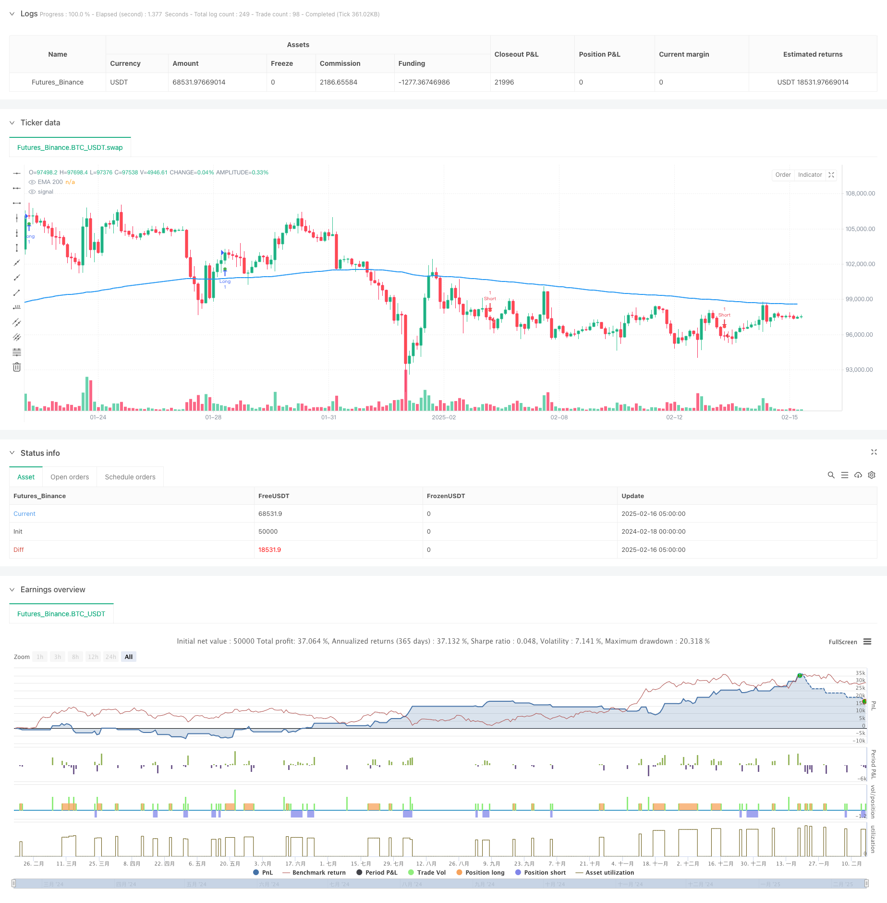

> Name

Dynamic Wave Indicator Combination Strategy-Dynamic-Wave-Indicator-Combination-Strategy
> Author

ChaoZhang

> Strategy Description



[trans]
#### Overview
This strategy is a comprehensive trading system based on multiple technical indicators, which combines momentum indicators, trend indicators and volatility indicators to capture short-term market fluctuation opportunities. The strategy identifies trading opportunities through MACD crossover signals, EMA trend confirmation, RSI overbought and oversold conditions, and ADX trend strength filtering, and uses ATR-based dynamic stop-loss and take-profit to manage risk.
#### Strategy Principle
The core logic of the strategy is based on the following key components:
1. The MACD indicator is used to capture momentum changes and determine the entry opportunity through the intersection of the fast line and the slow line.
2. The 200-period EMA is used to confirm the overall trend direction. When the price is above the moving average, it is considered a bullish trend, and vice versa is a short trend.
3. The RSI indicator is used to confirm price momentum. RSI>50 supports long positions, and RSI<50 supports short positions.
4. The ADX indicator is used to filter weak trends. Entry will only be considered when ADX is greater than the set threshold.
5. The ATR indicator is used to dynamically calculate stop loss and take profit positions, and adaptively adjust according to market volatility.
#### Strategic Advantages
1. Multi-indicator cross-validation to improve signal reliability
2. Dynamic risk management system that automatically adjusts stop loss and profit based on market volatility
3. Strong adaptability, parameters can be adjusted according to different market conditions
4. Complete trend confirmation mechanism to reduce the risk of false breakthroughs
5. Systematic entry and exit logic to reduce subjective judgments
#### Strategy Risk
1. Multiple indicators may cause signal lag
2. Short-term cycles are susceptible to market noise
3. Parameter optimization may lead to overfitting
4. High-frequency trading may bring higher transaction costs
5. Frequent stop losses may be triggered when the market fluctuates violently.
#### Strategy optimization direction
1. Introduce trading volume indicators as auxiliary confirmation
2. Optimize ADX threshold and improve trend filtering efficiency
3. Add time filter to avoid low liquidity periods
4. Develop an adaptive parameter system to improve strategy stability
5. Add market volatility filter to cope with different market environments
#### Summary
This strategy builds a complete trading system by comprehensively using multiple technical indicators. Although there is a certain degree of hysteresis and parameter optimization challenges, through reasonable risk management and continuous optimization, the strategy shows good adaptability and reliability. It is recommended that traders conduct sufficient backtesting and parameter optimization before using it in real trading. ||
#### Overview
This strategy is a comprehensive trading system based on multiple technical indicators, combining momentum indicators, trend indicators, and volatility indicators to capture short-term market opportunities. The strategy identifies trading opportunities through MACD crossover signals, EMA trend confirmation, RSI overbought/oversold conditions, and ADX trend strength filtering, while using ATR-based dynamic stop-loss and take-profit for risk management.

#### Strategy Principles
The core logic of the strategy is based on the following key components:
1. MACD indicator for capturing momentum changes through fast and slow line crossovers
2. 200-period EMA for overall trend confirmation, with price above the line indicating bullish trend and vice versa
3. RSI indicator for price momentum confirmation, RSI>50 supports long positions, RSI<50 supports short positions
4. ADX indicator for weak trend filtering, only considering entry when ADX is above the set threshold
5. ATR indicator for dynamic calculation of stop-loss and take-profit levels, adapting to market volatility

#### Strategy Advantages
1. Multiple indicator cross-validation improves signal reliability
2. Dynamic risk management system automatically adjusts stops based on market volatility
3. High adaptability with adjustable parameters for different market conditions
4. Complete trend confirmation mechanism reduces false breakout risks
5. Systematic entry and exit logic reduces subjective judgment

#### Strategy Risks
1. Multiple indicators may lead to signal lag
2. Short timeframes are susceptible to market noise
3. Parameter optimization may result in overfitting
4. High-frequency trading may incur higher transaction costs
5. Frequent stop-losses may be triggered during extreme market volatility

#### Strategy Optimization Directions
1. Incorporate volume indicators for additional confirmation
2. Optimize ADX threshold to improve trend filtering efficiency
3. Add time filters to avoid low liquidity periods
4. Develop adaptive parameter system to enhance strategy stability
5. Implement market volatility filters to handle different market conditions

#### Summary
This strategy constructs a complete trading system through the comprehensive use of multiple technical indicators. While it faces challenges such as lag and parameter optimization, the strategy demonstrates good adaptability and reliability through proper risk management and continuous optimization. Traders are advised to conduct thorough backtesting and parameter optimization before live implementation.[/trans]


> Source (PineScript)

``` pinescript
/*backtest
start: 2024-02-18 00:00:00
end: 2025-02-16 08:00:00
period: 3h
basePeriod: 3h
exchanges: [{"eid":"Futures_Binance","currency":"BTC_USDT"}]
*/

//@version=5
strategy("Optimized Impulse Wave Strategy", overlay=true)

// === INPUT PARAMETERS ===
fast_length = input(12, title="MACD Fast Length")
slow_length = input(26, title="MACD Slow Length")
signal_smoothing = input(9, title="MACD Signal Smoothing")
ema_length = input(200, title="EMA Length")
rsi_length = input(14, title="RSI Length")
adx_length = input(14, title="ADX Length")
adx_smoothing = input(14, title="ADX Smoothing")
atr_length = input(14, title="ATR Length")
risk_reward_ratio = input(2, title="Risk-Reward Ratio")
adx_threshold = input(20, title="ADX Threshold")

// === INDICATORS ===
[macdLine, signalLine, _] = ta.macd(close, fast_length, slow_length, signal_smoothing)
ema = ta.ema(close, ema_length)
rsi = ta.rsi(close, rsi_length)
[dmiPlus, dmiMinus, adx] = ta.dmi(adx_length, adx_smoothing)

// === ENTRY CONDITIONS ===
bullishTrend = ta.crossover(macdLine, signalLine) and close > ema and adx > adx_threshold and rsi > 50
bearishTrend = ta.crossunder(macdLine, signalLine) and close < ema and adx > adx_threshold and rsi < 50

// === STOP-LOSS & TAKE-PROFIT CALCULATION ===
longStopLoss = close - ta.atr(atr_length) * 1.5
longTakeProfit = close + (ta.atr(atr_length) * 1.5 * risk_reward_ratio)
shortStopLoss = close + ta.atr(atr_length) * 1.5
shortTakeProfit = close - (ta.atr(atr_length) * 1.5 * risk_reward_ratio)

// === STRATEGY EXECUTION ===
// Enter Long
if bullishTrend
    strategy.entry("Long", strategy.long)
    strategy.exit("TakeProfitLong", from_entry="Long", limit=longTakeProfit, stop=longStopLoss)

// Enter Short
if bearishTrend
    strategy.entry("Short", strategy.short)
    strategy.exit("TakeProfitShort", from_entry="Short", limit=shortTakeProfit, stop=shortStopLoss)

// === PLOTTING ===
plot(ema, title="EMA 200", color=color.blue, linewidth=2)
plotshape(series=bullishTrend, location=location.belowbar, color=color.green, size=size.small, title="Buy Signal")
plotshape(series=bearishTrend, location=location.abovebar, color=color.red, size=size.small, title="Sell Signal")

// === ALERTS ===
alertcondition(bullishTrend, title="Bullish Entry", message="Buy Signal Triggered!")
alertcondition(bearishTrend, title="Bearish Entry", message="Sell Signal Triggered!")

// === DEBUGGING LOG ===
label.new(bar_index, high, "ADX: " + str.tostring(adx), color=color.white, textcolor=color.black)
label.new(bar_index, low, "MACD Cross: " + str.tostring(macdLine), color=color.white, textcolor=color.black)

```

> Detail

https://www.fmz.com/strategy/482461

> Last Modified

2025-02-18 15:20:31
