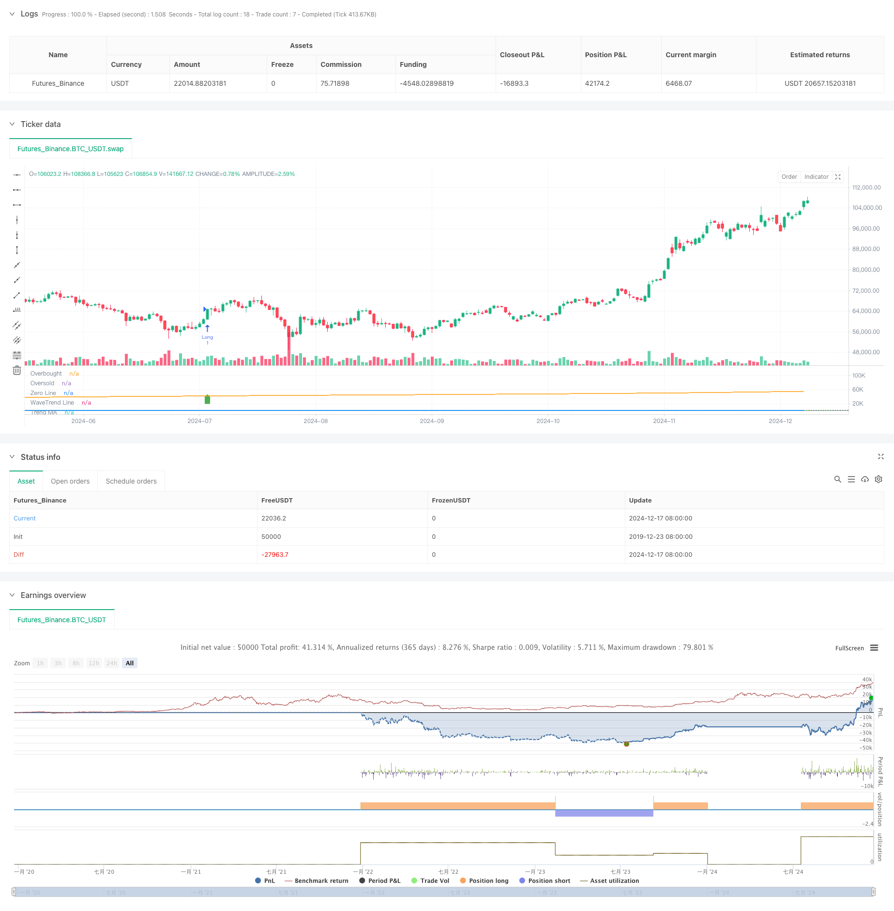

> Name

Dynamic-Wave-Trend-Tracking-Strategy
> Author

ChaoZhang

> Strategy Description



[trans]
#### Overview
This strategy is a quantitative trading system based on the WaveTrend indicator and trend following. It forms a complete trading decision-making framework by combining the WaveTrend indicator with moving averages. The strategy uses EMA and SMA to calculate wave trend values ​​and the overall market trend, identifies market turning points by setting overbought and oversold thresholds, and combines trend filters to improve trading accuracy.
#### Strategy Principle
The core of the strategy is achieved through the following steps:
1. First calculate the HLC average price (the average of the highest price, lowest price and closing price)
2. Use EMA to smooth the HLC average price to obtain the ESA line
3. Calculate the deviation between the HLC average price and the ESA line, and use EMA for smoothing
4. Calculate the K value based on the deviation, and obtain the final TCI line through two EMA smoothings
5. Calculate long-term trend lines using SMA as a trend filter
6. When the TCI line breaks through the overbought and oversold levels and is in line with the trend direction, a trading signal is generated
#### Strategic Advantages
1. High signal reliability: By combining the WaveTrend indicator and trend filter, false signals are effectively reduced
2. Improved risk control: clear overbought and oversold thresholds are set to help stop losses in a timely manner
3. Strong adaptability: strategy parameters can be flexibly adjusted according to different market conditions
4. Clear operation logic: clear entry and exit conditions, easy to execute
5. Comprehensive analysis: considering short-term fluctuations and long-term trends at the same time, improving the stability of transactions
#### Strategy Risk
1. Trend reversal risk: lags may occur in highly volatile markets
2. Parameter sensitivity: Different parameter combinations may lead to completely different results
3. Market adaptability: Frequent transactions may occur in volatile markets
4. Fund management: Positions need to be reasonably controlled to cope with market fluctuations
5. Technical dependence: Reliance on technical indicators may ignore fundamental factors
#### Strategy optimization direction
1. Add volatility filtering: adjust trading thresholds during periods of high volatility
2. Introduce multi-period analysis: combine signals from different time periods to improve accuracy
3. Optimization parameter adaptation: dynamically adjust indicator parameters according to market conditions
4. Improve stop-profit and stop-loss: add dynamic stop-profit and stop-loss mechanism
5. Add trading volume confirmation: combine with trading volume analysis to improve signal reliability
#### Summary
This strategy builds a robust trading system by cleverly combining the WaveTrend indicator and trend filters. The strategy achieves a comprehensive analysis of the market while keeping the operation simple. Although there are certain risks, through reasonable risk management and continuous optimization, this strategy has good practical value and development potential. ||
#### Overview
This strategy is a quantitative trading system based on the WaveTrend indicator and trend following. It combines the WaveTrend indicator with moving averages to form a complete trading decision framework. The strategy utilizes EMA and SMA to calculate wave trend values and overall market trends, identifies market turning points through overbought and oversold thresholds, and incorporates trend filters to improve trading accuracy.

#### Strategy Principle
The strategy's core is implemented through the following steps:
1. Calculate HLC average price (average of high, low, and closing prices)
2. Smooth the HLC average using EMA to obtain the ESA line
3. Calculate and smooth the deviation between HLC average and ESA line using EMA
4. Calculate K value based on deviation and smooth twice with EMA to get the final TCI line
5. Use SMA to calculate long-term trend line as trend filter
6. Generate trading signals when TCI line breaks through overbought/oversold levels and aligns with trend direction

#### Strategy Advantages
1. High signal reliability: Effectively reduces false signals by combining WaveTrend indicator and trend filter
2. Comprehensive risk control: Clear overbought/oversold thresholds for timely stop-loss
3. Strong adaptability: Strategy parameters can be flexibly adjusted for different market conditions
4. Clear operational logic: Explicit entry and exit conditions, easy to execute
5. Comprehensive analysis: Considers both short-term fluctuations and long-term trends, improving trading stability

#### Strategy Risks
1. Trend reversal risk: May lag in volatile markets
2. Parameter sensitivity: Different parameter combinations may lead to drastically different results
3. Market adaptability: May generate frequent trades in ranging markets
4. Capital management: Requires reasonable position control to handle market volatility
5. Technical dependence: Reliance on technical indicators may overlook fundamental factors

#### Strategy Optimization Directions
1. Add volatility filter: Adjust trading thresholds during high volatility periods
2. Incorporate multi-timeframe analysis: Combine signals from different timeframes to improve accuracy
3. Optimize parameter adaptation: Dynamically adjust indicator parameters based on market conditions
4. Improve profit/loss management: Add dynamic take-profit and stop-loss mechanisms
5. Add volume confirmation: Incorporate volume analysis to enhance signal reliability

#### Summary
The strategy constructs a robust trading system by cleverly combining the WaveTrend indicator with trend filters. While maintaining operational simplicity, it achieves comprehensive market analysis. Although certain risks exist, the strategy has good practical value and development potential through proper risk management and continuous optimization.[/trans]


> Source (PineScript)

``` pinescript
/*backtest
start: 2019-12-23 08:00:00
end: 2024-12-18 08:00:00
period: 1d
basePeriod: 1d
exchanges: [{"eid":"Futures_Binance","currency":"BTC_USDT"}]
*/

// This Pine Script™ code is subject to the terms of the Mozilla Public License 2.0 at https://mozilla.org/MPL/2.0/
// © mojomarv

//@version=6
strategy("WaveTrend with Trend Filter", shorttitle="WaveTrend Trend", overlay=false, initial_capital = 100000)

// Inputs for the WaveTrend indicator
inputLength = input.int(10, title="Channel Length", minval=1)
avgLength = input.int(21, title="Average Length", minval=1)
obLevel = input.float(45, title="Overbought Level")
osLevel = input.float(-45, title="Oversold Level")
showSignals = input.bool(true, title="Show Buy/Sell Signals")

// Trend filter input
maLength = input.int(500, title="Trend MA Length", minval=1)

// Calculate WaveTrend values
hlc_avg = (high + low + close) / 3  // Renamed from hlc3 to hlc_avg
esa = ta.ema(hlc_avg, inputLength)
d = ta.ema(math.abs(hlc_avg - esa), inputLength)
k = (hlc_avg - esa) / (0.015 * d)
ci = ta.ema(k, avgLength)
tci = ta.ema(ci, avgLength)

// Moving average for trend detection
trendMA = ta.sma(close, maLength)

// Determine trend
bullishTrend = close > trendMA
bearishTrend = close < trendMA

// Generate signals with trend filter
crossUp = ta.crossover(tci, osLevel)
crossDown = ta.crossunder(tci, obLevel)

// Plot WaveTrend
plot(tci, title="WaveTrend Line", color=color.new(color.blue, 0), linewidth=2)
hline(obLevel, "Overbought", color=color.red, linestyle=hline.style_dotted)
hline(osLevel, "Oversold", color=color.green, linestyle=hline.style_dotted)
hline(0, "Zero Line", color=color.gray, linestyle=hline.style_solid)

// Plot moving average for trend visualization
plot(trendMA, title="Trend MA", color=color.orange, linewidth=1)

// Plot buy and sell signals
plotshape(showSignals and crossUp, title="Buy Signal", location=location.belowbar, style=shape.labelup, color=color.new(color.green, 0), size=size.small)
plotshape(showSignals and crossDown, title="Sell Signal", location=location.abovebar, style=shape.labeldown, color=color.new(color.red, 0), size=size.small)

// Alerts
alertcondition(crossUp, title="Buy Alert", message="WaveTrend Buy Signal (Trend Confirmed)")
alertcondition(crossDown, title="Sell Alert", message="WaveTrend Sell Signal (Trend Confirmed)")
alertcondition(bullishTrend, title="bull", message="WaveTrend Sell Signal (Trend Confirmed)")
alertcondition(bearishTrend, title="bear", message="WaveTrend Sell Signal (Trend Confirmed)")

// Strategy logic
if crossUp and bullishTrend
    strategy.entry("Long", strategy.long)

if crossDown
    strategy.close("Long")

if crossDown and bearishTrend
    strategy.entry("Short", strategy.short)

if crossUp
    strategy.close("Short")
```

> Detail

https://www.fmz.com/strategy/475624

> Last Modified

2024-12-20 16:17:27
