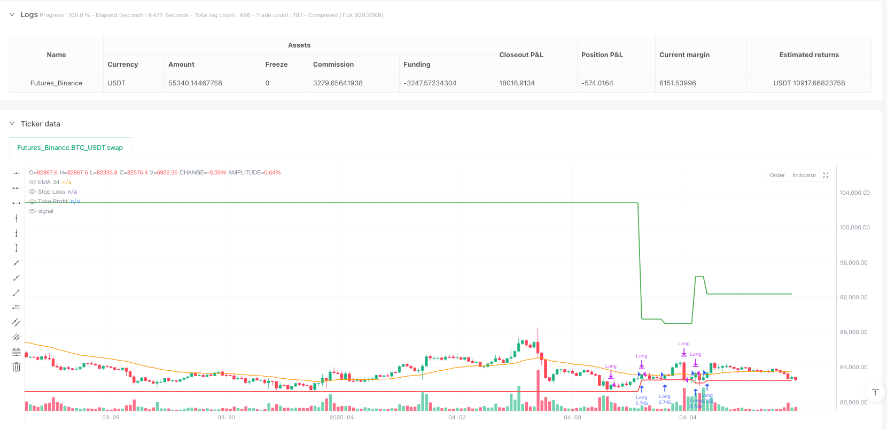
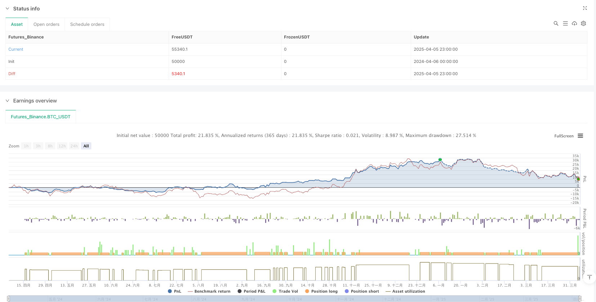

> Name

EMA-34-Dynamic-Stop-Loss-Crossover-Strategy-Intelligent-Combination-of-Trend-Following-and-Risk-Management
> Author

ianzeng123

> Strategy Description





[trans]

## Strategy Overview
The EMA 34 Dynamic Stop Crossover Strategy is a trend following trading system based on the 34-period exponential moving average (EMA) combined with an intelligent risk management mechanism. The core idea of ​​this strategy is to enter a long position when the price breaks above EMA 34 upwards, and to optimize the risk-reward ratio through dynamic stop loss and profit targets. The strategy adopts an adaptive stop-loss mechanism. When the transaction reaches a risk-reward ratio of 3:1, the stop-loss point will automatically move to the entry price (breakeven point), thereby locking in existing profits and eliminating the possibility of losses. This method not only protects the safety of funds, but also fully captures the potential returns of the upward trend. The ultimate goal is to achieve a risk-reward ratio of 10:1.
## Strategy Principle
How this strategy works can be broken down into several key links:
1. **Entry signal**: When the current closing price crosses the 34-period EMA (that is, the current closing price is higher than the EMA, and the closing price of the previous period is lower than or equal to the EMA), the system generates a long entry signal. This crossover is seen as the start of a potential uptrend.
2. **Initial Risk Setting**: Once the entry is confirmed, the system will automatically set the stop loss point at the lowest point of the previous candlestick. This setup cleverly exploits the market structure to minimize potential losses.
3. **Profit target determination**: Based on the difference between the entry price and the initial stop loss (defined as the risk value), the system sets a profit target of 10 times the risk value, that is, pursuing a risk-reward ratio of 10:1. This ratio is not only conducive to the establishment of long-term profitability, but also balances the transaction winning rate and the profit-loss ratio.
4. **Dynamic Stop Loss Adjustment**: When the transaction develops favorably and the price reaches a risk-reward ratio of 3:1 (that is, the price rises by more than 3 times the risk value), the stop loss point will automatically be adjusted to the entry price to achieve "capital-guaranteed trading". This mechanism ensures that even if the market reverses, the trade will not incur losses.
5. **Exit Mechanism**: The trade is automatically closed in two situations: the price hits the stop loss point or reaches the profit target. Due to the use of dynamic stop loss, after the price reaches a high enough point, even if the market reverses, the overall transaction is still profitable.
The strategy also includes visual elements, which visually display stop loss and profit target lines on the chart to facilitate traders to track trading status and risk management in real time.
## Strategic Advantages
After in-depth analysis of the code, this strategy shows unique advantages in many aspects:
1. **Accurate trend capture**: Using the mid-term moving average of EMA 34, the strategy can effectively filter short-term noise and only capture trend changes with significant breakthroughs, reducing the interference of false signals.
2. **Intelligent Risk Control**: By setting the stop loss point at the lowest point of the previous candle, the strategy not only respects the market structure, but also quantifies the risk of each transaction into a predictable value, which contributes to precise fund management.
3. **Adaptive protection mechanism**: When the trading profit reaches 3 times the risk value, the stop loss is automatically moved to the breakeven point. This design allows the strategy to "lock" existing profits and significantly reduces the probability of complete loss.
4. **Optimized risk-reward ratio**: A risk-reward setting of 10:1 means that even if the winning rate is low, the strategy may still be profitable in the long run. This feature is especially suitable for markets with high volatility but clear trends.
5. **Fully automated operation**: Once deployed, the strategy can automatically execute all trading decisions according to preset rules, eliminating human emotional interference and ensuring the strict execution of trading disciplines.
6. **Visual decision support**: By visually displaying stop loss and profit target lines on the chart, traders can easily monitor the trading status, which not only improves operational transparency, but also facilitates post-event analysis and strategy improvement.
## Strategy Risk
Although this strategy has many advantages, there are still several risks to be aware of:
1. **Poor performance in sideways markets**: In sideways markets that lack a clear direction, EMA cross signals may occur frequently but are difficult to form an effective trend, resulting in continuous small losses. A solution could be to consider adding additional market structure filters such as volatility indicators or trend strength confirmations.
2. **Gap Risk Exposure**: If there is a significant gap in the market, especially a downward gap, the actual stop-loss execution price may be much lower than the set stop-loss point, increasing the actual loss. This risk can be mitigated by setting maximum risk limits or by only trading in less volatile market environments.
3. **Parameter Sensitivity**: Strategy performance is highly dependent on the choice of EMA period (34) and risk-reward settings (3:1 and 10:1). Different market environments may require different parameter settings, and fixed parameters may lead to unstable performance. Extensive backtesting is recommended to optimize parameters under different market conditions.
4. **Profit Target Too High**: While a 10:1 risk-reward setup is attractive in theory, in actual trading, the price may reverse before reaching such a high target. It may be more pragmatic to consider introducing a partial profit capture mechanism or dynamically adjusting profit targets.
5. **Over-Reliance on a Single Indicator**: Relying solely on EMA 34 as an entry signal may ignore other important market factors. It is recommended to integrate other technical indicators or price action analysis to confirm the validity of the signal.
## Strategy optimization direction
Based on an in-depth analysis of the code, the following are possible optimization directions:
1. **Add market environment filtering**: Introduce indicators such as ATR (Average True Range) or ADX (Average Directional Index) to evaluate market volatility and trend strength, and only execute transactions in favorable environments. For example, you can add a condition that requires ADX>25 to indicate a clear trend before entry is allowed. This significantly reduces false signals in sideways markets.
2. **Realize batch profit mechanism**: The current strategy pursuing a single risk-return ratio of 10:1 may be too idealistic. It is recommended to achieve segmented profits, such as closing part of the position at three levels: 3:1, 5:1 and 10:1. This can not only lock in part of the profit, but also give the remaining positions room to pursue greater profits.
3. **Dynamic adjustment of risk return parameters**: Dynamically adjust the risk return target based on market volatility. For example, in a market with lower volatility, a lower return target is expected, and in a market with higher volatility, higher returns are pursued. This can be achieved by integrating ATR values ​​into profit target calculations.
4. **Add trading time filter**: Fluctuations in certain periods (such as the early opening of the market or around the release of important data) are often irregular and may produce false signals. Adding time filters can avoid these high-risk periods.
5. **Integrated multi-period analysis**: Consider confirming the trend direction on a larger time frame, and only enter the market when the daily trend is consistent with the hourly signal, which can improve signal quality and transaction success rate.
6. **Optimize position management**: The current strategy uses a fixed position percentage (100% account equity). You can consider dynamically adjusting the position size based on volatility or the current account retracement status, increasing the position in more confident transactions, and vice versa.
## Summarize
The EMA 34 dynamic stop-loss crossover strategy is a carefully designed trend following system that combines EMA crossover signals with advanced risk management techniques to effectively control risks while pursuing considerable returns. Its biggest feature is the dynamic stop-loss mechanism. When the transaction reaches a certain profit level, the stop-loss is automatically moved to the breakeven point, which not only protects the safety of funds but also allows enough price fluctuation space to capture the general trend.
The main advantages of the strategy are its strict risk control, clear trading rules and automated execution capabilities, allowing traders to remain disciplined during emotional swings. However, strategies also have potential risks such as over-reliance on a single technical indicator, parameter sensitivity, and poor performance in specific market environments.
By adding market environment filtering, achieving batch profits, dynamically adjusting parameters, optimizing position management, etc., the robustness and adaptability of the strategy can be further improved. These optimizations will help the strategy better respond to different market conditions and improve long-term profitability.
For investors looking for a mid- to long-term trend trading system, especially those who value risk control and money management, this strategy provides a clearly structured framework that is easy to implement and has the potential to generate substantial returns. As it continues to optimize and adapt to market changes, this strategy promises to become a powerful tool in a trader's arsenal. ||
## Strategy Overview

The EMA 34 Dynamic Stop-Loss Crossover Strategy is a trend-following trading system based on the 34-period Exponential Moving Average (EMA) combined with intelligent risk management mechanisms. The core idea of this strategy is to enter long positions when the price breaks above the EMA 34, and optimize the risk-reward ratio through dynamic stop-loss and profit targets. The strategy employs an adaptive stop-loss mechanism that automatically moves the stop-loss point to the entry price (break-even point) when the trade achieves a 3:1 risk-reward ratio, thereby locking in existing profits and eliminating the possibility of loss. This approach both protects capital safety and fully captures the potential gains of upward trends, with the ultimate goal of achieving a 10:1 risk-reward ratio.

## Strategy Principles

The operating principles of this strategy can be divided into several key components:

1. **Entry Signal**: The system generates a long entry signal when the current closing price crosses above the 34-period EMA (i.e., the current closing price is higher than the EMA, while the previous period's closing price was lower than or equal to the EMA). This crossover is viewed as the beginning of a potential uptrend.

2. **Initial Risk Setting**: Once entry is confirmed, the system automatically sets the stop-loss point at the lowest point of the previous candle. This setup cleverly utilizes market structure to minimize potential losses.

3. **Profit Target Determination**: Based on the difference between the entry price and the initial stop-loss (defined as the risk value), the system sets a profit target of 10 times the risk value, pursuing a 10:1 risk-reward ratio. This proportion is beneficial for establishing long-term profitability while balancing win rate and profit/loss ratio.

4. **Dynamic Stop-Loss Adjustment**: When the trade develops favorably and the price reaches a 3:1 risk-reward ratio (i.e., rises more than 3 times the risk value), the stop-loss point is automatically adjusted to the entry price, achieving a "break-even trade." This mechanism ensures that even if the market reverses, the trade will not result in a loss.

5. **Exit Mechanism**: The trade automatically closes in two scenarios: when the price hits the stop-loss point or reaches the profit target. Due to the dynamic stop-loss, even if the market reverses after the price reaches a sufficiently high point, the overall trade can still ensure profitability.

The strategy also includes visualization elements, displaying stop-loss and profit target lines on the chart for intuitive tracking of trade status and risk management situations.

## Strategy Advantages

Through in-depth analysis of the code, this strategy demonstrates multiple unique advantages:

1. **Precise Trend Capture**: Using the EMA 34 as a medium-term moving average, the strategy effectively filters short-term noise, capturing only significant trend changes with substantial breakouts, reducing interference from false signals.

2. **Intelligent Risk Control**: By setting the stop-loss point at the lowest point of the previous candle, the strategy both respects market structure and quantifies the risk of each trade into a predictable value, facilitating precise capital management.

3. **Adaptive Protection Mechanism**: Automatically moving the stop-loss to the break-even point when the trade profit reaches 3 times the risk value, this design allows the strategy to "lock in" existing profits, significantly reducing the probability of a complete loss.

4. **Optimized Risk-Reward Ratio**: The 10:1 risk-reward setting means that even with a relatively low win rate, the strategy can still potentially achieve profitability in the long run. This feature is particularly suitable for markets with high volatility but clear trends.

5. **Fully Automated Operation**: Once deployed, the strategy can automatically execute all trading decisions according to preset rules, eliminating human emotional interference and ensuring strict implementation of trading discipline.

6. **Visualization Decision Support**: By intuitively displaying stop-loss and profit target lines on the chart, traders can easily monitor trade status, which not only improves operational transparency but also facilitates post-analysis and strategy improvement.

## Strategy Risks

Despite its many advantages, there are several risk points that need attention:

1. **Poor Performance in Sideways Markets**: In sideways markets lacking clear direction, EMA crossover signals may frequently occur but struggle to form effective trends, leading to consecutive small losses. A solution could be to add additional market structure filters, such as volatility indicators or trend strength confirmation.

2. **Gap Risk Exposure**: If the market experiences significant gaps, especially downward gaps, the actual stop-loss execution price may be far lower than the set stop-loss point, increasing actual losses. Mitigating this risk can be achieved by setting maximum risk limits or only trading in market environments with lower volatility.

3. **Parameter Sensitivity**: Strategy performance is highly dependent on the choice of EMA period (34) and risk-reward settings (3:1 and 10:1). Different market environments may require different parameter settings, and fixed parameters may lead to unstable performance. Extensive backtesting is recommended to optimize parameters for different market conditions.

4. **Profit Target Too High**: While a 10:1 risk-reward setting is theoretically attractive, in actual trading, prices may reverse before reaching such a high target. Considering the introduction of partial profit-taking mechanisms or dynamically adjusting profit targets may be more practical.

5. **Over-reliance on a Single Indicator**: Relying solely on EMA 34 as an entry signal may ignore other important market factors. It is recommended to integrate other technical indicators or price action analysis to confirm signal validity.

## Strategy Optimization Directions

Based on in-depth analysis of the code, here are possible optimization directions:

1. **Add Market Environment Filtering**: Introduce indicators such as ATR (Average True Range) or ADX (Average Directional Index) to assess market volatility and trend strength, executing trades only in favorable environments. For example, adding a condition requiring ADX>25 to indicate a clear trend before allowing entry. This can significantly reduce false signals in sideways markets.

2. **Implement Partial Profit-Taking Mechanism**: The current strategy's pursuit of a single 10:1 risk-reward ratio may be too idealistic. It is recommended to implement staged profit-taking, such as closing portions of the position at 3:1, 5:1, and 10:1 levels, which both locks in partial profits and gives the remaining position space to pursue greater returns.

3. **Dynamically Adjust Risk-Reward Parameters**: Dynamically adjust risk-reward targets based on market volatility, for example, expecting lower return targets in less volatile markets and pursuing higher returns in more volatile markets. This can be achieved by incorporating ATR values into profit target calculations.

4. **Add Trading Time Filters**: Certain periods (such as early market opening or before and after important data releases) often have irregular volatility and may produce false signals. Adding time filters can avoid these high-risk periods.

5. **Integrate Multi-Timeframe Analysis**: Consider confirming trend direction on larger timeframes, entering only when the daily trend aligns with hourly signals, which can improve signal quality and trade success rate.

6. **Optimize Position Management**: The current strategy uses a fixed position percentage (100% of account equity), but could consider dynamically adjusting position size based on volatility or current account drawdown status, increasing positions in more reliable trades and reducing them otherwise.

## Summary

The EMA 34 Dynamic Stop-Loss Crossover Strategy is a carefully designed trend-following system that effectively controls risk while pursuing considerable returns by combining EMA crossover signals with advanced risk management techniques. Its most significant feature is the dynamic stop-loss mechanism, which automatically moves the stop-loss to the break-even point when the trade reaches a certain profit level, both protecting capital safety and allowing sufficient price movement space to capture major trends.

The strategy's main advantages lie in its strict risk control, clear trading rules, and automated execution capabilities, enabling traders to maintain discipline even during emotional fluctuations. However, the strategy also has potential risks such as over-reliance on a single technical indicator, parameter sensitivity, and poor performance in specific market environments.

By adding market environment filtering, implementing partial profit-taking, dynamically adjusting parameters, and optimizing position management, the strategy's robustness and adaptability can be further enhanced. These optimizations will help the strategy better respond to different market conditions and improve long-term profitability.

For investors seeking medium to long-term trend trading systems, especially those who value risk control and capital management, this strategy provides a clear, easy-to-implement framework with the potential to generate considerable returns. With continuous optimization and adaptation to market changes, this strategy has the potential to become a powerful tool in a trader's arsenal.[/trans]


> Source (PineScript)

``` pinescript
/*backtest
start: 2024-04-06 00:00:00
end: 2025-04-06 00:00:00
period: 1h
basePeriod: 1h
exchanges: [{"eid":"Futures_Binance","currency":"BTC_USDT"}]
*/

//@version=5
strategy("EMA 34 Crossover with Break Even Stop Loss", overlay=true, default_qty_type=strategy.percent_of_equity, default_qty_value=100)

// EMA 34
ema34 = ta.ema(close, 34)
plot(ema34, color=color.orange, title="EMA 34")

// Variables to manage trade
var float entryPrice = na
var float stopLoss = na
var float takeProfit = na
var bool inTrade = false
var float breakEvenLevel = na
var float risk = na

// Condition for EMA 34 crossover (price crossing above EMA 34)
longCondition = close > ema34 and close[1] <= ema34[1]

// Set up the trade when the crossover occurs
if longCondition and not inTrade
    entryPrice := close
    stopLoss := low[1]  // Set stop loss to the low of the previous candle (not the crossover candle)
    risk := entryPrice - stopLoss
    takeProfit := entryPrice + (risk * 10)  // 1:10 risk-to-reward ratio
    strategy.entry("Long", strategy.long)
    inTrade := true

// Move stop loss to break-even when 1:3 RR is reached
if inTrade and close >= entryPrice + (risk * 3)  // 1:3 RR reached
    stopLoss := entryPrice  // Move stop loss to entry price (break-even)
    breakEvenLevel := entryPrice

// Exit the trade if stop loss or take profit is hit
if inTrade
    if low <= stopLoss  // Stop loss condition
        strategy.close("Long", comment="Stop Loss Hit")
        inTrade := false
    if high >= takeProfit  // Take profit condition
        strategy.close("Long", comment="Take Profit Hit")
        inTrade := false

// Optionally plot stop loss and take profit levels for visualization
plot(stopLoss, color=color.red, title="Stop Loss", linewidth=2, style=plot.style_line)
plot(takeProfit, color=color.green, title="Take Profit", linewidth=2, style=plot.style_line)
```

> Detail

https://www.fmz.com/strategy/489638

> Last Modified

2025-04-07 11:39:45
