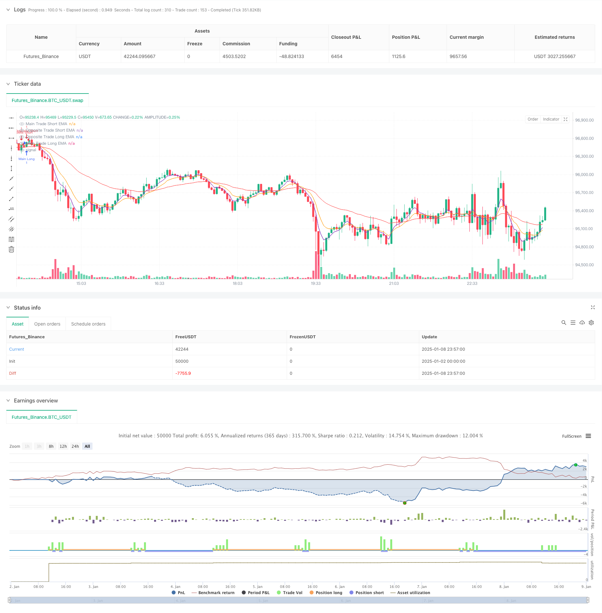

> Name

Adaptive-Dual-Direction-EMA-Trend-Trading-System-with-Reverse-Trade-Optimization-Strategy
> Author

ChaoZhang

> Strategy Description



[trans]
#### Overview
This strategy is a two-way trading system that combines exponential moving averages (EMA) and time intervals. Within a fixed time interval defined by the user, the system determines the main trading direction based on the positional relationship of EMAs of different periods. At the same time, by monitoring the cross signals of another set of EMA indicators or when the time is approaching the next trading cycle, it selects the appropriate time to conduct reverse hedging transactions, thereby realizing two-way trading opportunities.
#### Strategy Principle
The strategy operates based on two core mechanisms: main trades at fixed time intervals and flexible reverse trades. The main transaction is based on the relative position of the 5/40-minute EMA to determine the trend direction, and transactions are executed at each trading interval (default 30 minutes). Reverse trades are made by monitoring the 5/10 minute EMA crossover signal, or 1 minute before the next major trade, whichever occurs sooner. The entire transaction is conducted within a user-defined time window to ensure the timeliness of the transaction.
#### Strategic Advantages
1. It combines two trading ideas, trend tracking and mean reversion, to capture trading opportunities in different market environments.
2. Control trading frequency through time intervals to avoid excessive trading
3. The reverse trading mechanism provides a risk hedging function and helps control drawdowns.
4. Parameters can be highly customized, including EMA cycle, trading time interval, etc., with strong adaptability
5. The trading time window is adjustable to facilitate optimization for different market characteristics.
#### Strategy Risk
1. The EMA indicator is lagging and may produce lagging signals in violently volatile markets.
2. Trading at fixed time intervals may miss important market opportunities
3. Reverse trading may cause unnecessary losses when the trend is strong
4. Improper parameter selection may result in too many or too few trading signals
5. The impact of transaction costs on strategy returns needs to be considered
#### Strategy optimization direction
1. Introduce volatility indicators, dynamically adjust EMA parameters, and improve strategy adaptability
2. Increase trading volume analysis and improve the reliability of trading signals
3. Develop a dynamic time interval mechanism to adjust transaction frequency according to market activity
4. Add stop loss and profit target management to optimize fund management
5. Consider introducing other technical indicators as cross-validation to improve the accuracy of transactions
#### Summary
This is a comprehensive strategy that combines trend tracking and reverse trading. Through the cooperation of time intervals and EMA indicators, it achieves two-way grasp of trading opportunities. The strategy is highly customizable and has good risk control potential, but it requires parameter optimization and risk management improvement based on actual market conditions. When applying for real trading, it is recommended to conduct sufficient backtesting and parameter optimization, and make targeted adjustments based on market characteristics.
|| 

#### Overview
This strategy is a dual-direction trading system that combines Exponential Moving Averages (EMA) with time intervals. The system determines the main trading direction based on EMA relationships within user-defined fixed time intervals, while monitoring another set of EMA indicators for crossover signals or approaching the next trading cycle to execute reverse hedge trades, thereby capturing bi-directional trading opportunities.

#### Strategy Principle
The strategy operates on two core mechanisms: main trades at fixed intervals and flexible reverse trades. The main trades judge trend direction based on the relative position of 5/40-minute EMAs, executing trades at each interval (default 30 minutes). Reverse trades are triggered either by monitoring 5/10-minute EMA crossover signals or one minute before the next main trade, whichever occurs first. All trading occurs within a user-defined time window to ensure trading effectiveness.

#### Strategy Advantages
1. Combines trend-following and mean-reversion trading approaches to capture opportunities in different market environments
2. Controls trading frequency through time intervals to avoid overtrading
3. Reverse trading mechanism provides risk hedging functionality to help control drawdowns
4. Highly customizable parameters including EMA periods and trading intervals for strong adaptability
5. Adjustable trading time windows for optimization according to different market characteristics

#### Strategy Risks
1. EMA indicators have inherent lag, potentially generating delayed signals in volatile markets
2. Fixed time interval trading might miss important market opportunities
3. Reverse trades may result in unnecessary losses during strong trends
4. Improper parameter selection can lead to excessive or insufficient trading signals
5. Need to consider the impact of trading costs on strategy returns

#### Strategy Optimization Directions
1. Introduce volatility indicators to dynamically adjust EMA parameters for improved adaptability
2. Add volume analysis to enhance trading signal reliability
3. Develop dynamic time interval mechanisms that adjust trading frequency based on market activity
4. Implement stop-loss and profit target management to optimize capital management
5. Consider incorporating additional technical indicators for cross-validation to improve trading accuracy

#### Summary
This is a comprehensive strategy that combines trend following with reverse trading, achieving bi-directional opportunity capture through the coordination of time intervals and EMA indicators. The strategy offers strong customization capabilities and good potential for risk control, but requires parameter optimization and risk management refinement based on actual market conditions. For live trading implementation, it is recommended to conduct thorough backtesting and parameter optimization, along with specific adjustments based on market characteristics.[/trans]


> Source (PineScript)

``` pinescript
/*backtest
start: 2025-01-02 00:00:00
end: 2025-01-09 00:00:00
period: 3m
basePeriod: 3m
exchanges: [{"eid":"Futures_Binance","currency":"BTC_USDT"}]
*/

//@version=5
strategy("SPX EMA Strategy with Opposite Trades", overlay=true)

// User-defined inputs
tradeIntervalMinutes = input.int(30, title="Main Trade Interval (in minutes)", minval=1)
oppositeTradeDelayMinutes = input.int(1, title="Opposite Trade time from next trade (in minutes)", minval=1) // Delay of opposite trade (1 min before the next trade)
startHour = input.int(10, title="Start Hour", minval=0, maxval=23)
startMinute = input.int(30, title="Start Minute", minval=0, maxval=59)
stopHour = input.int(15, title="Stop Hour", minval=0, maxval=23)
stopMinute = input.int(0, title="Stop Minute", minval=0, maxval=59)

// User-defined EMA periods for main trade and opposite trade
mainEmaShortPeriod = input.int(5, title="Main Trade EMA Short Period", minval=1)
mainEmaLongPeriod = input.int(40, title="Main Trade EMA Long Period", minval=1)
oppositeEmaShortPeriod = input.int(5, title="Opposite Trade EMA Short Period", minval=1)
oppositeEmaLongPeriod = input.int(10, title="Opposite Trade EMA Long Period", minval=1)

// Calculate the EMAs for main trade
emaMainShort = ta.ema(close, mainEmaShortPeriod)
emaMainLong = ta.ema(close, mainEmaLongPeriod)

// Calculate the EMAs for opposite trade (using different periods)
emaOppositeShort = ta.ema(close, oppositeEmaShortPeriod)
emaOppositeLong = ta.ema(close, oppositeEmaLongPeriod)

// Condition to check if it is during the user-defined time window
startTime = timestamp(year, month, dayofmonth, startHour, startMinute)
stopTime = timestamp(year, month, dayofmonth, stopHour, stopMinute)
currentTime = timestamp(year, month, dayofmonth, hour, minute)

// Ensure the script only trades within the user-defined time window
isTradingTime = currentTime >= startTime and currentTime <= stopTime

// Time condition: Execute the trade every tradeIntervalMinutes
var float lastTradeTime = na
timePassed = na(lastTradeTime) or (currentTime - lastTradeTime) >= tradeIntervalMinutes * 60 * 1000

// Entry Conditions for Main Trade
longCondition = emaMainShort > emaMainLong // Enter long if short EMA is greater than long EMA
shortCondition = emaMainShort < emaMainLong // Enter short if short EMA is less than long EMA

// Detect EMA crossovers for opposite trade (bullish or bearish)
bullishCrossoverOpposite = ta.crossover(emaOppositeShort, emaOppositeLong)  // Opposite EMA short crosses above long
bearishCrossoverOpposite = ta.crossunder(emaOppositeShort, emaOppositeLong) // Opposite EMA short crosses below long

// Track the direction of the last main trade (true for long, false for short)
var bool isLastTradeLong = na
// Track whether an opposite trade has already been executed after the last main trade
var bool oppositeTradeExecuted = false

// Execute the main trades if within the time window and at the user-defined interval
if isTradingTime and timePassed
    if longCondition
        strategy.entry("Main Long", strategy.long) 
        isLastTradeLong := true // Mark the last trade as long
        oppositeTradeExecuted := false // Reset opposite trade status
        lastTradeTime := currentTime
       // label.new(bar_index, low, "Main Long", color=color.green, textcolor=color.white, size=size.small)
    else if shortCondition
        strategy.entry("Main Short", strategy.short) 
        isLastTradeLong := false // Mark the last trade as short
        oppositeTradeExecuted := false // Reset opposite trade status
        lastTradeTime := currentTime
       // label.new(bar_index, high, "Main Short", color=color.red, textcolor=color.white, size=size.small)

// Execute the opposite trade only once after the main trade
if isTradingTime and not oppositeTradeExecuted
    // 1 minute before the next main trade or EMA crossover
    if (currentTime - lastTradeTime) >= (tradeIntervalMinutes - oppositeTradeDelayMinutes) * 60 * 1000 or bullishCrossoverOpposite or bearishCrossoverOpposite
        if isLastTradeLong
            // If the last main trade was long, enter opposite short trade
            strategy.entry("Opposite Short", strategy.short) 
            //label.new(bar_index, high, "Opposite Short", color=color.red, textcolor=color.white, size=size.small)
        else
            // If the last main trade was short, enter opposite long trade
            strategy.entry("Opposite Long", strategy.long) 
            //label.new(bar_index, low, "Opposite Long", color=color.green, textcolor=color.white, size=size.small)
        
        // After entering the opposite trade, set the flag to true so no further opposite trades are placed
        oppositeTradeExecuted := true

// Plot the EMAs for visual reference
plot(emaMainShort, title="Main Trade Short EMA", color=color.blue)
plot(emaMainLong, title="Main Trade Long EMA", color=color.red)
plot(emaOppositeShort, title="Opposite Trade Short EMA", color=color.purple)
plot(emaOppositeLong, title="Opposite Trade Long EMA", color=color.orange)


```

> Detail

https://www.fmz.com/strategy/477951

> Last Modified

2025-01-10 15:24:00
