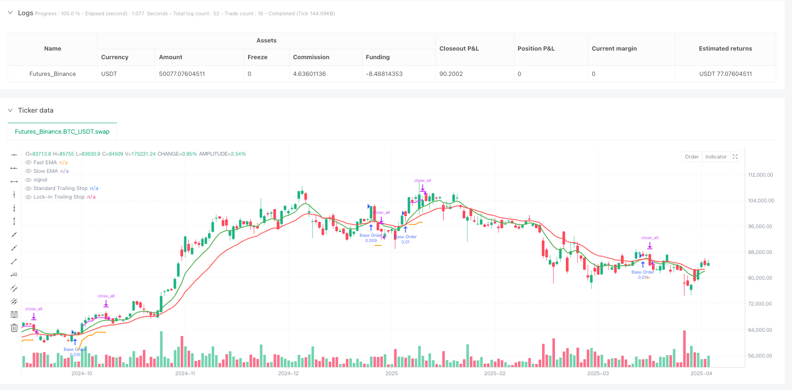
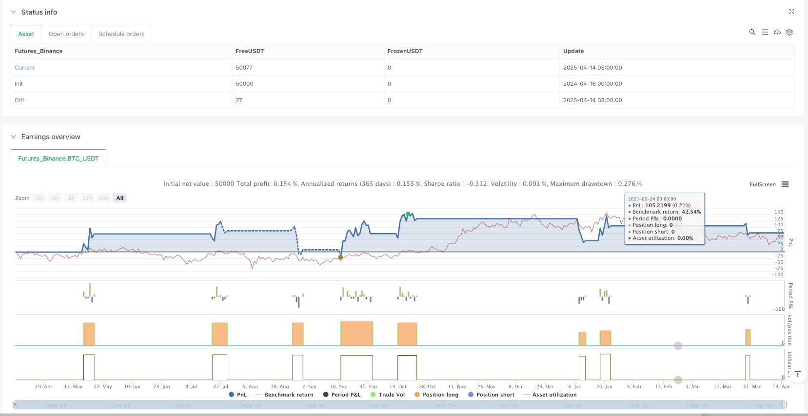

> Name

Index Moving Average Crossover Smart Fixed Investment Chain Stop Loss Tracking System-EMA-Crossover-Smart-DCA-with-Dual-Trailing-Stop-System
> Author

ianzeng123

> Strategy Description





[trans]

## Overview
The exponential moving average crossover intelligent fixed investment chain stop-loss tracking system is a quantitative trading strategy based on technical analysis and sophisticated fund management. This strategy uses exponential moving average (EMA) crossover signals to identify potential uptrends, combines dollar cost averaging (DCA) with smart additions, and protects profits with a dual trailing stop mechanism. The core of the strategy is to use the intersection of fast EMA and slow EMA to determine the timing of entry, automatically deploy up to two safety orders (Safety Orders) when the price drops, calculate the position of adding a position through the average true range (ATR) or a fixed percentage, and use a two-layer trailing stop loss system (standard trailing stop loss and profit lock trailing stop loss) to protect funds. The strategy also integrates functions such as date filters and trading cooling periods, providing quantitative traders with a complete risk management and capital allocation system.
## Strategy Principle
How this strategy works is based on several key components:
1. **Trend Identification Mechanism**: Use the intersection of fast EMA (default 9 periods) and slow EMA (default 21 periods) to identify potential upward trends. When the fast EMA crosses the slow EMA upward, the system generates a buy signal.
2. **Basic Orders and Safety Orders**: The strategy uses a layered money management approach, starting with a base order (default $1,000) and adding two additional safety orders (SO1 defaults to $1,250, SO2 defaults to $1,750) when the price drops.
3. **Dynamic Spacing Calculation**: The trigger price of a safety order can be calculated in two ways:
   - ATR spacing: Use ATR multiplied by a specific multiplier (SO1 defaults to 1.2 times, SO2 defaults to 2.5 times) to adapt to market fluctuations
   - Fixed percentage interval: Use the preset price drop percentage (default 4% for SO1, 8% for SO2)
4. **Double Trailing Stop Loss System**:
   - Standard trailing stop: set to a certain percentage from the highest price (default 8%)
   - Profit Lock Trailing Stop: activates when profit reaches a certain threshold (default 2.5%), uses a tighter trailing percentage (default 1.5%)
5. **Exit conditions**: The strategy closes the position under the following circumstances:
   - Any trailing stop is triggered
   - The fast EMA crosses the slow EMA downward (trend reversal)
6. **Cooling Period and Date Filter**: The strategy contains a cooling period after the base order (default 4 hours) and an optional date filter to limit backtesting or execution to a specific time period.
## Strategic Advantages
Analyzing the strategy code in depth, we can summarize the following main advantages:
1. **Adaptive Fund Management**: The strategy uses dollar cost averaging combined with dynamic safety orders to automatically adjust positions according to market conditions. This approach is particularly effective in volatile markets, lowering the average entry price and increasing potential profits.
2. **Position adjustment based on volatility**: By calculating the safe order position through ATR, the strategy can automatically adjust the position interval according to the current market fluctuations, which is more flexible than the fixed percentage method.
3. **Double-tier profit protection**: The dual trailing stop system provides innovative risk management, with the standard trailing stop protecting the majority of funds, while the profit locking mechanism is activated after reaching a specific profit target, protecting earned profits at a tighter percentage.
4. **Fully Customizable**: All key parameters (EMA length, order size, trailing stop percentage, safe order spacing) can be adjusted according to trader risk appetite and market conditions.
5. **Integrated early warning system**: The strategy contains formatted early warning conditions and can be integrated with third-party automation platforms (such as 3Commas) to achieve fully automated trading.
6. **Transparent debugging information**: Contains detailed debugging tables that display key trading indicators and status to facilitate real-time monitoring and strategy optimization.
## Strategy Risk
Although this strategy offers several advantages, there are still potential risks:
1. **Fund Loss Risk**: In a strong downward trend, even layered positions may lead to serious losses. Drawbacks may be larger than expected, especially if market volatility suddenly increases.
*Solution*: Adjust the trailing stop percentage and safe order spacing based on the specific trade and time frame; consider adding a global stop as an extra layer of protection.
2. **Parameter Sensitivity**: Strategy performance is highly dependent on EMA parameters, ATR multiplier and trailing stop settings. Improper parameter settings can result in exiting a good trend too early or exiting a bad trend too late.
*Solution*: Conduct detailed backtesting and optimization for specific trading products and market conditions; implement an adaptive parameter adjustment mechanism.
3. **Unactivated Safety Order Risk**: In the event of a rapid rebound, safety orders may never be activated, resulting in missed opportunities for dollar cost averaging.
*Workaround*: Consider implementing a more flexible security order triggering mechanism, such as time-based enforcement or adjusting spacing under specific market conditions.
4. **Overtrading**: In sideways markets, EMA crossovers may occur frequently, leading to overtrading and increased commission costs.
*Solution*: Add trading filters such as volatility thresholds or trend strength confirmations; extend the cooling period to reduce trading frequency.
5. **Reliance on Technical Indicators**: This strategy relies entirely on EMA crossovers and price action, ignoring fundamental factors and macro market conditions.
*Solution*: Consider incorporating a fundamental filter or risk sentiment indicator; add a cross-market correlation check as a confirmation signal.
## Strategy optimization direction
Based on an in-depth analysis of the strategy code, the following are several possible optimization directions:
1. **Adaptive Parameter Adjustment**: Implement a mechanism to automatically adjust the EMA length and ATR multiplier based on market volatility or trading volume. For example, use longer EMAs and larger ATR multipliers in high volatility environments, and use shorter EMAs and smaller ATR multipliers in low volatility environments. This will improve the adaptability of the strategy under different market conditions.
2. **Multiple Confirmation Signals**: Add additional confirmation indicators such as Relative Strength Index (RSI), volume or Bollinger Bands to reduce false signals. Filters can be implemented that require multiple technical indicators to simultaneously confirm entry signals, thus improving signal quality.
3. **Dynamic Fund Allocation**: Adjust order size based on market conditions and historical volatility. For example, increase the base order size during market phases where volatility is lower or historically more likely to rise, and decrease in higher-risk environments.
4. **Smart Exit Strategy**: Implements a partial profit-making mechanism, allowing for gradual exit at different profit levels, rather than closing positions all at once. This can be achieved by setting multiple profit targets and corresponding exit percentages to optimize the risk-reward ratio.
5. **Sentiment Indicator Integration**: Add market sentiment analysis, such as the Fear and Greed Index or trading volume analysis, as additional filters for entries and exits. This will help the strategy avoid unnecessary trades during periods of extreme market sentiment.
6. **Risk Exposure Management**: Implement the function of dynamically calculating the maximum risk exposure (the sum of all possible safety orders), and set the acceptable maximum risk limit. This will ensure that the strategy does not over-expose funds to a single trade at any time.
## Summarize
The exponential moving average crossover intelligent fixed investment chain stop-loss tracking system is a well-designed quantitative trading strategy that combines trend detection, layered position addition and advanced stop-loss management. Its core strengths lie in its ability to adapt to market fluctuations, intelligent fund management and a two-tier profit protection system. This strategy is particularly suitable for medium-volatility market environments where trends are sufficiently persistent and directional.
With appropriate parameter optimization and proposed enhancements, the strategy can further improve its performance and robustness. In particular, adaptive parameter adjustment and multiple confirmation signals may significantly improve entry quality, while dynamic fund allocation and smart exit strategies can optimize risk-return characteristics.
Ultimately, this strategy represents a balanced approach to quantitative trading that focuses on capital preservation and consistency rather than the pursuit of maximizing profits on each trade. It provides traders with a powerful framework that can be customized based on personal risk appetite and market conditions, potentially achieving long-term sustainable trading results. ||
## Overview

The EMA Crossover Smart DCA with Dual Trailing Stop System is a quantitative trading strategy based on technical analysis and sophisticated capital management. This strategy utilizes Exponential Moving Average (EMA) crossover signals to identify potential uptrends, combines Dollar-Cost Averaging (DCA) for intelligent position building, and implements a dual trailing stop mechanism to protect profits. The core of the strategy relies on using fast and slow EMA crossovers to determine entry points, automatically deploying up to two Safety Orders when price declines, calculating additional position entries using Average True Range (ATR) or fixed percentages, and employing a dual-layer trailing stop system (standard trailing stop and profit lock-in trailing stop) to protect capital. The strategy also integrates date filtering and trade cooldown periods, providing quantitative traders with a complete risk management and capital allocation system.

## Strategy Principles

The strategy operates based on several key components:

1. **Trend Identification Mechanism**: Uses a fast EMA (default 9-period) and slow EMA (default 21-period) crossover to identify potential uptrends. When the fast EMA crosses above the slow EMA, the system generates a buy signal.

2. **Base Orders and Safety Orders**: The strategy employs a tiered capital management approach, starting with a base order (default $1000) and adding two additional safety orders (SO1 default $1250, SO2 default $1750) as price declines.

3. **Dynamic Spacing Calculation**: Safety order trigger prices can be calculated in two ways:
   - ATR Spacing: Using ATR multiplied by specific multipliers (SO1 default 1.2x, SO2 default 2.5x) to adapt to market volatility
   - Fixed Percentage Spacing: Using preset price decline percentages (SO1 default 4%, SO2 default 8%)

4. **Dual Trailing Stop System**:
   - Standard Trailing Stop: Set at a certain percentage (default 8%) from the highest price
   - Profit Lock-In Trailing Stop: Activated when profit reaches a specific threshold (default 2.5%), using a tighter trailing percentage (default 1.5%)

5. **Exit Conditions**: The strategy closes positions when:
   - Either trailing stop is triggered
   - Fast EMA crosses under slow EMA (trend reversal)

6. **Cooldown Period and Date Filter**: The strategy includes a cooldown period after base orders (default 4 hours) and an optional date filter to limit backtesting or execution to specific time periods.

## Strategy Advantages

Analyzing the strategy code in depth, we can summarize the following key advantages:

1. **Adaptive Capital Management**: The strategy combines DCA with dynamic safety orders, automatically adjusting positions according to market conditions. This approach is particularly effective in volatile markets, reducing average entry price and increasing potential profits.

2. **Volatility-Based Position Adjustment**: By calculating safety order positions using ATR, the strategy can automatically adjust entry spacing based on current market volatility, providing more flexibility than fixed percentage methods.

3. **Dual Profit Protection**: The dual trailing stop system provides innovative risk management, with the standard trailing stop protecting the majority of capital while the profit lock-in mechanism activates after reaching a specific profit target, protecting gained profits with a tighter percentage.

4. **Fully Customizable**: All key parameters (EMA lengths, order sizes, trailing stop percentages, safety order spacing) can be adjusted according to trader risk preferences and market conditions.

5. **Integrated Alert System**: The strategy includes formatted alert conditions that can integrate with third-party automation platforms (like 3Commas) for fully automated trading.

6. **Transparent Debugging Information**: Includes a detailed debug table displaying key trading metrics and states, facilitating real-time monitoring and strategy optimization.

## Strategy Risks

Despite its numerous advantages, the strategy still has the following potential risks:

1. **Capital Loss Risk**: In strongly declining trends, even tiered position building may lead to significant losses. Drawdowns might exceed expectations, especially in cases of sudden increases in market volatility.

   *Solution*: Adjust trailing stop percentages and safety order spacing according to specific instruments and timeframes; consider adding a global stop loss as an additional protection layer.

2. **Parameter Sensitivity**: Strategy performance is highly dependent on EMA parameters, ATR multipliers, and trailing stop settings. Improper parameter settings may cause premature exits from good trends or delayed exits from poor trends.

   *Solution*: Conduct extensive backtesting and optimization for specific trading instruments and market conditions; implement adaptive parameter adjustment mechanisms.

3. **Unactivated Safety Order Risk**: In cases of rapid rebounds, safety orders may never be activated, missing opportunities for cost averaging.

   *Solution*: Consider implementing more flexible safety order trigger mechanisms, such as time-based forced execution or adjusting spacing under specific market conditions.

4. **Overtrading**: In sideways markets, EMA crossovers may occur frequently, leading to overtrading and increased commission costs.

   *Solution*: Add trading filters such as volatility thresholds or trend strength confirmation; extend cooldown periods to reduce trading frequency.

5. **Dependence on Technical Indicators**: The strategy relies entirely on EMA crossovers and price action, ignoring fundamental factors and macro market conditions.

   *Solution*: Consider integrating fundamental filters or risk sentiment indicators; add cross-market correlation checks as confirmation signals.

## Strategy Optimization Directions

Based on in-depth analysis of the strategy code, here are several possible optimization directions:

1. **Adaptive Parameter Adjustment**: Implement a mechanism to automatically adjust EMA lengths and ATR multipliers based on market volatility or trading volume. For example, use longer EMAs and larger ATR multipliers in high-volatility environments, and shorter EMAs and smaller ATR multipliers in low-volatility environments. This will improve strategy adaptability across different market conditions.

2. **Multiple Confirmation Signals**: Add additional confirmation indicators such as Relative Strength Index (RSI), volume, or Bollinger Bands to reduce false signals. Filters can be implemented requiring multiple technical indicators to simultaneously confirm entry signals, thereby improving signal quality.

3. **Dynamic Capital Allocation**: Adjust order sizes based on market conditions and historical volatility. For example, increase base order size during periods of lower volatility or historically more likely upward markets, while reducing it in high-risk environments.

4. **Intelligent Exit Strategy**: Implement partial profit-taking mechanisms, allowing for gradual exits at different profit levels rather than all-at-once position closing. This can be achieved by setting multiple profit targets with corresponding exit percentages, optimizing the risk-reward ratio.

5. **Sentiment Indicator Integration**: Add market sentiment analysis, such as Fear and Greed Index or volume analysis, as additional filters for entries and exits. This will help the strategy avoid unnecessary trades during periods of extreme market sentiment.

6. **Risk Exposure Management**: Implement functionality to dynamically calculate maximum risk exposure (sum of all possible safety orders) and set acceptable maximum risk limits. This will ensure the strategy never overexposes capital to a single trade at any time.

## Summary

The EMA Crossover Smart DCA with Dual Trailing Stop System is a well-designed quantitative trading strategy that combines trend detection, tiered position building, and advanced stop management. Its core strengths lie in its ability to adapt to market volatility, intelligent capital management, and dual-layer profit protection system. The strategy is particularly suitable for moderately volatile market environments where trends have sufficient persistence and directionality.

With appropriate parameter optimization and suggested enhancements, the strategy can further improve its performance and robustness. In particular, adaptive parameter adjustment and multiple confirmation signals could significantly improve entry quality, while dynamic capital allocation and intelligent exit strategies could optimize risk-reward characteristics.

Ultimately, this strategy represents a balanced quantitative trading approach with a focus on capital preservation and consistency rather than maximizing profit on each trade. It provides traders with a robust framework that can be customized according to individual risk preferences and market conditions, potentially achieving long-term sustainable trading results.[/trans]


> Source (PineScript)

``` pinescript
/*backtest
start: 2024-04-16 00:00:00
end: 2025-04-15 00:00:00
period: 1d
basePeriod: 1d
exchanges: [{"eid":"Futures_Binance","currency":"BTC_USDT"}]
*/

//@version=5
strategy(
     title="BONK/USD (1H) - $4k DCA + Dual Trailing + Date Filter", // Updated Title
     overlay=true,
     initial_capital=4000,
     currency=currency.USD,
     default_qty_type=strategy.fixed,
     default_qty_value=0, // Quantity calculated dynamically based on USD value
     commission_type=strategy.commission.percent, // Example: Add commission settings
     commission_value=0.1 // Example: 0.1% commission
     )

// 1) USER INPUTS (Defaults adjusted for 1H timeframe - REQUIRES BACKTESTING/TUNING)

// --- Date Filter ---
useDateFilter  = input.bool(true, title="Enable Date Filter?")


// --- Trend ---
fastMALen = input.int(9, title="Fast EMA Length (Default for 1H)")
slowMALen = input.int(21, title="Slow EMA Length (Default for 1H)")

// --- Trailing Stops ---
trailStopPerc   = input.float(8.0, title="Standard Trailing Stop (%) (Default for 1H)", minval=0.1) / 100
lockInThreshold = input.float(2.5,  title="Profit Lock-In Trigger (%) (Default for 1H)", minval=0.1) / 100
lockInTrailPct  = input.float(1.5,  title="Lock-In Trail (%) after Trigger (Default for 1H)", minval=0.1) / 100

// --- Safety Orders (SO) ---
useATRSpacing     = input.bool(true, title="Use ATR-Based Spacing?")
atrLength         = input.int(14,   title="ATR Length", minval=1)
atrSo1Multiplier  = input.float(1.2, title="ATR SO1 Multiplier (Default for 1H)", minval=0.1)
atrSo2Multiplier  = input.float(2.5, title="ATR SO2 Multiplier (Default for 1H)", minval=0.1)

// --- Fallback SO Spacing (if not using ATR) ---
fallbackSo1Perc = input.float(4.0,  title="Fallback SO1 Drop (%) (Default for 1H)", minval=0.1) / 100
fallbackSo2Perc = input.float(8.0, title="Fallback SO2 Drop (%) (Default for 1H)", minval=0.1) / 100

// --- Entry Cooldown ---
cooldownBars = input.int(4, "Cooldown Bars After Base Entry (Default for 1H)", minval=0)

// --- Order Sizes in USD ---
baseUsd = input.float(1000.0, title="Base Order Size (USD)", minval=1.0)
so1Usd  = input.float(1250.0, title="Safety Order 1 Size (USD)", minval=1.0)
so2Usd  = input.float(1750.0, title="Safety Order 2 Size (USD)", minval=1.0)

// 2) CALCULATIONS

// --- Trend & Reversal Detection ---
fastMA    = ta.ema(close, fastMALen)
slowMA    = ta.ema(close, slowMALen)
trendUp   = ta.crossover(fastMA, slowMA)
trendDown = ta.crossunder(fastMA, slowMA)

// --- ATR Value ---
atrValue = ta.atr(atrLength)

// --- Date Range Check ---

// 3) BASE ENTRY LOGIC

// Base Buy Signal: EMA crossover
baseBuySignal = trendUp

var int   lastBuyBar     = na // Tracks the bar index of the last base entry
inCooldown = not na(lastBuyBar) and (bar_index - lastBuyBar < cooldownBars)

var float baseEntryPrice = na // Stores the price of the initial base entry for SO calculations

// --- Execute Base Entry ---
// Added 'inDateRange' to the condition
if baseBuySignal and strategy.position_size == 0 and not inCooldown
    baseQty = baseUsd / close // Calculate quantity based on USD
    strategy.entry("Base Order", strategy.long, qty=baseQty, comment="Base Entry")
    baseEntryPrice := close
    lastBuyBar     := bar_index

// 4) SAFETY ORDERS LOGIC

// --- Calculate SO Trigger Prices ---
float so1TriggerPrice = na
float so2TriggerPrice = na

if not na(baseEntryPrice) // Only calculate if a base order has been placed
    so1TriggerPrice := useATRSpacing ?
         (baseEntryPrice - atrValue * atrSo1Multiplier) :
         (baseEntryPrice * (1 - fallbackSo1Perc))

    so2TriggerPrice := useATRSpacing ?
         (baseEntryPrice - atrValue * atrSo2Multiplier) :
         (baseEntryPrice * (1 - fallbackSo2Perc))

// --- Conditions for SO Execution ---
// Added 'inDateRange' check
// Ensure base order exists, price trigger hit, and the specific SO hasn't filled yet
bool so1Condition = not na(baseEntryPrice) and strategy.position_size > 0 and close <= so1TriggerPrice and strategy.opentrades == 1
bool so2Condition = not na(baseEntryPrice) and strategy.position_size > 0 and close <= so2TriggerPrice and strategy.opentrades == 2

// --- Execute SO1 ---
if so1Condition
    so1Qty = so1Usd / close // Calculate quantity based on USD
    strategy.entry("Safety Order 1", strategy.long, qty=so1Qty, comment="SO1")

// --- Execute SO2 ---
if so2Condition
    so2Qty = so2Usd / close // Calculate quantity based on USD
    strategy.entry("Safety Order 2", strategy.long, qty=so2Qty, comment="SO2")

// 5) AVERAGE ENTRY PRICE

// Use the built-in variable for the average price of the open position
avgEntryPrice = strategy.position_avg_price

// 6) DUAL TRAILING STOP LOGIC

// Variables to track trailing stop levels and states
var float highestSinceEntry = na
var float trailStopPrice    = na
var bool  stopHitNormal     = false

var bool  lockInTriggered = false
var float lockInPeak      = na
var float lockInStopPrice = na
var bool  stopHitLockIn   = false

// --- Update Trailing Logic when in a Position ---
if strategy.position_size > 0
    // --- Standard Trail ---
    highestSinceEntry := na(highestSinceEntry) ? close : math.max(highestSinceEntry, close)
    trailStopPrice    := highestSinceEntry * (1 - trailStopPerc)
    stopHitNormal     := close < trailStopPrice

    // --- Lock-In Trail ---
    if not lockInTriggered and close >= avgEntryPrice * (1 + lockInThreshold)
        lockInTriggered := true
        lockInPeak      := close

    if lockInTriggered
        lockInPeak      := math.max(lockInPeak, close)
        lockInStopPrice := lockInPeak * (1 - lockInTrailPct)
        stopHitLockIn   := close < lockInStopPrice
    else
        stopHitLockIn   := false
        lockInStopPrice := na

// --- Reset Variables when Flat ---
else
    highestSinceEntry := na
    trailStopPrice    := na
    stopHitNormal     := false

    lockInTriggered   := false
    lockInPeak        := na
    lockInStopPrice   := na
    stopHitLockIn     := false

    baseEntryPrice    := na
    // lastBuyBar is intentionally NOT reset here, cooldown depends on it

// 7) EXIT CONDITIONS

// Added 'inDateRange' check
// Exit if either trailing stop is hit OR if the trend reverses downward, within the active date range
exitCondition = (stopHitNormal or stopHitLockIn or trendDown) and strategy.position_size > 0

if exitCondition
    strategy.close_all(comment="Exit: SL / LockIn / TrendDown")

// 8) ALERT CONDITIONS (Potential 3Commas Integration)
// WARNING: Verify and adapt these JSON message strings for your specific 3Commas bot configuration!
//          The required format ('action', parameters, etc.) can vary.

// Added 'inDateRange[1]' check for Base Alert
alertcondition(baseBuySignal and strategy.position_size[1] == 0 and not inCooldown[1],
     title="Base Buy Alert",
     message='{"action":"start_deal","order":"base"} // Verify/Adapt JSON for your 3Commas bot!')

// Added 'inDateRange' check for SO1 Alert
alertcondition(so1Condition, title="SO1 Alert",
     message='{"action":"add_funds","order":"so1"} // Verify/Adapt JSON for your 3Commas bot!')

// Added 'inDateRange' check for SO2 Alert
alertcondition(so2Condition, title="SO2 Alert",
     message='{"action":"add_funds","order":"so2"} // Verify/Adapt JSON for your 3Commas bot!')

// Added 'inDateRange' check for Exit Alert
alertcondition(exitCondition, title="Exit Alert",
     message='{"action":"close_at_market_price"} // Verify/Adapt JSON for your 3Commas bot!')


// 9) PLOTS & DEBUG TABLE

// --- Plot MAs ---
plot(fastMA, color=color.new(color.green, 0), title="Fast EMA", linewidth=2)
plot(slowMA, color=color.new(color.red, 0),   title="Slow EMA", linewidth=2)

// --- Plot Trailing Stops ---
plot(strategy.position_size > 0 ? trailStopPrice : na, color=color.new(color.orange, 0), title="Standard Trailing Stop", style=plot.style_linebr, linewidth=2)
plot(lockInTriggered ? lockInStopPrice : na, color=color.new(color.fuchsia, 0), title="Lock-In Trailing Stop", style=plot.style_linebr, linewidth=2)


```

> Detail

https://www.fmz.com/strategy/490797

> Last Modified

2025-04-16 15:30:15
