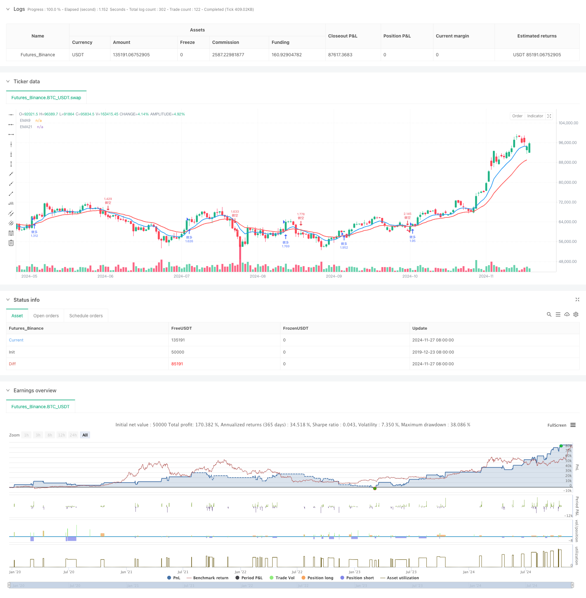

> Name

Dual-EMA-Indicator-Smart-Crossing-Trading-System-with-Dynamic-Stop-Loss-and-Take-Profit-Strategy
> Author

ChaoZhang

> Strategy Description



[trans]
#### Overview
This strategy is an intelligent trading system based on double moving average crossover, using 9-period and 21-period exponential moving averages (EMA) as the core indicator. This strategy integrates a dynamic stop-loss and take-profit mechanism, and automatically executes trading instructions by monitoring the cross signal of the EMA indicator in real time. The system adopts percentage trailing stop loss and fixed proportion take-profit solutions, which not only ensures the safety of transactions, but also ensures the possibility of profit.
#### Strategy Principle
The core logic of strategy operation is based on the intersection relationship between fast EMA (9 periods) and slow EMA (21 periods). When the fast line crosses the slow line upwards, the system identifies it as a bullish signal and automatically closes short positions and opens long positions; when the fast line crosses the slow line downwards, the system identifies it as a bearish signal and automatically closes long positions and opens short positions. At the same time, the system has also set up a dynamic stop-loss and stop-profit mechanism: during the long position, the stop-loss price is set at 5% below the opening price, and the take-profit price is set at 10% above the opening price; during the short position, the stop-loss price is set at 5% above the opening price, and the take-profit price is set at 10% below the opening price.
#### Strategic Advantages
1. The selection of indicators is scientific and reasonable: EMA is more responsive to market changes and can capture market trends in a timely manner.
2. The stop-loss and stop-profit mechanism is perfect: it adopts percentage setting method and can be flexibly adjusted according to different market environments.
3. High degree of automation: the entire process from signal recognition to transaction execution is automated, reducing human intervention.
4. Risk control is in place: each transaction has clear stop-loss and take-profit points
5. The code structure is clear: variable naming standards and clear logic levels facilitate later maintenance and optimization.
#### Strategy Risk
1. Volatile market risk: In a volatile market, cross signals may frequently occur, leading to frequent transactions.
2. Slippage risk: When the market fluctuates violently, you may face differences between the actual transaction price and the theoretical price.
3. Fund management risk: The fixed ratio position management method may not be flexible enough under certain market conditions.
4. Systemic risk: If extreme conditions occur in the market, stop-loss or take-profit orders may not be executed in time.
#### Strategy optimization direction
1. Introduce trend filter: You can add ADX or ATR indicators to judge the strength of the trend and avoid frequent trading in volatile markets.
2. Optimize the stop-loss and take-profit mechanism: You can consider using ATR to dynamically adjust the stop-loss and take-profit distance to make it more adaptable to market fluctuations.
3. Added trading time filtering: You can add specific trading time limits to avoid periods of greater volatility.
4. Improve position management: the number of open positions can be dynamically adjusted according to market volatility
5. Add market sentiment indicators: you can combine RSI or MACD and other indicators for transaction confirmation
#### Summary
This strategy is an automated trading system with complete structure and clear logic. Using EMA cross signals to make trading decisions, combined with the dynamic stop loss and take profit mechanism, can achieve better performance in trending markets. However, during use, you need to pay attention to changes in the market environment, adjust parameter settings in a timely manner, and do a good job in risk control. Through continuous optimization and improvement, this strategy is expected to become a stable and reliable trading tool. ||
#### Overview
This strategy is an intelligent trading system based on dual moving average crossovers, utilizing 9-period and 21-period Exponential Moving Averages (EMA) as core indicators. The strategy incorporates a dynamic stop-loss and take-profit mechanism, automatically executing trading orders by monitoring EMA crossover signals in real-time. The system employs percentage-based trailing stops and fixed-ratio take-profit levels, ensuring both trading safety and profit potential.

#### Strategy Principles
The core logic operates on the crossover relationship between the fast EMA (9-period) and slow EMA (21-period). When the fast line crosses above the slow line, the system recognizes a bullish signal, automatically closes any short positions and opens long positions. When the fast line crosses below the slow line, the system identifies a bearish signal, closes any long positions and opens short positions. Additionally, the system implements dynamic stop-loss and take-profit mechanisms: for long positions, the stop-loss is set 5% below the entry price and take-profit 10% above; for short positions, the stop-loss is set 5% above the entry price and take-profit 10% below.

#### Strategy Advantages
1. Scientific indicator selection: EMA responds more sensitively to market changes, effectively capturing market trends
2. Comprehensive stop-loss and take-profit mechanism: Percentage-based settings allow flexible adjustment to different market conditions
3. High degree of automation: Fully automated from signal detection to trade execution, minimizing human intervention
4. Effective risk control: Clear stop-loss and take-profit levels for each trade
5. Clear code structure: Standardized variable naming and logical hierarchy, facilitating maintenance and optimization

#### Strategy Risks
1. Sideways market risk: Frequent crossover signals may occur in ranging markets, leading to excessive trading
2. Slippage risk: Potential discrepancies between theoretical and actual execution prices during high volatility
3. Money management risk: Fixed-ratio position sizing may lack flexibility in certain market conditions
4. Systemic risk: Stop-loss or take-profit orders may not execute timely in extreme market conditions

#### Optimization Directions
1. Implement trend filters: Add ADX or ATR indicators to assess trend strength and avoid frequent trading in ranging markets
2. Optimize stop-loss and take-profit mechanisms: Consider using ATR for dynamic adjustment of stop-loss and take-profit distances
3. Add time filters: Implement specific trading time restrictions to avoid highly volatile periods
4. Improve position sizing: Dynamically adjust position sizes based on market volatility
5. Add market sentiment indicators: Incorporate RSI or MACD for trade confirmation

#### Summary
This strategy represents a complete and logically sound automated trading system. Through EMA crossover signals combined with dynamic stop-loss and take-profit mechanisms, it can perform well in trending markets. However, users need to monitor market conditions, adjust parameters accordingly, and maintain proper risk control. Through continuous optimization and refinement, this strategy has the potential to become a stable and reliable trading tool.[/trans]


> Source (PineScript)

``` pinescript
/*backtest
start: 2019-12-23 08:00:00
end: 2024-11-28 00:00:00
period: 1d
basePeriod: 1d
exchanges: [{"eid":"Futures_Binance","currency":"BTC_USDT"}]
*/

//@version=5
strategy("EMA Cross Strategy", overlay=true, initial_capital=10000, default_qty_type=strategy.percent_of_equity, default_qty_value=100)

// 添加策略参数设置
var showLabels = input.bool(true, "显示标签")
var stopLossPercent = input.float(5.0, "止损百分比", minval=0.1, maxval=20.0, step=0.1)
var takeProfitPercent = input.float(10.0, "止盈百分比", minval=0.1, maxval=50.0, step=0.1)

// 计算EMA
ema9 = ta.ema(close, 9)
ema21 = ta.ema(close, 21)

// 绘制EMA线
plot(ema9, "EMA9", color=color.blue, linewidth=2)
plot(ema21, "EMA21", color=color.red, linewidth=2)

// 检测交叉
crossOver = ta.crossover(ema9, ema21)  
crossUnder = ta.crossunder(ema9, ema21)

// 格式化时间显示 (UTC+8)
utc8Time = time + 8 * 60 * 60 * 1000
timeStr = str.format("{0,date,MM-dd HH:mm}", utc8Time)

// 计算止损止盈价格
longStopLoss = strategy.position_avg_price * (1 - stopLossPercent / 100)
longTakeProfit = strategy.position_avg_price * (1 + takeProfitPercent / 100)
shortStopLoss = strategy.position_avg_price * (1 + stopLossPercent / 100)
shortTakeProfit = strategy.position_avg_price * (1 - takeProfitPercent / 100)

// 交易逻辑
if crossOver
    if strategy.position_size < 0  // 如果持有空仓
        strategy.close("做空")     // 先平掉空仓
    strategy.entry("做多", strategy.long)  // 开多仓
    if showLabels
        label.new(bar_index, high, text="做多入场\n" + timeStr, color=color.green, textcolor=color.white, style=label.style_label_down, yloc=yloc.abovebar)

if crossUnder
    if strategy.position_size > 0  // 如果持有多仓
        strategy.close("做多")     // 先平掉多仓
    strategy.entry("做空", strategy.short)  // 开空仓
    if showLabels
        label.new(bar_index, low, text="做空入场\n" + timeStr, color=color.red, textcolor=color.white, style=label.style_label_up, yloc=yloc.belowbar)

// 设置止损止盈
if strategy.position_size > 0  // 多仓止损止盈
    strategy.exit("多仓止损止盈", "做多", stop=longStopLoss, limit=longTakeProfit)
    
if strategy.position_size < 0  // 空仓止损止盈
    strategy.exit("空仓止损止盈", "做空", stop=shortStopLoss, limit=shortTakeProfit) 
```

> Detail

https://www.fmz.com/strategy/473396

> Last Modified

2024-11-29 16:33:21
