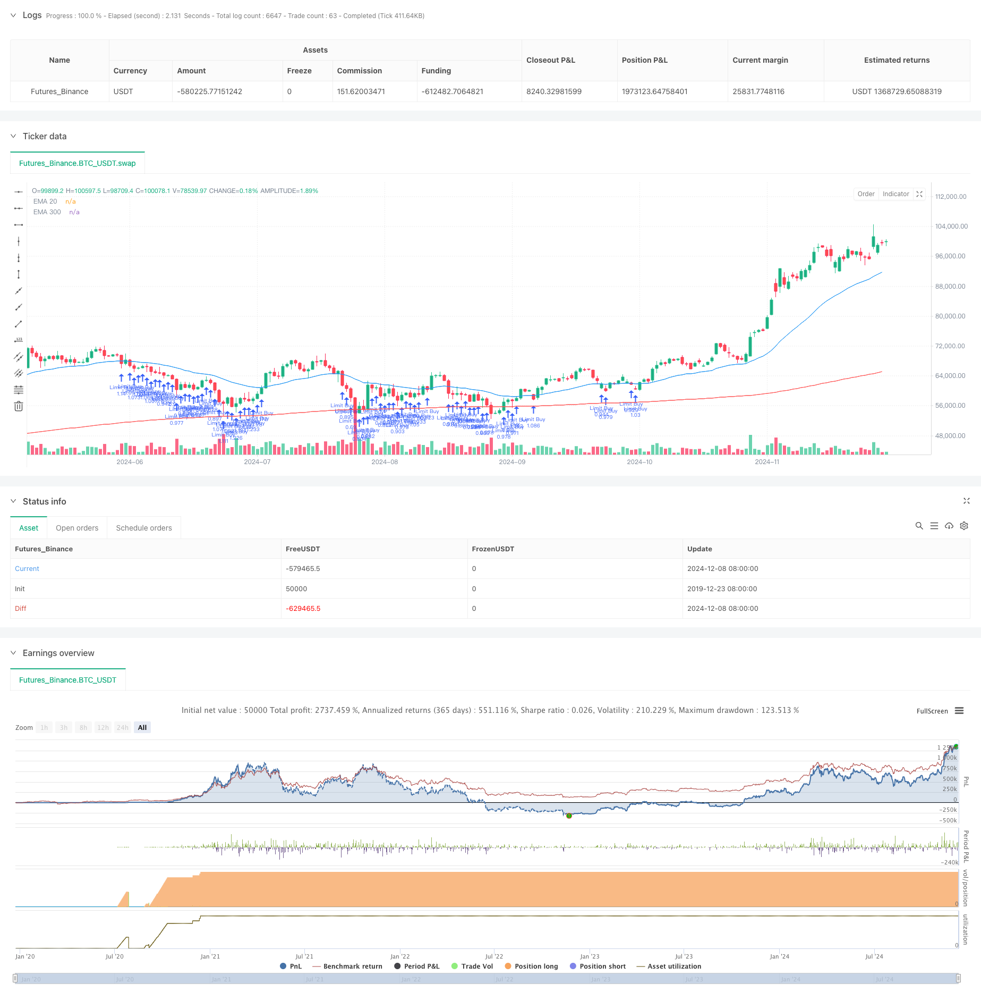

> Name

Trend-Following EMA Dual-Line Limit Buy Strategy-Dual-EMA-Trend-Following-Strategy-with-Limit-Buy-Entry
> Author

ChaoZhang

> Strategy Description



[trans]
#### Overview
This strategy is a trend following trading strategy based on a dual moving average system, which combines the exponential moving average (EMA) indicator in technical analysis and buys by setting a limit order at the EMA20 position. The strategy adopts a conservative fund management method, using only 10% of the account equity for each transaction, and setting a stop-profit and stop-loss to control risks. The strategy uses the 30-day and 300-day exponential moving averages to determine the market trend, and only looks for entry opportunities when the market is in an upward trend.
#### Strategy Principle
The core logic of the strategy is based on the following key points:
1. Use EMA300 as a trend judgment indicator. Only when the price is above EMA300 will it be considered to open a position. This ensures that the trading direction is consistent with the main trend.
2. After meeting the trend conditions, the strategy will set a limit buy order at the EMA20 position. This method can open a position at a relatively low price when the price pulls back to the moving average support level.
3. The strategy adopts a fixed percentage of take-profit and stop-loss settings. The default take-profit is 10% of the entry price and the stop-loss is 5% of the entry price. This setting ensures that the risk-reward ratio of each transaction is greater than 2:1.
4. Fund management uses 10% of account equity for position control. This conservative approach can effectively reduce the risk exposure of a single transaction.
#### Strategic Advantages
1. Trend following characteristics: By combining long and short-term moving averages, the strategy can effectively identify and track market trends and improve the success rate of transactions.
2. Improved risk control: Use fixed stop loss and fund management rules to effectively control the risk of each transaction.
3. Entry price optimization: Use a limit order to open a position at EMA20 to get a better entry price and increase overall returns.
4. High degree of automation: The strategy is completely systematic, reducing the emotional interference caused by human judgment.
5. Reasonable fund management: Using a fixed proportion of account equity for transactions can achieve compound interest growth of funds.
#### Strategy Risk
1. Risk of volatile markets: In a volatile market, the strategy may trigger stop losses frequently, resulting in continuous losses.
2. Slippage risk: Limit orders may not be fully executed, or there may be large slippage during violent fluctuations.
3. Trend reversal risk: Although the long-term moving average is used as a trend filter, you may still suffer large losses in the early stage of a trend reversal.
4. Fund efficiency issues: Due to the adoption of more conservative fund management, profit opportunities may not be fully grasped in strong market conditions.
#### Strategy optimization direction
1. Dynamic take-profit and stop-loss: The take-profit and stop-loss ratio can be dynamically adjusted according to market volatility to improve the adaptability of the strategy.
2. Multiple trend confirmation: Add other technical indicators such as RSI or MACD as auxiliary confirmation to improve the reliability of entry signals.
3. Market environment filtering: add volatility indicators such as ATR, adjust strategy parameters or suspend trading under different market environments.
4. Fund management optimization: You can consider dynamically adjusting the transaction size based on account income and appropriately increasing positions when profits are made.
5. Improvement of the entry mechanism: You can consider setting a price range near EMA20 to increase transaction opportunities.
#### Summary
This strategy builds a relatively robust trading system by combining the moving average system in technical analysis and strict risk control rules. The core advantage of the strategy lies in its trend tracking characteristics and complete risk management mechanism. It optimizes the entry price through limit orders and uses conservative fund management methods to control risks. Although the strategy may not perform well in volatile markets, the stability and profitability of the strategy can be further improved through the suggested optimization directions. For investors pursuing steady returns, this is a quantitative trading strategy option worth considering. ||
#### Overview
This strategy is a trend-following trading system based on a dual exponential moving average (EMA) framework, implementing limit buy orders at the EMA20 level. It employs a conservative money management approach, utilizing only 10% of account equity per trade and incorporating take-profit and stop-loss levels for risk management. The strategy uses two EMA periods (30 and 300 days) to determine market trends and only seeks entry opportunities during upward trending markets.

#### Strategy Principles
The core logic of the strategy is based on several key elements:
1. Uses EMA300 as a trend filter, only considering long positions when price is above EMA300, ensuring trade direction aligns with the main trend.
2. Places limit buy orders at the EMA20 level when trend conditions are met, allowing for entries at relatively lower prices during pullbacks to moving average support.
3. Implements fixed percentage-based take-profit and stop-loss levels, defaulting to 10% for profit targets and 5% for stop-losses, maintaining a risk-reward ratio greater than 2:1.
4. Employs position sizing at 10% of account equity, effectively reducing risk exposure per trade through conservative money management.

#### Strategy Advantages
1. Trend Following Characteristics: Effectively identifies and follows market trends by combining long and short-term moving averages, improving trade success rate.
2. Comprehensive Risk Control: Implements fixed stop-losses and money management rules to effectively control risk per trade.
3. Optimized Entry Prices: Uses limit orders at EMA20 to achieve better entry prices, enhancing overall returns.
4. High Automation Level: Fully systematic approach reduces emotional interference in trading decisions.
5. Rational Money Management: Uses fixed percentage of account equity for trading, enabling compound growth of capital.

#### Strategy Risks
1. Consolidation Market Risk: Strategy may experience frequent stop-losses during sideways, choppy markets leading to consecutive losses.
2. Slippage Risk: Limit orders may not fully execute or experience significant slippage during volatile market conditions.
3. Trend Reversal Risk: Despite using long-term moving average as a filter, significant losses may occur during initial trend reversals.
4. Capital Efficiency Issues: Conservative money management approach may limit profit potential during strong trending markets.

#### Strategy Optimization Directions
1. Dynamic Stop Levels: Adjust take-profit and stop-loss percentages based on market volatility to improve strategy adaptability.
2. Multiple Trend Confirmation: Add supplementary technical indicators like RSI or MACD to enhance entry signal reliability.
3. Market Environment Filtering: Incorporate volatility indicators like ATR to adjust strategy parameters or pause trading in different market conditions.
4. Money Management Optimization: Consider dynamic position sizing based on account performance, moderately increasing exposure during profitable periods.
5. Entry Mechanism Enhancement: Consider implementing a price range around EMA20 to increase execution opportunities.

#### Summary
This strategy combines a moving average system with strict risk control rules to create a relatively robust trading system. Its core strengths lie in its trend-following characteristics and comprehensive risk management mechanisms, optimizing entry prices through limit orders while maintaining conservative money management. Although the strategy may underperform in ranging markets, the suggested optimization directions can further enhance its stability and profitability. For investors seeking stable returns, this quantitative trading strategy represents a worthy consideration.[/trans]


> Source (PineScript)

``` pinescript
/*backtest
start: 2019-12-23 08:00:00
end: 2024-12-09 08:00:00
period: 1d
basePeriod: 1d
exchanges: [{"eid":"Futures_Binance","currency":"BTC_USDT"}]
*/

//@version=5
strategy("Limit Buy at EMA20 (Last 30 Days)", overlay=true)

// Inputs for EMAs
ema20Length = input.int(30, title="EMA 20 Length")
ema300Length = input.int(300, title="EMA 300 Length")
tpPercentage = input.float(10.0, title="Take Profit (%)", step=0.1) / 100
slPercentage = input.float(5.0, title="Stop Loss (%)", step=0.1) / 100  // Stop loss at 15%

// Calculate EMAs
ema20 = ta.ema(close, ema20Length)
ema300 = ta.ema(close, ema300Length)

// Plot EMAs
plot(ema20, color=color.blue, title="EMA 20")
plot(ema300, color=color.red, title="EMA 300")

// Limit backtesting to the last 30 days
startTime = timestamp(year(timenow), month(timenow), dayofmonth(timenow) - 30, 0, 0)
if (time < startTime)
    strategy.close_all()
    strategy.cancel_all()

// Entry Condition: Price above EMA300
longCondition = close > ema300 and time >= startTime

// Calculate position size (10% of equity)
positionSize = strategy.equity * 0.10 / ema20  // Use EMA20 as the limit price

// Place a limit buy order at EMA20
if (longCondition)
    strategy.order("Limit Buy", strategy.long, qty=positionSize, limit=ema20)

// Calculate TP and SL levels
tpPrice = ema20 * (1 + tpPercentage)
slPrice = ema20 * (1 - slPercentage)

// Set take profit and stop loss
if (strategy.position_size > 0)
    strategy.exit("Take Profit/Stop Loss", "Limit Buy", stop=slPrice, limit=tpPrice)

```

> Detail

https://www.fmz.com/strategy/474633

> Last Modified

2024-12-11 11:11:32
