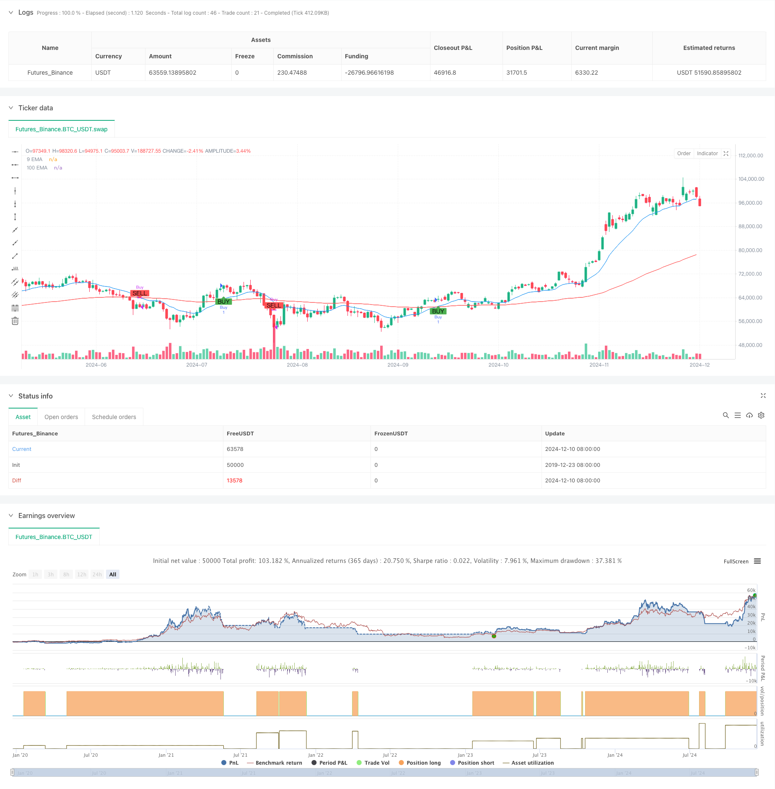

> Name

EMA Trend Cross Dynamic Entry Quantitative Strategy-Dynamic-EMA-Trend-Crossover-Entry-Quantitative-Strategy
> Author

ChaoZhang

> Strategy Description



[trans]
#### Overview
This strategy is a quantitative trading system based on a double exponential moving average (EMA) crossover. It uses the intersection of short-term EMA (14 periods) and long-term EMA (100 periods) to capture the transition point of the market trend, and determines the entry opportunity by judging the intersection position of the short-term moving average and the long-term moving average. When the short-term EMA crosses the long-term EMA upward, a buy signal is generated, and vice versa, a sell signal is generated. This strategy is particularly suitable for traders who want to position themselves early in a trend reversal.
#### Strategy Principle
The core logic of the strategy is based on momentum changes in price trends. The short-term EMA is more responsive to price changes, while the long-term EMA can better filter out market noise and reflect the main trend. When the short-term moving average crosses the long-term moving average, it indicates that short-term price momentum is increasing and the market may begin to enter an upward trend; when the short-term moving average crosses below the long-term moving average, it indicates that short-term momentum weakens and the market may turn into a downward trend. The strategy uses the ta.crossover and ta.crossunder functions to accurately capture these intersection points and perform position operations at the appropriate time.
#### Strategic Advantages
1. The operation logic is clear and simple, easy to understand and execute
2. Able to effectively capture the starting point of the trend and grasp the main market conditions
3. Have good risk control capabilities and automatically stop losses through moving average crossovers
4. Use the dynamic characteristics of EMA to respond to price changes faster
5. Supports custom parameter adjustment and can be optimized according to different market characteristics
6. Have automated execution capabilities to reduce human emotional interference
#### Strategy Risk
1. Frequent false signals may occur in volatile markets
2. The moving average crossover has a certain lag, and the best entry point may be missed.
3. Large drawdowns may occur in rapidly volatile markets
4. Improper parameter selection may cause signal quality to decrease.
5. The impact of transaction costs on strategy returns needs to be considered
#### Strategy optimization direction
1. Introduce trading volume indicators as auxiliary confirmation signals
2. Add trend strength filter to reduce the risk of false breakthroughs
3. Optimize the moving average cycle parameters to make them more suitable for specific markets
4. Add a dynamic stop loss mechanism to improve risk control capabilities
5. Combine with other technical indicators to improve signal reliability
6. Develop adaptive parameter mechanism to improve strategy adaptability
#### Summary
The EMA trend crossover dynamic entry quantitative strategy is a classic and practical trend tracking system. By combining short-term and long-term exponential moving averages, this strategy can better grasp market trend conversion opportunities. Although there is a certain degree of hysteresis and false signal risks, stable trading effects can still be achieved through appropriate parameter optimization and risk control measures. The simplicity and scalability of the strategy make it a good basic framework for quantitative trading. ||
#### Overview
This strategy is a quantitative trading system based on the crossover of dual Exponential Moving Averages (EMA). It utilizes a short-term EMA (14 periods) and a long-term EMA (100 periods) to capture market trend transition points by determining entry timing through the intersection of short-term and long-term moving averages. Buy signals are generated when the short-term EMA crosses above the long-term EMA, and sell signals are generated when the opposite occurs. This strategy is particularly suitable for traders looking to position themselves at the beginning of trend reversals.

#### Strategy Principles
The core logic of the strategy is built on momentum changes in price trends. The short-term EMA is more sensitive to price changes, while the long-term EMA better filters market noise and reflects the primary trend. When the short-term moving average crosses above the long-term moving average, it indicates strengthening short-term momentum and a possible uptrend; when the short-term moving average crosses below the long-term moving average, it suggests weakening momentum and a potential downtrend. The strategy uses ta.crossover and ta.crossunder functions to accurately capture these crossing points and execute position operations at appropriate times.

#### Strategy Advantages
1. Clear and simple operational logic, easy to understand and execute
2. Effectively captures trend initiation points, capitalizing on major market movements
3. Good risk control capability through automatic stop-loss using moving average crossovers
4. Utilizes EMA's dynamic characteristics for faster response to price changes
5. Supports customizable parameters for optimization based on different market characteristics
6. Features automated execution capability, reducing emotional interference

#### Strategy Risks
1. May generate frequent false signals in choppy markets
2. Moving average crossovers have inherent lag, potentially missing optimal entry points
3. Possible significant drawdowns in rapidly volatile markets
4. Improper parameter selection may lead to decreased signal quality
5. Need to consider the impact of trading costs on strategy returns

#### Strategy Optimization Directions
1. Incorporate volume indicators as confirmatory signals
2. Add trend strength filters to reduce false breakout risks
3. Optimize moving average period parameters for specific markets
4. Implement dynamic stop-loss mechanisms to enhance risk control
5. Integrate other technical indicators to improve signal reliability
6. Develop adaptive parameter mechanisms to enhance strategy adaptability

#### Summary
The Dynamic EMA Trend Crossover Entry Quantitative Strategy is a classic and practical trend-following system. By combining short-term and long-term exponential moving averages, the strategy effectively captures market trend transition opportunities. While there are risks of lag and false signals, stable trading results can still be achieved through appropriate parameter optimization and risk control measures. The strategy's simplicity and scalability make it an excellent foundation framework for quantitative trading.[/trans]


> Source (PineScript)

``` pinescript
/*backtest
start: 2019-12-23 08:00:00
end: 2024-12-11 08:00:00
period: 1d
basePeriod: 1d
exchanges: [{"eid":"Futures_Binance","currency":"BTC_USDT"}]
*/

//@version=5
strategy("EMA Crossover Strategy", overlay=true)

// Input for EMAs
shortEmaLength = input(14, title="Short EMA Length")
longEmaLength = input(100, title="Long EMA Length")

// Calculate EMAs
shortEma = ta.ema(close, shortEmaLength)
longEma = ta.ema(close, longEmaLength)

// Plot EMAs
plot(shortEma, color=color.blue, title="9 EMA")
plot(longEma, color=color.red, title="100 EMA")

// Historical Signal Tracking
var float lastBuyPrice = na
var float lastSellPrice = na

// Buy and Sell Signals
buySignal = ta.crossover(shortEma, longEma)
sellSignal = ta.crossunder(shortEma, longEma)

// Track last buy and sell prices
if (buySignal)
    lastBuyPrice := close

if (sellSignal)
    lastSellPrice := close

// Plot buy and sell signals on the chart
plotshape(buySignal, title="Buy Signal", location=location.belowbar, color=color.green, style=shape.labelup, text="BUY")
plotshape(sellSignal, title="Sell Signal", location=location.abovebar, color=color.red, style=shape.labeldown, text="SELL")

// Strategy Logic
if (buySignal)
    strategy.entry("Buy", strategy.long)

if (sellSignal)
    strategy.close("Buy")

```

> Detail

https://www.fmz.com/strategy/474967

> Last Modified

2024-12-13 10:55:34
