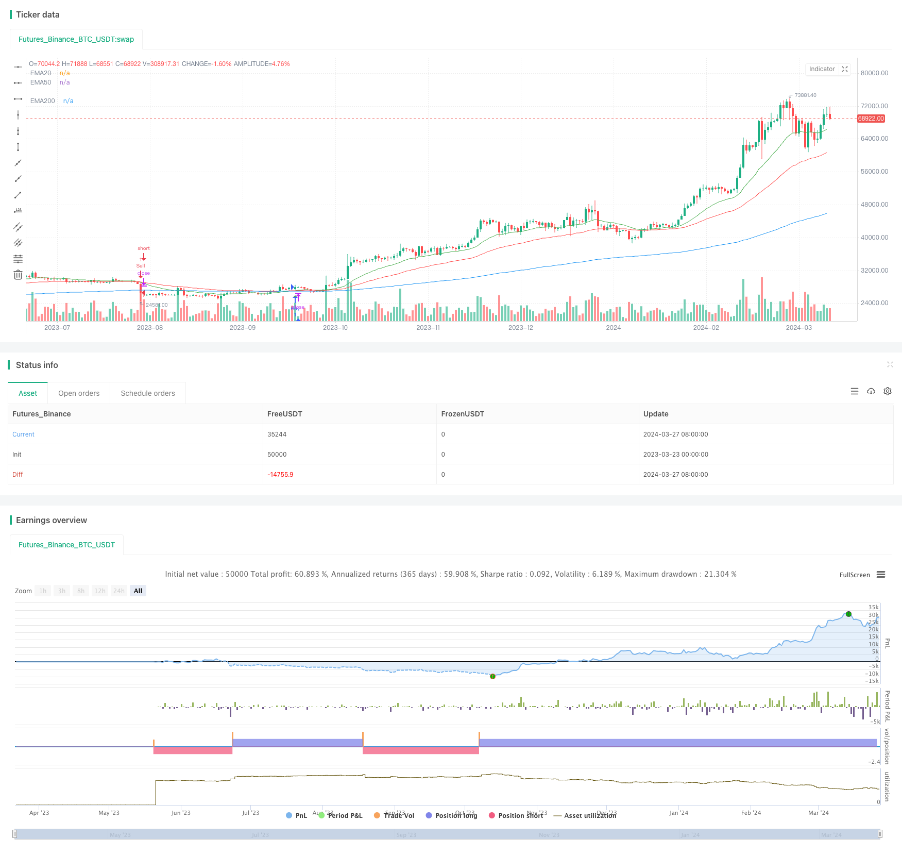

> Name

EMA Double Moving Average Crossover Strategy-EMA-Double-Moving-Average-Crossover-Strategy
> Author

ChaoZhang

> Strategy Description



[trans]
#### Overview
This strategy is based on the intersection of two moving averages (EMA) to generate trading signals. When the short-term EMA (20-day) crosses the long-term EMA (50-day) from bottom to top, a buy signal is generated; when the short-term EMA crosses the long-term EMA from top to bottom, a sell signal is generated. At the same time, the strategy also draws a 200-day EMA as a reference for the long-term trend. The main idea of ​​this strategy is to use the intersection of moving averages of different periods to capture changes in market trends for trading.
#### Strategy Principle
1. Calculate the 20-day EMA, 50-day EMA and 200-day EMA.
2. Determine the intersection of the 20-day EMA and the 50-day EMA:
   - When the 20-day EMA crosses the 50-day EMA from bottom to top, a buy signal is generated.
   - When the 20-day EMA crosses the 50-day EMA from top to bottom, a sell signal is generated.
3. Draw the 20-day EMA (green), 50-day EMA (red), and 200-day EMA (blue) on the chart to visually observe their trends and crossovers.
4. When buy and sell signals occur, mark the corresponding buy (green upper triangle) and sell (red lower triangle) marks on the chart.
#### Strategic Advantages
1. Simple and easy to understand: This strategy is based on the simple moving average crossover principle and is easy to understand and implement.
2. Trend following: Through the intersection of short-term and long-term moving averages, the strategy can better capture changes in market trends and is suitable for use in trending markets.
3. Long-term trend reference: The strategy introduces the 200-day EMA as a reference for the long-term trend, which helps to judge the current market environment.
4. Intuitive display: The strategy clearly draws moving averages and buying and selling signals on the chart, making it easier for traders to observe and analyze intuitively.
#### Strategy Risk
1. Volatile markets: In volatile markets, frequent moving average crossovers may generate more false signals, leading to poor strategy performance.
2. Hysteresis: The moving average has a certain degree of lag and may miss the best opportunity for market turning points.
3. Parameter sensitivity: The performance of the strategy depends on the period selection of the moving average, and different period parameters may lead to different results.
#### Strategy optimization direction
1. Introduce other indicators: You can consider introducing other technical indicators, such as RSI, MACD, etc., to improve the reliability and accuracy of signals.
2. Optimize parameters: Optimize the period parameters of the moving average and find the parameter combination that is most suitable for the current market conditions.
3. Add stop loss and take profit: Add reasonable stop loss and take profit mechanisms to the strategy to control the risk and profit of a single transaction.
4. Combined with trend judgment: filter trading signals based on the direction of the long-term trend (such as the 200-day EMA), and only trade in the direction of the trend.
#### Summary
The EMA double moving average crossover strategy is a simple and easy-to-understand trading strategy suitable for trending markets. It uses the intersection of short-term and long-term moving averages to capture changes in market trends, while introducing long-term trend reference. Although this strategy has some limitations, such as poor performance in volatile markets and the lag of the moving average, the robustness and profitability of the strategy can be further improved by introducing other indicators, optimizing parameters, and adding risk control measures.
|| 

#### Overview
This strategy generates trading signals based on the crossover of two moving averages (EMA). When the short-term EMA (20-day) crosses above the long-term EMA (50-day), a buy signal is triggered; when the short-term EMA crosses below the long-term EMA, a sell signal is triggered. Additionally, the strategy plots a 200-day EMA as a reference for the long-term trend. The main idea behind this strategy is to capture shifts in market trends by utilizing the crossover of moving averages with different periods.

#### Strategy Principle
1. Calculate the 20-day EMA, 50-day EMA, and 200-day EMA.
2. Determine the crossover conditions of the 20-day EMA and 50-day EMA:
   - When the 20-day EMA crosses above the 50-day EMA, a buy signal is generated.
   - When the 20-day EMA crosses below the 50-day EMA, a sell signal is generated.
3. Plot the 20-day EMA (green), 50-day EMA (red), and 200-day EMA (blue) on the chart for visual observation of their trends and crossovers.
4. Mark the corresponding buy (green upward triangle) and sell (red downward triangle) signals on the chart when they occur.

#### Strategy Advantages
1. Simplicity: The strategy is based on the simple principle of moving average crossovers, making it easy to understand and implement.
2. Trend Following: By utilizing the crossover of short-term and long-term moving averages, the strategy can effectively capture shifts in market trends, making it suitable for trending markets.
3. Long-term Trend Reference: The inclusion of the 200-day EMA provides a reference for the long-term market environment.
4. Visual Representation: The strategy clearly plots the moving averages and buy/sell signals on the chart, facilitating easy observation and analysis for traders.

#### Strategy Risks
1. Choppy Markets: In choppy markets, frequent moving average crossovers may generate numerous false signals, resulting in suboptimal performance.
2. Lag: Moving averages have an inherent lag, potentially missing the optimal timing of market reversals.
3. Parameter Sensitivity: The strategy's performance depends on the choice of moving average periods, and different parameter combinations may lead to varying results.

#### Strategy Optimization Directions
1. Incorporating Additional Indicators: Consider incorporating other technical indicators, such as RSI or MACD, to improve signal reliability and accuracy.
2. Parameter Optimization: Optimize the moving average period parameters to find the most suitable combination for the current market conditions.
3. Implementing Stop-Loss and Take-Profit: Incorporate reasonable stop-loss and take-profit mechanisms to control risk and profitability on individual trades.
4. Trend Confirmation: Filter trading signals based on the direction of the long-term trend (e.g., 200-day EMA) and only trade in the direction of the trend.

#### Summary
The EMA Double Moving Average Crossover Strategy is a simple and straightforward trading strategy suitable for trending markets. It utilizes the crossover of short-term and long-term moving averages to capture shifts in market trends while incorporating a long-term trend reference. Although the strategy has some limitations, such as suboptimal performance in choppy markets and the lag of moving averages, it can be further enhanced by incorporating additional indicators, optimizing parameters, implementing risk management measures, and confirming trends. These optimizations can improve the strategy's robustness and profitability.
[/trans]

> Strategy Arguments


|Argument|Default|Description|
|----|----|----|
|v_input_int_1|20|Short MA Length|
|v_input_int_2|50|Long MA Length|
|v_input_int_3|200|Long MA 200 Length|


> Source (PineScript)

``` pinescript
/*backtest
start: 2023-03-23 00:00:00
end: 2024-03-28 00:00:00
period: 1d
basePeriod: 1h
exchanges: [{"eid":"Futures_Binance","currency":"BTC_USDT"}]
*/

//@version=5
strategy("EMA Crossover Strategy by Peter Gangmei", overlay=true)

// Define the length for moving averages
short_ma_length = input.int(20, "Short MA Length")
long_ma_length = input.int(50, "Long MA Length")
long_ma_200_length = input.int(200, "Long MA 200 Length")

// Define start time for testing
start_time = timestamp(2024, 01, 01, 00, 00)

// Calculate current date and time
current_time = timenow

// Calculate moving averages
ema20 = ta.ema(close, short_ma_length)
ema50 = ta.ema(close, long_ma_length)
ema200 = ta.ema(close, long_ma_200_length)

// Crossing conditions
crossed_above = ta.crossover(ema20, ema50)
crossed_below = ta.crossunder(ema20, ema50)

// Entry and exit conditions within the specified time frame
if true
    if (crossed_above)
        strategy.entry("Buy", strategy.long)
        alert("Buy Condition", alert.freq_once_per_bar_close)

    if (crossed_below)
        strategy.entry("Sell", strategy.short)
        alert("Sell Condition", alert.freq_once_per_bar_close)

// Plotting moving averages for visualization
plot(ema20, color=color.green, title="EMA20")
plot(ema50, color=color.red, title="EMA50")
plot(ema200, color=color.blue, title="EMA200")

// Placing buy and sell markers
plotshape(series=crossed_above, style=shape.triangleup, location=location.belowbar, color=color.green, size=size.small, title="Buy Signal")
plotshape(series=crossed_below, style=shape.triangledown, location=location.abovebar, color=color.red, size=size.small, title="Sell Signal")

```

> Detail

https://www.fmz.com/strategy/446541

> Last Modified

2024-03-29 15:06:27
