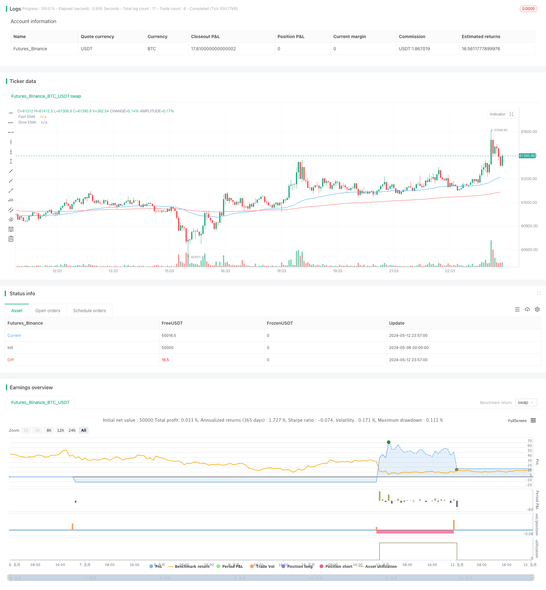

> Name

EMA-Dual-Crossover-Fixed-Risk-Stop-Loss-Take-Profit
> Author

ChaoZhang

> Strategy Description



[trans]
#### Overview
This strategy uses double EMA moving average crossover as a trading signal, with a fast line period of 65 and a slow line period of 240. At the same time, the trading volume is used as a filter condition, and transactions will only be carried out when the current trading volume is greater than the specified threshold. The strategy sets a fixed risk amount ($10) for each trade and dynamically calculates the position size based on the risk amount. Go long when the fast line crosses the slow line and the trading volume meets the conditions; go short when the fast line crosses the slow line and the trading volume meets the conditions. The stop-loss and take-profit positions are set according to the fixed price distance. When going long, the stop-loss position is $100 below the opening price, and the take-profit position is $1,500 above the opening price; when going short, the stop-loss position is $100 above the opening price, and the take-profit position is $1,500 below the opening price.
#### Strategy Principle
1. Calculate two EMA moving averages, the period of the fast line (ema_fast) is 65, and the period of the slow line (ema_slow) is 240.
2. Determine whether a bullish crossover (bullish_crossover) or a bearish crossover (bearish_crossover) occurs.
3. Set the volume threshold (volume_threshold), and trade only when the current volume is greater than the threshold.
4. Set the fixed risk amount per trade (risk_per_trade) to $10.
5. Calculate the position size (position_size) based on the risk amount and stop loss distance (stop_loss_distance).
6. When the long cross occurs and the trading volume meets the conditions, open a long position, set the stop loss level at $100 below the opening price, and set the take profit level at $1500 above the opening price.
7. When a short cross occurs and the trading volume meets the conditions, a short position is opened, the stop loss level is set at $100 above the opening price, and the take profit level is set at $1500 below the opening price.
#### Strategic Advantages
1. The double moving average crossover can better capture the market trend, and the 65/240 period combination can filter out most of the noise and only focus on the main trend.
2. Introducing trading volume filter conditions can avoid trading when trading volume is low and reduce the risk of market fluctuations.
3. The position management method with a fixed risk amount can effectively control the risk exposure of each transaction and avoid excessive losses in a single transaction.
4. Dynamic stop loss and take profit settings based on price distance can make the profit margin larger than the loss margin, thereby improving the long-term performance of the strategy.
5. It is suitable for high-volatility products such as BTC/USD and can fully capture the investment opportunities brought by its fluctuations.
#### Strategy Risk
1. As a trend tracking indicator, EMA has the problem of lagging when the trend reverses, which may lead to delayed entry or exit.
2. The fixed risk amount may not be able to dynamically adapt to market fluctuations and perform poorly under extreme market conditions (such as sudden rises and falls).
3. The setting of the trading volume threshold is somewhat subjective, and improper threshold setting may affect the strategy effect.
4. The fixed settings of stop loss and take profit levels may not match the actual fluctuation range of the market, resulting in frequent stop loss or take profit exits.
5. The strategy may perform poorly in volatile market conditions, and frequent crossovers may lead to continuous losing transactions.
#### Strategy optimization direction
1. Consider introducing more moving average combinations as filter conditions, such as adding mid-term moving averages and building a multi-moving average system to improve signal reliability.
2. Optimize position management methods, such as using the percentage risk method or Kelly formula to dynamically adjust positions to adapt to different market conditions.
3. Optimize the parameters of the trading volume threshold and find the best threshold setting to improve the stability of the strategy.
4. Optimize the stop-loss and take-profit position settings, adjust them in real time according to the latest market fluctuations, and increase the flexibility to adapt to the market.
5. Add certain hedging components to the trend-based method, such as PSAR and other counter-trend indicators to assist judgment, and enhance the ability to respond to volatile markets.
#### Summary
This strategy uses the 65/240 double moving average crossover as the basis for trend judgment, and combines the volume filter conditions to improve signal reliability. Fixed risk position management and fixed price stop-loss and take-profit settings can control risks to a certain extent and tilt the profit-loss ratio in a favorable direction. However, the strategy also has problems such as relative lag in grasping trends, insufficient flexibility in position management, and lack of dynamic adjustment of stop loss and profit. In the future, the strategy can be optimized and improved from the perspectives of building a multi-moving average system, optimizing position management, dynamic stop loss and profit, and introducing hedging indicators, in order to obtain more stable and reliable trading performance.
|| 

#### Overview
This strategy employs a dual EMA crossover approach as trading signals, with the fast EMA having a period of 65 and the slow EMA having a period of 240. It also uses volume as a filter condition, only executing trades when the current volume exceeds a specified threshold. The strategy sets a fixed risk amount ($10) for each trade and dynamically calculates position sizes based on the risk amount. When the fast EMA crosses above the slow EMA and the volume condition is met, it enters a long position. Conversely, when the fast EMA crosses below the slow EMA and the volume condition is satisfied, it enters a short position. Stop loss and take profit levels are set based on fixed price distances, with the stop loss placed $100 below the entry price and the take profit placed $1500 above the entry price for long positions, and vice versa for short positions.

#### Strategy Principles
1. Calculate two EMA lines: the fast EMA (ema_fast) with a period of 65 and the slow EMA (ema_slow) with a period of 240.
2. Determine whether a bullish crossover (bullish_crossover) or a bearish crossover (bearish_crossover) occurs.
3. Set a volume threshold (volume_threshold) and only execute trades when the current volume exceeds this threshold.
4. Set a fixed risk amount (risk_per_trade) of $10 for each trade.
5. Calculate the position size (position_size) based on the risk amount and the stop loss distance (stop_loss_distance).
6. When a bullish crossover occurs and the volume condition is met, enter a long position with the stop loss set $100 below the entry price and the take profit set $1500 above the entry price.
7. When a bearish crossover occurs and the volume condition is met, enter a short position with the stop loss set $100 above the entry price and the take profit set $1500 below the entry price.

#### Strategy Advantages
1. The dual EMA crossover approach can effectively capture market trends, with the 65/240 period combination filtering out most noise and focusing on the main trends.
2. Introducing the volume filter condition helps avoid trading during periods of low volume, reducing market volatility risks.
3. The fixed risk amount position sizing method effectively controls the risk exposure of each trade, preventing excessive losses from a single trade.
4. The dynamic stop loss and take profit settings based on price distances allow for a larger profit potential than the loss potential, improving the long-term performance of the strategy.
5. Suitable for highly volatile instruments like BTC/USD, enabling the strategy to fully capture investment opportunities arising from price fluctuations.

#### Strategy Risks
1. As a trend-following indicator, EMA may lag in detecting trend reversals, potentially leading to delayed entries or exits.
2. The fixed risk amount may not dynamically adapt to market volatility conditions, resulting in suboptimal performance during extreme market movements (e.g., sharp rises or falls).
3. The setting of the volume threshold involves a certain level of subjectivity, and improper threshold settings may impact the strategy's effectiveness.
4. The fixed stop loss and take profit levels may not match the actual market volatility, leading to frequent stop-outs or profit-takings.
5. The strategy may underperform in choppy markets, with frequent crossovers potentially resulting in consecutive losing trades.

#### Strategy Optimization Directions
1. Consider introducing more EMA combinations as filter conditions, such as incorporating intermediate-term EMAs to build a multi-EMA system for improving signal reliability.
2. Optimize the position sizing approach, such as adopting a percentage risk method or the Kelly Criterion to dynamically adjust positions based on different market states.
3. Perform parameter optimization on the volume threshold to find the optimal threshold setting for enhancing strategy stability.
4. Optimize the stop loss and take profit level settings, adjusting them in real-time based on the latest market volatility conditions to increase flexibility and adaptability to the market.
5. Incorporate certain hedging components into the trend-following approach, such as utilizing counter-trend indicators like PSAR to assist in judging market oscillations and improve the strategy's ability to handle choppy markets.

#### Summary
This strategy employs a 65/240 dual EMA crossover as the basis for trend determination, combined with a volume filter condition to improve signal reliability. The fixed risk position sizing and fixed price stop loss/take profit settings can control risks to a certain extent and tilt the risk-reward ratio in a favorable direction. However, the strategy also faces issues such as relatively lagging trend detection, insufficient flexibility in position sizing, and lack of dynamic adjustments for stop loss and take profit levels. Future optimizations and improvements can focus on constructing a multi-EMA system, optimizing position sizing, implementing dynamic stop loss and take profit mechanisms, and incorporating hedging indicators to achieve more stable and reliable trading performance.
[/trans]


> Source (PineScript)

``` pinescript
/*backtest
start: 2024-05-06 00:00:00
end: 2024-05-13 00:00:00
period: 3m
basePeriod: 1m
exchanges: [{"eid":"Futures_Binance","currency":"BTC_USDT"}]
*/

//@version=5
strategy("EMA Crossover Strategy with 1:3 RR, Volume Filter, and Custom Stop Loss/Take Profit (BTC)", overlay=true, currency="USD", initial_capital=100)

// Define EMA lengths
ema_length_fast = 65
ema_length_slow = 240

// Calculate EMAs
ema_fast = ta.ema(close, ema_length_fast)
ema_slow = ta.ema(close, ema_length_slow)

// Define crossover conditions
bullish_crossover = ta.crossover(ema_fast, ema_slow)
bearish_crossover = ta.crossunder(ema_fast, ema_slow)

// Plot EMAs
plot(ema_fast, color=color.blue, title="Fast EMA")
plot(ema_slow, color=color.red, title="Slow EMA")

// Define volume filter
volume_threshold = 1000 // Adjust as needed

// Define risk amount per trade
risk_per_trade = 0.5 // $10 USD

// Calculate position size based on risk amount
stop_loss_distance = 100
take_profit_distance = 1500
position_size = risk_per_trade / syminfo.mintick / stop_loss_distance

// Execute trades based on crossovers and volume filter
if (bullish_crossover and volume > volume_threshold)
    strategy.entry("Buy", strategy.long, qty=position_size)
    strategy.exit("Exit", "Buy", stop=close - stop_loss_distance, limit=close + take_profit_distance)
if (bearish_crossover and volume > volume_threshold)
    strategy.entry("Sell", strategy.short, qty=position_size)
    strategy.exit("Exit", "Sell", stop=close + stop_loss_distance, limit=close - take_profit_distance)

```

> Detail

https://www.fmz.com/strategy/451392

> Last Modified

2024-05-14 15:48:48
