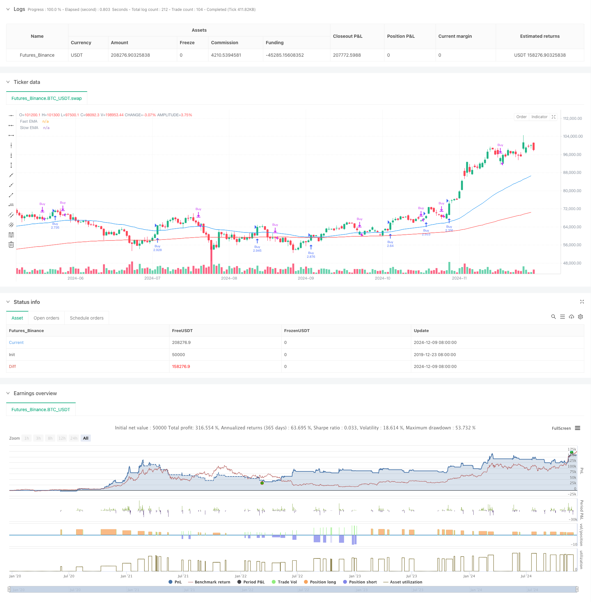

> Name

Trend Band Trading EMA-MACD Composite Strategy-EMA-MACD-Composite-Strategy-for-Trend-Scalping
> Author

ChaoZhang

> Strategy Description



[trans]
#### Overview
This strategy is a trend following trading system based on multiple indicators of moving averages, MACD and RSI. It identifies market trends through the intersection of fast exponential moving averages (EMA) and slow EMA, and combines RSI overbought and oversold signals with MACD trend confirmation to find entry opportunities. The strategy design is mainly aimed at the foreign exchange market, and improves the accuracy and reliability of transactions through the combination of multiple technical indicators.
#### Strategy Principle
The strategy uses the 50-period and 200-period dual EMA systems as the basis for judging the main trend. When the fast EMA (50 periods) crosses the slow EMA (200 periods), it is determined to be an upward trend; vice versa, it is a downward trend. After confirming the trend direction, the strategy uses the 14-period RSI indicator and the MACD indicator set with 12/26/9 parameters as auxiliary confirmation signals. The specific trading rules are as follows:
- Long conditions: fast EMA is above slow EMA (uptrend) + RSI is greater than 55 (upward momentum) + MACD line is above signal line (uptrend confirmation)
- Short selling conditions: Fast EMA is below the slow EMA (downtrend) + RSI is less than 45 (downward momentum) + MACD line is below the signal line (downward confirmation)
- Closing conditions: When the trend reverses or MACD divergences
#### Strategic Advantages
1. Multiple technical indicators verify each other, which can effectively reduce false signals
2. The EMA system is relatively stable in identifying trends and is not easily affected by short-term fluctuations.
3. The introduction of the RSI indicator can help identify overbought and oversold areas and avoid entering an overstretched market.
4. The use of the MACD indicator helps confirm trend continuity and potential turning points
5. The strategy logic is clear and the parameters are highly adjustable to adapt to different market environments.
#### Strategy Risk
1. Multiple indicator systems may cause signal lag and miss good entry points in rapidly fluctuating markets.
2. The EMA system may produce frequent false breakthrough signals in sideways markets.
3. The settings of RSI and MACD may need to be optimized according to different market environments
4. In high-volatility markets, larger retracements may occur
5. The strategy is highly dependent on trends and may perform poorly in volatile markets.
#### Strategy optimization direction
1. Introduce adaptive indicator parameter settings so that the strategy can automatically adjust according to market volatility
2. Add trading volume indicators as auxiliary confirmation to improve the reliability of signals
3. Develop a dynamic stop-loss and stop-profit mechanism to better control risks
4. Consider adding a market volatility filter to adjust position size during periods of high volatility
5. Add time filter to avoid entering the market during unfavorable trading hours
#### Summary
This is a trend tracking strategy with reasonable design and clear logic. Through the combined use of multiple technical indicators, it can better grasp the market trend. The advantage of the strategy lies in its robust trend tracking ability and clear signal system, but it also suffers from signal lag and strong dependence on the market environment. Through the proposed optimization direction, the strategy is expected to further improve its adaptability and profitability while maintaining its robustness. ||
#### Overview
This strategy is a trend-following trading system based on multiple indicators including EMA, MACD, and RSI. It identifies market trends through the crossover of fast and slow Exponential Moving Averages (EMA) and combines RSI overbought/oversold signals with MACD trend confirmation to find entry points. The strategy is primarily designed for the forex market, utilizing multiple technical indicators to enhance trading accuracy and reliability.

#### Strategy Principles
The strategy employs a dual EMA system with 50-period and 200-period EMAs as the primary trend identification tool. An uptrend is identified when the fast EMA (50-period) crosses above the slow EMA (200-period), and vice versa for downtrends. After confirming the trend direction, the strategy uses a 14-period RSI indicator and MACD with 12/26/9 parameter settings as auxiliary confirmation signals. The specific trading rules are:
- Long conditions: Fast EMA above Slow EMA (uptrend) + RSI above 55 (upward momentum) + MACD line above signal line (uptrend confirmation)
- Short conditions: Fast EMA below Slow EMA (downtrend) + RSI below 45 (downward momentum) + MACD line below signal line (downtrend confirmation)
- Exit conditions: When trend reverses or MACD shows divergence

#### Strategy Advantages
1. Multiple technical indicators cross-validate, effectively reducing false signals
2. EMA system provides stable trend identification, less affected by short-term fluctuations
3. Integration of RSI helps identify overbought/oversold areas, avoiding entries in overextended markets
4. Use of MACD helps confirm trend continuation and potential turning points
5. Clear strategy logic with adjustable parameters, adaptable to different market conditions

#### Strategy Risks
1. Multiple indicator system may lead to delayed signals, missing good entry points in rapidly moving markets
2. EMA system may generate frequent false breakout signals in ranging markets
3. RSI and MACD settings may need optimization for different market environments
4. Possibility of significant drawdowns in highly volatile markets
5. Strong dependency on trends, potentially underperforming in choppy markets

#### Strategy Optimization Directions
1. Introduce adaptive indicator parameters that automatically adjust based on market volatility
2. Add volume indicators as auxiliary confirmation to improve signal reliability
3. Develop dynamic stop-loss and take-profit mechanisms for better risk control
4. Consider adding volatility filters to adjust position sizes during high volatility periods
5. Implement time filters to avoid entering trades during unfavorable trading sessions

#### Summary
This is a well-designed trend-following strategy with clear logic, utilizing multiple technical indicators to effectively capture market trends. The strategy's strengths lie in its robust trend-following capabilities and clear signal system, though it faces challenges with signal lag and strong dependency on market conditions. Through the proposed optimization directions, the strategy has the potential to enhance its adaptability and profitability while maintaining its robustness.[/trans]


> Source (PineScript)

``` pinescript
/*backtest
start: 2019-12-23 08:00:00
end: 2024-12-10 08:00:00
period: 1d
basePeriod: 1d
exchanges: [{"eid":"Futures_Binance","currency":"BTC_USDT"}]
*/

// This Pine Script™ code is subject to the terms of the Mozilla Public License 2.0 at https://mozilla.org/MPL/2.0/
// © YDMykael

//@version=6
//@version=5
strategy("TrendScalp Bot", overlay=true, default_qty_type=strategy.percent_of_equity, default_qty_value=100)

// Inputs for indicators
fastEMA = input.int(50, title="Fast EMA")
slowEMA = input.int(200, title="Slow EMA")
rsiPeriod = input.int(14, title="RSI Period")
macdFast = input.int(12, title="MACD Fast Length")
macdSlow = input.int(26, title="MACD Slow Length")
macdSignal = input.int(9, title="MACD Signal Length")

// Indicators
fastEMAValue = ta.ema(close, fastEMA)
slowEMAValue = ta.ema(close, slowEMA)
rsiValue = ta.rsi(close, rsiPeriod)
[macdLine, signalLine, _] = ta.macd(close, macdFast, macdSlow, macdSignal)

// Trend detection
isUptrend = fastEMAValue > slowEMAValue
isDowntrend = fastEMAValue < slowEMAValue

// Entry conditions
longCondition = isUptrend and rsiValue > 55 and macdLine > signalLine
shortCondition = isDowntrend and rsiValue < 45 and macdLine < signalLine

// Plot EMA
plot(fastEMAValue, color=color.blue, title="Fast EMA")
plot(slowEMAValue, color=color.red, title="Slow EMA")

// Buy/Sell signals
if (longCondition)
    strategy.entry("Buy", strategy.long)
if (shortCondition)
    strategy.entry("Sell", strategy.short)

// Exit on opposite signal
if (not isUptrend or not (macdLine > signalLine))
    strategy.close("Buy")
if (not isDowntrend or not (macdLine < signalLine))
    strategy.close("Sell")

// Alerts
alertcondition(longCondition, title="Buy Alert", message="TrendScalp Bot: Buy Signal")
alertcondition(shortCondition, title="Sell Alert", message="TrendScalp Bot: Sell Signal")

```

> Detail

https://www.fmz.com/strategy/474847

> Last Modified

2024-12-12 15:05:37
