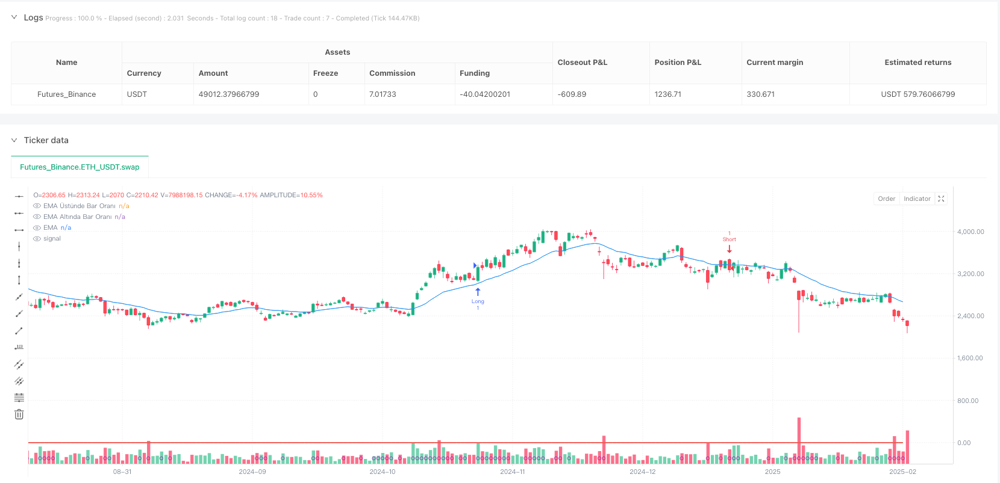
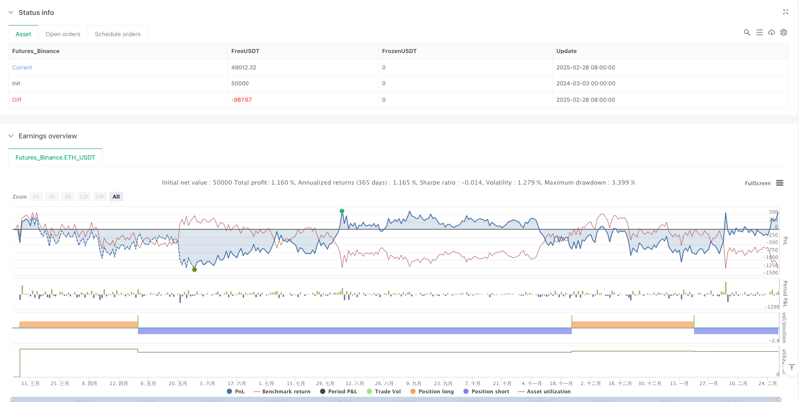

> Name

Multi-Dimensional-EMA-Trend-Following-with-Volume-and-Volatility-Confirmation-Strategy
> Author

ianzeng123

> Strategy Description





[trans]

#### Overview
The multi-dimensional EMA trend tracking and volume volatility confirmation strategy is a comprehensive quantitative trading system that combines the exponential moving average (EMA), volume analysis and volatility filtering. This strategy identifies potential trend entry opportunities by observing price relative to the EMA, historical price trend statistics, volume breakouts, and ATR volatility confirmations. The core idea of ​​the strategy is to conduct transactions under conditions where prices form a clear trend, trading volume increases, and market volatility is moderate, thereby improving transaction success rate and profitability.
#### Strategy Principle
How this strategy works is based on four key components:
1. **EMA trend identification**: The strategy uses the exponential moving average (EMA) of user-defined length as the baseline, and determines the current trend direction by comparing the position of the closing price and the EMA.
2. **Historical trend strength analysis**: The strategy calculates the proportion of closing prices above and below the EMA during the lookback period (lookbackBars) to determine the persistence and strength of the trend. When more than 50% of the K-line closing prices are above the EMA, it is considered an uptrend; otherwise, it is considered a downtrend.
3. **Volume Confirmation**: The strategy requires that the current trading volume must exceed a specific multiple (volMultiplier) of the average trading volume during the lookback period to ensure that there is sufficient market participation to support the price trend.
4. **Volatility Filter**: The strategy uses the Average True Range (ATR) indicator to measure market volatility, requiring that the percentage of the current ATR relative to the closing price must exceed a preset threshold to ensure that the market has sufficient volatility to generate effective signals.
Conditions for generating a strategy’s buy signal:
- More than 50% of K-line closing prices during the lookback period were above the EMA
- The current K-line closing price is above the EMA
- The current trading volume is greater than the average trading volume multiplied by the set multiple
- The current ATR percentage is greater than the volatility threshold
Conditions for generating sell signals for strategies:
- More than 50% of the K-line closing prices during the lookback period were below the EMA
- The current K-line closing price is below the EMA
- The current trading volume is greater than the average trading volume multiplied by the set multiple
- The current ATR percentage is greater than the volatility threshold
#### Strategic Advantages
1. **Multiple confirmation mechanism**: This strategy not only focuses on price trends, but also combines trading volume and volatility indicators for multiple confirmations, reducing false breakthrough signals and improving transaction quality.
2. **Trend Continuity Assessment**: By counting the relative positions of historical K-lines and EMA, the strategy can evaluate the persistence and intensity of the trend and avoid entering the market when the trend is weak.
3. **Adaptability and Flexibility**: The strategy provides multiple adjustable parameters (EMA length, lookback period, trading volume multiple, ATR period and threshold), allowing users to optimize according to different market environments and trading varieties.
4. **Visual support**: The strategy provides visual elements such as EMA lines, trend strength ratios, and trading volume condition indications to help traders understand market conditions and strategy logic more intuitively.
5. **Filtering low-liquidity environments**: Through trading volume conditions, the strategy automatically filters low-liquidity environments to reduce the risk of slippage and the possibility of false signals.
6. **Volatility Adaptability**: Through ATR volatility filtering, the strategy can trade when market fluctuations are reasonable and avoid generating bad signals in excessively calm or excessively volatile market environments.
#### Strategy Risk
1. **Trend reversal risk**: Although the strategy uses a multiple confirmation mechanism, it may still produce a lag when the trend reverses quickly, resulting in poor entry or exit timing. Solution: Consider adding a faster reversal indicator or setting a stop-loss strategy to limit losses.
2. **Parameter optimization over-fitting**: Over-optimizing strategy parameters may lead to over-fitting historical data and poor performance in actual transactions. Solution: Parameter robustness testing across markets and time periods should be adopted, and the rationality of parameter settings should be maintained.
3. **Low Volatility Environment Performance**: In an environment with extremely low market volatility, the strategy may not generate trading signals for a long time, affecting the efficiency of capital utilization. Solution: Different parameter configurations can be set for different volatility environments, or combined with other types of strategies to form a combined strategy.
4. **Abnormal volume interference**: Abnormally large volume spikes (such as after major news releases) may cause false signals. Solution: Consider using the standard deviation of volume or other statistical methods to filter outliers.
5. **Parameter sensitivity**: Small changes in parameters such as EMA length and lookback period may lead to large differences in strategy performance. Solution: Conduct parameter sensitivity analysis and select a configuration whose performance remains relatively stable when parameters change slightly.
6. **Market environment adaptability**: Strategies may perform inconsistently in different market environments (such as trending markets and volatile markets). Solution: You can add market environment identification functions and apply different trading rules or parameter settings in different environments.
#### Strategy optimization direction
1. **Adaptive parameters**: Key parameters such as EMA length and lookback period are designed to be adaptive and automatically adjusted according to market volatility and trend strength. This can improve the adaptability of the strategy in different market environments and reduce the need for manual parameter adjustment.
2. **Improved stop loss mechanism**: Add intelligent stop loss mechanisms, such as dynamic stop loss based on ATR or conditional stop loss based on strategy signal reversal, to protect existing profits and limit single transaction losses.
3. **Market Environment Classification**: Add market environment classification logic, such as distinguishing trend markets and shock markets, and apply different trading rules or parameter configurations in different environments to improve the environmental adaptability of the strategy.
4. **Multi-time frame analysis**: Introduce multi-time frame analysis, and only trade when the trend direction of the higher time frame is consistent with the current time frame to improve the accuracy of trend judgment.
5. **Trading volume analysis optimization**: Refine the trading volume analysis method, such as considering the growth rate, continuity and other characteristics of the trading volume, instead of simply comparing the relationship with the average value, to obtain more accurate trading volume confirmation signals.
6. **Machine Learning Enhancement**: Try to introduce machine learning algorithms to optimize the signal generation process, such as training models through historical data to predict which combinations of conditions are more likely to lead to successful transactions.
7. **Dynamic adjustment of transaction size**: Dynamically adjust the transaction size based on signal strength (such as the gap between the trend ratio and the threshold, the degree of trading volume exceeding the average, etc.), increase positions when the signal is stronger, and improve capital utilization efficiency.
8. **Correlation Filtering**: Increase correlation analysis with related markets or indexes, conduct transactions only when supported by correlation, and reduce false signals caused by broad market factors.
#### Summary
The multi-dimensional EMA trend tracking and volume volatility confirmation strategy is a comprehensive trading system that combines multi-dimensional analysis of price trends, historical patterns, trading volume and volatility. By simultaneously considering price position relative to the EMA, historical trend strength, volume breakouts, and volatility confirmations, this strategy effectively identifies trend entry opportunities with continuation potential.
The core advantage of the strategy lies in its multiple confirmation mechanism and flexible parameter configuration, allowing it to adapt to different market environments. However, the strategy also faces challenges such as parameter optimization, market environment adaptability and signal lag. By introducing adaptive parameters, improving the stop-loss mechanism, adding market environment classification and multi-time frame analysis and other optimization measures, the robustness and profitability of the strategy are expected to be further improved.
For quantitative traders, this strategy provides a solid foundational framework that can be further customized and optimized based on personal trading style and target market characteristics. By understanding the principles and logic behind strategies, traders can better grasp market trend opportunities and improve the quality and consistency of trading decisions. ||
#### Overview
The Multi-Dimensional EMA Trend Following with Volume and Volatility Confirmation Strategy is a comprehensive quantitative trading system that combines Exponential Moving Average (EMA), volume analysis, and volatility filtering. The strategy identifies potential trend entry opportunities by observing the relative position of price to EMA, historical price trend statistics, volume breakouts, and ATR volatility confirmation. The core idea is to execute trades when a clear price trend is forming, trading volume is increasing, and market volatility is moderate, thereby improving trade success rate and profitability.
#### Strategy Principles
The strategy operates based on four key components:
1. **EMA Trend Identification**: The strategy uses an Exponential Moving Average (EMA) of user-defined length as a baseline and determines the current trend direction by comparing closing prices to the EMA.
2. **Historical Trend Strength Analysis**: The strategy calculates the proportion of closing prices above and below the EMA during the lookback period (lookbackBars) to determine trend persistence and strength. When more than 50% of candles close above the EMA, it's considered an uptrend; conversely, it's considered a downtrend.
3. **Volume Confirmation**: The strategy requires current volume to exceed a specific multiple (volMultiplier) of the average volume during the lookback period, ensuring sufficient market participation to support price movements.
4. **Volatility Filtering**: The strategy uses the Average True Range (ATR) indicator to measure market volatility, requiring the current ATR percentage relative to closing price to exceed a preset threshold, ensuring the market has sufficient volatility to generate valid signals.

Buy signal conditions:
- More than 50% of candles in the lookback period close above the EMA
- Current candle closes above the EMA
- Current volume is greater than average volume multiplied by the set multiplier
- Current ATR percentage is greater than the volatility threshold

Sell signal conditions:
- More than 50% of candles in the lookback period close below the EMA
- Current candle closes below the EMA
- Current volume is greater than average volume multiplied by the set multiplier
- Current ATR percentage is greater than the volatility threshold

#### Strategy Advantages
1. **Multiple Confirmation Mechanism**: The strategy not only focuses on price trends but also incorporates volume and volatility indicators for multiple confirmations, reducing false breakout signals and improving trade quality.
2. **Trend Persistence Assessment**: By tracking the historical candles' position relative to the EMA, the strategy can evaluate trend persistence and strength, avoiding entry during weak trends.
3. **Adaptability and Flexibility**: The strategy provides multiple adjustable parameters (EMA length, lookback period, volume multiplier, ATR period, and threshold), allowing users to optimize according to different market environments and trading instruments.
4. **Visualization Support**: The strategy provides visual elements such as the EMA line, trend strength ratio, and volume condition indicators, helping traders understand market conditions and strategy logic more intuitively.
5. **Low Liquidity Environment Filtering**: Through volume conditions, the strategy automatically filters low liquidity environments, reducing slippage risk and the possibility of false signals.
6. **Volatility Adaptability**: Through ATR volatility filtering, the strategy can trade in markets with reasonable volatility, avoiding poor signals in excessively calm or volatile market environments.

#### Strategy Risks
1. **Trend Reversal Risk**: Although the strategy uses multiple confirmation mechanisms, it may still lag during rapid trend reversals, leading to suboptimal entry or exit timing. Solution: Consider adding faster reversal indicators or setting stop-loss strategies to limit losses.
2. **Parameter Optimization Overfitting**: Excessive optimization of strategy parameters may lead to overfitting historical data, performing poorly in actual trading. Solution: Conduct parameter robustness tests across markets and time periods, maintaining reasonable parameter settings.
3. **Low Volatility Environment Performance**: In extremely low volatility environments, the strategy may not generate trading signals for extended periods, affecting capital utilization efficiency. Solution: Set different parameter configurations for different volatility environments or combine with other types of strategies.
4. **Volume Anomaly Interference**: Abnormally large volume spikes (such as after major news releases) may cause erroneous signals. Solution: Consider using volume standard deviation or other statistical methods to filter outliers.
5. **Parameter Sensitivity**: Small changes in parameters like EMA length and lookback period may cause significant differences in strategy performance. Solution: Conduct parameter sensitivity analysis, selecting configurations that remain relatively stable in performance despite small parameter changes.
6. **Market Environment Adaptability**: Strategy performance may be inconsistent across different market environments (such as trending vs. range-bound markets). Solution: Add market environment identification functionality to apply different trading rules or parameter settings in different environments.

#### Strategy Optimization Directions
1. **Adaptive Parameters**: Design key parameters such as EMA length and lookback period to be adaptive, automatically adjusting based on market volatility and trend strength. This improves strategy adaptability across different market environments, reducing the need for manual parameter adjustments.
2. **Stop-Loss Mechanism Improvement**: Add intelligent stop-loss mechanisms, such as ATR-based dynamic stop-loss or condition-based stop-loss triggered by strategy signal reversal, to protect existing profits and limit single trade losses.
3. **Market Environment Classification**: Add market environment classification logic, such as distinguishing between trending and range-bound markets, and apply different trading rules or parameter configurations in different environments to improve strategy adaptability.
4. **Multi-Timeframe Analysis**: Introduce multi-timeframe analysis, trading only when the higher timeframe trend direction aligns with the current timeframe, improving trend judgment accuracy.
5. **Volume Analysis Optimization**: Refine volume analysis methods by considering characteristics such as volume growth rate and continuity, rather than simply comparing to average values, to obtain more precise volume confirmation signals.
6. **Machine Learning Enhancement**: Attempt to incorporate machine learning algorithms to optimize signal generation, such as training models on historical data to predict which condition combinations are more likely to lead to successful trades.
7. **Dynamic Trade Sizing**: Dynamically adjust trade size based on signal strength (such as the difference between trend ratio and threshold, the extent volume exceeds average, etc.), increasing position size with stronger signals to improve capital utilization efficiency.
8. **Correlation Filtering**: Add correlation analysis with related markets or indices, trading only when supported by correlations, reducing false signals caused by broad market factors.

#### Summary
The Multi-Dimensional EMA Trend Following with Volume and Volatility Confirmation Strategy is a comprehensive trading system that combines price trend, historical pattern, volume, and volatility analysis across multiple dimensions. By simultaneously considering price position relative to EMA, historical trend strength, volume breakouts, and volatility confirmation, the strategy can effectively identify trend entry opportunities with continuation potential.

The core advantage of the strategy lies in its multiple confirmation mechanisms and flexible parameter configuration, allowing it to adapt to different market environments. However, the strategy also faces challenges in parameter optimization, market environment adaptability, and signal lag. By introducing adaptive parameters, improving stop-loss mechanisms, adding market environment classification, and multi-timeframe analysis, the strategy's robustness and profitability can be further enhanced.

For quantitative traders, this strategy provides a solid framework that can be further customized and optimized according to individual trading styles and target market characteristics. By understanding the principles and logic behind the strategy, traders can better capitalize on market trend opportunities and improve the quality and consistency of trading decisions.[/trans]


> Source (PineScript)

``` pinescript
/*backtest
start: 2024-03-03 00:00:00
end: 2025-03-01 08:00:00
period: 1d
basePeriod: 1d
exchanges: [{"eid":"Futures_Binance","currency":"ETH_USDT"}]
*/

//@version=5
strategy("EMA, Hacim ve Volatilite Stratejisi", overlay=true, initial_capital=10000, currency=currency.USD)

// Kullanıcı girdileri
emaLength           = input.int(20, "EMA Uzunluğu", minval=1)
lookbackBars        = input.int(50, "Bakış Periyodu (Bar Sayısı)", minval=1)
volMultiplier       = input.float(1.0, "Hacim Çarpanı (Ortalama Hacim x)", step=0.1)
atrPeriod           = input.int(14, "ATR Periyodu", minval=1)
atrPercentThreshold = input.float(0.01, "ATR Yüzde Eşiği (Örn: 0.01 = %1)", step=0.001)

// EMA hesaplaması
emaSeries = ta.ema(close, emaLength)
plot(emaSeries, color=color.blue, title="EMA")

// Son lookbackBars barı içerisinde, kapanışın EMA'nın üzerinde olduğu bar sayısını hesaplamak için döngü
barsAboveEMA = 0.0
for i = 0 to lookbackBars - 1
    barsAboveEMA := barsAboveEMA + (close[i] > emaSeries[i] ? 1.0 : 0.0)
ratioAbove = barsAboveEMA / lookbackBars

// Son lookbackBars barı içerisinde, kapanışın EMA'nın altında olduğu bar sayısını hesaplamak için döngü
barsBelowEMA = 0.0
for i = 0 to lookbackBars - 1
    barsBelowEMA := barsBelowEMA + (close[i] < emaSeries[i] ? 1.0 : 0.0)
ratioBelow = barsBelowEMA / lookbackBars

// Hacim filtresi: Mevcut barın hacmi, lookbackBars süresince hesaplanan ortalama hacmin volMultiplier katından yüksek olmalı
avgVolume       = ta.sma(volume, lookbackBars)
volumeCondition = volume > volMultiplier * avgVolume

// Volatilite filtresi: ATR değerinin, kapanışa oranı belirlenen eşikten yüksek olmalı
atrValue            = ta.atr(atrPeriod)
atrPercent          = atrValue / close
volatilityCondition = atrPercent > atrPercentThreshold

// Long ve Short giriş koşulları:
// Long: lookbackBars barının %50'sinden fazlası EMA üzerinde ve son barın kapanışı EMA üzerinde; hacim ve volatilite şartları sağlanmalı
longCondition = (ratioAbove > 0.5) and (close > emaSeries) and volumeCondition and volatilityCondition

// Short: lookbackBars barının %50'sinden fazlası EMA altında ve son barın kapanışı EMA altında; hacim ve volatilite şartları sağlanmalı
shortCondition = (ratioBelow > 0.5) and (close < emaSeries) and volumeCondition and volatilityCondition

// Ekstra görselleştirmeler
plot(ratioAbove, color=color.green, title="EMA Üstünde Bar Oranı", linewidth=2)
plot(ratioBelow, color=color.red, title="EMA Altında Bar Oranı", linewidth=2)
plotshape(volumeCondition, title="Hacim Şartı", style=shape.circle, location=location.bottom, color=color.purple, size=size.tiny)

// İşlem sinyalleri
if longCondition
    strategy.entry("Long", strategy.long)
if shortCondition
    strategy.entry("Short", strategy.short)

```

> Detail

https://www.fmz.com/strategy/484581

> Last Modified

2025-03-03 09:59:19
