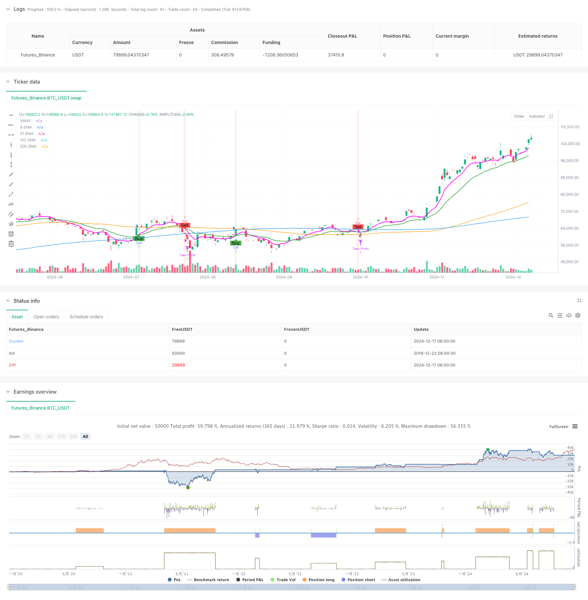

> Name

Multi-Indicator-Trend-Following-Options-Trading-EMA-Cross-Strategy
> Author

ChaoZhang

> Strategy Description



[trans]
#### Overview
This strategy is a trend following options trading strategy based on a combination of multiple technical indicators. Mainly use EMA cross as the core signal, combined with SMA and VWAP to confirm the trend direction, and use MACD and RSI as auxiliary indicators for signal filtering. The strategy uses fixed take-profit points to manage risks, and improves the success rate of transactions through strict entry conditions and position management.
#### Strategy Principle
The strategy uses the intersection of the 8-period and 21-period EMA as the main trading signal. A long signal is triggered when the short-term EMA crosses the long-term EMA and the following conditions are met: the price is above the 100 and 200-period SMA, the MACD line is above the signal line, and the RSI is greater than 50. The short signal is triggered by the opposite conditions. The strategy introduces VWAP as a price weight reference to help determine the relative position of the current price. Each transaction uses a fixed 1 contract as the trading volume and sets a 5% take-profit point. The strategy tracks the position status through the positionOpen flag to ensure that only one position is held at the same time.
#### Strategic Advantages
1. Collaborate with multiple indicators and improve signal reliability through cross-validation of indicators of different periods and types.
2. Use a combination of trend tracking and momentum indicators to capture trends and focus on short-term momentum.
3. Fixed take-profit points help protect profits and avoid excessive greed.
4. Strict position management to avoid repeated opening of positions and reduce risk exposure
5. The visualization effect is clear, including EMA, SMA, VWAP trends and signal marks
#### Strategy Risk
1. Frequent false signals may occur in volatile markets
2. Fixed take-profit points may lead to missing greater profit opportunities
3. If you do not set a stop loss, you may suffer large losses in extreme market conditions.
4. The use of multiple indicators may cause signal lag
5. In illiquid options contracts, you may face the risk of slippage
#### Strategy optimization direction
1. Introduce an adaptive stop-profit and stop-loss mechanism and dynamically adjust according to market volatility
2. Add a trading volume management module to dynamically adjust positions based on account size and market conditions.
3. Add market volatility filter to adjust strategy parameters in high volatility environment
4. To optimize indicator parameters, consider using adaptive periods instead of fixed periods.
5. Add a time filter to avoid trading during volatile periods such as market opening and closing.
#### Summary
This is a multi-indicator trend following option trading strategy with complete structure and clear logic. The strategy improves the reliability of trading signals through the coordination of multiple technical indicators, and uses fixed take-profit points to manage risks. Although the strategy has some inherent risks, the stability and profitability of the strategy can be further improved through the proposed optimization direction. The visual design of the strategy also helps traders intuitively understand and execute trading signals. ||
#### Overview
This strategy is a trend-following options trading system that combines multiple technical indicators. It uses EMA crossover as the core signal, along with SMA and VWAP for trend confirmation, while utilizing MACD and RSI as supplementary indicators for signal filtering. The strategy employs fixed take-profit levels for risk management and enhances trading success through strict entry conditions and position management.

#### Strategy Principles
The strategy uses the crossover of 8-period and 21-period EMAs as the primary trading signal. A long (Call) signal is triggered when the short-term EMA crosses above the long-term EMA and meets the following conditions: price is above both 100 and 200-period SMAs, MACD line is above the signal line, and RSI is above 50. Short (Put) signals are triggered under opposite conditions. VWAP is incorporated as a price-weighted reference to help assess relative price position. Each trade uses a fixed position size of 1 contract with a 5% take-profit level. The strategy tracks position status using a positionOpen flag to ensure only one position is held at a time.

#### Strategy Advantages
1. Multiple indicators work in synergy, cross-validating signals through different periods and types of indicators
2. Combines trend-following and momentum indicators to capture both trend and short-term momentum
3. Fixed take-profit levels help protect profits and prevent excessive greed
4. Strict position management prevents overlapping positions and reduces risk exposure
5. Clear visualization including EMA, SMA, VWAP trends and signal markers

#### Strategy Risks
1. May generate frequent false signals in ranging markets
2. Fixed take-profit levels might limit profit potential
3. Absence of stop-loss could lead to significant losses in extreme market conditions
4. Multiple indicators might result in delayed signals
5. May face slippage risk in options contracts with low liquidity

#### Strategy Optimization Directions
1. Implement adaptive take-profit and stop-loss mechanisms based on market volatility
2. Add position sizing module to dynamically adjust based on account size and market conditions
3. Include volatility filters to adjust strategy parameters in high-volatility environments
4. Optimize indicator parameters, considering adaptive periods instead of fixed ones
5. Add time filters to avoid trading during highly volatile market opening and closing periods

#### Summary
This is a well-structured, logically sound multi-indicator trend-following options trading strategy. It enhances trading signal reliability through the coordination of multiple technical indicators and manages risk using fixed take-profit levels. While the strategy has some inherent risks, the proposed optimization directions can further improve its stability and profitability. The strategy's visualization design also helps traders intuitively understand and execute trading signals.
[/trans]


> Source (PineScript)

``` pinescript
/*backtest
start: 2019-12-23 08:00:00
end: 2024-12-18 08:00:00
period: 1d
basePeriod: 1d
exchanges: [{"eid":"Futures_Binance","currency":"BTC_USDT"}]
*/

//@version=5
strategy("OptionsMillionaire Strategy with Take Profit Only", overlay=true, default_qty_type=strategy.fixed, default_qty_value=1)

// Define custom magenta color
magenta = color.rgb(255, 0, 255)  // RGB for magenta

// Input settings for Moving Averages
ema8 = ta.ema(close, 8)
ema21 = ta.ema(close, 21)
sma100 = ta.sma(close, 100)
sma200 = ta.sma(close, 200)
vwap = ta.vwap(close)  // Fixed VWAP calculation

// Input settings for MACD and RSI
[macdLine, signalLine, _] = ta.macd(close, 12, 26, 9)
rsi = ta.rsi(close, 14)

// Define trend direction
isBullish = ema8 > ema21 and close > sma100 and close > sma200
isBearish = ema8 < ema21 and close < sma100 and close < sma200

// Buy (Call) Signal
callSignal = ta.crossover(ema8, ema21) and isBullish and macdLine > signalLine and rsi > 50

// Sell (Put) Signal
putSignal = ta.crossunder(ema8, ema21) and isBearish and macdLine < signalLine and rsi < 50

// Define Position Size and Take-Profit Level
positionSize = 1  // Position size set to 1 (each trade will use one contract)
takeProfitPercent = 5  // Take profit is 5%

// Variables to track entry price and whether the position is opened
var float entryPrice = na  // To store the entry price
var bool positionOpen = false  // To check if a position is open

// Backtesting Execution
if callSignal and not positionOpen
    // Enter long position (call)
    strategy.entry("Call", strategy.long, qty=positionSize)
    entryPrice := close  // Store the entry price
    positionOpen := true  // Set position as opened

if putSignal and not positionOpen
    // Enter short position (put)
    strategy.entry("Put", strategy.short, qty=positionSize)
    entryPrice := close  // Store the entry price
    positionOpen := true  // Set position as opened

// Only check for take profit after position is open
if positionOpen
    // Calculate take-profit level (5% above entry price for long, 5% below for short)
    takeProfitLevel = entryPrice * (1 + takeProfitPercent / 100)

    // Exit conditions (only take profit)
    if strategy.position_size > 0
        // Long position (call)
        if close >= takeProfitLevel
            strategy.exit("Take Profit", "Call", limit=takeProfitLevel)
    if strategy.position_size < 0
        // Short position (put)
        if close <= takeProfitLevel
            strategy.exit("Take Profit", "Put", limit=takeProfitLevel)

// Reset position when it is closed (this happens when an exit is triggered)
if strategy.position_size == 0
    positionOpen := false  // Reset positionOpen flag

// Plot EMAs
plot(ema8, color=magenta, linewidth=2, title="8 EMA")
plot(ema21, color=color.green, linewidth=2, title="21 EMA")

// Plot SMAs
plot(sma100, color=color.orange, linewidth=1, title="100 SMA")
plot(sma200, color=color.blue, linewidth=1, title="200 SMA")

// Plot VWAP
plot(vwap, color=color.white, style=plot.style_circles, title="VWAP")

// Highlight buy and sell zones
bgcolor(callSignal ? color.new(color.green, 90) : na, title="Call Signal Background")
bgcolor(putSignal ? color.new(color.red, 90) : na, title="Put Signal Background")

// Add buy and sell markers (buy below, sell above)
plotshape(series=callSignal, style=shape.labelup, location=location.belowbar, color=color.green, text="Buy", title="Call Signal Marker")
plotshape(series=putSignal, style=shape.labeldown, location=location.abovebar, color=color.red, text="Sell", title="Put Signal Marker")

```

> Detail

https://www.fmz.com/strategy/475602

> Last Modified

2024-12-20 14:49:04
