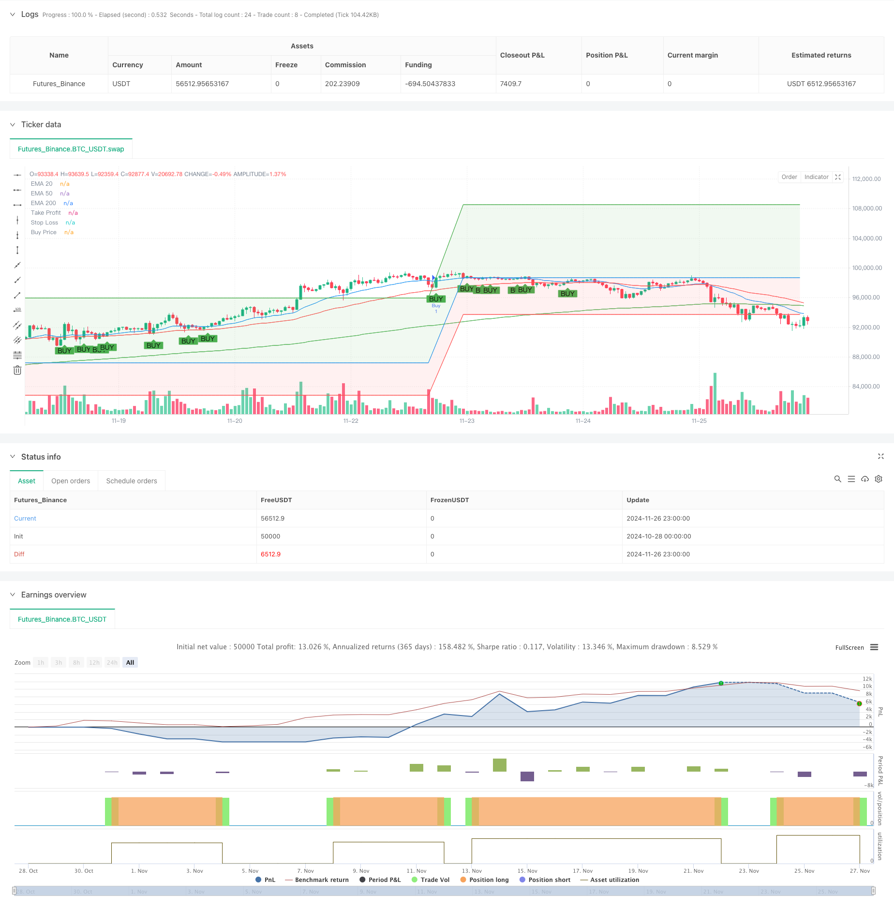

> Name

Multi-Timeframe-EMA-Cross-High-Win-Rate-Trend-Following-Strategy-Advanced
> Author

ChaoZhang

> Strategy Description



[trans]
#### Overview
This is a trend following strategy based on multi-period moving average crossovers. The strategy mainly determines the entry timing based on the intersection relationship of the 20, 50 and 200 period exponential moving averages (EMA) and the relationship between price and the moving average. At the same time, it also sets percentage-based take-profit and stop-loss to control risks. This strategy is especially suitable for larger time periods, such as 1-hour, daily and weekly charts, and can effectively capture medium and long-term trend markets.
#### Strategy Principle
The core logic of the strategy is based on multiple moving average systems and price action analysis:
1. Use three exponential moving averages with different periods (20, 50, 200) to build a trend judgment system
2. Admission requirements require all of the following conditions to be met:
   - Price breaks out and closes above the 20-period EMA
   - The 20-period EMA is above the 50-period EMA
   - The 50-period EMA is above the 200-period EMA
3. Risk control adopts a fixed percentage method:
   - Take profit is set 10% above the entry price
   - Stop loss is set 5% below the entry price
#### Strategic Advantages
1. Multiple confirmation mechanism improves reliability
   - Provides multiple validations via triple moving averages and price breakouts
   - Avoid false signal interference
2. Complete risk control system
   - Default take profit and stop loss positions
   - Reasonable risk-benefit ratio (1:2)
3. Strong adaptability
   - Can be applied to multiple timeframes
   - Particularly suitable for mid- to long-term trend trading
#### Strategy Risk
1. Poor performance in sideways market
   - Stop loss may be triggered frequently in volatile markets
   - Recommended for use when identifying trends
2. Lag risk
   -The moving average system has a certain hysteresis
   - May miss some market starting points
3. Fixed take-profit and stop-loss limits
   - Fixed percentages may not be suitable in all market circumstances
   - It is recommended to dynamically adjust based on volatility
#### Strategy optimization direction
1. Introducing volatility indicators
   - Use ATR to dynamically adjust take profit and stop loss
   - Improve strategy adaptability to the market
2. Add trend strength filtering
   - Added trend strength indicators such as ADX
   - Improved entry signal quality
3. Optimize the moving average period
   - Adjust moving average parameters according to different market characteristics
   - Provide suggestions for parameter optimization range
#### Summary
This is a well designed and logical trend following strategy. Through the combined use of multiple technical indicators, it not only ensures the reliability of the strategy, but also provides a clear risk control plan. The strategy is particularly suitable for running on large cycle charts and has unique advantages in grasping medium and long-term trends. Through the suggested optimization directions, there is room for further improvement of the strategy. It is recommended that traders fully test in the backtest system before using it in real trading, and adjust parameters appropriately according to the characteristics of specific trading varieties. ||
#### Overview
This is a trend following strategy based on multiple timeframe EMA crossovers. The strategy primarily relies on the crossover relationships between 20, 50, and 200-period Exponential Moving Averages (EMAs) and price-EMA relationships to determine entry points, while incorporating percentage-based take-profit and stop-loss levels for risk management. This strategy is particularly effective on larger timeframes such as 1-hour, daily, and weekly charts.

#### Strategy Principles
The core logic is based on a multiple moving average system and price action analysis:
1. Uses three different period EMAs (20, 50, 200) to build a trend identification system
2. Entry conditions require all of the following:
   - Price breaks and closes above the 20-period EMA
   - 20-period EMA is above the 50-period EMA
   - 50-period EMA is above the 200-period EMA
3. Risk management uses fixed percentage methods:
   - Take profit is set at 10% above entry price
   - Stop loss is set at 5% below entry price

#### Strategy Advantages
1. Multiple confirmation mechanism improves reliability
   - Multiple validations through triple EMAs and price breakout
   - Reduces false signal interference
2. Comprehensive risk management system
   - Preset take-profit and stop-loss levels
   - Reasonable risk-reward ratio (1:2)
3. High adaptability
   - Applicable across multiple timeframes
   - Particularly suitable for medium to long-term trend trading

#### Strategy Risks
1. Poor performance in ranging markets
   - May trigger frequent stop losses in sideways markets
   - Recommended for use in clear trending conditions
2. Lag risk
   - Moving average system has inherent lag
   - May miss some trend starting points
3. Fixed take-profit and stop-loss limitations
   - Fixed percentages may not suit all market conditions
   - Recommend dynamic adjustment based on volatility

#### Strategy Optimization Directions
1. Incorporate volatility indicators
   - Use ATR for dynamic take-profit and stop-loss adjustment
   - Improve strategy market adaptability
2. Add trend strength filtering
   - Include ADX or other trend strength indicators
   - Improve entry signal quality
3. Optimize EMA periods
   - Adjust EMA parameters based on different market characteristics
   - Provide parameter optimization range suggestions

#### Summary
This is a well-designed trend following strategy with clear logic. Through the combination of multiple technical indicators, it ensures both strategy reliability and clear risk management solutions. The strategy is particularly suitable for larger timeframe charts and has unique advantages in capturing medium to long-term trends. Through the suggested optimization directions, there is room for further improvement. Traders are advised to thoroughly test the strategy in a backtesting system before live trading and adjust parameters according to specific trading instrument characteristics.[/trans]


> Source (PineScript)

``` pinescript
/*backtest
start: 2024-10-28 00:00:00
end: 2024-11-27 00:00:00
period: 1h
basePeriod: 1h
exchanges: [{"eid":"Futures_Binance","currency":"BTC_USDT"}]
*/

//@version=5
strategy("EMA Cross Strategy with Targets and Fill", overlay=true)

// Define EMAs
ema20 = ta.ema(close, 20)
ema50 = ta.ema(close, 50)
ema200 = ta.ema(close, 200)

// Plot EMAs (hidden)
plot(ema20, color=color.blue, title="EMA 20", display=display.none)
plot(ema50, color=color.red, title="EMA 50", display=display.none)
plot(ema200, color=color.green, title="EMA 200", display=display.none)

// Define the conditions
priceCrossAboveEMA20 = ta.crossover(close, ema20)
priceCloseAboveEMA20 = close > ema20
ema20AboveEMA50 = ema20 > ema50
ema50AboveEMA200 = ema50 > ema200

// Buy condition
buyCondition = priceCrossAboveEMA20 and priceCloseAboveEMA20 and ema20AboveEMA50 and ema50AboveEMA200

// Plot buy signals
plotshape(series=buyCondition, location=location.belowbar, color=color.green, style=shape.labelup, text="BUY")

// Declare and initialize variables for take profit and stop loss levels
var float longTakeProfit = na
var float longStopLoss = na
var float buyPrice = na

// Update levels and variables on buy condition
if (buyCondition)
    // Enter a new buy position
    strategy.entry("Buy", strategy.long)

    // Set new take profit and stop loss levels
    longTakeProfit := strategy.position_avg_price * 1.10  // Target is 10% above the buy price
    longStopLoss := strategy.position_avg_price * 0.95    // Stop loss is 5% below the buy price
    buyPrice := strategy.position_avg_price

// Plot levels for the new trade
plotTakeProfit = plot(longTakeProfit, color=color.green, title="Take Profit", linewidth=1, offset=-1)
plotStopLoss = plot(longStopLoss, color=color.red, title="Stop Loss", linewidth=1, offset=-1)
plotBuyPrice = plot(buyPrice, color=color.blue, title="Buy Price", linewidth=1, offset=-1)

// Fill areas between buy price and take profit/stop loss levels
fill(plotBuyPrice, plotTakeProfit, color=color.new(color.green, 90), title="Fill to Take Profit")  // Light green fill to target
fill(plotBuyPrice, plotStopLoss, color=color.new(color.red, 90), title="Fill to Stop Loss")    // Light red fill to stop loss

// Exit conditions
strategy.exit("Take Profit/Stop Loss", from_entry="Buy", limit=longTakeProfit, stop=longStopLoss)

```

> Detail

https://www.fmz.com/strategy/473272

> Last Modified

2024-11-28 17:27:46
