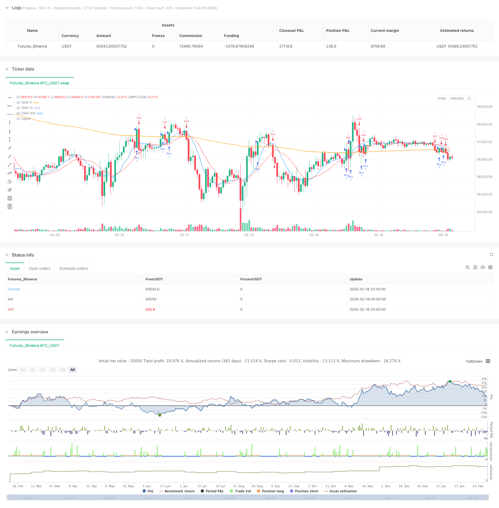

> Name

Neural-Moving-Average-Crossover-Trend-Following-Strategy-with-EMA-Filtering-System
> Author

ChaoZhang

> Strategy Description



[trans]
#### Overview
This strategy is a trading system based on moving average crossover signals and trend filtering. It combines the cross signals of short-term SMA (9 periods and 15 periods) and long-term EMA (200 periods) as a trend filter to capture market trends through moving average crossovers on different time periods. The system also includes a re-entry mechanism, which allows you to re-open positions when the trend continues.
#### Strategy Principle
The strategy uses a triple moving average system for trading decisions:
1. Generate trading signals using 9-period and 15-period simple moving averages (SMA)
2. Use the 200-period exponential moving average (EMA) as a trend filter
3. When the short-term SMA (9-period) crosses the 15-period SMA upward and the price is above the 200-period EMA, a long signal is generated
4. When the short-term SMA (9-period) crosses the 15-period SMA downward and the price is below the 200-period EMA, a short signal is generated
5. The system also includes re-entry logic, allowing positions to be re-opened after the initial cross signal as long as the price remains on the correct side of the 200EMA
#### Strategic Advantages
1. Multiple time frame analysis: combines short-term and long-term moving averages to provide a more comprehensive market perspective
2. Trend filtering: Use 200EMA to filter out false signals and improve trading quality
3. Re-entry mechanism: allows multiple positions to be opened in strong trends to increase profit potential
4. Clear entry and exit rules: based on objective technical indicators to reduce subjective judgments
5. Two-way trading: you can make profits in both long and short directions
6. Risk management integration: automatically control risks through the moving average system
#### Strategy Risk
1. Volatile market risk: Frequent false signals may occur in sideways markets
2. Lagging risk: The moving average is essentially a lagging indicator and may miss the best entry point
3. Trend reversal risk: You may suffer large losses in a violent market reversal.
4. Re-entry risk: excessive position building may lead to overweight positions
Mitigation measures:
- Added additional market volatility filter
-Set maximum position limit
- Use dynamic stop loss mechanism
- Implement warehouse management system
#### Strategy optimization direction
1. Dynamic cycle optimization:
- Automatically adjust the moving average period based on market volatility
- Introduce adaptive moving average (AMA) to replace fixed period moving average
2. Admission optimization:
- Increased volume confirmation
- Added momentum indicator validation
- Introducing price pattern confirmation
3. Risk management optimization:
- Implement dynamic position management
- Add trailing stop
- Volatility based stop loss setting
4. Re-entry logic optimization:
- Added trend strength confirmation
- Design gradient warehouse building system
- Add market environment identification
#### Summary
This strategy builds a complete trend following trading system by combining a multiple moving average system and trend filters. Its main advantage is that it can obtain considerable profits in strong trending markets, while improving the stability of the system through moving average filtering and re-entry mechanisms. Although there are some inherent risks, the performance of the strategy can be further improved through the implementation of optimization directions. This strategy is suitable for tracking medium and long-term market trends and is a reliable trading tool for patient traders. ||
#### Overview
This strategy is a trading system based on moving average crossover signals and trend filtering. It combines short-term SMA crossover signals (9-period and 15-period) with a long-term EMA (200-period) as a trend filter to capture market trends across different timeframes. The system also includes a re-entry mechanism that allows for position rebuilding during trend continuation.

#### Strategy Principles
The strategy employs a triple moving average system for trading decisions:
1. Uses 9-period and 15-period Simple Moving Averages (SMA) for generating trading signals
2. Employs 200-period Exponential Moving Average (EMA) as a trend filter
3. Generates long signals when the short-term SMA (9-period) crosses above the 15-period SMA and price is above the 200-period EMA
4. Generates short signals when the short-term SMA (9-period) crosses below the 15-period SMA and price is below the 200-period EMA
5. Includes re-entry logic allowing new positions after initial crossover signals as long as price maintains position relative to the 200 EMA

#### Strategy Advantages
1. Multiple timeframe analysis: Combines short-term and long-term moving averages for a comprehensive market perspective
2. Trend filtering: Uses 200 EMA to filter false signals and improve trade quality
3. Re-entry mechanism: Allows multiple entries during strong trends to maximize profit potential
4. Clear entry/exit rules: Based on objective technical indicators, reducing subjective judgment
5. Bi-directional trading: Profits from both bullish and bearish markets
6. Integrated risk management: Automatic risk control through the moving average system

#### Strategy Risks
1. Choppy market risk: May generate frequent false signals in sideways markets
2. Lag risk: Moving averages are inherently lagging indicators, potentially missing optimal entry points
3. Trend reversal risk: May suffer significant losses during sharp market reversals
4. Re-entry risk: Excessive position building may lead to overexposure
Mitigation measures:
- Add additional volatility filters
- Set maximum position limits
- Implement dynamic stop-loss mechanisms
- Deploy position sizing system

#### Strategy Optimization Directions
1. Dynamic Period Optimization:
- Automatically adjust moving average periods based on market volatility
- Introduce Adaptive Moving Averages (AMA) to replace fixed-period ones

2. Entry Optimization:
- Add volume confirmation
- Include momentum indicator validation
- Implement price pattern confirmation

3. Risk Management Optimization:
- Implement dynamic position sizing
- Add trailing stops
- Develop volatility-based stop-loss settings

4. Re-entry Logic Optimization:
- Add trend strength confirmation
- Design graduated position building system
- Incorporate market environment recognition

#### Summary
This strategy builds a comprehensive trend-following trading system by combining multiple moving average systems with trend filters. Its main advantage lies in capturing significant profits in trending markets while improving stability through moving average filtering and re-entry mechanisms. Although inherent risks exist, implementing the optimization directions can further enhance strategy performance. The strategy is suitable for tracking medium to long-term market trends and serves as a reliable trading tool for patient traders.[/trans]


> Source (PineScript)

``` pinescript
/*backtest
start: 2024-02-19 00:00:00
end: 2025-02-17 00:00:00
period: 1h
basePeriod: 1h
exchanges: [{"eid":"Futures_Binance","currency":"BTC_USDT"}]
*/


//@version=5
strategy("SMA Crossover with EMA Filter", overlay=true)

// Define indicators
sma9 = ta.sma(close, 9)
sma15 = ta.sma(close, 15)
ema200 = ta.ema(close, 200)

// Crossover conditions
bullish_crossover = ta.crossover(sma9, sma15) // Buy signal
bearish_crossover = ta.crossunder(sma9, sma15) // Sell signal

// Filters
above_ema200 = close > ema200
below_ema200 = close < ema200

// Buy condition (only above 200 EMA)
buy_signal = bullish_crossover and above_ema200
if buy_signal
    strategy.entry("Buy", strategy.long)

// Sell condition (only below 200 EMA)
sell_signal = bearish_crossover and below_ema200
if sell_signal
    strategy.entry("Sell", strategy.short)

// Exit condition if the signal reverses
exit_long = bearish_crossover
exit_short = bullish_crossover
if exit_long
    strategy.close("Buy")
if exit_short
    strategy.close("Sell")

// Re-entry condition when price crosses EMA 200 after a prior crossover
buy_reentry = ta.barssince(bullish_crossover) > 0 and above_ema200
sell_reentry = ta.barssince(bearish_crossover) > 0 and below_ema200
if buy_reentry
    strategy.entry("Buy", strategy.long)
if sell_reentry
    strategy.entry("Sell", strategy.short)

// Plot indicators
plot(sma9, color=color.blue, title="SMA 9")
plot(sma15, color=color.red, title="SMA 15")
plot(ema200, color=color.orange, title="EMA 200")


```

> Detail

https://www.fmz.com/strategy/482515

> Last Modified

2025-02-18 18:29:13
