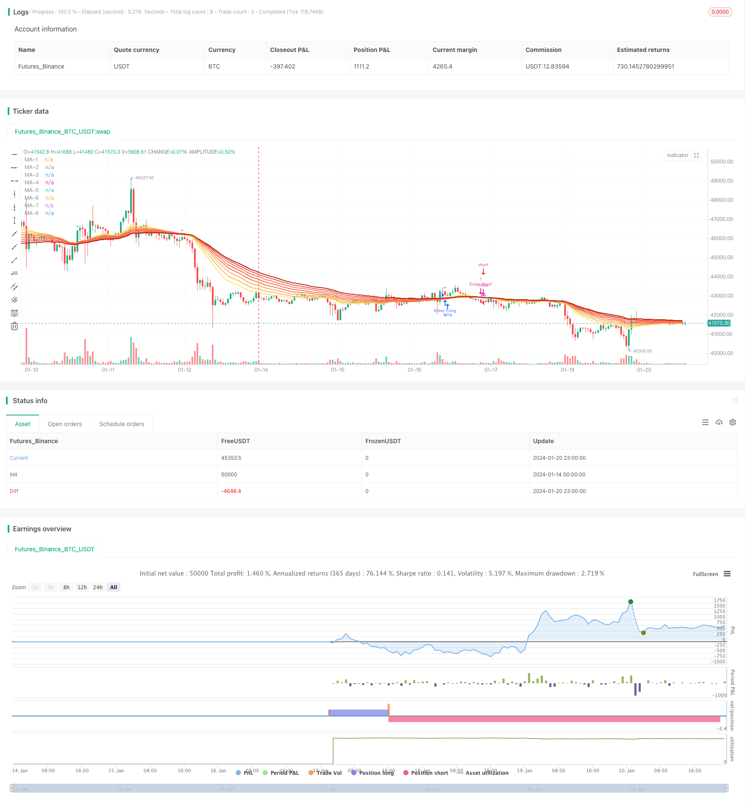

> Name

Moving Average Ribbon Strategy EMA-Ribbon-Strategy
> Author

ChaoZhang

> Strategy Description


 [trans]
### Overview
The moving average stacking strategy calculates moving averages of different periods and generates trading signals based on their intersections. This strategy uses 8 exponential moving averages with different periods to construct a moving average stack, and determines market trends and generates trading signals based on the intersection of the shortest period and the longest period moving averages.
### Strategy Principles
This strategy is mainly based on 8 moving averages: 20-day line, 25-day line, 30-day line, 35-day line, 40-day line, 45-day line, 50-day line and 55-day line. These 8 moving averages are constructed into a bottom-up moving average stack. When the short-period moving average breaks through the long-period moving average from below, a buy signal is generated; when the short-period moving average falls below the long-period moving average from above, a sell signal is generated.
For example, when the 20-day line breaks through the 55-day line from below, a buy signal is generated; when the 20-day line falls below the 55-day line from above, a sell signal is generated. Moving averages can well indicate market trends. This strategy uses the intersection of multiple moving averages to determine the main market trends and generate trading signals.
### Advantage Analysis
The moving average stacking strategy has the following advantages:
1. Using multiple moving averages with different periods can more accurately judge changes in market trends.
2. Multiple moving averages build overlapping bands to make trading signals clearer.
3. Combined with the long and short period moving average, it takes into account both the long-term market trend and the short-term adjustment.
4. There is a large space for optimization of strategy parameters. The strategy can be optimized by adjusting parameters such as the period of the moving average.
5. The strategy logic is simple and clear, easy to understand and implement.
### Risk Analysis
The moving average stacking strategy also has some risks:
1. When the overall trend of the market cannot be determined, false signals may be generated. This can be confirmed by combining it with other indicators.
2. The transaction frequency may be too high, increasing transaction costs and slippage costs. The moving average cycle can be appropriately adjusted to reduce the trading frequency.
3. Improper parameter settings may result in over sensitivity or lag. Optimization parameters need to be tested repeatedly.
4. Rapid jumps caused by unexpected events may render the strategy ineffective. Stop loss strategies can be set to control risks.
### Optimization direction
The moving average stacking strategy can be optimized from the following aspects:
1. Adjust the period parameters of the moving average and find the optimal parameter combination.
2. Add other technical indicators for signal filtering and confirmation to improve signal accuracy.
3. Combine with volatility indicators to reduce trading frequency in low volatility environments.
4. Set up a stop-loss strategy to control single losses.
5. Optimize fund management strategies and improve profitability factors.
6. Test the parameter robustness of different types of contracts. Find the best varieties.
### Summarize
The overall idea of ​​the moving average stacking strategy is clear. The market trend is judged through the intersection of multiple moving averages and trading signals are generated. The strategy optimization space is large and can be optimized by adjusting parameters, adding signal filtering and other methods. Generally speaking, this strategy is relatively simple and practical, and is suitable for introductory learning of quantitative trading. However, you still need to pay attention to controlling transaction frequency and risk.
||

### Overview

The EMA Ribbon strategy generates trading signals by calculating exponential moving averages (EMAs) of different periods and identifying crossovers between them. This strategy constructs a ribbon of 8 EMAs with varying periods, and uses the crossover between the shortest-period EMA and the longest-period EMA to determine market trend and generate trade signals.  

### Strategy Logic

The core of this strategy consists of 8 EMAs: 20-period, 25-period, 30-period, 35-period, 40-period, 45-period, 50-period and 55-period. These 8 EMAs form a ribbon stacking from bottom to top. When a shorter-period EMA crosses above a longer-period EMA, a buy signal is generated. When a shorter-period EMA crosses below a longer-period EMA, a sell signal is generated.

For example, when the 20-period EMA crosses above the 55-period EMA, a buy signal is triggered; when the 20-period EMA crosses below the 55-period EMA, a sell signal is triggered. EMAs can indicate market trend very well. This strategy identifies the predominant trend using multiple EMA crossovers and generates trading signals accordingly.

### Advantage Analysis  

The EMA Ribbon strategy has the following advantages:

1. Using multiple EMAs of different periods can identify changes in market trend more accurately. 

2. Constructing a ribbon with multiple EMAs makes trading signals clearer.

3. Incorporating both long-period and short-period EMAs considers both long-term trend and short-term corrections.  

4. The strategy allows large parameter optimization space by adjusting EMA periods and other parameters.

5. The strategy logic is simple and easy to understand and implement.

### Risk Analysis

The EMA Ribbon strategy also has some risks:  

1. It may generate false signals when the overall market trend is unclear. Additional indicators can be used for signal confirmation.

2. High trading frequency increases transaction and slippage costs. EMA periods can be adjusted to reduce trading frequency.  

3. Improper parameter settings may cause signals to be too sensitive or lagging. Parameters need to be repeatedly tested and optimized. 

4. Sudden price gaps from events may invalidate signals. Stop loss strategies should be used to control risks.

### Optimization Directions

The EMA Ribbon strategy can be optimized in the following aspects:

1. Adjust EMA period parameters to find optimal combinations.

2. Add other technical indicators for signal filtering and confirmation to improve accuracy. 

3. Incorporate volatility indicators to reduce trade frequency in low volatility environments.  

4. Set stop loss strategies to limit per trade loss.

5. Optimize money management strategies to improve profit factors.

6. Test parameter robustness across different products and contracts. Find the best markets.

### Summary

The EMA Ribbon strategy has clear logic, identifying trend with EMA crossovers and generating trade signals. It has large optimization space for adjusting parameters, adding signal filters etc. Overall it is quite simple and practical, good for quant trading beginners. But controlling trade frequency and risks remains important.

[/trans]

> Strategy Arguments


|Argument|Default|Description|
|----|----|----|
|v_input_1|20|MA-1 period|
|v_input_2|25|MA-2 period|
|v_input_3|30|MA-3 period|
|v_input_4|35|MA-4 period|
|v_input_5|40|MA-5 period|
|v_input_6|45|MA-6 period|
|v_input_7|50|MA-7 period|
|v_input_8|55|MA-8 period|
|v_input_9_close|0|Source: close|high|low|open|hl2|hlc3|hlcc4|ohlc4|


> Source (PineScript)

``` pinescript
/*backtest
start: 2024-01-14 00:00:00
end: 2024-01-21 00:00:00
period: 1h
basePeriod: 15m
exchanges: [{"eid":"Futures_Binance","currency":"BTC_USDT"}]
*/

//@version=4
strategy(title="EMA Ribbon [Krypt] with Buy/Sell Signals", shorttitle="EMA Ribbon", overlay=true)

dropn(src, n) =>
    na(src[n]) ? na : src

length1 = input(20, title="MA-1 period", minval=1)
length2 = input(25, title="MA-2 period", minval=1)
length3 = input(30, title="MA-3 period", minval=1)
length4 = input(35, title="MA-4 period", minval=1)
length5 = input(40, title="MA-5 period", minval=1)
length6 = input(45, title="MA-6 period", minval=1)
length7 = input(50, title="MA-7 period", minval=1)
length8 = input(55, title="MA-8 period", minval=1)
source_input = input(close, title="Source")

price = dropn(source_input, 1)

ema1 = ema(price, length1)
ema2 = ema(price, length2)
ema3 = ema(price, length3)
ema4 = ema(price, length4)
ema5 = ema(price, length5)
ema6 = ema(price, length6)
ema7 = ema(price, length7)
ema8 = ema(price, length8)

plot(ema1, title="MA-1", color=#f5eb5d, transp=0, linewidth=2)
plot(ema2, title="MA-2", color=#f5b771, transp=0, linewidth=2)
plot(ema3, title="MA-3", color=#f5b056, transp=0, linewidth=2)
plot(ema4, title="MA-4", color=#f57b4e, transp=0, linewidth=2)
plot(ema5, title="MA-5", color=#f56d58, transp=0, linewidth=2)
plot(ema6, title="MA-6", color=#f57d51, transp=0, linewidth=2)
plot(ema7, title="MA-7", color=#f55151, transp=0, linewidth=2)
plot(ema8, title="MA-8", color=#aa2707, transp=0, linewidth=2)

// Buy and sell signals based on crossover and crossunder
buySignal = crossover(ema1, ema8)
sellSignal = crossunder(ema1, ema8)

plotshape(series=buySignal, title="Buy Signal", color=color.green, style=shape.triangleup, size=size.small)
plotshape(series=sellSignal, title="Sell Signal", color=color.red, style=shape.triangledown, size=size.small)

if buySignal
    strategy.entry("Enter Long", strategy.long)
else if sellSignal
    strategy.entry("Enter Short", strategy.short)
```

> Detail

https://www.fmz.com/strategy/439622

> Last Modified

2024-01-22 12:21:47
