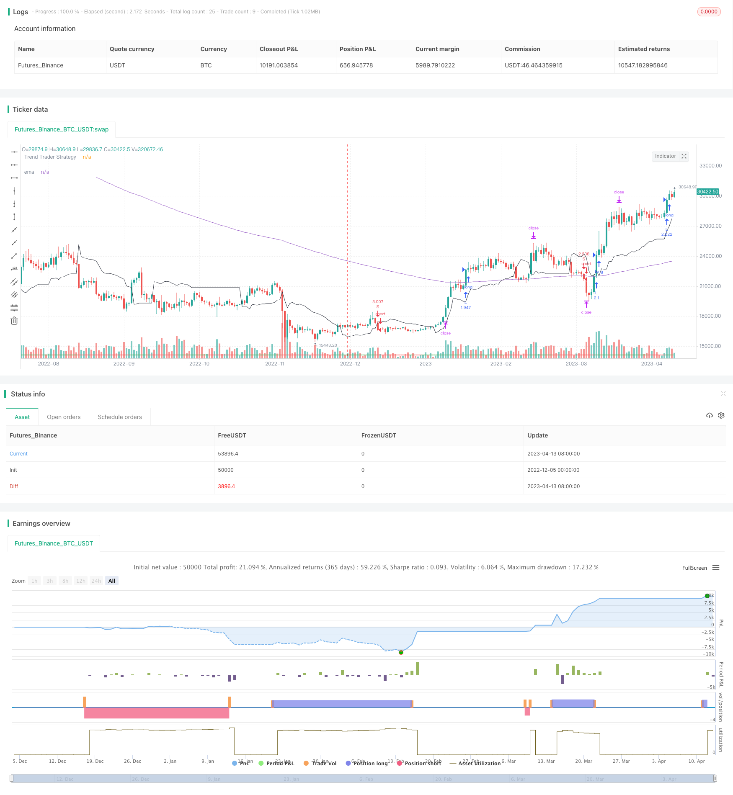

> Name

Short-term tracking trend suppresses oscillation strategy EMA-Tracking-Trend-Suppressing-Oscillation-Strategy
> Author

ChaoZhang

> Strategy Description


[trans]

## Overview
This strategy comprehensively utilizes the advantages of the indicator EMA, the trend following strategy TTS and the Schuft trend cycle STC to form a strong short-term trend tracking strategy. Specifically, the strategy will simultaneously determine whether the long and short signals of the three indicators are consistent. If they are consistent, a trading signal will be generated; if they are inconsistent, no buying or selling will be performed. This can filter out some false signals and make the strategy more reliable.
## Strategy Principle
This strategy mainly consists of three parts: EMA smoothing indicator, TTS trend following strategy and STC Shuft trend cycle indicator.
First, calculate the 200-period EMA exponential moving average to determine whether the price is below or above the EMA line. If the price is below the line, the EMA indicator gives a short signal; -1; if the price is above the line, the EMA indicator gives a long signal: 1.
Secondly, calculate the relevant parameters of the TTS trend following strategy, and judge the market trend direction based on the price breaking through the upper and lower rails. If the price breaks through the upper band, a long signal 1 is generated; if the price breaks through the lower band, a short signal -1 is generated.
Finally, the Shufter trend cycle STC indicator is calculated, which reflects the changing trend of the price center. If the STC indicator rises, a long signal 1 is generated; if the STC indicator falls, a short signal -1 is generated.
After getting the judgment signals of the three indicators, the strategy will determine whether they are consistent. Only when the judgment signals of the three indicators are all consistent, the actual trading signal will be generated. This can effectively filter out some false signals and make the strategy more reliable.
If it is determined that a trading signal is generated, place a long or short order and set a take-profit and stop-loss point.
## Strategic Advantages
1. This strategy comprehensively uses three different types of indicators to effectively determine the direction of market trends.
2. Use the consistency judgment of the judgment signals of the three indicators to filter out false signals, which can reduce unnecessary transactions and make the strategy more reliable.
3. Set reasonable stop-profit and stop-loss points to lock in profits and avoid losses from expanding.
4. The selected parameters have been optimized and can be adapted to most stocks and foreign exchange varieties.
5. The transaction logic is clear and concise, easy to understand and modify.
## Strategy Risk
1. When the three indicator judgments are inconsistent, dimers will appear and it is easy to miss trading opportunities. Consider optimizing judgment rules.
2. The STC indicator is highly sensitive to parameters, and parameters need to be adjusted for different varieties.
3. In a recession, the stop loss may be breached, resulting in larger losses. Consider optimizing stop loss points in real time.
4. It is impossible to effectively judge the market that is moving sideways, and entering the market during the consolidation range may cause lock-up.
## Strategy optimization
1. You can test more combinations of indicators to find stronger judgment rules. For example, add RSI indicator, etc.
2. Optimize the indicator parameters of the STC indicator to make it more suitable for different varieties. Added adaptive parameter optimization module.
3. Add an adaptive stop loss module, which can optimize and set stop loss points in real time according to the market situation.
4. Enhance the position closing module to determine whether to enter sideways consolidation to avoid getting stuck.
5. Optimize the algorithm for high-frequency trading to reduce system delays and improve the commission success rate.
## Summarize
This strategy comprehensively uses three indicators, EMA, TTS and STC, to determine the market trend direction. The judgment rule is set to generate trading signals when the three indicators are consistent, which can effectively filter out false signals. There is still a lot of room for strategy optimization. By testing more indicator combinations, adding adaptive algorithms, optimizing high-frequency trading modules, etc., we can further strengthen the performance of this strategy in tracking trends. Compared with traditional strategies such as simply following the moving average, this strategy can judge the market more intelligently and try to avoid being trapped while seizing the trend.
||

## Overview

This strategy combines the advantages of three indicators: EMA, Trend Tracking Strategy (TTS) and Schaff Trend Cycle (STC) to form a strong short-term trend tracking strategy. Specifically, the strategy will judge whether the buy and sell signals of the three indicators are consistent. If they are consistent, trading signals will be generated; otherwise no trades will be made. This filters out some false signals and makes the strategy more reliable. 

## Strategy Principle  

The strategy consists of three main parts: EMA indicator, TTS trend tracking strategy and STC indicator.

Firstly, the 200-period EMA exponential moving average line is calculated. If the price is below this EMA line, the EMA indicator gives a sell signal: -1; if the price is above the line, the EMA indicator gives a buy signal: 1.

Secondly, the relevant parameters of the TTS trend tracking strategy are calculated. According to the price breakouts of the upper and lower rails, the market trend direction is determined. If the price breaks through the upper rail, a buy signal 1 is generated; if the price breaks through the lower rail, a sell signal -1 is generated.

Finally, the Schaff Trend Cycle (STC) indicator is calculated, which reflects the change trend of the price consolidation. If the STC indicator rises, it generates a buy signal 1; if the STC indicator falls, it generates a sell signal -1.

After obtaining the judgment signals from the three indicators, the strategy will determine whether they are consistent. Only when all three indicator judgment signals are consistent will actual trading signals be generated. This can effectively filter out some false signals and make the strategy more reliable. 

Once determining to generate trading signals, long or short positions will be opened and stop-profit/stop-loss points will be set.

## Advantages

1. The strategy combines three different types of indicators to effectively determine market trend direction.

2. Using the consistency of judgment signals from three indicators to filter out false signals can reduce unnecessary trades and make the strategy more reliable.

3. Setting reasonable stop-profit/stop-loss points can lock in profits and prevent losses from expanding.

4. The optimized parameters are suitable for most stocks and forex products. 

5. Simple and easy-to-understand trading logic.

## Risks

1. Inconsistency between indicator judgments may cause loss of trading opportunities. Judgment rules can be further optimized.

2. STC indicator is sensitive to parameters. Different products need parameter tuning.

3. In downtrends, stop loss may be penetrated, causing huge losses. Adaptive stop loss can be considered.  

4. Sideway consolidations cannot be effectively identified, leading to trap positions.

## Enhancements

1. Test more indicator combinations to find stronger judgment rules, e.g. adding RSI indicator.

2. Optimize STC parameters for better adaptation across different products. Add adaptive parameter optimization module.

3. Increase adaptive stop loss module to optimize stop loss points dynamically.  

4. Enhance position closing module to identify sideway ranges and avoid traps.

5. Optimize algorithms for high frequency trading, reducing latency and improving order fulfillment rates.

## Conclusion

The strategy combines EMA, TTS and STC indicators to determine market direction, with consistent judgments from all three triggering trades, effectively filtering out false signals. There is still large room for optimizations, e.g. testing more indicator combinations, adding adaptive algorithms, optimizing high frequency trading modules, etc, to further strengthen trend tracking capability. Compared to traditional strategies simply following moving averages, this strategy can judge markets more intelligently, capture trends while avoiding traps.  
[/trans]

> Strategy Arguments


|Argument|Default|Description|
|----|----|----|
|v_input_float_1|0.1|(?Strategy)Profit %|
|v_input_int_1|21|(?Trend Trader Strategy)Length|
|v_input_float_2|3|Multiplier|
|v_input_int_2|12|(?Schaff Trend Cycle)Length|
|v_input_int_3|26|FastLength|
|v_input_int_4|50|SlowLength|
|v_input_float_3|0.5|AAA|


> Source (PineScript)

``` pinescript
/*backtest
start: 2022-12-05 00:00:00
end: 2023-04-14 00:00:00
period: 1d
basePeriod: 1h
exchanges: [{"eid":"Futures_Binance","currency":"BTC_USDT"}]
*/

// This source code is subject to the terms of the Mozilla Public License 2.0 at https://mozilla.org/MPL/2.0/
// © ajahanbin1374

//@version=5
strategy(title = "EMA + TTS + STC", shorttitle = "EMA + TTS + STC", overlay = true, calc_on_order_fills=false, calc_on_every_tick = false, initial_capital = 100, default_qty_type = strategy.percent_of_equity, default_qty_value = 100, commission_type = strategy.commission.percent, commission_value = 0.01)

////////////////////////////////////////////////////////////
// Strategy entry
////////////////////////////////////////////////////////////
profit = input.float(defval = 0.1, minval = 0.0, title="Profit %", step=0.01, group = "Strategy") * 0.01

////////////////////////////////////////////////////////////
// Emponential Moving Average
////////////////////////////////////////////////////////////
ema = ta.ema(close, 200)
posEma = close < ema ? -1 : 1

////////////////////////////////////////////////////////////
// Trend Trader Strategy
////////////////////////////////////////////////////////////
Length = input.int(21, minval=1, group="Trend Trader Strategy")
Multiplier = input.float(3, minval=0.000001, group="Trend Trader Strategy")
avgTR = ta.wma(ta.atr(1), Length)
highestC = ta.highest(Length)
lowestC = ta.lowest(Length)
hiLimit = highestC[1] - avgTR[1] * Multiplier
loLimit = lowestC[1] + avgTR[1] * Multiplier
ret = 0.0
posTts = 0.0
ret:= close > hiLimit and close > loLimit ? hiLimit :
         close < loLimit and close < hiLimit ? loLimit : nz(ret[1], close)
posTts:=  close > ret ? 1 :close < ret ? -1 : nz(posTts[1], 0)


////////////////////////////////////////////////////////////
// Schaff Trend Cycle (STC)
////////////////////////////////////////////////////////////
EEEEEE = input.int(12, 'Length', group ="Schaff Trend Cycle")
BBBB = input.int(26, 'FastLength', group ="Schaff Trend Cycle")
BBBBB = input.int(50, 'SlowLength', group ="Schaff Trend Cycle")

AAAA(BBB, BBBB, BBBBB) =>
    fastMA = ta.ema(BBB, BBBB)
    slowMA = ta.ema(BBB, BBBBB)
    AAAA = fastMA - slowMA
    AAAA

AAAAA(EEEEEE, BBBB, BBBBB) =>
    AAA = input.float(0.5, group ="Schaff Trend Cycle")
    var CCCCC = 0.0
    var DDD = 0.0
    var DDDDDD = 0.0
    var EEEEE = 0.0
    BBBBBB = AAAA(close, BBBB, BBBBB)
    CCC = ta.lowest(BBBBBB, EEEEEE)
    CCCC = ta.highest(BBBBBB, EEEEEE) - CCC
    CCCCC := CCCC > 0 ? (BBBBBB - CCC) / CCCC * 100 : nz(CCCCC[1])
    DDD := na(DDD[1]) ? CCCCC : DDD[1] + AAA * (CCCCC - DDD[1])
    DDDD = ta.lowest(DDD, EEEEEE)
    DDDDD = ta.highest(DDD, EEEEEE) - DDDD
    DDDDDD := DDDDD > 0 ? (DDD - DDDD) / DDDDD * 100 : nz(DDDDDD[1])
    EEEEE := na(EEEEE[1]) ? DDDDDD : EEEEE[1] + AAA * (DDDDDD - EEEEE[1])
    EEEEE

mAAAAA = AAAAA(EEEEEE, BBBB, BBBBB)
mColor = mAAAAA > mAAAAA[1] ? color.new(color.green, 20) : color.new(color.red, 20)
posStc = mAAAAA > mAAAAA[1] ? 1 : -1

////////////////////////////////////////////////////////////
// Strategy entry
////////////////////////////////////////////////////////////
pos = posEma == 1 and posTts == 1 and posStc == 1 ? 1 : posEma == -1 and posTts == -1 and posStc == -1 ? -1 : 0

currentPostition = strategy.position_size > 0 ? 1 : strategy.position_size < 0 ? -1 : 0
noOpenPosition = strategy.position_size == 0

signal = pos != pos[1] and pos == 1 and noOpenPosition ? 1 : pos != pos[1] and pos == -1 and noOpenPosition ? -1 : 0

stopPriceForLong = math.min(close * (1 - profit), low[1] * 0.9998, low[2] * 0.9998)
limitPriceForLong = close + (close - stopPriceForLong)
stopPriceForShort = math.max(close * (1 + profit), high[1] * 1.0002, high[2] * 1.0002)
limitPriceForShort = close - (stopPriceForShort - close)

if signal == 1
    strategy.entry(id="L", direction=strategy.long)
    strategy.exit(id='EL', from_entry='L', limit=limitPriceForLong, stop=stopPriceForLong)
if signal == -1
    strategy.entry(id="S", direction=strategy.short)
    strategy.exit(id='ES', from_entry='S', limit=limitPriceForShort, stop=stopPriceForShort)

////////////////////////////////////////////////////////////
// Plots - Debuger
////////////////////////////////////////////////////////////
plotchar(signal, title='singal', char = '')
plotchar(posEma, title='posEma', char = '')
plotchar(posTts, title='posTts', char = '')
plotchar(pos, title='pos', char = '')
plotchar(currentPostition, title = 'currentPostition', char='')
plotchar(stopPriceForLong, title = "stopPriceForLong", char ='')
plotchar(limitPriceForLong, title = 'limitPriceForLong', char='')
plotchar(stopPriceForShort, title = "stopPriceForShort", char ='')
plotchar(limitPriceForShort, title = 'limitPriceForShort', char='')

////////////////////////////////////////////////////////////
// Plots
////////////////////////////////////////////////////////////
plot(ret, color=color.new(color.black, 0), title='Trend Trader Strategy')
plotchar(mAAAAA, color=mColor, title='STC', location = location.bottom, char='-', size=size.normal)
plot(series = ema, title = "ema")

```

> Detail

https://www.fmz.com/strategy/435133

> Last Modified

2023-12-12 15:52:37
