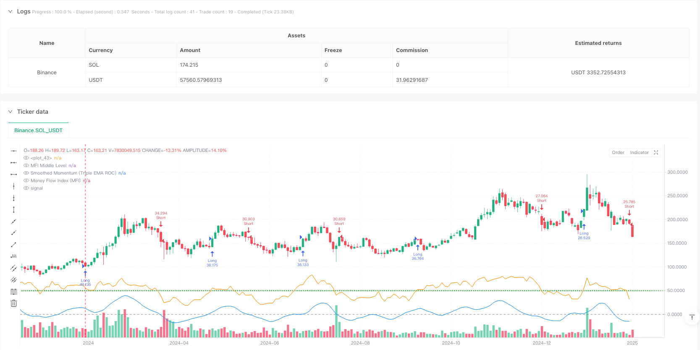
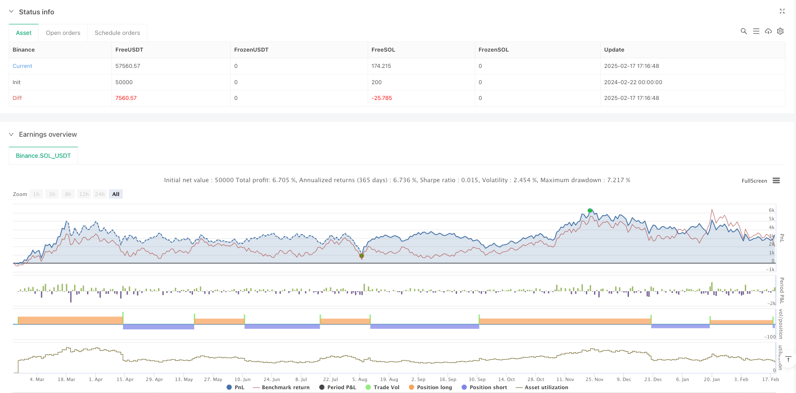

> Name

Triple-EMA-Smoothed-Momentum-and-Money-Flow-Integrated-Trading-Strategy
> Author

ianzeng123

> Strategy Description





[trans]
#### Overview
This strategy is a comprehensive trading system that combines momentum indicators and fund flow indicators. The momentum indicator is smoothed through the triple exponential moving average (EMA), which effectively reduces market noise. The strategy uses the rate of change (ROC) to calculate raw momentum and combines it with the money flow indicator (MFI) to confirm trading signals, which can be applied to transactions in various time periods.
#### Strategy Principle
The core principles of the strategy are based on two main technical indicators: the momentum indicator and the money flow indicator (MFI). First use ROC to calculate raw momentum, and then use triple EMA smoothing to obtain a more stable momentum signal line. The generation of trading signals needs to meet the conditions of both momentum and MFI: when the smoothed momentum is positive and the MFI is above the median level, a long signal is generated; when the smoothed momentum is negative and the MFI is below the median level, a short signal is generated. The strategy also designs an exit mechanism based on momentum and MFI turning points, which helps to stop losses and lock in profits in a timely manner.
#### Strategic Advantages
1. Strong signal smoothness: False signals are significantly reduced through triple EMA processing and the reliability of trading is improved.
2. Double confirmation mechanism: combining the two dimensions of momentum and capital flow, reducing the limitations of a single indicator
3. Wide adaptability: can be applied to different time periods and has strong universality
4. Perfect risk control: clear entry and exit conditions, including stop loss mechanism
5. Highly adjustable parameters: multiple adjustable parameters are provided to facilitate optimization according to different market conditions.
#### Strategy Risk
1. Trend turning risk: Signal lags may occur in violently volatile markets
2. Parameter sensitivity: Different parameter settings may lead to large differences in strategy performance.
3. Market environment dependence: Frequent false signals may occur in sideways markets
4. Fund management risk: Position size needs to be set appropriately to control risks
5. Limitations of technical indicators: Strategies based on technical indicators may fail when fundamentals change
#### Strategy optimization direction
1. Introduce volatility filter: add ATR indicator to filter signals in low volatility period
2. Optimize the exit mechanism: add trailing stop loss and profit target
3. Add time filtering: avoid important economic data release periods
4. Add trading volume confirmation: Combined with trading volume analysis to improve signal reliability
5. Develop adaptive parameters: dynamically adjust parameters based on market conditions
#### Summary
This is a comprehensive trading strategy with reasonable design and clear logic. Through the combination of momentum and capital flow indicators, as well as triple EMA smoothing, the timeliness and reliability of signals are effectively balanced. The strategy has strong practicality and scalability, and is suitable for further optimization and real-time application. It is recommended that traders pay attention to risk control in practical applications, set parameters reasonably, and make optimization adjustments according to specific market conditions. ||
#### Overview
This strategy is an integrated trading system that combines momentum indicators and money flow indicators, using triple exponential moving averages (EMA) to smooth the momentum indicator, effectively reducing market noise. The strategy uses Rate of Change (ROC) to calculate raw momentum and combines it with the Money Flow Index (MFI) to confirm trading signals, applicable to various timeframes.

#### Strategy Principles
The core principles are based on two main technical indicators: momentum and Money Flow Index (MFI). First, ROC calculates raw momentum, which is then smoothed through triple EMA processing to obtain a more stable momentum signal line. Trading signals require simultaneous satisfaction of momentum and MFI conditions: long signals are generated when smoothed momentum is positive and MFI is above the middle level; short signals are generated when smoothed momentum is negative and MFI is below the middle level. The strategy also incorporates exit mechanisms based on momentum and MFI turning points, helping to implement timely stop-losses and lock in profits.

#### Strategy Advantages
1. Strong Signal Smoothing: Triple EMA processing significantly reduces false signals, improving trading reliability
2. Dual Confirmation Mechanism: Combines momentum and money flow dimensions, reducing limitations of single indicators
3. Wide Adaptability: Applicable to different timeframes with strong universality
4. Comprehensive Risk Control: Clear entry and exit conditions, including stop-loss mechanisms
5. Strong Parameter Adjustability: Provides multiple adjustable parameters for optimization across different market conditions

#### Strategy Risks
1. Trend Reversal Risk: Potential signal lag in volatile markets
2. Parameter Sensitivity: Different parameter settings may lead to significant performance variations
3. Market Environment Dependency: May generate frequent false signals in sideways markets
4. Money Management Risk: Requires proper position sizing for risk control
5. Technical Indicator Limitations: Strategy based on technical indicators may fail during fundamental changes

#### Strategy Optimization Directions
1. Introduce Volatility Filter: Add ATR indicator to filter signals during low volatility periods
2. Optimize Exit Mechanism: Add trailing stops and profit targets
3. Add Time Filters: Avoid important economic data release periods
4. Incorporate Volume Confirmation: Combine volume analysis to improve signal reliability
5. Develop Adaptive Parameters: Dynamically adjust parameters based on market conditions

#### Summary
This is a well-designed trading strategy with clear logic. Through the combination of momentum and money flow indicators, along with triple EMA smoothing, it effectively balances signal timeliness and reliability. The strategy demonstrates strong practicality and scalability, suitable for further optimization and live trading application. Traders are advised to pay attention to risk control, set parameters reasonably, and optimize according to specific market conditions when implementing the strategy.[/trans]


> Source (PineScript)

``` pinescript
/*backtest
start: 2024-02-22 00:00:00
end: 2025-02-19 08:00:00
period: 2d
basePeriod: 2d
exchanges: [{"eid":"Binance","currency":"SOL_USDT"}]
*/

//@version=5
strategy("Momentum & Money Flow Strategy with Triple EMA Smoothing", overlay=true, initial_capital=100000, default_qty_type=strategy.percent_of_equity, default_qty_value=10)

// Input parameters
momentumPeriod  = input.int(7, title="Momentum Period", minval=1)
smoothingPeriod = input.int(3, title="Momentum Smoothing Period", minval=1)
mfiPeriod       = input.int(14, title="MFI Period", minval=1)
mfiMiddleLevel  = input.int(50, title="MFI Middle Level", minval=1, maxval=100)
mfiOverbought   = input.int(80, title="MFI Overbought Level", minval=1, maxval=100)
mfiOversold     = input.int(20, title="MFI Oversold Level", minval=1, maxval=100)

// Calculate raw momentum oscillator using rate-of-change (ROC)
rawMomentum = ta.roc(close, momentumPeriod)
// Apply triple EMA smoothing for a much smoother momentum line
smoothedMomentum = ta.ema(ta.ema(ta.ema(rawMomentum, smoothingPeriod), smoothingPeriod), smoothingPeriod)

// Calculate Money Flow Index (MFI) using the typical price (hlc3)
typicalPrice = hlc3
mfiValue     = ta.mfi(typicalPrice, mfiPeriod)

// Define conditions for filtering signals based on smoothed momentum and MFI
longCondition  = (smoothedMomentum > 0) and (mfiValue > mfiMiddleLevel)
shortCondition = (smoothedMomentum < 0) and (mfiValue < mfiMiddleLevel)

// Define exit conditions for capturing turning points
exitLongCondition  = (smoothedMomentum < 0) and (mfiValue < mfiOversold)
exitShortCondition = (smoothedMomentum > 0) and (mfiValue > mfiOverbought)

// Execute entries based on defined conditions
if (longCondition and strategy.position_size <= 0)
    strategy.entry("Long", strategy.long)
if (shortCondition and strategy.position_size >= 0)
    strategy.entry("Short", strategy.short)

// Exit positions based on turning point conditions
if (strategy.position_size > 0 and exitLongCondition)
    strategy.close("Long")
if (strategy.position_size < 0 and exitShortCondition)
    strategy.close("Short")

// Plot the triple EMA smoothed momentum oscillator and MFI for visual reference
plot(smoothedMomentum, title="Smoothed Momentum (Triple EMA ROC)", color=color.blue)
hline(0, color=color.gray)
plot(mfiValue, title="Money Flow Index (MFI)", color=color.orange)
hline(mfiMiddleLevel, color=color.green, linestyle=hline.style_dotted, title="MFI Middle Level")
```

> Detail

https://www.fmz.com/strategy/483094

> Last Modified

2025-02-21 13:25:57
