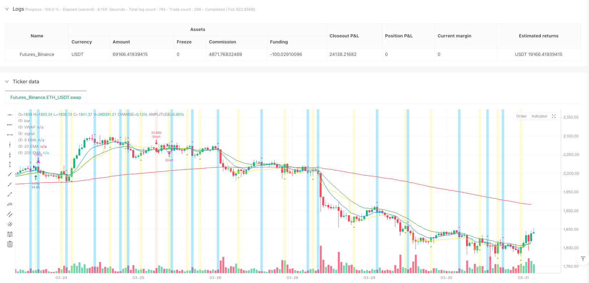
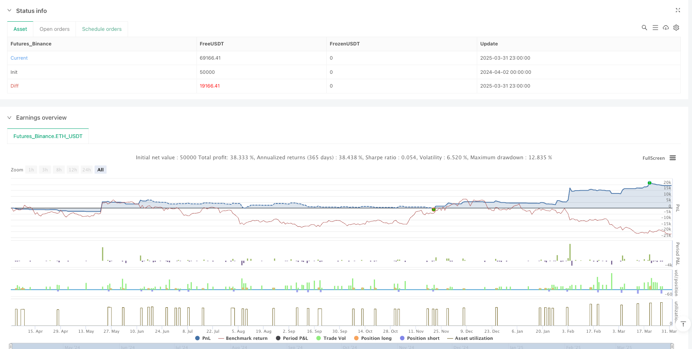

> Name

EMA-VWAP synergy with CBC reversal trend tracking quantitative trading strategy-EMA-VWAP-Synergy-CBC-Reversal-Trend-Following-Quantitative-Trading-Strategy
> Author

ianzeng123

> Strategy Description





[trans]

## Strategy Overview
The EMA-VWAP and CBC reversal trend tracking quantitative trading strategy is a composite trading system that combines a variety of technical indicators. The core of this strategy is to use the synergy of three major technical indicators: exponential moving average (EMA), volume weighted average price (VWAP) and key price breakthrough confirmation (CBC) to form accurate trading signals.
This strategy is particularly suitable for market environments with clear trends. By combining the directionality of short-term and medium-term EMA with the positional relationship of VWAP, and adding CBC breakthrough confirmation, it effectively filters out false breakthroughs and noise signals. The strategy also integrates intraday key price references, including the previous trading day's high (PDH), low (PDL), closing price (PDC) and VWAP levels, as well as Monday's high and low points as a full-week reference, providing rich market background information for trading decisions.
This strategy adopts clear entry and exit rules. The entry signal requires multiple conditions to be met at the same time, while the exit simply relies on CBC's reverse reversal signal, realizing the trading philosophy of "going with the trend and going against the trend".
## Strategy Principle
The core rationale of the strategy is based on the synergy of four key technology elements:
1. **Multi-period EMA system**: The strategy uses three EMA lines (9 periods, 20 periods and 200 periods) to form a trend judgment framework. The relative position of the fast EMA (9 periods) and the medium-speed EMA (20 periods) is used to determine the short-term trend direction. When the fast EMA is above the medium-speed EMA, it is regarded as a bullish signal; otherwise, it is regarded as a bearish signal.
2. **VWAP Benchmark**: As the balance point of price and trading volume, VWAP plays a key support/resistance reference line role in the strategy. The strategy requires that price, fast EMA, and medium EMA must all be on the same side of VWAP to confirm the consistency and strength of the trend.
3. **CBC (Close, Break, Close) reversal signal**: This is the core triggering mechanism of the strategy, by detecting the price breaking through the high or low of the previous trading day, and confirming the validity of the breakthrough at the close. When the closing price exceeds the previous day's high, the CBC flips to bullish; when the closing price falls below the previous day's low, the CBC flips to bearish. The CBC signal serves as both an entry trigger and a signal indicator for closing a position.
4. **Intraday key price reference system**: The strategy integrates the high point, low point, closing price and VWAP level of the previous trading day, as well as Monday's high point and low point as a full-week reference, forming a complete market structure reference frame.
Entry logic requires the following conditions to be met at the same time:
- Long entry: CBC flips from bearish to bullish + price is above VWAP + EMA system is bullishly arranged (fast EMA > medium speed EMA) + both EMAs are above VWAP
- Short entry: CBC flips from bullish to bearish + price is below VWAP + EMA system is in a bearish arrangement (fast EMA < medium speed EMA) + both EMAs are below VWAP
The exit logic directly relies on the reverse reversal of CBC, that is, long positions are closed when CBC flips to bearish, and short positions are closed when CBC flips to bullish, which reflects the trend-trading nature of the strategy.
## Strategic Advantages
Through analysis of the strategy code, the strategy shows the following significant advantages:
1. **Multiple confirmation mechanism**: The strategy requires the EMA trend direction, the position relationship between price and VWAP, and the CBC flip signal to be consistent before the trading signal is triggered, effectively reducing the false alarm rate and improving the signal quality.
2. **Trend following and reversal combined**: The strategy not only captures the trend (through the consistency of EMA and VWAP), but also relies on CBC signals to capture key breakthroughs, balancing the advantages of trend following and reversal trading.
3. **Complete Market Structure Reference**: Integrates the previous trading day's key prices and Monday's high and low points, providing rich market background information for trading decisions and helping to understand the current price's position within the larger market structure.
4. **Clear Visual Feedback**: The strategy uses rich visual elements, including background color changes, shape markers, and labels, allowing traders to intuitively identify signals and current market status.
5. **Simple exit logic**: Using CBC reverse flip as the exit signal avoids the risk of premature exit or over-holding, forming a consistent and symmetrical system with the entry logic.
6. **Adaptive parameter settings**: The strategy provides date filtering functions and multiple display options, allowing traders to customize the strategy according to their own needs, improving the flexibility and adaptability of the strategy.
7. **Fund Management Integration**: The strategy defaults to using the percentage of account funds for trading instead of a fixed number of lots, which reflects good risk management awareness and contributes to long-term capital growth and risk control.
## Strategy Risk
While this strategy has many advantages, a deeper analysis of the code revealed the following potential risks:
1. **Lagging risk**: EMA is essentially a lagging indicator, which may cause signal delays in a violently volatile market, missing the best entry point or lagging exits, resulting in additional losses. The solution is to consider adjusting EMA parameters or adding a volatility filter in high volatility environments.
2. **False breakthrough risk**: Although CBC logic requires the closing price to confirm a breakthrough, the market may still reverse quickly after a false breakthrough. The solution is to consider adding volume confirmation or setting a breakout amplitude filter.
3. **Over-reliance on VWAP**: In sideways or narrow range markets, prices may frequently cross VWAP, resulting in increased signal noise. The solution is to pause trading or increase the volatility filter when sideways markets are identified.
4. **Lack of stop-loss mechanism**: The current strategy does not have a clear stop-loss mechanism and relies entirely on CBC reversal signals to close positions, which may lead to larger losses in extreme market conditions. The solution is to add a fixed stop loss or ATR multiple stop loss and set a maximum loss limit.
5. **Insufficient date filtering**: Although the strategy provides a date filtering function, it does not consider the impact of special market events (such as financial reports, policy announcements, etc.) on strategy performance. The solution is to integrate an economic calendar function that automatically adjusts or pauses trading during important events.
6. **Backtest Bias**: The strategy uses `fill_orders_on_standard_ohlc = true` parameters, which may be different from the actual transaction in the backtest, causing the backtest results to be too optimistic. The solution is to use tick-by-tick simulations or conduct more realistic backtests that account for slippage and transaction costs.
7. **Single period dependence**: The strategy only operates on a single time period, lacks multi-period confirmation, and may miss reverse signals of larger periods. The solution is to consider integrating a multi-cycle signal acknowledgment mechanism.
## Strategy optimization direction
Based on a comprehensive analysis of the strategy code, we recommend the following optimization directions:
1. **Add adaptive parameters**: The EMA period can be dynamically adjusted according to market volatility. Use shorter periods in high-volatility markets and longer periods in low-volatility markets to improve the adaptability of the strategy to different market environments. This can be achieved by calculating the ATR (Average True Range) and mapping it to the EMA period range.
2. **Integrated volume confirmation**: Add volume confirmation requirements on the basis of CBC flip signal. The signal will only be triggered when the breakthrough is accompanied by a significant increase in trading volume, filtering out low-quality breakthroughs. This can be achieved by comparing the relationship between the current trading volume and the N-period average trading volume.
3. **Add stop loss mechanism**: Introduce dynamic stop loss or fixed percentage stop loss based on ATR to protect funds from extreme market conditions before waiting for CBC reversal signal. It is recommended to implement a trailing stop loss function and automatically adjust the stop loss level as the price moves in a favorable direction.
4. **Multi-period collaborative confirmation**: Increase the check of higher time period trends and only enter the market when the direction of the large-period trend is consistent with the current trading direction to improve signal quality. This can be achieved by requesting higher period EMA data and checking its directionality.
5. **Market status classification**: Develop a market status identification module to distinguish trend markets and sideways markets, and adjust strategy parameters or suspend transactions under different market conditions. Market status can be identified using ADX (Average Directional Index) or price range analysis.
6. **Optimized Fund Management**: Dynamically adjust position size based on volatility and winning rate, increase positions on high winning probability signals, and reduce positions on low winning probability signals. Dynamic position adjustment can be achieved through historical signal statistics and current market volatility calculations.
7. **Add time filtering**: Introduce intraday time filtering to avoid high volatility periods before opening and closing, and focus on trading during active but relatively stable periods of the market. Optimized trading periods can be set according to the trading time characteristics of different markets.
8. **Backtest environment optimization**: Use `fill_orders_on_standard_ohlc = false` and actual slippage and commission settings to conduct a more realistic backtest and obtain more reliable strategy evaluation results.
## Summarize
The EMA-VWAP and CBC reversal trend tracking quantitative trading strategy is a trading system with a complete structure and clear logic. It forms high-quality trading signals by integrating a variety of technical indicators and price action analysis methods. The core advantage of this strategy lies in the multiple confirmation mechanism and complete market structure reference system, which effectively reduces the false alarm rate and improves signal quality.
The strategy adopts the trading philosophy of "going with the trend and going against the trend". When entering the market, multiple conditions are required to be confirmed collaboratively. When exiting, the reverse reversal signal of CBC is relied on, forming a logically consistent and symmetrical trading system. At the same time, the strategy integrates rich visual feedback elements and flexible parameter settings to improve user experience and adaptability.
However, this strategy also has potential problems such as lag risk, false breakthrough risk and lack of stop loss mechanism. By adding adaptive parameters, integrating trading volume confirmation, adding stop-loss mechanisms and multi-cycle collaborative confirmation and other optimization measures, the robustness and profitability of the strategy can be further improved.
Overall, this is a well-designed basic strategy framework that has the potential to become a robust trading system through reasonable optimization and risk management configuration. In practical applications, traders should make personalized adjustments to strategy parameters based on their own risk preferences and trading goals, and always maintain appropriate fund management discipline. ||
## Strategy Overview

The EMA-VWAP Synergy CBC Reversal Trend Following Quantitative Trading Strategy is a sophisticated trading system that combines multiple technical indicators. The core of this strategy leverages the synergistic effect of Exponential Moving Averages (EMA), Volume Weighted Average Price (VWAP), and key price breakthrough confirmation (CBC) to generate precise trading signals.

This strategy is particularly effective in markets with clear trends. By combining the directional relationship between short-term and medium-term EMAs with their position relative to VWAP, and adding CBC breakthrough confirmation, the strategy effectively filters out false breakouts and noise signals. The strategy also incorporates intraday key price references, including the previous day's high (PDH), low (PDL), closing price (PDC), and VWAP level, as well as Monday's high and low points as references for the entire week, providing rich market context information for trading decisions.

The strategy employs clear entry and exit rules. Entry signals require multiple conditions to be simultaneously satisfied, while the exit strategy simply relies on the CBC reversal signal, embodying the trading philosophy of "follow the trend, exit on reversal."

## Strategy Principles

The core principles of this strategy are based on the synergistic effect of four key technical elements:

1. **Multi-period EMA System**: The strategy uses three EMA lines (9-period, 20-period, and 200-period) to form a trend judgment framework. The relative position of the fast EMA (9-period) to the medium EMA (20-period) is used to determine the short-term trend direction. When the fast EMA is above the medium EMA, it is considered a bullish signal; otherwise, it is considered a bearish signal.

2. **VWAP Benchmark**: VWAP, as the balance point between price and volume, plays the role of a key support/resistance reference line in the strategy. The strategy requires that the price, fast EMA, and medium EMA must all be on the same side of VWAP to confirm the consistency and strength of the trend.

3. **CBC (Close, Break, Close) Flip Signal**: This is the core trigger mechanism of the strategy, which detects when the price breaks through the previous day's high or low and confirms the validity of the breakthrough at the close. When the closing price exceeds the previous day's high, CBC flips to bullish; when the closing price breaks below the previous day's low, CBC flips to bearish. The CBC signal serves both as an entry trigger condition and as an indicator for closing positions.

4. **Intraday Key Price Reference System**: The strategy integrates the previous day's high, low, closing price, and VWAP level, as well as Monday's high and low as references for the entire week, forming a complete market structure reference framework.

The entry logic requires the following conditions to be met simultaneously:
- Long entry: CBC flips from bearish to bullish + price is above VWAP + EMA system shows bullish alignment (fast EMA > medium EMA) + both EMAs are above VWAP
- Short entry: CBC flips from bullish to bearish + price is below VWAP + EMA system shows bearish alignment (fast EMA < medium EMA) + both EMAs are below VWAP

The exit logic directly relies on the CBC's reverse flip, meaning long positions are closed when CBC flips to bearish, and short positions are closed when CBC flips to bullish, reflecting the trend-following nature of the strategy.

## Strategy Advantages

Through analysis of the strategy code, this strategy demonstrates the following significant advantages:

1. **Multiple Confirmation Mechanism**: The strategy requires the EMA trend direction, the position relationship between price and VWAP, and the CBC flip signal to be consistent before triggering a trading signal, effectively reducing the false alarm rate and improving signal quality.

2. **Combination of Trend Following and Reversal**: The strategy captures both trends (through the consistency of EMA and VWAP) and key breakouts (through CBC signals), balancing the advantages of trend following and reversal trading.

3. **Complete Market Structure Reference**: By integrating the key price levels of the previous trading day and Monday's high and low points, the strategy provides rich market background information for trading decisions, helping to understand the position of the current price in the larger market structure.

4. **Clear Visual Feedback**: The strategy uses rich visual elements, including background color changes, shape markers, and labels, allowing traders to intuitively identify signals and current market status.

5. **Concise Exit Logic**: Using the CBC reverse flip as an exit signal avoids the risks of premature exit or excessive holding, forming a consistent and symmetrical system with the entry logic.

6. **Adaptive Parameter Settings**: The strategy provides date filtering functionality and multiple display options, allowing traders to customize the strategy according to their needs, enhancing flexibility and adaptability.

7. **Integrated Money Management**: The strategy defaults to using a percentage of account equity for trading, rather than fixed lots, reflecting good risk management awareness and contributing to long-term capital growth and risk control.

## Strategy Risks

Despite its many advantages, through in-depth analysis of the code, we have also identified the following potential risks:

1. **Lag Risk**: EMAs are inherently lagging indicators and may cause signal delays in highly volatile markets, missing the optimal entry point or resulting in delayed exits, causing additional losses. The solution is to consider adjusting EMA parameters or adding volatility filters in high-volatility environments.

2. **False Breakout Risk**: Although the CBC logic requires the closing price to confirm a breakthrough, the market may still experience false breakouts followed by quick reversals. The solution is to consider adding volume confirmation or setting breakthrough amplitude filtering conditions.

3. **Over-reliance on VWAP**: In sideways or narrow-range markets, prices may frequently cross VWAP, increasing signal noise. The solution is to pause trading when a sideways market is identified or add amplitude filtering conditions.

4. **Lack of Stop-Loss Mechanism**: The current strategy does not have a clear stop-loss mechanism and relies entirely on CBC reversal signals to close positions, which may lead to significant losses in extreme market conditions. The solution is to add fixed stop-losses or ATR multiple stop-losses and set maximum loss limits.

5. **Insufficient Date Filtering**: Although the strategy provides date filtering functionality, it does not consider the impact of special market events (such as earnings reports, policy announcements, etc.) on strategy performance. The solution is to integrate an economic calendar feature to automatically adjust or pause trading during important events.

6. **Backtest Bias**: The strategy uses the `fill_orders_on_standard_ohlc = true` parameter, which may differ from actual trading in backtests, leading to overly optimistic backtest results. The solution is to use tick-by-tick simulation or consider slippage and trading costs for more realistic backtesting.

7. **Single Timeframe Dependency**: The strategy only runs on a single timeframe, lacking multi-timeframe confirmation, and may miss reversal signals from larger timeframes. The solution is to consider integrating multi-timeframe signal confirmation mechanisms.

## Strategy Optimization Directions

Based on a comprehensive analysis of the strategy code, we recommend the following optimization directions:

1. **Add Adaptive Parameters**: EMA periods can be dynamically adjusted according to market volatility, using shorter periods in high-volatility markets and longer periods in low-volatility markets, improving the strategy's adaptability to different market environments. This can be achieved by calculating ATR (Average True Range) and mapping it to the EMA period range.

2. **Integrate Volume Confirmation**: Add volume confirmation requirements on top of CBC flip signals, triggering signals only when breakouts are accompanied by significant volume increases, filtering out low-quality breakouts. This can be implemented by comparing the current volume with the N-period average volume.

3. **Add Stop-Loss Mechanism**: Introduce dynamic stop-losses based on ATR or fixed percentage stop-losses to protect capital from extreme market conditions before waiting for CBC reversal signals. It is recommended to implement trailing stop-loss functionality that automatically adjusts stop-loss levels as prices move in a favorable direction.

4. **Multi-Timeframe Synergistic Confirmation**: Add checks for trends in higher timeframes, entering positions only when the higher timeframe trend direction is consistent with the current trading direction, improving signal quality. This can be implemented by requesting EMA data from higher timeframes and checking their directionality.

5. **Market State Classification**: Develop a market state recognition module to distinguish between trending and sideways markets, adjusting strategy parameters or pausing trading in different market states. ADX (Average Directional Index) or price range analysis can be used to identify market states.

6. **Optimize Money Management**: Dynamically adjust position sizes based on volatility and win rates, increasing positions on high-probability signals and decreasing positions on low-probability signals. Dynamic position adjustment can be achieved through historical signal statistics and current market volatility calculations.

7. **Add Time Filtering**: Introduce intraday time filtering to avoid high-volatility periods at market open and before close, focusing on trading during active but relatively stable market periods. Optimized trading periods can be set based on the trading time characteristics of different markets.

8. **Backtest Environment Optimization**: Use `fill_orders_on_standard_ohlc = false` and actual slippage and commission settings for more realistic backtesting, obtaining more reliable strategy evaluation results.

## Summary

The EMA-VWAP Synergy CBC Reversal Trend Following Quantitative Trading Strategy is a structurally complete and logically clear trading system that forms high-quality trading signals by integrating multiple technical indicators and price action analysis methods. The core advantages of this strategy lie in its multiple confirmation mechanisms and complete market structure reference system, effectively reducing the false alarm rate and improving signal quality.

The strategy adopts the trading philosophy of "follow the trend, exit on reversal," requiring multiple conditions to confirm entry and relying on CBC reversal signals for exit, forming a logically consistent and symmetrical trading system. At the same time, the strategy integrates rich visual feedback elements and flexible parameter settings, enhancing user experience and adaptability.

However, the strategy also has potential issues such as lag risk, false breakout risk, and lack of a stop-loss mechanism. Through optimization measures such as adding adaptive parameters, integrating volume confirmation, adding stop-loss mechanisms, and multi-timeframe synergistic confirmation, the strategy's robustness and profitability can be further enhanced.

Overall, this is a well-designed basic strategy framework that has the potential to become a robust trading system through reasonable optimization and risk management configuration. In practical application, traders should personalize strategy parameters according to their risk preferences and trading objectives, and always maintain appropriate money management discipline.[/trans]


> Source (PineScript)

``` pinescript
/*backtest
start: 2024-04-02 00:00:00
end: 2025-04-01 00:00:00
period: 1h
basePeriod: 1h
exchanges: [{"eid":"Futures_Binance","currency":"ETH_USDT"}]
*/

//@version=6
strategy("Maple&CBC Strategy", overlay = true, fill_orders_on_standard_ohlc = true, default_qty_type = strategy.percent_of_equity, default_qty_value = 100)


// EMA's
fastEma = ta.ema(close, 9)
middleEma = ta.ema(close, 20)
slowEma = ta.ema(close, 200)
vwap = ta.vwap(close)

plot(fastEma, color=color.blue, title="9 EMA")
plot(middleEma, color=color.green, title="20 EMA")
plot(slowEma, color=color.red, title="200 EMA")
plot(vwap, color=color.yellow, title="VWAP")

// Input instellingen voor zichtbaarheid van lijnen
show_prev_day_high = input.bool(true, title="Toon Previous Day High")
show_prev_day_low = input.bool(true, title="Toon Previous Day Low")
show_prev_day_vwap = input.bool(true, title="Toon Previous Day VWAP")
show_prev_day_close = input.bool(true, title="Toon Previous Day Close")
show_monday_levels = input.bool(true, title="Toon Monday High/Low")

// Vorige dag niveaus
[dh, dl, dc, dv] = request.security(syminfo.tickerid, "D", [high[1], low[1], close[1], ta.vwap(close)[1]])

// Maandag High en Low
isMonday = dayofweek == dayofweek.monday
var float mondayHigh = na
var float mondayLow = na

if isMonday and barstate.isconfirmed
    mondayHigh := high
    mondayLow := low

// CBC Flip Logica
cbc = false
cbc := cbc[1]
if cbc and close < low[1]
    cbc := false
if not cbc and close > high[1]
    cbc := true

cbc_long = cbc and not cbc[1]
cbc_short = not cbc and cbc[1]

// EMA's bullish/bearish check
ema_bullish = fastEma > middleEma
ema_bearish = fastEma < middleEma

// Prijs boven/onder VWAP check
price_above_vwap = close > vwap
price_below_vwap = close < vwap

// ==================== STRATEGIE LOGICA ====================

// Long signaal: prijs boven VWAP + EMA's bullish + EMA's boven VWAP + CBC flip bullish
emas_above_vwap = fastEma > vwap and middleEma > vwap
longCondition = cbc_long and price_above_vwap and ema_bullish and emas_above_vwap and barstate.isconfirmed

// Short signaal: prijs onder VWAP + EMA's bearish + EMA's onder VWAP + CBC flip bearish
emas_below_vwap = fastEma < vwap and middleEma < vwap
shortCondition = cbc_short and price_below_vwap and ema_bearish and emas_below_vwap and barstate.isconfirmed

// Variabelen om bij te houden of we in een positie zitten
var bool inLongPosition = false
var bool inShortPosition = false

// Strategy entrypoints
if longCondition and not inLongPosition and not inShortPosition
    strategy.entry("Long", strategy.long)
    inLongPosition := true
    inShortPosition := false

if shortCondition and not inShortPosition and not inLongPosition
    strategy.entry("Short", strategy.short)
    inShortPosition := true
    inLongPosition := false

// Strategy exitpoints - wacht op tegenovergestelde CBC flip signaal
if cbc_short and inLongPosition
    strategy.close("Long", comment="Exit Long on CBC flip short")
    inLongPosition := false

if cbc_long and inShortPosition
    strategy.close("Short", comment="Exit Short on CBC flip long")
    inShortPosition := false

// Visuele weergave van signalen
plotshape(series=cbc_long, location=location.belowbar, color=color.green, style=shape.triangleup, title="Bulls")
plotshape(series=cbc_short, location=location.abovebar, color=color.red, style=shape.triangledown, title="Bears")

// Achtergrondkleur voor visuele ondersteuning
bgcolor(cbc_long ? color.rgb(255, 235, 59, 71) : cbc_short ? color.rgb(5, 185, 240, 59) : na)

// Extra achtergrondkleur voor trading signalen
bgcolor(longCondition ? color.rgb(0, 255, 0, 90) : shortCondition ? color.rgb(255, 0, 0, 90) : na)

// Labels voor de trading posities
if inLongPosition and barstate.islast
    label.new(bar_index, low - (low * 0.002), "IN LONG", color=color.green, style=label.style_label_up, textcolor=color.white, size=size.small)

if inShortPosition and barstate.islast
    label.new(bar_index, high + (high * 0.002), "IN SHORT", color=color.red, style=label.style_label_down, textcolor=color.white, size=size.small)

```

> Detail

https://www.fmz.com/strategy/489144

> Last Modified

2025-04-02 10:31:49
