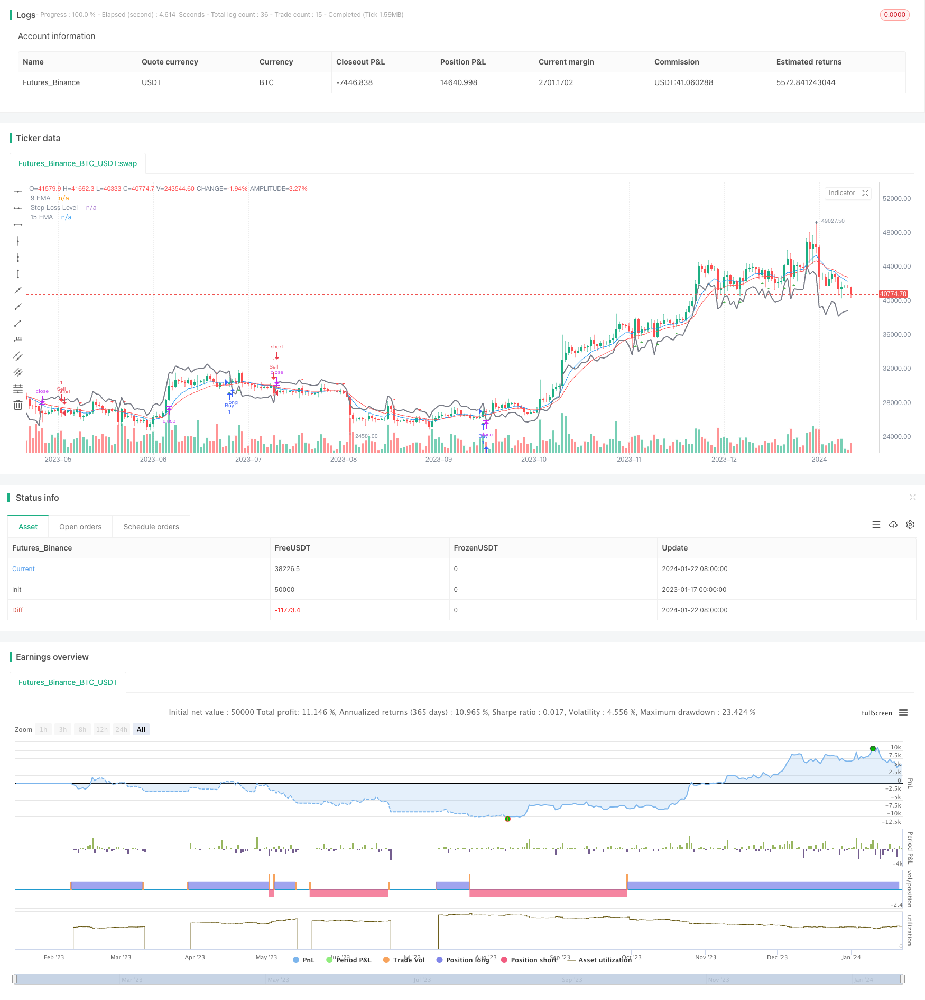

> Name

EMA-based intraday-skillet-business strategy EMA-Intraday-Scalping-Strategy
> Author

ChaoZhang

> Strategy Description


 [trans]
## Summary
This strategy calculates the exponential moving average on the 9th and 15th day, and identifies the buy and sell signals formed by the EMA golden cross and dead cross, and is used for short-term trading within the day. When the 9EMA crosses the 15EMA, and the last K line is a positive line, a buy signal is generated; when the 9EMA crosses below the 15EMA, and the last K line is a negative line, a sell signal is generated. This strategy also combines the ATR indicator to draw a stop loss line.
## Strategy Principle
1. Calculate 9-day EMA and 15-day EMA
2. Identify the rising and falling nature of the latest K line and determine whether it is a positive line or a negative line
3. When the 9EMA crosses the 15EMA and the latest K line is a positive line, a buy signal is generated
4. When the 9EMA crosses the 15EMA and the latest K line is a negative line, a sell signal is generated
5. Calculate the ATR value through the ATR indicator and draw a stop loss line when holding a position
## Advantage Analysis
This strategy has the following advantages:
1. Uses a double EMA indicator combination to capture short- and medium-term trends
2. Filter false signals based on the direction of the K-line entity
3. Using ATR dynamic stop loss can control risks while ensuring profits.
4. The time period is short, suitable for taking advantage of short-term price fluctuations for intraday skillet trading.
5. Simple operation and easy to implement
## Risk Analysis
This strategy also has certain risks:
1. The EMA indicator has hysteresis and may miss some price fluctuations.
2. Double EMA mean reversion may produce whipsaws signals
3. Intraday short-term trading is easily affected by price fluctuations
4. If the stop loss distance is too small, it will be easily broken, but if it is too large, it will affect the profit margin.
Countermeasures:
1. Appropriately adjust EMA parameters and shorten the moving average period
2. Combine with other indicators such as MACD to filter signals
3. Dynamically adjust the stop loss distance and optimize the stop loss strategy
## Optimization direction
This strategy can be optimized from the following aspects:
1. Test different EMA parameter combinations to find the best moving average period
2. Add other indicators to judge and build a multi-factor model
3. Use time period filtering to only send signals in a specific time period
4. Combined with the volatility indicator, adjust the stop loss distance
5. Use machine learning technology to dynamically optimize parameters
## Summarize
This strategy integrates dual EMA indicators to determine the trend direction and K-line entity filtering signals, and uses ATR dynamic stop loss. It is a simple and practical intraday skillet trading strategy. Through parameter optimization and multi-factor combination, the stability and profitability of the strategy can be further improved.
||

## Overview

This strategy calculates the 9-day and 15-day exponential moving averages (EMA) to identify buy and sell signals based on EMA crosses and candlestick direction for intraday trading. It generates buy signals when the 9EMA crosses above the 15EMA and the last candlestick is bullish, and sell signals when the 9EMA crosses below the 15EMA and the last candlestick is bearish. The strategy also incorporates an ATR-based stop loss.  

## Strategy Logic

1. Calculate the 9-day EMA and 15-day EMA
2. Identify the direction of the last candlestick (bullish or bearish)
3. Generate buy signal when 9EMA crosses above 15EMA and last candlestick is bullish 
4. Generate sell signal when 9EMA crosses below 15EMA and last candlestick is bearish
5. Calculate ATR value using ATR indicator to plot stop loss during trade

## Advantage Analysis 

The advantages of this strategy include:

1. Uses EMA combo to capture short-mid term trends  
2. Filters false signals using candlestick direction
3. Employs dynamic ATR stop loss to control risk
4. Short timeframe suitable for intraday scalping  
5. Simple to implement  

## Risk Analysis

The risks include:

1. EMA has lagging effect, may miss some price moves
2. EMA crossovers can cause whipsaws
3. Prone to price fluctuations in intraday trading
4. Stop loss too tight tends to get hit, too wide impacts profit  

Solutions:

1. Optimize EMA parameters  
2. Add other filters like MACD
3. Dynamically adjust stop loss  
4. Optimize stop loss strategy

## Optimization Directions

Areas for optimization:

1. Test different EMA combos to find optimal periods  
2. Add other indicators, build multifactor model
3. Add timeframe filter, signal only during certain periods
4. Incorporate volatility index to adjust stop loss level  
5. Employ machine learning to dynamically optimize parameters

## Summary
This is a simple yet effective intraday scalping strategy integrating dual EMA crossover and candlestick filtering with ATR-based dynamic stop loss. Further enhancements in parameters and multi-factor combinations can improve stability and profitability.  

[/trans]

> Strategy Arguments


|Argument|Default|Description|
|----|----|----|
|v_input_1|9|9 EMA Length|
|v_input_2|15|15 EMA Length|
|v_input_3|14|ATR Length for Stop Loss|
|v_input_4|1.5|ATR Multiplier for Stop Loss|


> Source (PineScript)

``` pinescript
/*backtest
start: 2023-01-17 00:00:00
end: 2024-01-23 00:00:00
period: 1d
basePeriod: 1h
exchanges: [{"eid":"Futures_Binance","currency":"BTC_USDT"}]
*/

//@version=5
strategy("EMA Scalping Strategy", shorttitle="EMAScalp", overlay=true)

// Input parameters
ema9_length = input(9, title="9 EMA Length")
ema15_length = input(15, title="15 EMA Length")

// Calculate EMAs
ema9 = ta.ema(close, ema9_length)
ema15 = ta.ema(close, ema15_length)

// Plot EMAs on the chart
plot(ema9, color=color.blue, title="9 EMA")
plot(ema15, color=color.red, title="15 EMA")

// Identify Bullish and Bearish candles
bullish_candle = close > open
bearish_candle = close < open

// Bullish conditions for Buy Signal
buy_condition = ta.crossover(close, ema9) and ema15 < ema9 and bullish_candle

// Bearish conditions for Sell Signal
sell_condition = ta.crossunder(close, ema9) and ema15 > ema9 and bearish_candle

// Plot Buy and Sell signals
plotshape(series=buy_condition, title="Buy Signal", color=color.green, style=shape.triangleup, location=location.belowbar)
plotshape(series=sell_condition, title="Sell Signal", color=color.red, style=shape.triangledown, location=location.abovebar)

// Optional: Add stop-loss levels
atr_length = input(14, title="ATR Length for Stop Loss")
atr_multiplier = input(1.5, title="ATR Multiplier for Stop Loss")

atr_value = ta.atr(atr_length)
stop_loss_level = strategy.position_size > 0 ? close - atr_multiplier * atr_value : close + atr_multiplier * atr_value
plot(stop_loss_level, color=color.gray, title="Stop Loss Level", linewidth=2)

// Strategy rules
if (buy_condition)
    strategy.entry("Buy", strategy.long)
    strategy.exit("Exit Buy", from_entry="Buy", loss=stop_loss_level)

if (sell_condition)
    strategy.entry("Sell", strategy.short)
    strategy.exit("Exit Sell", from_entry="Sell", loss=stop_loss_level)

```

> Detail

https://www.fmz.com/strategy/439883

> Last Modified

2024-01-24 15:43:31
