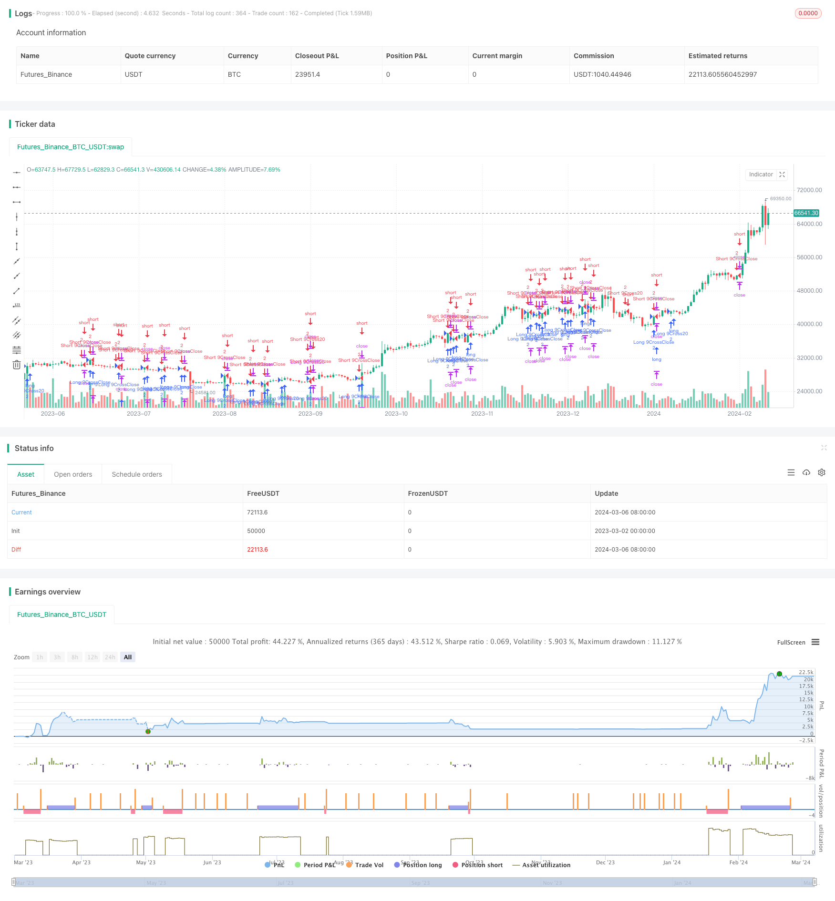

> Name

Dual-Moving-Average-Crossover-Strategy-EMA9-20
> Author

ChaoZhang

> Strategy Description


[trans]

## Strategy Overview
Double moving average crossover strategy-EMA9/20 is a quantitative trading strategy based on the crossover of two exponential moving averages (EMA). This strategy uses the 9-day EMA and the 20-day EMA as trading signals, generating buy or sell signals when the two moving averages cross. At the same time, this strategy also uses the price crossover with the 9-day EMA as a secondary signal, as well as a trailing stop to manage trading risk.
## Strategy Principle
The core principle of this strategy is to use the intersection of two exponential moving averages with different periods to capture market trends. When the short-term moving average (9-day EMA) crosses the long-term moving average (20-day EMA), it indicates that the market may enter an upward trend, and the strategy will generate a buy signal at this time; conversely, when the short-term moving average crosses below the long-term moving average, it indicates that the market may enter a downward trend, at which time the strategy will generate a sell signal.
In addition to the moving average crossover signal, this strategy also introduces the intersection of price and the short-term moving average (9-day EMA) as an auxiliary signal. When the price crosses above the 9-day EMA, a buy signal will also be generated; when the price falls below the 9-day EMA, a sell signal will also be generated. This can capture changes in market trends in a more timely manner.
In order to control risk, this strategy uses the trailing stop method. Once the transaction enters a profitable state, the trailing stop will continuously adjust the stop loss position as the price changes until the price reversely breaks through the stop loss position, thus locking in profits while limiting potential losses.
## Strategic Advantages
1. Simple and easy to understand: This strategy is based on the classic moving average crossover principle, with clear logic and easy to understand and implement.
2. Trend following: Through the intersection of two moving averages of different periods, this strategy can effectively capture the main trend of the market.
3. Timely stop loss: The introduction of a trailing stop loss mechanism can promptly close positions when the trend reverses and control downside risks.
4. Flexible parameters: The parameters of this strategy (such as moving average period, stop loss points, etc.) can be optimized and adjusted according to different markets and varieties to adapt to different market environments.
## Strategy Risk
1. Frequent trading: Since this strategy uses both moving average crossover and price crossover signals, it may result in higher trading frequency, thereby increasing transaction costs.
2. Shocking market: When the market fluctuates or consolidates, this strategy may produce more false signals, resulting in lower profitability.
3. Parameter sensitivity: The performance of this strategy may be sensitive to parameter selection, and different parameters may bring completely different results.
## Optimization direction
1. Signal filtering: On the basis of moving average crossover and price crossover signals, other technical indicators (such as RSI, MACD, etc.) are introduced as filtering conditions to reduce false signals.
2. Dynamic parameters: Dynamically adjust strategy parameters (such as moving average period, stop loss points, etc.) based on market volatility, trend intensity and other factors to adapt to different market conditions.
3. Position management: Dynamically adjust the position size based on market trends and signal strength, increase the position when the trend is strong, and decrease the position when the trend is unclear or the signal is weak.
4. Multi-variety adaptation: Expand this strategy to multiple varieties and markets, and reduce overall risks and improve income stability through diversified investments and correlation analysis.
## Summarize
Double moving average crossover strategy - EMA9/20 is a simple and practical quantitative trading strategy that captures market trends through the crossover and price crossover of two moving averages of different periods, while using moving stop loss to control risks. The strategy has clear logic, is easy to understand and implement, and is suitable for beginners to learn and use. However, this strategy also has some limitations, such as poor performance in volatile markets and sensitivity to parameter selection. Therefore, in practical applications, the strategy needs to be optimized and improved according to the specific market and variety characteristics, such as introducing signal filtering, dynamic parameter adjustment, position management and other methods to improve the profitability and stability of the strategy. In general, the double moving average crossover strategy-EMA9/20 provides a good basic framework for quantitative trading and is worthy of further research and exploration.
||

## Strategy Overview

The Dual Moving Average Crossover Strategy - EMA9/20 is a quantitative trading strategy based on the crossover of two exponential moving averages (EMAs). This strategy uses the 9-day EMA and the 20-day EMA as trading signals, generating buy or sell signals when the two moving averages cross. Additionally, the strategy employs the crossover between the price and the 9-day EMA as an auxiliary signal, as well as a trailing stop to manage trading risk.

## Strategy Principles

The core principle of this strategy is to capture market trends by utilizing the crossover of two moving averages with different periods. When the short-term moving average (9-day EMA) crosses above the long-term moving average (20-day EMA), it indicates a potential upward trend in the market, and the strategy generates a buy signal. Conversely, when the short-term moving average crosses below the long-term moving average, it suggests a potential downward trend, and the strategy generates a sell signal.

In addition to the moving average crossover signals, the strategy also incorporates the crossover between the price and the short-term moving average (9-day EMA) as an auxiliary signal. When the price crosses above the 9-day EMA, it also generates a buy signal, and when the price crosses below the 9-day EMA, it generates a sell signal. This allows for more timely capture of changes in market trends.

To control risk, the strategy employs a trailing stop mechanism. Once a trade enters a profitable state, the trailing stop continuously adjusts the stop-loss position according to price movements until the price breaches the stop-loss level in the opposite direction, thereby locking in profits while limiting potential losses.

## Strategy Advantages

1. Simplicity: The strategy is based on the classic principle of moving average crossovers, making it easy to understand and implement.

2. Trend following: By utilizing the crossover of two moving averages with different periods, the strategy can effectively capture the main trends in the market.

3. Timely stop-loss: The introduction of the trailing stop mechanism allows for timely closing of positions when the trend reverses, controlling downside risk.

4. Parameter flexibility: The parameters of the strategy (such as moving average periods, stop-loss points, etc.) can be optimized and adjusted according to different markets and instruments to adapt to various market conditions.

## Strategy Risks

1. Frequent trading: Since the strategy employs both moving average crossover and price crossover signals, it may lead to a higher trading frequency, thus increasing trading costs.

2. Choppy markets: In choppy or range-bound markets, the strategy may generate more false signals, resulting in reduced profitability.

3. Parameter sensitivity: The performance of the strategy may be sensitive to parameter selection, and different parameters may yield significantly different results.

## Optimization Directions

1. Signal filtering: In addition to the moving average crossover and price crossover signals, introduce other technical indicators (such as RSI, MACD, etc.) as filtering conditions to reduce false signals.

2. Dynamic parameters: Dynamically adjust strategy parameters (such as moving average periods, stop-loss points, etc.) based on factors like market volatility and trend strength to adapt to different market states.

3. Position sizing: Dynamically adjust position sizes based on market trends and signal strength, increasing position size when trend strength is high and reducing position size when trends are unclear or signals are weaker.

4. Multi-instrument adaptation: Expand the strategy to multiple instruments and markets, and through diversification and correlation analysis, reduce overall risk and improve return stability.

## Summary

The Dual Moving Average Crossover Strategy - EMA9/20 is a simple and practical quantitative trading strategy that captures market trends through the crossover of two moving averages with different periods and price crossovers, while using trailing stops to control risk. The strategy has a clear logic, is easy to understand and implement, making it suitable for beginners to learn and use. However, the strategy also has some limitations, such as poor performance in choppy markets and sensitivity to parameter selection. Therefore, in practical application, it is necessary to optimize and improve the strategy according to the specific characteristics of the market and instrument, such as introducing signal filtering, dynamic parameter adjustment, position sizing, and other methods to improve the profitability and stability of the strategy. Overall, the Dual Moving Average Crossover Strategy - EMA9/20 provides a good basic framework for quantitative trading and is worth further research and exploration.

[/trans]


> Source (PineScript)

``` pinescript
/*backtest
start: 2023-03-02 00:00:00
end: 2024-03-07 00:00:00
period: 1d
basePeriod: 1h
exchanges: [{"eid":"Futures_Binance","currency":"BTC_USDT"}]
*/


//@version=5
strategy(title = "EMAs 9 / 20",
		 shorttitle = '9/20 EMAs', 
		 initial_capital = 1000,
		 overlay = true, 
		 default_qty_type = strategy.fixed,
		 commission_type = strategy.commission.cash_per_contract,
		 commission_value = 0.35,
		 default_qty_value = 1)


int trailOffset = 10
int trailPoints = 15


series float oEma9 = ta.ema(ohlc4, 9)
series float oEma20 = ta.ema(ohlc4, 20)

series bool closeCrossoverEma9 = ta.crossover(close, oEma9)
series bool closeCrossunderEma9 = ta.crossover(close, oEma9)

series bool nineCrossover20 = ta.crossover(oEma9, oEma20)
series bool nineCrossunder20 = ta.crossunder(oEma9, oEma20)

//Entry Exits

if nineCrossover20
    strategy.entry("Long 9Cross20", strategy.long, 2)
else if closeCrossoverEma9
    strategy.entry("Long 9CrossClose", strategy.long, 2)
    strategy.exit("Long 9CrossClose Exit", from_entry = "Long 9CrossClose", trail_points = trailPoints, trail_offset = trailOffset)
else if nineCrossunder20
    strategy.close("Long 9Cross20")
    
    

if nineCrossunder20
    strategy.entry("Short 9Cross20", strategy.short, 2)
else if closeCrossunderEma9
    strategy.entry("Short 9CrossClose", strategy.short, 2)
    strategy.exit("Short 9CrossClose Exit", from_entry = "Short 9CrossClose", trail_points = trailPoints, trail_offset = trailOffset)
else if nineCrossover20
    strategy.close("Short 9Cross20")
    

```

> Detail

https://www.fmz.com/strategy/444007

> Last Modified

2024-03-08 15:22:50
