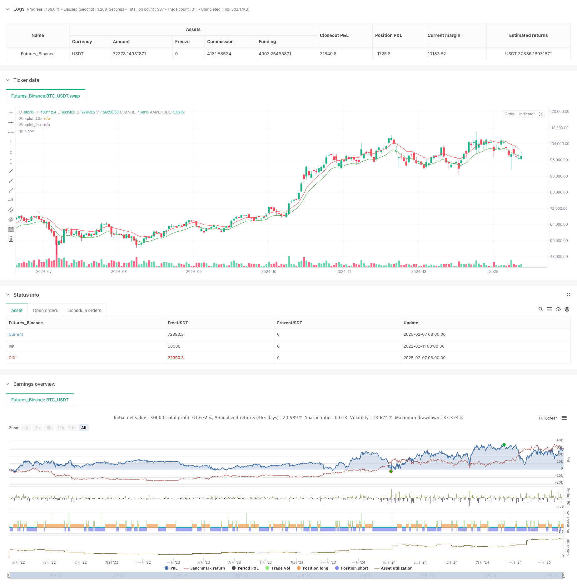

> Name

Adaptive-Mean-Channel-Breakout-Trading-Strategy-Dynamic-Volatility-Range-Trading-System-Based-on-EMA-and-ATR
> Author

ChaoZhang

> Strategy Description


[trans]
#### Overview
This strategy is an adaptive trading system based on moving averages and volatility. It constructs a dynamic trading channel by combining the exponential moving average (EMA) and the average true range (ATR), and trades when the price touches the upper and lower channels. The core idea of ​​the strategy is to capture the natural fluctuations of the market and perform well in sideways market conditions.
#### Strategy Principle
The strategy uses three key technical indicators:
1. Short-term EMA (default 10 periods): as the price center, used to build the baseline of the trading channel
2. Long-term EMA (default 30 periods): serves as a trend filter to help determine market status
3. ATR (default 14 periods): measures market volatility and is used to dynamically adjust channel width
The trading channel is calculated as follows:
- Upper track = EMA + ATR × multiplier (default 0.5)
- Lower rail = EMA - ATR × multiplier (default 0.5)
The system starts shorting when the price hits the upper track and starts going long when it hits the lower track. It is recommended to use a risk-return ratio of 2:1.
#### Strategic Advantages
1. Strong adaptability: dynamically adjust the channel width through ATR to adapt to different market environments
2. Controllable risk: clear entry points and stop-loss positions for easy risk management
3. Objective operation: a mechanical trading system based on technical indicators to avoid deviations caused by subjective judgments
4. Adjustable parameters: Multiple adjustable parameters allow traders to optimize according to different market characteristics
#### Strategy Risk
1. Trend market risk: Frequent false signals may occur under strong trend conditions
2. Parameter sensitivity: Different parameter combinations may lead to significantly different trading results.
3. Impact of slippage: Limit order execution may be affected by liquidity and slippage.
4. Changing costs: Frequent transactions may result in higher transaction costs
#### Strategy optimization direction
1. Trend adaptability optimization:
- Add trend strength indicators (such as ADX)
- Adjust channel parameters or pause trading during strong trends
2. Signal quality improvement:
- Confirm signals in combination with volume indicators
- Added volatility filter to avoid false breakouts
3. Risk management optimization:
- Realize dynamic position size management
- Adjust stop loss levels based on market fluctuations
4. Improvement of execution mechanism:
- Optimize order type selection
- Implement intelligent slippage management
#### Summary
This is a well-designed mean reversion trading system that captures market fluctuation opportunities through a combination of technical indicators. The advantage of the strategy lies in its adaptability and objectivity, but it is necessary to pay attention to the influence of the trend environment and parameter optimization when applying it. Through the suggested optimization direction, the stability and profitability of the strategy can be further improved. The strategy is suitable for use in market environments with severe fluctuations but no obvious trends. It is recommended to conduct sufficient backtesting and parameter optimization before real trading. ||
#### Overview
This strategy is an adaptive trading system based on moving averages and volatility, constructing dynamic trading channels by combining Exponential Moving Average (EMA) and Average True Range (ATR). The core idea is to capture natural market volatility, performing excellently in sideways markets.

#### Strategy Principle
The strategy utilizes three key technical indicators:
1. Short-term EMA (default 10 periods): Serves as price center, used as baseline for trading channel
2. Long-term EMA (default 30 periods): Acts as trend filter, helping determine market conditions
3. ATR (default 14 periods): Measures market volatility, used for dynamic channel width adjustment

Trading channel calculation method:
- Upper Band = EMA + ATR × Multiplier (default 0.5)
- Lower Band = EMA - ATR × Multiplier (default 0.5)

The system initiates short positions when price touches the upper band and long positions at the lower band, with a recommended risk-reward ratio of 2:1.

#### Strategy Advantages
1. Strong Adaptability: Dynamically adjusts channel width through ATR, adapting to different market environments
2. Controlled Risk: Clear entry points and stop-loss positions facilitate risk management
3. Objective Operation: Mechanical trading system based on technical indicators, avoiding subjective judgment bias
4. Adjustable Parameters: Multiple configurable parameters allow traders to optimize for different market characteristics

#### Strategy Risks
1. Trend Market Risk: May generate frequent false signals in strong trend markets
2. Parameter Sensitivity: Different parameter combinations may lead to significantly different trading results
3. Slippage Impact: Limit order execution may be affected by liquidity and slippage
4. Turnover Cost: Frequent trading may incur high transaction costs

#### Strategy Optimization Directions
1. Trend Adaptability Optimization:
- Add trend strength indicator (such as ADX)
- Adjust channel parameters or pause trading during strong trends

2. Signal Quality Enhancement:
- Incorporate volume indicators for signal confirmation
- Add volatility filters to avoid false breakouts

3. Risk Management Optimization:
- Implement dynamic position sizing
- Adjust stop-loss levels based on market volatility

4. Execution Mechanism Improvement:
- Optimize order type selection
- Implement intelligent slippage management

#### Summary
This is a well-designed mean reversion trading system that captures market volatility opportunities through technical indicator combinations. The strategy's strengths lie in its adaptability and objectivity, but attention must be paid to trend environment effects and parameter optimization during application. Through the suggested optimization directions, the strategy's stability and profitability can be further enhanced. The strategy is suitable for markets with high volatility but unclear trends, and it is recommended to conduct thorough backtesting and parameter optimization before live trading.[/trans]


> Source (PineScript)

``` pinescript
/*backtest
start: 2022-02-11 00:00:00
end: 2025-02-08 08:00:00
period: 1d
basePeriod: 1d
exchanges: [{"eid":"Futures_Binance","currency":"BTC_USDT"}]
*/

// This source code is subject to the terms of the Mozilla Public License 2.0 at https://mozilla.org/MPL/2.0/
// © rolguergf34585

//@version=5
strategy("Grupo ROG - Cash Bands", overlay=true)

PeriodoATR = input.int(defval=14,title="Período ATR")
PeriodoMedia = input.int(defval=10,title="Período Média Móvel")
PeriodoFiltro = input.int(defval=30,title="Período Média Filtro")
Mult = input.float(defval=0.5,title="Multiplicador",step=0.1)
Casas_Decimais = input.int(defval=5,title="Casas Decimais")

ema = ta.ema(close,PeriodoMedia)
filtro = ta.ema(close,PeriodoFiltro)
atr = ta.atr(PeriodoATR)

upper = math.round(ema+atr*Mult,Casas_Decimais) 
basis = ema
lower = math.round(ema-atr*Mult,Casas_Decimais) 

tendencia = lower>filtro?1:upper<filtro?-1:0

plot(upper,color=color.red)
plot(lower,color=color.green)
//plot(filtro,color=color.white)

barcolor(tendencia==1?color.green:tendencia==-1?color.red:color.white)

longCondition = true//tendencia==1 //and close < lower[1]
shortCondition = true//tendencia==-1 //and close > upper[1]

// if (strategy.position_size>0)
//     strategy.exit("Long", limit=upper[0])
// if (strategy.position_size<0)
//     strategy.exit("Short", limit=lower[0])

if (longCondition)
    strategy.entry("Long", strategy.long, limit=lower[0])
if (shortCondition)
    strategy.entry("Short", strategy.short, limit=upper[0])


```

> Detail

https://www.fmz.com/strategy/481357

> Last Modified

2025-02-10 14:50:45
