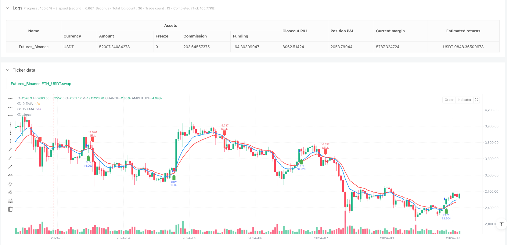
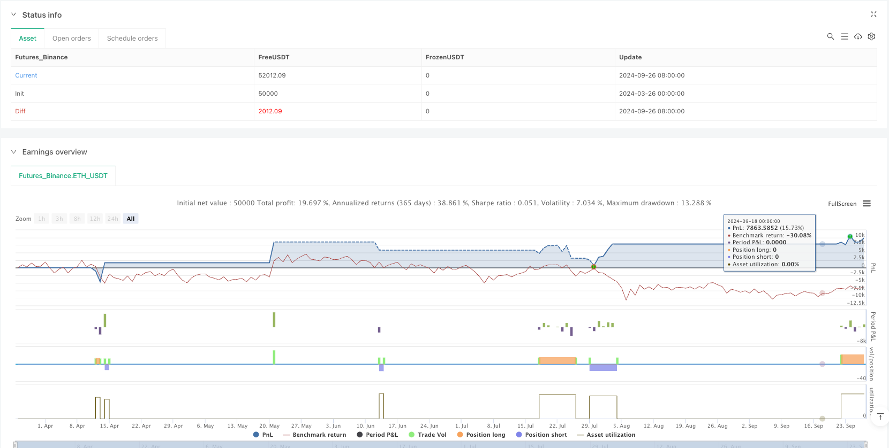

> Name

Dynamic-Dual-EMA-Trend-Capture-with-ATR-Risk-Management-Quantitative-Strategy
> Author

ianzeng123

> Strategy Description





[trans]

#### Overview
This quantitative trading strategy is a short-term trading system based on double EMA (exponential moving average) crossover signals and ATR (average true range) dynamic risk management. The core of the strategy uses the cross relationship between the fast 9-period EMA and the slow 15-period EMA to capture short-term market trend changes, and combines the price confirmation mechanism to filter false signals. At the same time, the stop loss position is dynamically set through the ATR indicator, and the take-profit target is automatically calculated with a fixed risk-reward ratio (default 1:1.5). This strategy is suitable for ultra-short period charts such as 1 minute and 3 minutes. It is specially designed for short-term traders and provides clear entry signals, risk management mechanisms and automated reminder functions.
#### Strategy Principle
The core principle of this strategy is based on the relationship between the fast moving average and the slow moving average to determine the short-term trend direction:
1. Long entry conditions:
   - When the 9-period EMA crosses the 15-period EMA upward (forming a golden cross)
   - Price closes above both EMAs (as a confirmation signal)
   - After meeting the above conditions, enter the market and go long when the next K-line opens.
   - Stop loss is set at 1x ATR distance below the entry point
   - The take-profit target is set to 1.5 times the stop-loss distance (adjustable)
2. Short entry conditions:
   - When the 9-period EMA crosses the 15-period EMA downward (forming a dead cross)
   - Price closes below both EMAs (as a confirmation signal)
   - After meeting the above conditions, enter the market and go short when the next K-line opens.
   - Stop loss is set at 1 times ATR distance above the entry point
   - The take-profit target is set to 1.5 times the stop-loss distance (adjustable)
The strategy implements complete trading logic in Pine script, including signal generation, dynamic stop loss calculation, risk reward settings and chart visualization functions. The system captures the EMA crossover signal through the built-in functions ta.crossover and ta.crossunder, and uses ta.atr to calculate the dynamic stop loss distance to ensure the adaptability of risk control under different fluctuation environments.
#### Strategic Advantages
1. The signal is clear and unambiguous: The double EMA crossover provides a visually intuitive signal of trend changes, coupled with the price confirmation mechanism, effectively reducing the interference of false signals.
2. Dynamic risk management: Use the ATR indicator to dynamically adjust the stop loss distance, so that the strategy can adapt to the fluctuation characteristics of different markets, narrow the stop loss in a low volatility environment, and widen the stop loss in a high volatility environment, which is more in line with the actual market conditions.
3. Fixed risk-return ratio: The strategy has a built-in risk-return setting of 1:1.5 (adjustable), ensuring that traders have clear risk-return expectations in each transaction, which contributes to long-term stable profitability.
4. Automated reminder function: Through the reminder function of TradingView, traders can receive entry signals in real time without having to keep an eye on the market, which improves operational efficiency.
5. Parameter adjustability: The strategy allows adjustment of the EMA period, risk-reward ratio and stop-loss multiplier, allowing traders to make personalized settings based on personal risk preferences and trading characteristics.
6. The strategy code is concise and efficient: the entire strategy logic is clear, the code structure is compact, easy to understand and modify, and is suitable for traders to further optimize and expand.
#### Strategy Risk
1. Shock market risk: In a sideways shock market, EMA will cross frequently, generating a large number of false signals, which may lead to continuous stop losses. Mitigation method: suspend the use of this strategy when the market is clearly in a range, or add filtering conditions such as trend strength indicators.
2. Impact of slippage and transaction costs: As a short-term strategy, frequent transactions will generate higher transaction costs, and you may face slippage problems in markets with poor liquidity. Mitigation method: Appropriately reduce the trading frequency and choose trading varieties with better liquidity.
3. Sudden market risk: When there is a sudden major news in the market, there may be a short jump or violent fluctuations, resulting in the stop loss being ineffective. Mitigation methods: Set a maximum loss limit and suspend trading before major news is released.
4. Parameter optimization overfitting: Over-adjusting parameters to fit historical data may cause the strategy to perform poorly in the future. Mitigation method: Use fixed parameters to conduct backtests for a sufficiently long period of time, and set aside out-of-sample data for verification.
5. Risk of technical failure: Automated trading systems that rely on platforms and network connections may face technical failures. Mitigation method: Set up backup trading plans and regularly check system stability.
#### Strategy optimization direction
1. Add trend filter: Combined with longer-period trend indicators, such as MACD or ADX, and only opening positions in the main trend direction, it can effectively reduce false signals in volatile markets. Such optimization can increase your win rate, since trading with trends on larger time frames is often more advantageous.
2. Integrate support and resistance levels: Add automatically identified support and resistance levels to the strategy, and increase the signal weight when going long near the support level or short near the resistance level, which can improve the quality of the entry point.
3. Optimize the take-profit strategy: Introduce dynamic take-profit mechanisms, such as trailing take-profit or multiple take-profit targets based on ATR, to obtain more profits in trending markets.
4. Add trading period filtering: According to the active period characteristics of different markets, add time filtering conditions to avoid market periods with less fluctuation or irregularity and improve signal quality.
5. Introducing trading volume confirmation: Using trading volume as an auxiliary confirmation indicator requires an increase in trading volume when a signal appears, which can improve the reliability of trend changes.
6. Risk management optimization: Automatically adjust position size based on historical volatility, reduce positions in high-volatility environments, and appropriately increase positions in low-volatility environments to achieve a smoother equity curve.
#### Summarize
The dynamic double EMA trend capture and ATR risk control quantitative strategy is a short-term trading system that combines technical indicator cross signals and dynamic risk management. Capture short-term trend changes through the cross relationship between 9-period and 15-period EMA, and use the ATR indicator to dynamically set stop loss levels to achieve quantitative control of risks. The main advantages of this strategy are clear signals, controllable risks, and adjustable parameters, making it suitable for short-term traders. However, in volatile markets, there may be an increase in false signals, which requires traders to apply them flexibly according to market conditions. By adding trend filters, analyzing support and resistance levels, optimizing the take-profit mechanism, and other improvements, there is room for further improvement in strategy performance. Overall, this is a quantitative trading strategy with a solid foundation and clear logic, which can be directly applied to real trading or used as a basic component of a more complex trading system.
|| 

#### Overview

This quantitative trading strategy is a scalping system based on dual EMA (Exponential Moving Average) crossover signals combined with ATR (Average True Range) dynamic risk management. The core of the strategy utilizes the crossover relationship between a fast 9-period EMA and a slow 15-period EMA to capture short-term market trend changes, incorporates a price confirmation mechanism to filter false signals, and dynamically sets stop-loss positions through the ATR indicator, automatically calculating take-profit targets with a fixed risk-reward ratio (default 1:1.5). This strategy is suitable for ultra-short-term charts such as 1-minute and 3-minute timeframes, specifically designed for scalpers, providing clear entry signals, risk management mechanisms, and automated alert functionality.

#### Strategy Principles

The core principle of this strategy is based on the relationship between fast and slow moving averages to determine short-term trend direction:

1. Long Entry Conditions:
   - When the 9-period EMA crosses above the 15-period EMA (golden cross formation)
   - Price closes above both EMAs (as confirmation signal)
   - Enter long at the opening of the next candle after conditions are met
   - Stop-loss is set at 1x ATR distance below the entry point
   - Take-profit target is set at 1.5 times the stop-loss distance (adjustable)

2. Short Entry Conditions:
   - When the 9-period EMA crosses below the 15-period EMA (death cross formation)
   - Price closes below both EMAs (as confirmation signal)
   - Enter short at the opening of the next candle after conditions are met
   - Stop-loss is set at 1x ATR distance above the entry point
   - Take-profit target is set at 1.5 times the stop-loss distance (adjustable)

The strategy implements complete trading logic in Pine Script, including signal generation, dynamic stop-loss calculation, risk-reward settings, and chart visualization features. The system captures EMA crossover signals using built-in functions ta.crossover and ta.crossunder, and calculates dynamic stop-loss distances using ta.atr, ensuring risk control adaptability in different volatility environments.

#### Strategy Advantages

1. Clear and Definitive Signals: The dual EMA crossover provides visually intuitive trend change signals, and with the price confirmation mechanism, effectively reduces interference from false signals.

2. Dynamic Risk Management: Using the ATR indicator to dynamically adjust stop-loss distances allows the strategy to adapt to different market volatility characteristics, narrowing stops in low volatility environments and widening them in high volatility environments, better reflecting actual market conditions.

3. Fixed Risk-Reward Ratio: The strategy incorporates a built-in 1:1.5 risk-reward setting (adjustable), ensuring traders have a clear risk-return expectation for each trade, contributing to long-term stable profitability.

4. Automated Alert Functionality: Through TradingView's alert feature, traders can receive entry signals in real-time without constant chart monitoring, improving operational efficiency.

5. Parameter Adjustability: The strategy allows adjustment of EMA periods, risk-reward ratio, and stop-loss multiplier, enabling traders to customize settings according to personal risk preferences and instrument characteristics.

6. Concise and Efficient Strategy Code: The entire strategy logic is clear, with compact code structure that is easy to understand and modify, suitable for traders to further optimize and expand.

#### Strategy Risks

1. Ranging Market Risk: In sideways consolidating markets, EMAs frequently cross, generating numerous false signals that may lead to consecutive stop-losses. Mitigation: Pause using the strategy when the market is clearly range-bound, or add filtering conditions such as trend strength indicators.

2. Slippage and Trading Cost Impact: As a scalping strategy, frequent trading generates higher transaction costs, and may face slippage issues in less liquid markets. Mitigation: Appropriately reduce trading frequency and select more liquid trading instruments.

3. Sudden Market Movement Risk: Major news events may cause gaps or violent fluctuations, rendering stop-losses ineffective. Mitigation: Set maximum loss limits and pause trading before major news releases.

4. Parameter Optimization Overfitting: Excessive parameter adjustment to fit historical data may lead to poor strategy performance in the future. Mitigation: Use fixed parameters for sufficiently long backtesting periods and reserve out-of-sample data for validation.

5. Technical Failure Risk: Automated trading systems relying on platform and network connections may face technical failures. Mitigation: Set up backup trading plans and regularly check system stability.

#### Strategy Optimization Directions

1. Add Trend Filters: Incorporating longer-term trend indicators, such as MACD or ADX, to only open positions in the direction of the main trend can effectively reduce false signals in ranging markets. This optimization can improve win rates, as trading in alignment with larger timeframe trends typically offers more advantages.

2. Integrate Support and Resistance Levels: Adding automatically identified support and resistance levels to increase signal weight when buying near support or selling near resistance can improve entry point quality.

3. Optimize Take-Profit Strategy: Introducing dynamic take-profit mechanisms, such as trailing stops or multiple ATR-based take-profit targets, can capture more profit in trending markets.

4. Add Trading Session Filters: Based on the characteristics of active sessions in different markets, adding time filtering conditions to avoid market periods with lower or irregular volatility can improve signal quality.

5. Incorporate Volume Confirmation: Using volume as an auxiliary confirmation indicator, requiring signals to be accompanied by increased volume, can enhance the reliability of trend changes.

6. Risk Management Optimization: Automatically adjusting position size based on historical volatility, reducing positions in high volatility environments and appropriately increasing them in low volatility environments, to achieve a smoother equity curve.

#### Summary

The Dynamic Dual EMA Trend Capture with ATR Risk Management Quantitative Strategy is a scalping trading system that combines technical indicator crossover signals with dynamic risk management. By capturing short-term trend changes through the crossover relationship between 9-period and 15-period EMAs, and utilizing the ATR indicator to dynamically set stop-loss levels, it achieves quantified risk control. The strategy's main advantages lie in its clear signals, controllable risk, and adjustable parameters, making it suitable for scalpers. However, it may face increased false signals in ranging markets, requiring traders to apply it flexibly according to market conditions. Through improvements in trend filtering, support and resistance analysis, take-profit mechanism optimization, and other directions, the strategy's performance can be further enhanced. Overall, this is a quantitative trading strategy with solid foundations and clear logic that can be directly applied to live trading or used as a basic component of more complex trading systems.

[/trans]


> Source (PineScript)

``` pinescript
/*backtest
start: 2024-03-26 00:00:00
end: 2024-09-27 00:00:00
period: 1d
basePeriod: 1d
exchanges: [{"eid":"Futures_Binance","currency":"ETH_USDT"}]
*/

//@version=5
strategy("9 & 15 EMA Scalping Strategy", overlay=true, default_qty_type=strategy.percent_of_equity, default_qty_value=100)

// Input Variables
fastEmaLength = input(9, title="Fast EMA Length")
slowEmaLength = input(15, title="Slow EMA Length")
riskRewardRatio = input.float(1.5, title="Risk-Reward Ratio") // 1:1.5 RR
slMultiplier = input.float(1.0, title="SL Multiplier") // Adjust SL distance

// EMA Calculation
fastEMA = ta.ema(close, fastEmaLength)
slowEMA = ta.ema(close, slowEmaLength)

// Conditions for Buy Entry
buyCondition = ta.crossover(fastEMA, slowEMA) and close > fastEMA and close > slowEMA

// Conditions for Sell Entry
sellCondition = ta.crossunder(fastEMA, slowEMA) and close < fastEMA and close < slowEMA

// Stop-Loss and Take-Profit Calculation
atrValue = ta.atr(14) // ATR for dynamic SL
longSL = close - (atrValue * slMultiplier)
longTP = close + ((close - longSL) * riskRewardRatio)

shortSL = close + (atrValue * slMultiplier)
shortTP = close - ((shortSL - close) * riskRewardRatio)

// Executing Trades
if buyCondition
    strategy.entry("BUY", strategy.long)
    strategy.exit("TP/SL Long", from_entry="BUY", stop=longSL, limit=longTP)

if sellCondition
    strategy.entry("SELL", strategy.short)
    strategy.exit("TP/SL Short", from_entry="SELL", stop=shortSL, limit=shortTP)

// Plot EMAs
plot(fastEMA, title="9 EMA", color=color.blue, linewidth=2)
plot(slowEMA, title="15 EMA", color=color.red, linewidth=2)

// Mark Buy/Sell Signals
plotshape(series=buyCondition, location=location.belowbar, color=color.green, style=shape.labelup, size=size.small, title="BUY Signal")
plotshape(series=sellCondition, location=location.abovebar, color=color.red, style=shape.labeldown, size=size.small, title="SELL Signal")

// Alerts
alertcondition(buyCondition, title="BUY Alert", message="BUY Signal - 9 EMA crossed above 15 EMA!")
alertcondition(sellCondition, title="SELL Alert", message="SELL Signal - 9 EMA crossed below 15 EMA!")

```

> Detail

https://www.fmz.com/strategy/488284

> Last Modified

2025-03-26 15:44:55
