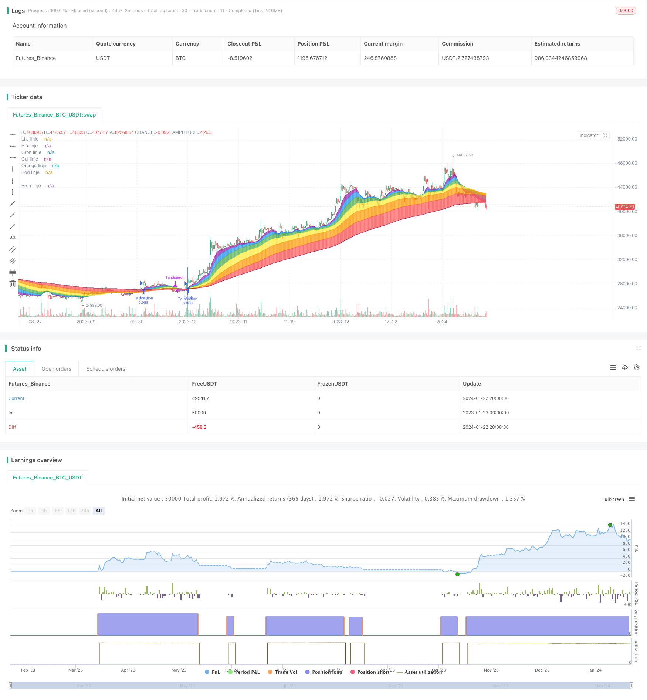

> Name

Bidirectional-EMA-Cross-Quant-Trading-Strategy
> Author

ChaoZhang

> Strategy Description


 [trans]

### Overview
This strategy uses the two-way EMA indicator to determine the main trend direction of the market, and combines it with the RSI indicator to select entry opportunities. It is a trend-following algorithmic trading strategy.
### Strategy Principles
1. Calculate multiple sets of EMA moving averages with different periods, and identify the main market trend directions in the three dimensions of short-term, mid-term and long-term.
2. When the short-term EMA crosses the medium- and long-term EMA, it is determined that a bullish trend has formed.
3. When the short-term EMA crosses the medium- and long-term EMA, it is determined that a bearish trend has formed.
4. Use the RSI indicator to find suitable entry opportunities. The RSI indicator can be used to determine overbought and oversold areas.
5. In a bullish trend, take a long position when the RSI indicator is low; in a bearish trend, step in to take a short position when the RSI indicator is high.
The above strategy mainly uses the double EMA indicator to determine the main trend direction, and uses the RSI indicator as the choice of entry signal. It is a typical trend following algorithmic trading strategy.
### Analysis of strategic advantages
The biggest advantage of this strategy is that it can clearly judge the main trend direction of the market and choose a better entry time based on the RSI indicator. The specific advantages are as follows:
1. Use multiple sets of EMA moving average sets to identify the main market trend direction in multiple time dimensions.
2. The EMA indicator is simple to calculate, the noise is small, and the main market trend can be determined accurately and reliably.
3. The RSI indicator can effectively determine entry and stop loss points, and can greatly optimize the strategy’s profit drawdown ratio.
4. The algorithm has a clear structure, is easy to understand and modify, and is a typical trend following strategy.
5. Other technical indicators can be flexibly combined to further improve the strategy effect.
### Strategy Risk Analysis
This strategy also has certain risks, mainly reflected in the following aspects:
1. When the trend reverses, the stop loss point may be too ideal and increase losses.
2. Unable to effectively judge the trend reversal point, and may miss the opportunity to stop loss and exit in time.
3. EMA parameters and RSI parameters need to be repeatedly tested and optimized, otherwise it may lead to instability
4. There is no guarantee that every entry will be at a perfect time, and unnecessary repeated operations may occur.
5. Large gaps caused by emergencies are difficult to effectively avoid
In view of the above risks, optimization can be carried out from the following perspectives:
1. Set a reasonable stop loss point to prevent excessive single loss
2. Add other indicators to judge trend reversal and ensure timely stop loss
3. Optimize the parameter combination to make it suitable for a wider range of market conditions
4. Modify the entry and stop loss logic to reduce the number of repeated operations
5. Increase the judgment of abnormal situations and avoid the adverse effects of market jumps
### Strategy optimization direction
From the advantages and risks of this strategy out, we can get the following optimization directions:
1. Based on the existing double EMA framework, other indicators such as MACD and BOLL are introduced, which can be used to determine the trend reversal point, thereby optimizing the stop-profit and stop-loss strategy.
2. Introduce a machine learning model to predict the probability of trend reversal and further improve the strategy effect.
3. Apply advanced filters to automatically identify abnormal market conditions and effectively prevent losses.
4. Use genetic algorithms, deep reinforcement learning and other methods to automatically optimize parameters to adapt the strategy to more market types
5. Add an automatic stop loss module, which can dynamically adjust the stop loss point according to the actual situation
By introducing more indicators, prediction models, parameter optimization, risk control modules and other means, this strategy can be further improved, making it adaptable to more complex and changeable market conditions.
### Summarize
This article introduces in detail the main contents of the two-way EMA cross quantitative trading strategy. First, the main ideas and operating principles of the strategy are outlined. Then, the advantages of the strategy are fully analyzed. At the same time, the main risk points that may exist in the strategy are also analyzed. On this basis, several key optimization directions are given. In general, this strategy has the advantage of judging the main market trends, and there is also some room for optimization. It is a typical quantitative trading strategy. Through continuous improvement and optimization, this strategy can become one of the important choices for investors in algorithmic trading.
||

### Overview

This strategy uses bidirectional EMA indicators to determine the main trend direction of the market, and combines the RSI indicator as the timing of entry selection, which belongs to the trend following algorithm trading strategy.

### Strategy Principle  

1. Calculate multiple groups of EMA with different cycles to identify the main trend direction of the market in three dimensions: short-term, medium-term and long-term
2. When the short-term EMA crosses above the medium-long term EMA, it is determined that a bullish trend has formed
3. When the short-term EMA crosses below the medium-long term EMA, it is determined that a bearish trend has formed  
4. Combine the RSI indicator to find suitable entry timing. The RSI indicator can be used to determine overbought and oversold zones
5. In an uptrend, go long when the RSI indicator is at low levels; In a downtrend, go short when the RSI indicator is at high levels

The above strategy mainly applies the bidirectional EMA indicator to determine the main trend direction, and uses the RSI indicator as the entry signal selection, which belongs to a typical trend following algorithm trading strategy.  

### Advantage Analysis  

The biggest advantage of this strategy is that it can clearly determine the main trend direction of the market, and select a better entry timing based on the RSI indicator. Specific advantages are as follows:  

1. Use multiple sets of EMA to identify the main trend direction of the market under multiple time dimensions  
2. The EMA indicator calculation is simple with less noise, and it determines the main trend of the market accurately and reliably
3. The RSI indicator can effectively determine entry and stop loss points to significantly optimize return retio  
4. The algorithm structure is clear and easy to understand and modify. It is a typical trend following strategy
5. It can be flexibly combined with other technical indicators to further improve strategy performance  

### Risk Analysis

The strategy also has some risks, mainly in the following aspects:

1. When the trend reverses, the stop loss point may be too idealized, thus increasing losses  
2. Unable to effectively determine the trend reversal point, possibly missing the opportunity to stop loss in time
3. EMA parameters and RSI parameters need repeated testing and optimization, otherwise it may cause instability
4. Cannot guarantee that every entry is the perfect timing, there may be unnecessary multiple repetitions
5. It is difficult to effectively avoid major gaps under the influence of sudden events  

To address the above risks, optimizations can be made in the following areas:  
1. Reasonably set stop loss points to prevent excessive losses  
2. Increase other indicators to determine trend reversal to ensure timely stop loss  
3. Optimize parameter combinations to adapt to wider market conditions  
4. Modify entry and stop loss logic to reduce the number of repetitions  
5. Increase exceptions judgment to avoid adverse effects of market gaps  

### Optimization Directions  

From the advantages and risks of this strategy, we can get the following optimizable directions:  

1. On the existing bidirectional EMA framework, introduce indicators like MACD and BOLL for judging trend reversal points, thereby optimizing take profit and stop loss strategies  
2. Introduce machine learning models to predict trend reversal probability and further improve strategy performance  
3. Apply advanced filters to automatically identify abnormal market conditions and effectively prevent losses  
4. Use genetic algorithms, deep reinforcement learning and other methods to automatically optimize parameters so that strategies can adapt to more market types  
5. Add automatic stop loss module, can dynamically adjust stop loss points according to actual situation  

Through introducing more indicators, prediction models, parameter optimization, risk control modules and other means, this strategy can be further improved to adapt to more complex and volatile market conditions.  

### Conclusion  

This article detailed introduced the main content of the bidirectional EMA cross quantitative trading strategy. First, it outlined the main ideas and operating principles of the strategy. Then the advantages of the strategy were fully analyzed. At the same time, it also analyzed the main potential risks in the strategy. On this basis, several key optimizable directions were proposed. In summary, this strategy has the advantage of determining the main trend of the market, and also has some room for optimization, which is a typical quantitative trading strategy. Through continuous improvement and optimization, this strategy can become an important choice for investors' algorithmic trading.

[/trans]

> Strategy Arguments


|Argument|Default|Description|
|----|----|----|
|v_input_1|21|Lila linje|
|v_input_2|true|Visa lila linje|
|v_input_3|34|Blå linje|
|v_input_4|true|Visa blå linje|
|v_input_5|55|Grön linje|
|v_input_6|true|Visa grön linje|
|v_input_7|89|Gul linje|
|v_input_8|true|Visa gul linje|
|v_input_9|141|Orange linje|
|v_input_10|true|Visa orange linje|
|v_input_11|230|Röd linje|
|v_input_12|true|Visa röd linje|
|v_input_13|371|Röd linje|
|v_input_14|true|Visa röd linje|
|v_input_15|true|Första stapeln|
|v_input_16_close|0|Source: close|high|low|open|hl2|hlc3|hlcc4|ohlc4|


> Source (PineScript)

``` pinescript
/*backtest
start: 2023-01-23 00:00:00
end: 2024-01-23 00:00:00
period: 4h
basePeriod: 15m
exchanges: [{"eid":"Futures_Binance","currency":"BTC_USDT"}]
*/

// This source code is subject to the terms of the Mozilla Public License 2.0 at https://mozilla.org/MPL/2.0/
// © Investoz
// Indikatorn är byggd som ett utbildningsyfte och är därför ingen rekommendation för köp/sälj av aktier. Tanken är att skapa en visuell form i en graf
// som visar om det finns någon trend såväl positiv som negativ. En dialogruta med en varning talar om vilken trend som råder. I koden finns en möjlighet
// att ta position eller gå ur position om man vill skapa en startegi kring denna trendindikator. Rekommenderar dock starkt att inte enbart förlita sig på denna
// indikator som beslut för köp/sälj då resultaten blir negativa om man köper på psoitiv trend och säljer på negativ trend. Det måste kombineras med andra idéer
// och därför fungerar denna skript mer som ett komplement till sin egen strategi.
// Det är fritt fram för vem som helst att använda sig av denna indikator.  
//@version=4
//Skapar en strategiskript med 5 % av eget kapital som ett exempel. Detta går att ändra i skriptets inställningar, välj egenskaper och sedan ändra orderstorlek
//till ett annat värde av % på eget kapital.
strategy("© Investoz trendvarningar", overlay=true, default_qty_type=strategy.percent_of_equity, default_qty_value=5)
//Lägger till inmatningar till skriptindikatorn. Användaren kan se och redigera inmatningar i objektdialogen efter eget val.
ema1 = input(21, minval=1, maxval=500, title="Lila linje")
valema1=input(true, title="Visa lila linje")
ema2 = input(34, minval=1, maxval=500, title="Blå linje")
valema2=input(true, title="Visa blå linje")
ema3 = input(55, minval=1, maxval=500, title="Grön linje")
valema3=input(true, title="Visa grön linje")
ema4 = input(89, minval=1, maxval=500, title="Gul linje")
valema4=input(true, title="Visa gul linje")
ema5 = input(141, minval=1, maxval=500, title="Orange linje")
valema5=input(true, title="Visa orange linje")
ema6 = input(230, minval=1, maxval=500, title="Röd linje")
valema6=input(true, title="Visa röd linje")
ema7 = input(371, minval=1, maxval=500, title="Röd linje")
valema7=input(true, title="Visa röd linje")
//Inmatningar för antal staplar
startbar = input(1, minval=1, maxval=1, title="Första stapeln")
Endbar = bar_index
//Källa input, stängning. Användaren kan själv byta till vilken källa som önskas.
src = input(close, title="Source")
//Antal staplar sedan den längsta ema började och framåt. 
tid=Endbar + startbar - 371
//EMA loop
aema1 = ema(src, ema1)
bema2 = ema(src, ema2)
cema3 = ema(src, ema3)
dema4 = ema(src, ema4)
eema5 = ema(src, ema5)
fema6 = ema(src, ema6)
gema7 = ema(src, ema7)
//Skriver ut linjer i diagrammet om förhållandet är sant, annars falskt.
h=plot(valema1 ? aema1 : na, title="Lila linje", style=plot.style_line, linewidth=1, color=color.purple)
i=plot(valema2 ? bema2 : na, title="Blå linje", style=plot.style_line, linewidth=1, color=color.blue)
j=plot(valema3 ? cema3 : na, title="Grön linje", style=plot.style_line, linewidth=1, color=color.green)
k=plot(valema4 ? dema4 : na, title="Gul linje", style=plot.style_line, linewidth=1, color=color.yellow)
l=plot(valema5 ? eema5 : na, title="Orange linje", style=plot.style_line, linewidth=1, color=color.orange)
m=plot(valema6 ? fema6 : na, title="Röd linje", style=plot.style_line, linewidth=1, color=color.red)
n=plot(valema7 ? gema7 : na, title="Brun linje", style=plot.style_line, linewidth=1, color=color.maroon)
//Fyller bakgrunden mellan två linjer med en viss färg.
fill(h, i, color = color.purple,transp=34)
fill(i, j, color = color.blue,transp=34)
fill(j, k, color = color.green,transp=34)
fill(k, l, color = color.yellow,transp=34)
fill(l, m, color = color.orange,transp=34)
fill(m, n, color = color.red,transp=34)
//Skapa en algoritm för positiv trend
PositivTrend = crossover(aema1,gema7)?1:0
TrendPositiv = ema(close,1) > aema1 and aema1 > bema2?1:0
//Skapa en algoritm för negativ trend
NegativTrend = crossunder(aema1,gema7)?1:0
TrendNegativ = ema(close,1) < aema1 and aema1 < bema2?1:0
//Skapar en textruta med varningstext för positiv trend
varningtextpositiv = "Varning för positiv trend."+"\n" + "Leta efter att ta position!"
// if PositivTrend
//     varningpositiv=label.new(
//      bar_index, 
//      low,  
//      xloc=xloc.bar_index, 
//      yloc=yloc.price,
//      color=color.black, 
//      textcolor=color.green,
//      text=varningtextpositiv,
//      style=label.style_label_down,
//      textalign=text.align_left)
//Skapar en textruta med varningstext för negativ trend
varningtextnegativ = "Varning för negativ trend."+"\n" + "Leta efter utgången!"
// if NegativTrend
//     varningnegativ=label.new(
//      bar_index, 
//      low,  
//      xloc=xloc.bar_index, 
//      yloc=yloc.price,
//      color=color.black, 
//      textcolor=color.red,
//      text=varningtextnegativ,
//      style=label.style_label_up,
//      textalign=text.align_left)
//Köp om positiv trend
if (PositivTrend) 
    strategy.entry("Ta position", strategy.long, when = PositivTrend)
//Sälj om negativ trend
if (NegativTrend)
    strategy.close("Ta position", when = NegativTrend, comment="Gå ur position")
//Beräkning av positiv trend
vspositiv(positiv)=>valuewhen(Endbar==startbar,positiv,0)
vepositiv(positiv)=>valuewhen(Endbar==Endbar,positiv,0)
positivmean(TrendPositiv)=>
    csumpositiv = cum(TrendPositiv)
//Slut//   
    a = vepositiv(csumpositiv)
//Start//
    b = vspositiv(csumpositiv)
//Slut - Start// 
    (a - b)/(tid)
positivmeanpositiv = positivmean(TrendPositiv) 
//Beräkning av negativ trend
vsnegativ(negativ)=>valuewhen(Endbar==startbar,negativ,0)
venegativ(negativ)=>valuewhen(Endbar==Endbar,negativ,0)
negativmean(TrendNegativ)=>
    csumnegativ = cum(TrendNegativ)
//Slut//   
    a = venegativ(csumnegativ)
//Start//
    b = vsnegativ(csumnegativ)
//Slut - Start// 
    (a - b)/(tid)
negativmeannegativ = negativmean(TrendNegativ) 
//Inmatning av text som ska in i texruta som visar antal staplar i trend
logga = "© Investoz: Trend i tid"+ "\n"
streck = "--------------------------------------------------------"
totalastaplar = "\n" + "Dagar totalt: " + tostring(tid)+ " dagar "+"\n"+ streck + "\n"
totalpositiv = "Dagar totalt i positiv trend "+" ? : "  +tostring(positivmeanpositiv*tid, "##.##") +" dagar " + "\n"
totalnegativ = "\n" + "Dagar totalt i negativ trend" + " ? : "  +tostring(negativmeannegativ*tid, "##.##") +" dagar " 
//Textruta för antal staplar i trend
// if barstate.ishistory
//     barcountlbl=label.new(
//      bar_index, 
//      low,  
//      xloc=xloc.bar_index, 
//      yloc=yloc.price,
//      color=color.black, 
//      textcolor=color.yellow,
//      text=logga+streck+totalastaplar+totalpositiv+streck+totalnegativ,
//      style=label.style_label_lower_left,
//      textalign=text.align_left)
//     label.delete(barcountlbl[1])
////////////////////////////////// 
```

> Detail

https://www.fmz.com/strategy/439899

> Last Modified

2024-01-24 17:31:41
