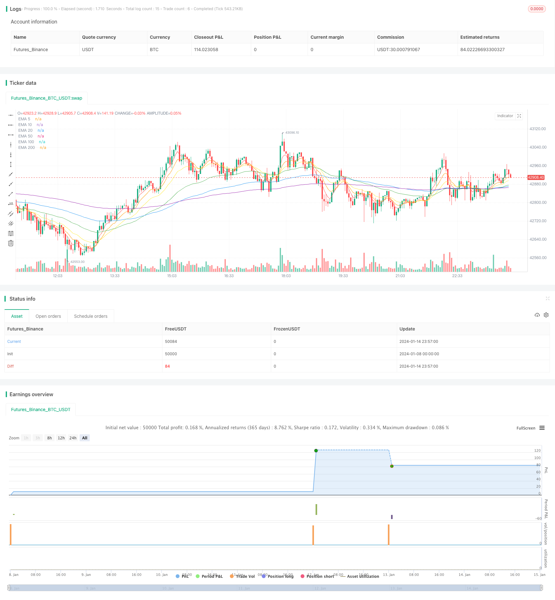

> Name

Daily-DCA-Strategy-with-Touching-EMAs Daily-DCA-Strategy-with-Touching-EMAs
> Author

ChaoZhang

> Strategy Description


 [trans]
## Overview
This Pine Script strategy implements a daily average cost strategy on the TradingView platform and combines the touch signal of the EMA indicator to determine entry points. The strategy follows the average cost investment rule and purchases with a fixed amount every day to diversify risks. At the same time, the EMA's touch signal is used to guide the specific entry timing.
## Strategy Principle
This strategy mainly has the following characteristics:
1. Daily average cost investment rule
   * Buy with a fixed amount every day, regardless of market ups and downs
   * Long-term diversification of investments to reduce the risk of a single investment
2. EMA indicator determines entry point
   * When the closing price crosses the 5-day, 10-day, 20-day EMA, etc., buying is triggered
   * EMA line serves as support and can better avoid short-term adjustments.
3. Dynamic stop loss mechanism
   * When the closing price falls below the 20-day simple moving average, stop loss and clear positions
   * Avoid further expansion of losses
4. Maximum position limit
   * A maximum of 300 transactions are allowed to control position size and risk
   * Prevent insufficient funds caused by over-investment
Specifically, the strategy invests a fixed amount every day and calculates the number of stocks that can be purchased based on that day's closing price. On this basis, if the closing price of the day crosses any of the 5-day, 10-day, 20-day EMA, etc., a buy signal will be triggered. Once the accumulated positions reach the maximum limit of 300, there will be no new buying operations. In addition, if the closing price falls below the 20-day SMA, or reaches the exit date set in advance, the position will be cleared and the loss stopped. This strategy also draws EMA lines of different periods on the price chart to facilitate visual analysis.
## Advantage Analysis
This strategy has several advantages:
1. Diversify investments and reduce single investment risks
   * Invest small, fixed amounts every day, regardless of rise or fall
   * There will be no problem of reunrung chasing highs
2. Combine EMA to avoid short-term adjustments
   * EMA crosses above as a buy signal, avoid buying during retracement
   * Continue to buy in batches during the retracement period to spread risks
3. Dynamic stop loss, control losses
   * Set a stop loss line to stop the loss in time
   * Prevent large losses
4. Maximum position limit to control risks
   * The maximum position can be preset to prevent over-investment
   * Invest within the ETP’s affordability
5. Intuitive EMA display, easy to determine
   * Draw lines with different EMA periods on the price chart
   * Clear at a glance, easy for operator monitoring
6. Highly customizable
   * You can customize the investment amount, EMA period, stop loss line, etc.
   *Adjust based on personal risk appetite
## Risk Analysis
There are also some risks to be aware of with this strategy:
1. Systemic risks are difficult to avoid
   * In the event of a black swan event, you may face larger losses
   * Diversification of investments can reduce risks, but cannot be completely avoided
2. Risks arising from fixed investment amounts
   * Invest a fixed amount every day, you may regret it when the price rises sharply
   * Optimization that dynamically adjusts the investment amount can be used
3. EMA cannot react to extreme market conditions
   * EMA is slow to respond to emergencies and cannot stop losses in time
   * You can consider combining it with KD, BOLL and other indicators to identify extreme market conditions
4. Position limits also limit profit margins
   * The position has an upper limit and cannot be increased indefinitely.
   * Need to consider comprehensively and find a balance between risk and return
5. Setting stop loss points requires experience and skills
   * If the stop loss point is too close, it will be easily broken; if it is too far, the loss will not be stopped in time.
   * Need to achieve balance through repeated testing
## Optimization direction
This strategy also has room for further optimization:
1. Increase the dynamic adjustment of daily investment amount
   * Daily investment can be dynamically adjusted based on specific indicators
   * Increase investment when the market is bullish and reduce investment when the market is bearish.
2. Combine more indicators to determine entry
   * In addition to EMA, KD, BOLL and other indicators can also be introduced for judgment.
   * Improve the ability to judge extreme market conditions
3. Use exponential moving average
   * EMA is slow to respond to emergencies, you can consider using DEMA, TEMA, etc.
   * Capture new trend directions faster
4. Dynamically adjust the maximum position
   * The maximum position can be dynamically adjusted according to the profit of the strategy
   * Appropriately increase the position when the valuation is reasonable
5. Use progressive stops
   * The existing strategy is direct liquidation and stop loss, and gradual liquidation can be used
   * Prevent the risk of "buying the dip" at the stop loss point
## Summarize
In general, this daily average cost strategy combines the EMA touch signal to realize the idea of ​​long-term batch investment. Compared with opening a large position at a time, it can spread risks and avoid carnival at high points. The addition of EMA also avoids the risks caused by short-term adjustments to a certain extent, and takes stop-loss measures to control the maximum loss. At the same time, we still need to pay attention to black swan risks and the regrets caused by failing to fully seize opportunities with a fixed investment amount. These provide directions for further optimization of the strategy. Through parameter adjustment and indicator combination, an efficient and stable quantitative trading strategy can be gradually optimized and realized.
||

## Overview

This Pine script strategy implements a daily dollar-cost averaging approach on the TradingView platform, incorporating EMA touch signals to determine entry points. It follows the dollar-cost averaging methodology to make fixed-amount investments every day, spreading purchases over time to mitigate risk. The EMA crossovers then serve as the specific trigger for entries.  

## Strategy Logic

The strategy has the following key features:

1. Daily Dollar-Cost Averaging 
   * Fixed daily investment regardless of market ups and downs
   * Long-term batch investments to reduce single-trade risk

2. EMAs for Entry Signals
   * Buy signal triggered when closing price crosses above EMA 5, 10, 20 etc. 
   * EMA lines serve as support to avoid short-term pullbacks

3. Dynamic Stop Loss
   * Sell all positions if closing price falls below 20-day SMA
   * Avoid further losses  

4. Trade Count Limit 
   * Caps max trades at 300 to control position sizing  
   * Prevents over-investment beyond asset capacity  

Specifically, every day the strategy invests a fixed amount and calculates the shares to buy based on the closing price. If the closing price crosses above any of the 5-, 10-, 20-day EMA etc., a buy signal is triggered. Once the accumulated trade count hits the 300 limit, no further buys will occur. Additionally, if the price closes below the 20-day SMA or reaches the preset exit date, all positions are cleared. The script also plots the EMAs on the price chart for visual analysis.  

## Advantage Analysis

The advantages of this strategy include:

1. Risk Diversification  
   * Small fixed-amount daily investments regardless of market trends 
   * Avoids chasing highs  

2. EMA Combination Avoids Pullbacks
   * EMA crossovers prevent buying into pullback periods
   * Continued buying during pullbacks diversifies risk

3. Dynamic Stop Loss Controls Losses
   * Stop loss allows timely exits
   * Prevents heavy losses  

4. Trade Limit Controls Risks
   * Max position size is preset to prevent over-investment
   * Keeps investment within asset capacity  

5. Intuitive EMA Visualization  
   * EMAs plotted on price chart  
   * Allows easy monitoring by operator  

6. Highly Customizable
   * Custom inputs for investment amount, EMA periods, stops etc.
   * Adjusts based on personal risk preferences

## Risk Analysis  

The strategy also carries some risks to note:

1. Systemic Risks Still Exist
   * Black swan events can lead to heavy losses
   * Diversification only reduces but don't eliminate risks

2. Fixed Investment Amount 
   * Fixed daily investments could miss out on upside if prices surge
   * Dynamic amount adjustment could help

3. EMAs Cannot React to Extreme Moves
   * EMAs have slower reaction to sudden events and fails to stop loss in time
   * Combining with KD, BOLL may help identify extremes  

4. Trade Limit Caps Profit Potential
   * Upper limit on trades caps possible gains
   * Need to balance risks and rewards  

5. Stop Loss Placement Requires Care
   * Stops too close tend to get taken out prematurely while stops too loose fails to protect in time
   * Extensive testing needed to find the right balance

## Future Enhancements  

Further optimizations:  

1. Dynamic Daily Investment Amount
   * Base daily investments on indicators
   * Increase when bullish, decrease when bearish

2. Additional Entry Signals  
   * Complement EMA with other indicators like KD, BOLL  
   * Improve identification of extreme moves
   
3. Exponential Moving Averages
   * EMAs react slowly to sudden events, DEMA, TEMA may help
   * Faster capture of new trends  

4. Dynamic Position Limit
   * Increase limit based on strategy profitability  
   * Allows higher exposure at fair valuations   

5. Trailing Stop Loss
   * Current strategy market sells all, trailing stops could help avoid gaps down
   * Reduce risk of stops being "run"

## Conclusion

In summary, this EMA-combined daily DCA strategy realizes the concept of long-term periodic investments, spreading risks across multiple small entries compared to large one-time purchases. The EMAs help avoid short-term pullback risks to a certain extent, while the stop loss controls max loss. Still, black swan risks and the limitations of fixed investment size need to be kept in mind. These aspects provide future enhancement directions through parameter tuning and indicator combinations for building efficient yet stable quant strategies.

[/trans]

> Strategy Arguments


|Argument|Default|Description|
|----|----|----|
|v_input_1|50000|Daily Investment|
|v_input_2|2022|Start Year|
|v_input_3|true|Start Month|
|v_input_4|true|Start Day|
|v_input_5|2023|End Year|
|v_input_6|12|End Month|
|v_input_7|true|End Day|
|v_input_8|10000|Pyramiding Limit|
|v_input_9|true|Enable Sell|


> Source (PineScript)

``` pinescript
/*backtest
start: 2024-01-08 00:00:00
end: 2024-01-15 00:00:00
period: 3m
basePeriod: 1m
exchanges: [{"eid":"Futures_Binance","currency":"BTC_USDT"}]
*/

//@version=4
strategy("Daily DCA Strategy with Touching EMAs", overlay=true, pyramiding=10000)

// Customizable Parameters
daily_investment = input(50000, title="Daily Investment")
start_year = input(2022, title="Start Year")
start_month = input(1, title="Start Month")
start_day = input(1, title="Start Day")
end_year = input(2023, title="End Year")
end_month = input(12, title="End Month")
end_day = input(1, title="End Day")
trade_count_limit = input(10000, title="Pyramiding Limit")
enable_sell = input(true, title="Enable Sell")

start_date = timestamp(start_year, start_month, start_day)
var int trade_count = 0

// Calculate the number of shares to buy based on the current closing price
shares_to_buy = daily_investment / close

// Check if a new day has started and after the start date
isNewDay = dayofmonth != dayofmonth[1] and time >= start_date

// Buy conditions based on EMA crossovers
ema5_cross_above = crossover(close, ema(close, 5))
ema10_cross_above = crossover(close, ema(close, 10))
ema20_cross_above = crossover(close, ema(close, 20))
ema50_cross_above = crossover(close, ema(close, 50))
ema100_cross_above = crossover(close, ema(close, 100))
ema200_cross_above = crossover(close, ema(close, 200))

if isNewDay and (ema5_cross_above or ema10_cross_above or ema20_cross_above or ema50_cross_above or ema100_cross_above or ema200_cross_above) and trade_count < trade_count_limit
    strategy.entry("Buy", strategy.long, qty=shares_to_buy)
    trade_count := trade_count + 1

// Dynamic sell conditions (optional)
sell_condition =  true

if enable_sell and sell_condition
    strategy.close_all()

// EMA Ribbon for visualization
plot(ema(close, 5), color=color.red, title="EMA 5")
plot(ema(close, 10), color=color.orange, title="EMA 10")
plot(ema(close, 20), color=color.yellow, title="EMA 20")
plot(ema(close, 50), color=color.green, title="EMA 50")
plot(ema(close, 100), color=color.blue, title="EMA 100")
plot(ema(close, 200), color=color.purple, title="EMA 200")

```

> Detail

https://www.fmz.com/strategy/438947

> Last Modified

2024-01-16 15:30:17
