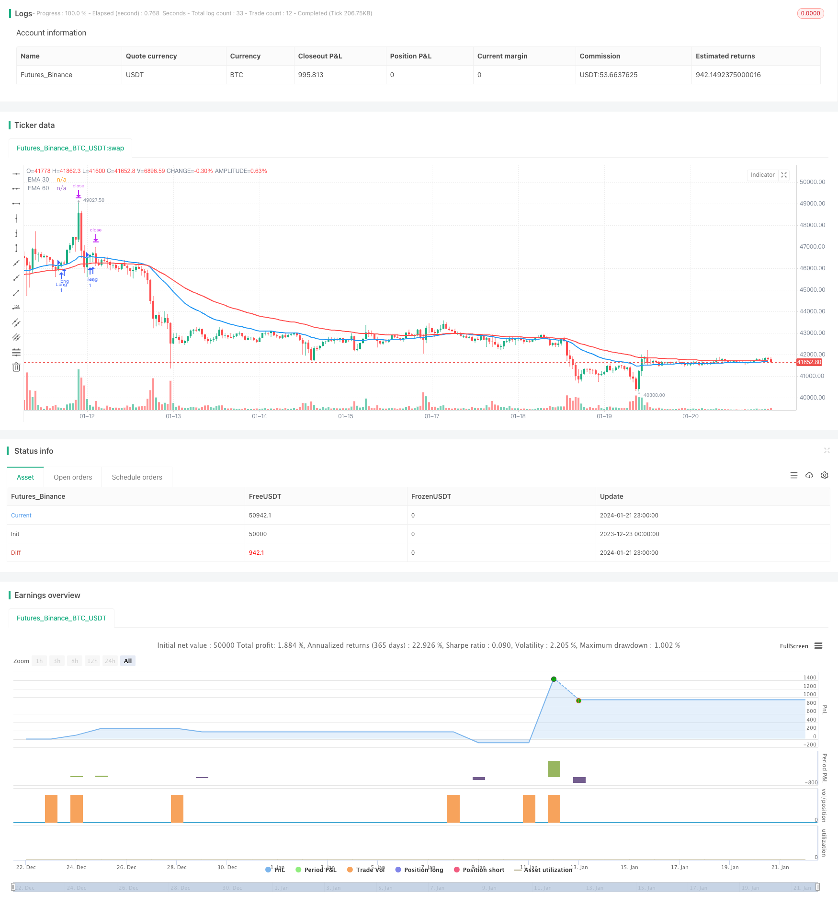

> Name

Dual-EMA-Cross-Trend-Trading-Strategy based on EMA indicator
> Author

ChaoZhang

> Strategy Description


 [trans]
## Overview
This strategy is a strategy that determines the trend based on the cross of the two lines of EMA. It uses two EMA moving averages with different lengths. During the consolidation period, it determines that it is in an upward trend by judging the position of the EMA moving average. During the breakthrough period, it sends a buy signal by judging the intersection of the price and the EMA moving average. This strategy also sets take-profit and stop-loss points to lock in profits and control risks.
## Strategy Principle
This strategy uses two EMAs of 30 and 60 periods. The EMA is a smoothed moving average that gives more weight to recent prices so that the EMA can respond to price changes more quickly.
When the short-period EMA crosses the long-period EMA, a buy signal is generated, which indicates that the current uptrend is in progress. When the price breaks through the short-period EMA moving average from bottom to top, with the support of the long-term trend, the price will continue to move upward, then buy.
This strategy also sets take-profit and stop-loss points. The take-profit point is set to the highest point among the highest prices of the past 10 K lines to lock in the maximum profit. The stop loss point is set to the long-term EMA to control risks.
## Advantage Analysis
The main advantages of this strategy are:
1. Using EMA to judge the trend has high reliability and makes it easy to seize trend opportunities.
2. The double-line cross signal has high sensitivity
3. Set take-profit and stop-loss points to lock in profits and control risks.
## Risk Analysis
The main risks of this strategy are:
1. When the trend reverses, the EMA moving average does not respond in time, which may lead to losses.
2. Double lines crossing can easily send out wrong signals
3. Improper setting of take-profit and stop-loss points may lead to premature take-profit and stop-loss
Corresponding solutions:
1. Optimize EMA moving average parameters to respond to trend reversal faster
2. Add filter conditions to avoid false signals
3. Test to determine the best take profit and stop loss parameters
## Optimization direction
The main optimization directions of this strategy include:
1. Optimize EMA moving average parameters and find the best parameter combination
2. Add other indicators as auxiliary judgments, such as MACD, KDJ, etc.
3. Increase quantity and energy indicators to avoid false breakthroughs due to insufficient quantity and energy.
4. Use machine learning methods to dynamically optimize take-profit and stop-loss points
5. Test the robustness of parameters of different varieties and find the best suitable varieties
## Summarize
This strategy as a whole is a relatively typical strategy that determines the trend direction based on the EMA moving average and sends signals when the two lines cross. It uses EMA moving averages to determine the general trend and double-line crossovers to improve signal accuracy. However, the lag in response of the EMA moving average to trend reversal and the possibility of false signals from the double-line crossover are the main risks of this strategy. Through parameter optimization and assisted system expansion, the stability and scalability of the strategy can be improved. Overall, this strategy has certain practicality.
||

## Overview

This strategy is a trend trading strategy based on the dual EMA cross using EMA indicators with different lengths. It determines the current trend in consolidation by judging the position relationship of the EMA lines. And it generates buy signals by judging the cross situation between price and EMA lines during breakouts. It also sets take profit and stop loss points to lock in profits and control risks.

## Strategy Principle 

The strategy uses 30-period and 60-period EMA lines. EMA lines are smoothed moving average lines which put more weight on recent prices, so EMA lines can respond to price changes faster.

When the shorter-period EMA line crosses over the longer-period EMA line, a buy signal is generated. This indicates an upward trend currently. When price breaks through the shorter EMA from bottom up, with support from the long-term trend, price will continue going up. So we buy at this point.

This strategy also sets take profit and stop loss points. Take profit point is set to the highest point among the highest prices of last 10 bars, to lock in maximum profits. Stop loss point is set to the long EMA line to control risks.

## Advantage Analysis

The main advantages of this strategy include:

1. Using EMA lines to determine trend reliability is reliable and it’s easy to catch trend opportunities.  
2. Dual EMA cross signals have high sensitivity. 
3. Take profit and stop loss points can lock in profits and control risks.

## Risk Analysis

The main risks of this strategy include:  

1. EMA lines may have lagging response when trend reverses, which may lead to losses.
2. Dual EMA cross signals may produce wrong signals sometimes.  
3. Improper take profit and stop loss point settings may lead to premature stop of profit taking and cutting losses.

Corresponding solutions:

1. Optimize EMA parameters for faster response to trend reversal.
2. Add filters to avoid wrong signals.  
3. Test and determine optimal take profit and stop loss parameters.  

## Optimization Directions

The main optimization directions for this strategy include:

1. Optimize EMA parameters to find best parameter combinations.
2. Add other indicators as auxiliary judgements, like MACD, KDJ etc.  
3. Add volume indicators to avoid false breakouts without enough trading volumes.  
4. Use machine learning methods to dynamically optimize take profit and stop loss points.
5. Test robustness of parameters on different products to find best fitting.

## Conclusion

Overall this strategy is a typical trend trading strategy based on EMA lines to determine trend direction and dual EMA cross for signal triggering. It utilizes EMA lines to judge major trends and dual cross signals to improve accuracy. Lagging response of EMA lines to trend reversal and wrong signals of dual cross are its main risks. By parameter optimization and auxiliary system expansion, the stability and scalability of this strategy can be improved. In general, this strategy has some practical utility. 

[/trans]

> Strategy Arguments


|Argument|Default|Description|
|----|----|----|
|v_input_int_1|30|EMA 30 Length|
|v_input_int_2|60|EMA 60 Length|


> Source (PineScript)

``` pinescript
/*backtest
start: 2023-12-23 00:00:00
end: 2024-01-22 00:00:00
period: 1h
basePeriod: 15m
exchanges: [{"eid":"Futures_Binance","currency":"BTC_USDT"}]
*/

//@version=5
strategy("EMA Cross Strategy", overlay=true)

// 输入设置
ema30_length = input.int(30, title="EMA 30 Length", minval=1)
ema60_length = input.int(60, title="EMA 60 Length", minval=1)

// 计算EMA
ema30 = ta.ema(close, ema30_length)
ema60 = ta.ema(close, ema60_length)

// 绘制EMA
plot(ema30, title="EMA 30", color=color.blue, linewidth=2)
plot(ema60, title="EMA 60", color=color.red, linewidth=2)

// 判断上升趋势
uptrend = close > ema30 and ema30 > ema60

// 买入条件
buy_signal = ta.crossover(close, ema30) and close[1] < ema30[1] and close[1] > ema60[1] and uptrend

// 止盈止损
take_profit_level = ta.highest(high, 10)
stop_loss_level = ema60

// 执行交易
if (buy_signal)
    strategy.entry("Long", strategy.long)
    strategy.exit("Exit", "Long", stop=stop_loss_level, limit=take_profit_level)


```

> Detail

https://www.fmz.com/strategy/439747

> Last Modified

2024-01-23 14:43:46
