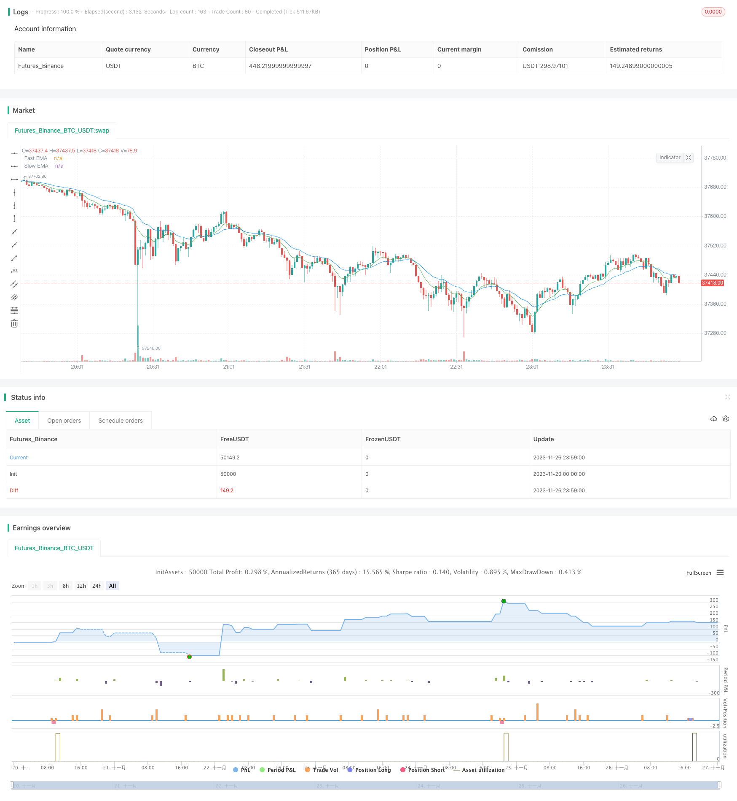

> Name

Dual-EMA-Crossover-Breakout-Strategy
> Author

ChaoZhang

> Strategy Description



[trans]


## Overview
The double EMA golden cross breakthrough strategy generates buy and sell signals by calculating the intersection of fast EMA and slow EMA, combined with trading volume breakthrough, K-line shape and price breakthrough judgment. This strategy combines a variety of technical indicators to improve the reliability of signals and control risks while capturing price trends.
## Strategy Principle
The core logic of the double EMA golden cross breakthrough strategy is based on the double EMA golden cross theory. This theory holds that when the short-term EMA crosses above the longer-term EMA, it means that the price has a strong upward momentum, and a long position should be established; when the short-term EMA crosses below the longer-term EMA, it means that the price has a strong downward momentum, and a short position should be established.
Specifically, the strategy first calculates the 9-day EMA and the 21-day EMA. When the 9-day EMA crosses above the 21-day EMA, a "long" signal is generated; when the 9-day EMA crosses below the 21-day EMA, a "short" signal is generated. In order to filter out false signals, the strategy also sets the following judgment conditions:
1. Trading volume conditions. The trading volume of the latest K-line needs to be greater than 85% of the average trading volume of the previous 5 K-lines. This condition can filter out false signals of insufficient trading volume.
2. Price breakthrough conditions. Price needs to break above the 9-day EMA for entry confirmation.
3. K-line shape conditions. It is necessary to identify reversal K-line patterns, including upward engulfing patterns or downward engulfing patterns. This can avoid repeated entry and exit during consolidation and shock.
In a long position, when the price falls below the 9-day EMA, the position is closed and exited. In a short position, when the price rises above the 9-day EMA, the position is also closed and exited.
## Advantage Analysis
The double EMA golden cross breakthrough strategy combines a variety of technical indicator signals to effectively identify price trends and improve the winning rate of transactions. Its main advantages are:
1. Use double EMA to determine the main trend direction, which has high reliability.
2. Add transaction volume filtering to avoid sending false signals when transaction volume is insufficient.
3. Adding K-line morphological judgment can filter out the noise of the volatile and consolidating market.
4. Entering the market when the price breaks through the EMA can confirm the trend.
5. Set up a stop-loss exit mechanism to proactively control risks.
## Risk Analysis
The double EMA golden cross breakthrough strategy also has certain risks, which are mainly concentrated in the following aspects:
1. In volatile markets, EMA may send out wrong signals, resulting in trading losses. You can decide whether to open a position by judging the overall trend.
2. The fixed EMA period setting may not be able to adapt to market changes. You can try to use adaptive EMA.
3. There is still a certain probability of misjudgment when judging the reversal K-line pattern, and the stop-loss mechanism can be used to control risks.
4. The strategy may miss part of the market and cannot perfectly track the price. Parameters can be adjusted appropriately or used in combination with other strategies.
## Optimization direction
The double EMA golden cross breakthrough strategy also has the following main optimization directions:
1. Test more EMA combinations to find the best parameters.
2. Add adaptive EMA and adjust EMA parameters according to market changes.
3. Optimize position management and adopt different positions for different market conditions.
4. Combine with more indicators for optimization, such as MACD, KDJ, etc., to form a strategy combination.
5. Introduce advanced technologies such as machine learning for model fusion to improve strategy stability.
## Summarize
The double EMA golden cross breakthrough strategy determines the trend direction through double EMA and adds multiple filters of trading volume/price/K line form, which can effectively identify trends and improve trading efficiency while controlling risks. This strategy is simple to operate and easy to implement, while leaving a lot of room for optimization. It is a recommended breakthrough trading strategy.

||


## Overview

The Dual EMA Crossover Breakout strategy generates buy and sell signals based on the crossover of fast and slow EMA lines, combined with trading volume breakout, candlestick patterns and price breakout filters to improve reliability. By integrating multiple technical indicators, it aims to identify trends while controlling risks.

## Principles

The core logic of the Dual EMA Crossover Breakout strategy lies in the golden crossover theory of two EMAs. The theory believes that when the shorter-term EMA crosses above the longer-term EMA, it signals an uptrend, so long positions should be established. When the shorter-term EMA crosses below the longer-term EMA, it signals a downtrend, so short positions should be established.   

Specifically, the strategy first calculates the 9-period and 21-period EMAs. When the 9-EMA crosses above the 21-EMA, a "long" signal is generated. When the 9-EMA crosses below the 21-EMA, a "short" signal is generated. To filter out false signals, the following conditions are checked:  

1. Volume condition - Volume of recent candle should exceed 85% of average volume of previous 5 candles. This filters out signals with insufficient trading volumes.

2. Price breakout condition - Price needs to breakout above 9-EMA as entry confirmation.   

3. Candlestick pattern condition - Identify bullish or bearish reversal patterns, avoiding whipsaws during sideways markets.

For long positions, exits are triggered when price breaks below 9-EMA. For short positions, exits are triggered when price breaks above 9-EMA.  

## Advantage Analysis 

By combining signals from multiple technical indicators, the Dual EMA Crossover Breakout strategy can effectively identify trends and improve win rate. The main advantages are:

1. Using dual EMAs to determine major trend direction is highly reliable. 

2. Adding volume filter avoids wrong signals when volume is insufficient.  

3. Adding candlestick pattern filter eliminates noise from range-bound markets.

4. Entering after price breaks EMA confirms trend. 

5. The stop loss mechanism actively controls risks.

## Risk Analysis

There are still some risks with the strategy:  

1. EMA may generate false signals during choppy markets, causing losses. Overall trend judgement can help decide on opening positions.  

2. Fixed EMA periods may fail to adapt to changing markets. Adaptive EMAs can be tested.

3. There are still probabilities of misidentifying candlestick patterns. Stop losses control risk.  

4. The strategy may miss some price moves and have imperfect trend tracking. Parameter tuning or combining with other strategies can help.

## Optimization Directions

The main optimization directions are:  

1. Test more EMA combinations to find optimal parameters.  

2. Add adaptive EMAs based on changing market conditions. 

3. Optimize position sizing for different market conditions.  

4. Incorporate more indicators like MACD, KDJ to form ensemble strategies.

5. Introduce machine learning models to improve robustness.  

## Conclusion

The Dual EMA Crossover Breakout strategy effectively identifies trends using dual EMA directional analysis, and adds multiple volume/price/pattern filters to improve efficiency while controlling risks. Easy to implement with optimization flexibility, it is a recommended breakout trend following strategy.

[/trans]


> Source (PineScript)

``` pinescript
/*backtest
start: 2023-11-20 00:00:00
end: 2023-11-27 00:00:00
period: 1m
basePeriod: 1m
exchanges: [{"eid":"Futures_Binance","currency":"BTC_USDT"}]
*/

//@version=5
//Author: Andrew Shubitowski
strategy("Buy/Sell Strat", overlay = true)

//Define EMAs & Crossovers (Feature 2)
a = ta.ema(close, 9)
b = ta.ema(close, 21)
crossUp = ta.crossover(a, b)
crossDown = ta.crossunder(a, b)


//Define & calc volume averages (Feature 1)
float volAvg = 0
for i = 1 to 5
    volAvg := volAvg + volume[i]
volAvg := volAvg / 5

//Define candlestick pattern recongition (Feature 4)
bool reversalPatternUp = false
bool reversalPatternDown = false
if (close > close[1] and close[1] > close [2] and close[3] > close[2] and close > close[3])
    reversalPatternUp := true
    
if (close < close[1] and close[1] < close [2] and close[3] < close[2] and close < close[3])
    reversalPatternDown := true

//Execute trade (Feature 3 + 5)
if (crossUp)
    strategy.entry("long", strategy.long, when = ((volume * 0.85) > volAvg and close > a and reversalPatternUp == true))
    
if (crossDown)
    strategy.entry("short", strategy.short, when = ((volume * 0.85) > volAvg and close < a and reversalPatternDown == true))
    
//Exit strategy (New Feature)
close_condition_long = close < a
close_condition_short = close > a
if (close_condition_long)
    strategy.close("long")

if (close_condition_short)
    strategy.close("short")

//plot the EMAs
plot(a, title = "Fast EMA", color = color.green)
plot(b, title = "Slow EMA", color = color.blue)


//Some visual validation parameters
//plotchar(volAvg, "Volume", "", location.top, color.aqua) //*TEST* volume calc check
//plotshape(reversalPatternUp, style = shape.arrowup, color = color.aqua) //*TEST* reversal check
//plotshape(reversalPatternDown, style = shape.arrowup, location = location.belowbar, color = color.red) //*TEST* reversal check
```

> Detail

https://www.fmz.com/strategy/433566

> Last Modified

2023-11-28 15:39:37
