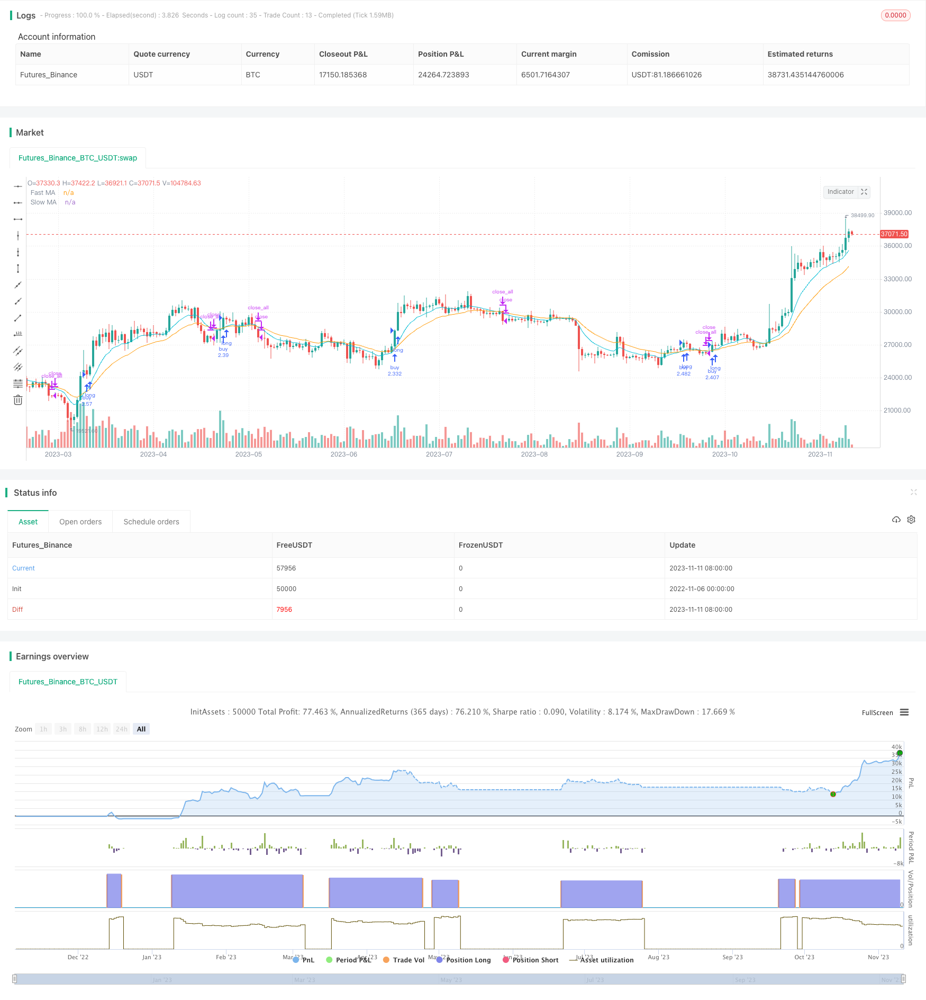

> Name

Dual-EMA-Crossover-Strategy
> Author

ChaoZhang

> Strategy Description


[trans]


## Overview
This strategy calculates the fast EMA and the slow EMA and compares the size relationship between the two to achieve the golden cross and dead cross trading signals of the double EMA, which is a trend following strategy. When the fast line crosses the slow line, a buy signal is generated, and when the fast line crosses below the slow line, a sell signal is generated, implementing a simple trend following strategy.
## Strategy Principle
The core logic of this strategy mainly includes the following parts:
1. Calculate fast EMA and slow EMA: Use the ta.ema() function to calculate the fast EMA with a length of fastInput and the slow EMA with a length of slowInput.
2. Set the backtest time range: set whether to filter the backtest time through the useDateFilter parameter, and set the backtest start and end time with backtestStartDate and backtestEndDate.
3. Generate trading signals: Compare the size relationship between the fast EMA and the slow EMA through the ta.crossover() and ta.crossunder() functions. When the fast line crosses the slow line, a buy signal is generated, and when the fast line crosses the slow line, a sell signal is generated.
4. Processing of orders outside the time range: Unfilled orders outside the backtesting time range will be canceled and all positions will be closed.
5. Draw moving averages: Draw the moving averages of fast EMA and slow EMA on the chart.
## Strategic Advantages
This is a very simple trend following strategy that has several advantages:
1. The strategy logic is simple and easy to understand and implement.
2. EMA smoothes price data and can reduce noise trading.
3. EMA cycle parameters can be customized to adapt to different market environments.
4. The backtest time range can be flexibly set to conduct testing within a specific time range.
5. Can optimize entry and exit conditions and use them in combination with other indicators.
## Risk Analysis
There are also some risks to be aware of with this strategy:
1. The double EMA strategy is relatively extensive and cannot flexibly respond to market changes.
2. There are risks of frequent transactions and repeated transactions.
3. Improper setting of EMA parameters may lead to incorrect trading signals.
4. Unreasonable backtest time range may lead to overfitting.
5. There is an unavoidable risk of retracements and losses.
Risks can be controlled through parameter optimization, appropriate filtering of fluctuations, and setting of stop losses.
## Optimization direction
This strategy can be optimized from the following aspects:
1. Optimize the EMA cycle parameters and select the best parameter combination.
2. Add other indicator filters to avoid unnecessary transactions.
3. Add a stop loss strategy to control single losses.
4. Combine with filters such as trend and volatility to reduce trading frequency.
5. Test different types of contracts to find the best strategy candidates.
6. Use cost controls such as slippage and handling fees to make backtesting more realistic.
## Summarize
Overall, this strategy is a very simple double EMA golden cross and dead cross strategy. The logic is clear and easy to understand. Trading signals are generated by comparing fast and slow EMAs. The advantage of this strategy is that it is simple to implement, but there are also some problems such as frequent transactions and easy over-optimization. The next step can be improved from aspects such as parameter optimization and risk control to make the strategy more robust and practical.
||


## Overview

This strategy generates trading signals based on the crossover and crossunder of fast and slow EMA lines, belonging to trend following strategies. It buys when the fast EMA crosses over the slow EMA, and sells when the fast EMA crosses under the slow EMA, implementing a simple trend tracking strategy.

## Strategy Logic

The core logic of this strategy mainly includes the following parts:

1. Calculate fast and slow EMAs: Use ta.ema() to calculate fast EMA of length fastInput and slow EMA of length slowInput.

2. Set backtest time range: Use useDateFilter to set whether to filter backtest time range, and use backtestStartDate and backtestEndDate to set start and end time. 

3. Generate trading signals: Use ta.crossover() and ta.crossunder() to compare fast and slow EMAs, generating buy signals when fast EMA crosses over slow EMA, and sell signals when fast EMA crosses under slow EMA.

4. Handle orders outside time range: Cancel unfilled orders outside backtest time range, and flatten all positions.

5. Plot EMA lines: Plot fast and slow EMA lines on the chart.

## Advantage Analysis  

This is a very simple trend following strategy, with the following advantages:

1. Simple logic, easy to understand and implement.

2. EMA smooths price data and reduces noise trading.

3. Customizable EMA periods, adaptable to different market environments. 

4. Flexible backtest time range for testing specific time periods.

5. Optimizable entry and exit conditions, can be combined with other indicators.

## Risk Analysis

This strategy also has some risks:

1. Dual EMA strategy is crude, unable to adapt flexibly to market changes.

2. Risk of frequent trading and repeated trading.

3. Improper EMA parameters may cause wrong trading signals. 

4. Unreasonable backtest time range may lead to overfitting. 

5. Risk of unavoidable drawdown and losses.

Risks can be managed through parameter optimization, filtering fluctuations, stop loss, etc.

## Optimization Directions

This strategy can be optimized in the following aspects:

1. Optimize EMA periods to find the best parameter combination.

2. Add other indicators for filtering unnecessary trades. 

3. Add stop loss to control single trade loss.

4. Incorporate trend, volatility filters to reduce trading frequency.

5. Test different products to find the best fit.

6. Use slippage, commission for more realistic backtest.

## Summary

In summary, this is a very simple dual EMA crossover strategy with clear logic by comparing fast and slow EMAs. The advantage is simple implementation, but it also has issues like frequent trading, overfitting. Next step is to improve on parameter optimization, risk management for a more robust strategy.

[/trans]

> Strategy Arguments


|Argument|Default|Description|
|----|----|----|
|v_input_1|10|Fast EMA|
|v_input_2|21|Slow EMA|
|v_input_bool_1|true|(?Backtest Time Period)Filter Date Range of Backtest|
|v_input_3|timestamp(1 Jan 2018)|Start Date|
|v_input_4|timestamp(7 Sep 2023)|End Date|


> Source (PineScript)

``` pinescript
/*backtest
start: 2022-11-06 00:00:00
end: 2023-11-12 00:00:00
period: 1d
basePeriod: 1h
exchanges: [{"eid":"Futures_Binance","currency":"BTC_USDT"}]
*/


//@version=5
strategy("MollyETF_EMA_Crossover", overlay = true, initial_capital = 100000, default_qty_value=100, default_qty_type=strategy.percent_of_equity)

fastInput = input( 10, "Fast EMA")
slowInput = input( 21, "Slow EMA")

// Calculate two moving averages with different lengths.
float fastMA = ta.ema(close, fastInput)
float slowMA = ta.ema(close, slowInput)


// STEP 1. Create inputs that configure the backtest's date range
useDateFilter = input.bool(true, title="Filter Date Range of Backtest",
     group="Backtest Time Period")
backtestStartDate = input(timestamp("1 Jan 2018"), 
     title="Start Date", group="Backtest Time Period",
     tooltip="This start date is in the time zone of the exchange " +  
     "where the chart's instrument trades. It doesn't use the time " + 
     "zone of the chart or of your computer.")
backtestEndDate = input(timestamp("7 Sep 2023"),
     title="End Date", group="Backtest Time Period",
     tooltip="This end date is in the time zone of the exchange " + 
     "where the chart's instrument trades. It doesn't use the time " + 
     "zone of the chart or of your computer.")

// STEP 2. See if current bar falls inside the date range
inTradeWindow = true

// STEP 3. Include the date filter with the entry order conditions

// Enter a long position when `fastMA` crosses over `slowMA`.
if inTradeWindow and ta.crossover(fastMA, slowMA)
    strategy.entry("buy", strategy.long)

// Enter a short position when `fastMA` crosses under `slowMA`.
if inTradeWindow and ta.crossunder(fastMA, slowMA)
    strategy.close_all(comment="sell")

// STEP 4. With the backtest date range over, exit all open
// trades and cancel all unfilled pending orders
if not inTradeWindow and inTradeWindow[1]
    strategy.cancel_all()
    strategy.close_all(comment="Date Range Exit")

// Plot the moving averages.
plot(fastMA, "Fast MA", color.aqua)
plot(slowMA, "Slow MA", color.orange)


```

> Detail

https://www.fmz.com/strategy/431966

> Last Modified

2023-11-13 17:35:14
