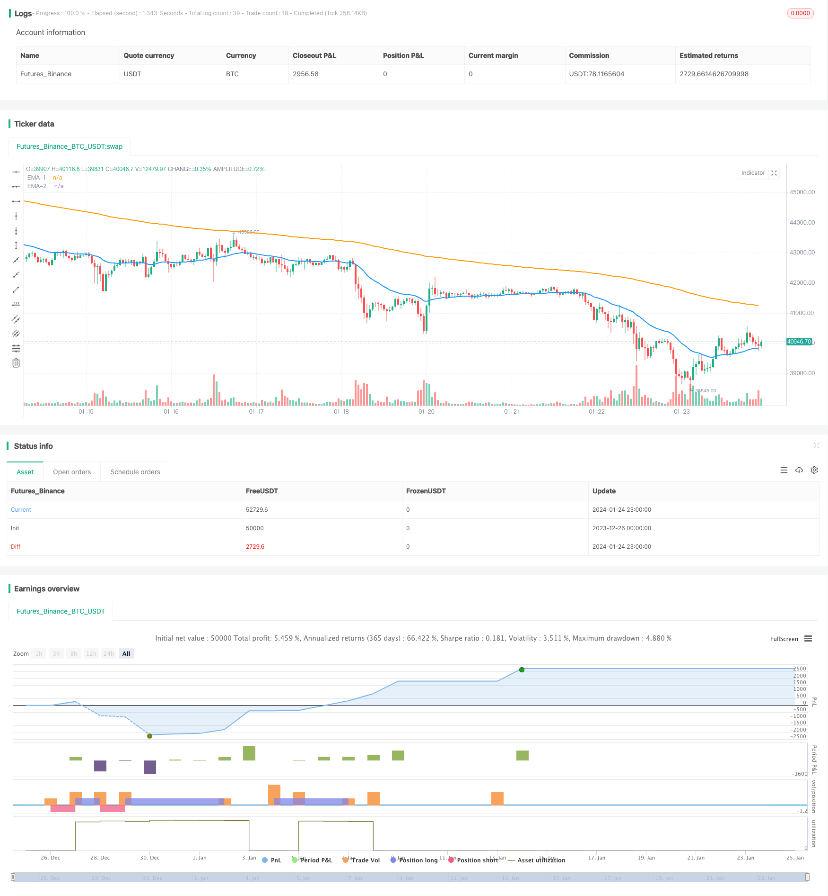

> Name

Dual-EMA-Golden-Cross-Breakout-Strategy
> Author

ChaoZhang

> Strategy Description


 [trans]

## Overview
The Double EMA Golden Cross Breakout Strategy is a trend following and breakout trading strategy based on double exponential moving averages (EMA). It captures changes in price trends by calculating EMAs of two different periods, generating buy signals when they occur at golden crosses, and generating sell signals at death crosses. This strategy also combines the conditions for the price to break through the EMA to send out signals, thereby filtering out false signals.
## Strategy Principle
The double EMA golden cross breakthrough strategy is mainly based on the following principles:
1. Use the shorter-period EMA (26-day line) to capture the short-term trend of prices, and use the longer-period EMA (200-day line) to determine the long-term trend.
2. When the short-term EMA breaks through the long-term EMA from bottom to top, it is called a "golden cross", indicating that the price trend has turned from falling to rising, generating a buy signal.
3. When the short-term EMA breaks through the long-term EMA from top to bottom, it is called a "death cross", indicating that the price trend has turned from rising to falling, generating a sell signal.
4. When the cross signal is issued, the price also needs to break through the EMA at the same time to filter out false signals and ensure the reliability of the trading signal.
5. Use trading stop-loss and stop-profit methods to control trading risks and lock in profits.
## Advantage Analysis
The double EMA golden cross breakout strategy has the following advantages:
1. Use double EMA to determine price trends and cross signals, which can effectively track market trends.
2. Filter signals based on price breakthroughs to avoid misleading cross false signals.
3. Use simple and clear transaction logic, which is easy to understand and implement.
4. Applicable to different varieties and time periods, flexible and universal.
5. Configurable EMA parameters and stop-loss and stop-profit conditions, with strong adaptability.
## Risk Analysis
The double EMA golden cross breakout strategy also has the following risks:
1. When prices fluctuate, EMA crossovers may occur frequently, generating too many trading signals. EMA parameters can be adjusted appropriately to reduce the number of crossovers.
2. Double EMA sometimes produces hysteresis and cannot respond to price changes in a timely manner. Can be combined with other indicators for confirmation.
3. A stop-loss point that is too small may be easily triggered by slight price fluctuations, and a stop-profit point that is too large may miss part of the profit. The stop loss and stop profit positions need to be adjusted according to the market.
4. Before generating trading signals, it is necessary to determine the large-level trend and avoid trading against the trend.
## Optimization direction
The double EMA golden cross breakthrough strategy can be optimized from the following aspects:
1. Apply machine learning algorithms to dynamically optimize EMA parameters so that they can better adapt to price fluctuations.
2. Add other indicators to confirm signals, such as trading volume, Bollinger Bands, etc., to improve signal quality.
3. Combined with deep learning to predict the price path, make the stop loss and take profit closer to the optimal position.
4. Optimize strategies for high-frequency data to improve signal accuracy.
5. Add an adaptive stop loss mechanism to prevent excessive frequent stop losses.
## Summary
To sum up, the double EMA golden cross breakthrough strategy uses EMA cross signals to determine price trends and turning points, and adds price breakthrough filtering to avoid false signals. It is a reliable, stable, and easy-to-implement trend following trading strategy. The effectiveness of the strategy can be further enhanced through parameter optimization, signal filtering and adaptive adjustment. Its trading ideas are simple and intuitive, suitable for all types of investors, and it is one of the basic strategies for quantitative trading.
||

## Overview
The dual EMA golden cross breakout strategy is a trend-following and breakout trading strategy based on two exponential moving averages (EMAs) with different periods. It generates buy signals when a golden cross between the two EMAs emerges and sell signals when a death cross happens, in order to capture trend changes in prices. This strategy also combines the price breakout condition of EMAs to filter out false signals.   

## Strategy Logic   
The dual EMA golden cross breakout strategy is mainly based on the following logic:  

1. Use a shorter period EMA (26-day line) to capture short-term trends and a longer period EMA (200-day line) to determine the long-term trend direction.    

2. When the shorter period EMA crosses above the longer period EMA, it is called a “golden cross”, indicating the trend changes from downtrend to uptrend, and a buy signal is generated.   

3. When the shorter period EMA crosses below the longer period EMA, it is called a “death cross”, indicating the trend changes from uptrend to downtrend, and a sell signal is generated.  

4. When the cross signals occur, the price also needs to break through the EMAs to filter out false signals and ensure reliable trade signals.   

5. Apply stop loss and take profit techniques to control trading risks and lock in profits.   

## Advantages Analysis  
The dual EMA golden cross breakout strategy has the following advantages:  

1. Using dual EMAs to determine price trends and crossover signals can effectively track market movements.   

2. Combining price breakout filter signals avoids being misled by false crossover signals.   

3. Adopting simple and clear trading logic, easy to understand and implement.  

4. Applicable to different products and time frames, flexible and versatile.  

5. Configurable EMA parameters and stop loss/take profit conditions make it highly adaptable.  

## Risk Analysis
The dual EMA golden cross breakout strategy also has the following risks:   

1. Frequent crossovers may occur when prices oscillate, generating excessive trading signals. Adjusting EMA parameters properly can reduce crossover frequency.   

2. Dual EMAs sometimes have lagging performance and cannot respond to price changes in time. Other indicators can be combined for confirmation.  

3. Stop loss points that are too small may be easily triggered by slight price fluctuations, while take profit points that are too large may miss some profits. Stop loss and take profit positions need to be adjusted according to market conditions.  

4. Major trend judgments should be made before trade signals to avoid trading against the trend.  

## Optimization Directions
The dual EMA golden cross breakout strategy can be optimized in the following aspects:  

1. Apply machine learning algorithms to dynamically optimize EMA parameters so that they can better adapt to price fluctuations.  

2. Add other confirming signals like volume, Bollinger Bands etc. to improve signal quality.  

3. Incorporate deep learning predictions of price paths to place stop loss and take profit closer to optimal levels.  

4. Optimize strategies specifically for high frequency data to increase signal precision.   

5. Add adaptive adjustment mechanisms for stop loss to prevent excessive stopping out.  

## Conclusion
In summary, the dual EMA golden cross breakout strategy utilizes EMA crossover signals to determine price trends and turning points, and incorporates price breakout filters to avoid false signals. It is a reliable, steady and easy-to-implement trend following trading strategy. Further enhancements can be made through parameter optimization, signal filtering and adaptive adjustment. Its trading logic is simple and intuitive, suitable for all kinds of investors, and thus is one of the fundamental algorithmic trading strategies.

[/trans]

> Strategy Arguments


|Argument|Default|Description|
|----|----|----|
|v_input_1_close|0|src: close|high|low|open|hl2|hlc3|hlcc4|ohlc4|
|v_input_2|26|EMA-1|
|v_input_3|200|EMA-2|
|v_input_4|true|Show EMA ?|
|v_input_5|2|Take Profit (%)|
|v_input_6|true|Stop Loss (%)|


> Source (PineScript)

``` pinescript
/*backtest
start: 2023-12-26 00:00:00
end: 2024-01-25 00:00:00
period: 1h
basePeriod: 15m
exchanges: [{"eid":"Futures_Binance","currency":"BTC_USDT"}]
*/

//@version=5
strategy("EMA Buy/Sell Signal", shorttitle="EMABuySell", overlay=true)

// === INPUTS ===
src = input(close)
ema1Length = input(26, title='EMA-1')
ema2Length = input(200, title='EMA-2')

EMASig = input(true, title="Show EMA ?")
takeProfitPercent = input(2.0, title="Take Profit (%)") / 100
stopLossPercent = input(1, title="Stop Loss (%)") / 100

pema1 = ta.ema(src, ema1Length)
pema2 = ta.ema(src, ema2Length)

// Plotting EMAs
plot(EMASig ? pema1 : na, title='EMA-1', color=color.new(color.blue, 0), linewidth=2)
plot(EMASig ? pema2 : na, title='EMA-2', color=color.new(color.orange, 0), linewidth=2)

// EMA Crossover Buy Signal
EMACrossoverLong = ta.crossover(pema1, pema2)

// EMA Crossunder Short Signal
EMACrossoverShort = ta.crossunder(pema1, pema2)

// Crossover above EMA-200 Long Signal
CrossoverAboveEMA200 = ta.crossover(close, pema2)

// Trading logic for Long
if ((EMACrossoverLong and close > pema1 and close > pema2) or CrossoverAboveEMA200)
    strategy.entry("Buy", strategy.long, qty=1)

// Take Profit logic for Long
longCondition = close >= strategy.position_avg_price * (1 + takeProfitPercent)
if (strategy.position_size > 0 and longCondition)
    strategy.close("Buy")

// Stop Loss logic for Long
stopLossConditionLong = ta.crossunder(pema1, pema2)
if (strategy.position_size > 0 and stopLossConditionLong)
    strategy.close("Buy")

// Trading logic for Short
if (EMACrossoverShort and close < pema1 and close < pema2)
    strategy.entry("Sell", strategy.short, qty=1)

// Take Profit logic for Short
shortCondition = close <= strategy.position_avg_price * (1 - takeProfitPercent)
if (strategy.position_size < 0 and shortCondition)
    strategy.close("Sell")

// Stop Loss logic for Short
stopLossConditionShort = ta.crossover(pema1, pema2)
if (strategy.position_size < 0 and stopLossConditionShort)
    strategy.close("Sell")

// Visual Signals
plotshape(series=EMACrossoverLong or CrossoverAboveEMA200, title="Buy Signal", color=color.green, style=shape.triangleup, size=size.small)
plotshape(series=EMACrossoverShort, title="Sell Signal", color=color.red, style=shape.triangledown, size=size.small)

```

> Detail

https://www.fmz.com/strategy/440087

> Last Modified

2024-01-26 15:13:59
