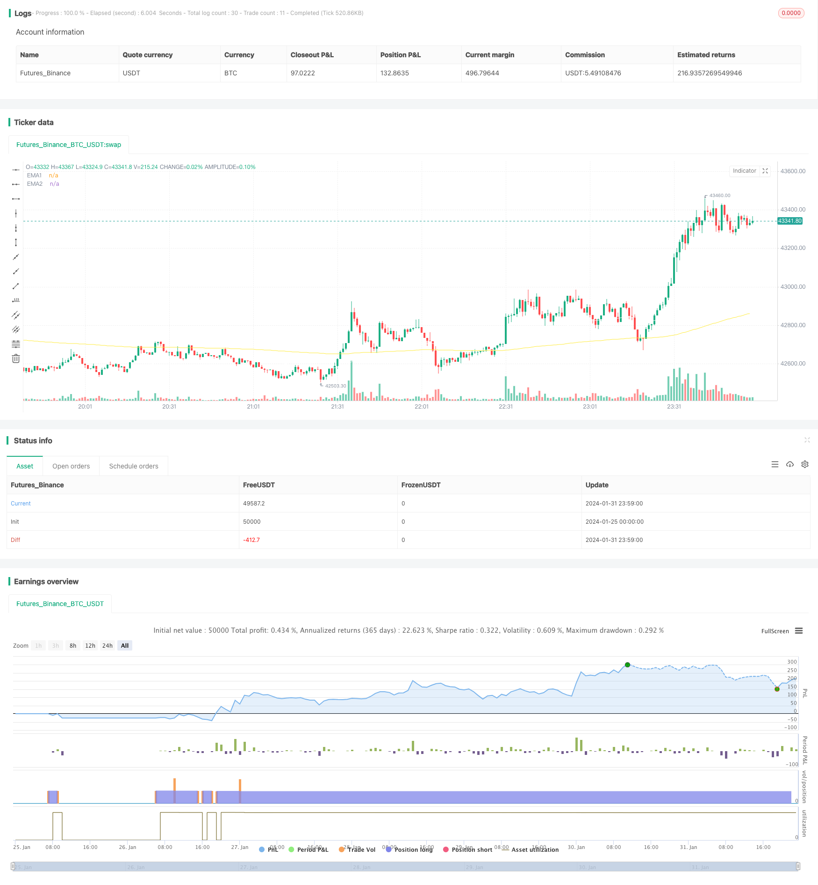

> Name

Trend following strategy EMA-RSI-Hidden-Divergence-Trend-Following-Strategy based on EMA and hidden divergence
> Author

ChaoZhang

> Strategy Description


[trans]
### Overview
This strategy opens a long position based on the hidden divergence signals of the EMA moving average and the RSI indicator. By identifying the characteristic points formed by the hidden long divergence, it is judged that the current upward trend is at the beginning, which is used as a signal to open a position. At the same time, combined with the golden cross of the EMA moving average and the K-line closing price above the EMA moving average, it can ensure that the trend is upward. This strategy is suitable for tracking the mid- to long-term trend and opening long positions during the re-rising stage after the consolidation.
### Strategy Principles
1. EMA moving average strategy: Use the 50-period and 250-period EMA moving averages to conduct a golden cross to determine the trend. When the price crosses the 50 EMA, it is regarded as a long signal.
2. RSI hidden divergence strategy: A hidden bull divergence signal when the RSI indicator appears at a lower low and the price appears at a higher low indicates the beginning of a reversal. Combined with limiting the number of divergence points, false signals can be filtered out.
3. K-line closing strategy: Open a long position when the K-line closing price exceeds 50EMA.
Based on the above three strategies, it is judged that the current trend is starting to rise, and a long position is opened.
### Advantage Analysis
1. Use the EMA moving average to determine the trend direction, and cooperate with the reversal signal of the RSI indicator to open a position at the beginning of the trend.
2. Double confirmation mechanism, using the combined judgment of EMA, RSI and K-line closing price, can effectively filter out false signals.
3. Tracking the medium and long-term trend is suitable for judging the start of a new upward trend after consolidation.
### Risk Analysis
1. When the EMA crosses the moving average, the position needs to be closed in time.
2. Judgment of RSI hidden divergence signals requires a certain amount of experience. Improper parameter settings may miss signals or make wrong judgments.
3. The parameters of the trading products need to be optimized and set.
### Optimization direction
1. Dynamically adjust the parameters of EMA to optimize the accuracy of trend judgment.
2. Adjust RSI parameters to optimize the accuracy of judging hidden divergence.
3. Add a stop-loss mechanism and use ATR stop-loss or percentage stop-loss to control risks.
4. Develop a short trading strategy so that the strategy can open short positions in a downtrend.
### Summarize
This strategy comprehensively uses the EMA moving average to judge the general trend, cooperates with the RSI indicator to increase the accuracy of judgment, and judges the beginning of a new upward trend after the consolidation. It is a relatively conservative trend following strategy. By optimizing parameter settings and adding stop loss methods, better results can be obtained. Compared with the simple moving average strategy, it is more accurate in judging the upward trend and has a higher winning rate. It is a practical strategy.
||

### Overview

This strategy opens long positions based on the EMA crossover and RSI hidden bullish divergence signals to identify the beginning of an upward trend. The combination of EMA lines, RSI indicator, and K-line closing prices provides double confirmation for ensuring an upward momentum. This strategy is suitable to follow mid-long term trends and open long positions after price consolidations.  

### Strategy Logic

1. EMA Strategy: Using the golden cross of 50-period EMA and 250-period EMA to determine the trend direction. A close above the 50 EMA gives a long signal.

2. RSI Hidden Divergence Strategy: The RSI forms lower lows while price forms higher lows, signaling a trend reversal at the beginning. Limiting the number of pivot points filters out false signals.   

3. K-line Closing Strategy: Go long when the closing price is above the 50 EMA line.

The combination of the above three strategies identifies the start of an upward trend and opens long positions accordingly.

### Advantage Analysis  

1. Using EMA lines to determine trend direction along with RSI reversal signals allows early entry at the beginning of trends.

2. The dual confirmation from EMA lines, RSI indicator, and K-line closing prices effectively filters out false signals. 

3. Following mid-long term trends makes it suitable to identify new up trends after consolidations.

### Risk Analysis

1. Close positions when the EMA lines have a death cross.  

2. Identifying RSI hidden divergences needs experience, improper parameter tuning could lead to missing or false signals.

3. Parameters need optimization for different trading instruments. 

### Optimization Directions 

1. Dynamically adjust EMA parameters for better trend determination accuracy.  

2. Fine tune RSI parameters for better hidden divergence signal accuracy.

3. Add stop loss mechanisms like ATR or percentage stops to control risks.

4. Develop strategies for short positions to trade downward trends.

### Conclusion

This strategy combines EMA lines for trend determination and RSI signals for increase accuracy. It identifies new upward trends after consolidations. With proper parameter tuning and risk management, it could achieve good results. Compared to simple moving average strategies, it has higher accuracy in catching trends with better win rates. Overall it is a practical trend following strategy.

[/trans]

> Strategy Arguments


|Argument|Default|Description|
|----|----|----|
|v_input_1|true|FromMonth|
|v_input_2|true|FromDay|
|v_input_3|2020|FromYear|
|v_input_4|true|ToMonth|
|v_input_5|true|ToDay|
|v_input_6|9999|ToYear|
|v_input_7|50|EMA1|
|v_input_8|250|EMA2|
|v_input_9|4|K|
|v_input_10|4|D|
|v_input_11|3|Smooth|
|v_input_12|14|RSI Period|
|v_input_13_close|0|RSI Source: close|high|low|open|hl2|hlc3|hlcc4|ohlc4|
|v_input_14|true|Pivot Lookback Right|
|v_input_15|19|Pivot Lookback Left|
|v_input_16|20|Max of Lookback Range|
|v_input_17|4|Min of Lookback Range|
|v_input_18|1.6|Profitfactor|
|v_input_19|38|Lowest Low Lookback|


> Source (PineScript)

``` pinescript
/*backtest
start: 2024-01-25 00:00:00
end: 2024-02-01 00:00:00
period: 1m
basePeriod: 1m
exchanges: [{"eid":"Futures_Binance","currency":"BTC_USDT"}]
*/

//@version=4

strategy(title="EMA RSI ATR Hidden Div Strat", shorttitle="Hidden Div Strat", overlay = true, pyramiding = 0, max_bars_back=3000, calc_on_order_fills = false, commission_type =  strategy.commission.percent, commission_value = 0, default_qty_type = strategy.percent_of_equity, default_qty_value = 10, initial_capital=5000, currency=currency.USD)

// Time Range
FromMonth=input(defval=1,title="FromMonth",minval=1,maxval=12)
FromDay=input(defval=1,title="FromDay",minval=1,maxval=31)
FromYear=input(defval=2020,title="FromYear",minval=2016)
ToMonth=input(defval=1,title="ToMonth",minval=1,maxval=12)
ToDay=input(defval=1,title="ToDay",minval=1,maxval=31)
ToYear=input(defval=9999,title="ToYear",minval=2017)
start=timestamp(FromYear,FromMonth,FromDay,00,00)
finish=timestamp(ToYear,ToMonth,ToDay,23,59)
window()=>true

// Bar's time happened on/after start date?
afterStartDate = time >= start and time<=finish?true:false

//EMA'S
emasrc = close

len1 = input(50, minval=1, title="EMA1")
ema1 = ema(emasrc, len1)
col1 = color.white

len2 = input(250, minval=1, title="EMA2")
ema2 = ema(emasrc, len2)
col2 = color.yellow

//Plots
plot(ema1, title="EMA1", linewidth=1, color=col1)
plot(ema2, title="EMA2", linewidth=1, color=col2)

//Stoch
periodK = input(4, title="K", minval=1)
periodD = input(4, title="D", minval=1)
smoothK = input(3, title="Smooth", minval=1)
k = sma(stoch(close, high, low, periodK), smoothK)
d = sma(k, periodD)

//Hidden Divergence Indikator

len = input(title="RSI Period", minval=1, defval=14)
src = input(title="RSI Source", defval=close)
lbR = input(title="Pivot Lookback Right", defval=1)
lbL = input(title="Pivot Lookback Left", defval=19)
rangeUpper = input(title="Max of Lookback Range", defval=20)
rangeLower = input(title="Min of Lookback Range", defval=4)
hiddenBullColor = color.new(color.green, 80)
textColor = color.white
noneColor = color.new(color.white, 100)
osc = rsi(src, len)

plFound = na(pivotlow(osc, lbL, lbR)) ? false : true
phFound = na(pivothigh(osc, lbL, lbR)) ? false : true
_inRange(cond) =>
	bars = barssince(cond == true)
	rangeLower <= bars and bars <= rangeUpper

//------------------------------------------------------------------------------
// Hidden Bullish
// Osc: Lower Low

oscLL = osc[lbR] < valuewhen(plFound, osc[lbR], 1) and _inRange(plFound[1])

// Price: Higher Low

priceHL = low[lbR] > valuewhen(plFound, low[lbR], 1)
hiddenBullCond = priceHL and oscLL and plFound

//buy Conditions
buyhiddenbull = hiddenBullCond[1] or hiddenBullCond[2] or hiddenBullCond[3] or hiddenBullCond[4] or hiddenBullCond[5] or hiddenBullCond[6] or hiddenBullCond[7] or hiddenBullCond[8] or hiddenBullCond[9] or hiddenBullCond[10]
emacondition = ema1 > ema2
upcondition = close[1] > ema1[1] and ema2[1] and close[2] > ema1[2] and ema2[2] and close[3] > ema1[3] and ema2[3]
crossup = k[0] >= d[0] and k[1] <= d[1]
longcondition = emacondition and upcondition and crossup and buyhiddenbull

if (afterStartDate)
    strategy.entry("Long", strategy.long, when = longcondition)

//TakeProfit, StopLoss lowest low
profitfactor = input(title="Profitfactor", type=input.float, step=0.1, defval=1.6)
loLen = input(title="Lowest Low Lookback", type=input.integer,
  defval=38, minval=2)
stop_level = lowest(low, loLen)[1]
bought = strategy.position_size[1] < strategy.position_size
barsbought = barssince(bought)

if strategy.position_size>0
    profit_level = strategy.position_avg_price + ((strategy.position_avg_price - stop_level[barsbought])*profitfactor)
    strategy.exit(id="TP/ SL", stop=stop_level[barsbought], limit=profit_level)
```

> Detail

https://www.fmz.com/strategy/440847

> Last Modified

2024-02-02 16:54:27
