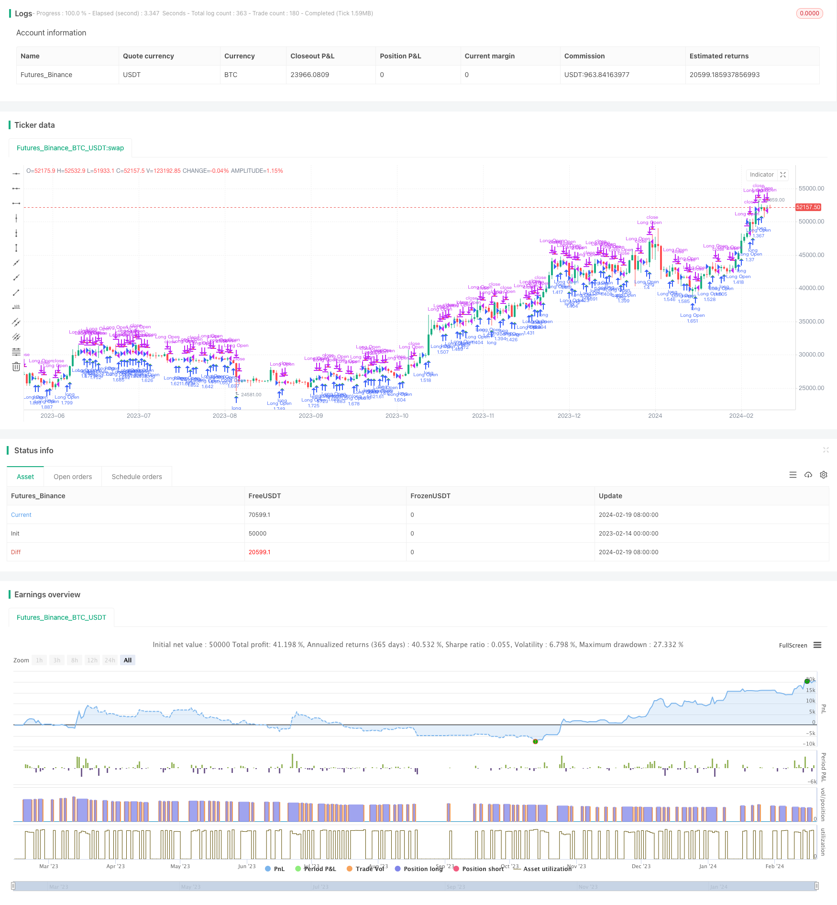

> Name

Trading-Strategy-Based-on-Multiple-Time-Frame-EMA-Breakthrough-and-K-line-Pattern-Combination
> Author

ChaoZhang

> Strategy Description


[trans]
### Overview
This strategy combines multi-time frame EMA indicators and K-line morphological judgment to achieve more sensitive long-term signal capture and stop-loss exit.
### Strategy Principles
This strategy is mainly judged based on the following indicators:
1. EMA moving average: Use 13-period and 21-period EMA to determine price breakthroughs to form trading signals.
2. K-line shape: Determine the direction of the K-line entity and use it in conjunction with the EMA indicator to filter out false breakthroughs.
3. Support and resistance: It is constructed using the highest high point of the recent 10 periods, and it is judged that the breakthrough passes through this area to enhance the reliability of the signal.
4. Rising time-sharing: If the closing price of the 120-period close is above the opening price, it is judged as rising time-sharing, as an auxiliary judgment.
The trading signal generation rules are:
1. Bull signal: The fast EMA breaks through the slow EMA upwards and is a positive K line. Close short positions and open long positions.
2. Short signal: The fast EMA falls below the slow EMA and is a negative K line, close the long position.
3. Stop loss and exit: Stop loss and exit the current position when the backhand signal is sent.
### Strategic Advantages
1. Multi-time frame EMA indicator makes it more reliable to judge the trend and avoid false breakthroughs.
2. Filter based on the K-line entity direction to identify trends more accurately.
3. Add time-sharing judgment and support resistance judgment to ensure signal quality.
4. Use backhand as a stop-loss method to reduce the risk of loss.
### Strategy Risk
1. Invalid breakthroughs bring risk of loss. Even if multi-time frame EMA and K-line entity judgment are introduced, the impact of invalid breakthroughs on the strategy cannot be completely avoided.
2. Risks in parameter selection. Improper setting of parameters such as EMA cycle and K-line judgment cycle will lead to a decrease in signal quality.
3. Risk of failure of support and resistance. It is common for historical support and resistance to fail, which can also result in insufficient momentum when the signal is generated.
4. Risk of time-sharing failure. The time-sharing situation is changing, and time-sharing judgment cannot be completely relied on.
The above risks can be mitigated by avoiding over-optimization, carefully selecting parameters, and strictly controlling the position size.
### Strategy optimization direction
1. Introduce machine learning models to assist judgment. The classification model can be trained to determine the direction of the K-line entity and improve the accuracy of the judgment.
2. Add adaptive stop loss mechanism. Such as trailing stop or volatility based stop loss.
3. Combined with emotional analysis. Introduce a certain media public opinion judgment mechanism to avoid the impact of major negative news on strategies.
4. Added warehouse management module. Such as introducing a fixed position ratio or a position adjustment module based on fund management.
### Summarize
This strategy integrates multi-time frame EMA indicators and K-line entity judgment to achieve more reliable trend judgment. At the same time, support resistance and time-sharing conditions are combined to provide assistance to ensure signal quality. Stop loss through the backhand signal mechanism can effectively control the stop loss of a single transaction. In the future, optimization can be done by introducing machine learning models, adaptive stop loss, sentiment analysis and position management modules to make the strategy more robust.
||

### Overview  

This strategy integrates multiple time frame EMA indicators and K-line pattern judgments to achieve relatively sensitive long-term signal capture and stop-loss exits.

### Strategy Principle  

The strategy is mainly based on the following indicators for judgment:  

1. EMA: Uses 2 sets of 13 and 21 cycles of EMA to determine the trading signal when price breakthrough.  

2. K-line pattern: Judges the direction of K-line entity and uses it with the EMA indicator to filter false breakthroughs.   

3. Support Resistance: Constructed by the highest points in the last 10 cycles to determine if the breakthrough passes this area to enhance signal reliability.  

4. Rise in Time Division: 120 cycle of close is above open to judge as rise in time division, as an auxiliary judgment.  

The rules for generating trading signals are:  

1. Bullish signal: Fast EMA breaks through slow EMA upwards with a Yang line K-line, close short position and open long.   

2. Bearish signal: Fast EMA breaks down through slow EMA with a Yin line K-line, flatten long position.   

3. Stop loss exit: Stop loss exit at current position when reverse signal appears.

### Advantages  

1. Multiple time frame EMA indicators judge the trend more reliably and avoid false breakthroughs.   
2. Combined with K-line entity direction for filtering to identify trends more accurately.  
3. Increase time division judgments and support resistance judgments to ensure signal quality.   
4. Use reverse signals as stop loss to reduce risk of loss.   

### Risks  

1. Risk of invalid breakthroughs resulting in losses. Multi time frame EMA and K-line entity judgments still cannot completely avoid the impact of invalid breakthroughs on the strategy.  
2. Risk of inappropriate parameter selection. Improper settings of EMA cycles, K-line judgment cycles will lead to decline in signal quality.   
3. Risk of failure in support resistance. Historical support resistance failure is common, this will also lead to lack of momentum when signals are generated.   
4. Risk of time division failure. Time division situation changes and cannot completely rely on it for judgment.   

The above risks can be mitigated through methods like avoiding excessive optimization, careful parameter selection, strictly controlling position sizing.  

### Optimization Directions   

1. Introduce machine learning models to assist judgment. Train classification models to judge K-line entity directions for higher accuracy.    
2. Increase adaptive stop loss mechanism like trailing stops or volatility based stops.   
3. Combine sentimental analysis. Introduce certain media opinion judgments to avoid major negative news impact.   
4. Add position sizing management module. Introduce fixed position sizing ratios or fund management based sizing.  

### Conclusion  

The strategy integrates multiple time frame EMA and K-line entity judgments for relatively reliable trend judgments. Auxiliary judgments using support resistance and time division ensure signal quality. Using reverse signals for stop loss can effectively control single stop loss. Future optimizations can be done through introducing machine learning models, adaptive stops, sentimental analysis and position sizing management modules to make the strategy more robust.

[/trans]

> Strategy Arguments


|Argument|Default|Description|
|----|----|----|
|v_input_1_close|0|Candle body resistance Channel: close|high|low|open|hl2|hlc3|hlcc4|ohlc4|
|v_input_2|10|Support / Resistance length:|
|v_input_3|13|EMA 1|
|v_input_4|21|EMA 2|
|v_input_5_close|0|HullMA Source:: close|high|low|open|hl2|hlc3|hlcc4|ohlc4|
|v_input_6|8|HullMA Base Length:|
|v_input_7|5|HullMA Length Scalar:|
|v_input_8|120|Period|


> Source (PineScript)

``` pinescript
/*backtest
start: 2023-02-14 00:00:00
end: 2024-02-20 00:00:00
period: 1d
basePeriod: 1h
exchanges: [{"eid":"Futures_Binance","currency":"BTC_USDT"}]
*/

//@version=2
strategy(title='ck - CryptoSniper Longs Only (Strategy)', shorttitle='ck - CryptoSniper Longs (S) v1', overlay=true, precision=2, commission_value=0.25, default_qty_type=strategy.percent_of_equity, pyramiding=0, default_qty_value=100, initial_capital=100)

open_long = 0
close_position = 0
last_long=close
last_short=close

//Candle body resistance Channel-----------------------------//
len = 34
src = input(close, title="Candle body resistance Channel")
out = sma(src, len)
last8h = highest(close, 13)
lastl8 = lowest(close, 13)
bearish = cross(close,out) == 1 and falling(close, 1)
bullish = cross(close,out) == 1 and rising(close, 1)
channel2=false

//-----------------Support and Resistance 
RST = input(title='Support / Resistance length:', defval=10) 
RSTT = valuewhen(high >= highest(high, RST), high, 0)
RSTB = valuewhen(low <= lowest(low, RST), low, 0)

//--------------------Trend colour ema------------------------------------------------// 
src0 = close, len0 = input(13, minval=1, title="EMA 1")
ema0 = ema(src0, len0)
direction = rising(ema0, 2) ? +1 : falling(ema0, 2) ? -1 : 0

//-------------------- ema 2------------------------------------------------//
src02 = close, len02 = input(21, minval=1, title="EMA 2")
ema02 = ema(src02, len02)
direction2 = rising(ema02, 2) ? +1 : falling(ema02, 2) ? -1 : 0

//=============Hull MA//
show_hma = false
hma_src = input(close, title="HullMA Source:")
hma_base_length = input(8, minval=1, title="HullMA Base Length:")
hma_length_scalar = input(5, minval=0, title="HullMA Length Scalar:")
hullma(src, length)=>wma(2*wma(src, length/2)-wma(src, length), round(sqrt(length)))

//============ signal Generator ==================================//
Period=input(title='Period', defval='120')
ch1 = request.security(syminfo.tickerid, Period, open)
ch2 = request.security(syminfo.tickerid, Period, close)

// Signals//
long = crossover(request.security(syminfo.tickerid, Period, close),request.security(syminfo.tickerid, Period, open))
short = crossunder(request.security(syminfo.tickerid, Period, close),request.security(syminfo.tickerid, Period, open))
last_long := long ? time : nz(last_long[1])
last_short := short ? time : nz(last_short[1])
long_signal = crossover(last_long, last_short) ? 1 : -1
short_signal = crossover(last_short, last_long) ? -1 : 1

if (long_signal == 1)
    strategy.entry("Long Open", strategy.long)

if (short_signal == -1)
    strategy.close("Long Open")
    
if (long_signal[1] == 1 and short_signal[1] == 1)
    open_long := 1
    close_position := 0

if (short_signal[1] == -1 and long_signal[1] == -1)
    open_long := 0
    close_position := 1

plotshape(open_long == 1, title="Open Long", location=location.belowbar, style=shape.triangleup, size=size.small, color=green, transp=10)
plotshape(close_position == 1, title="Close Long", location=location.abovebar, style=shape.triangledown, size=size.small, color=red, transp=10)
//plot(0, title="Trigger", color=white)

///////////////////////////////////////////////////////////////////////////////////////////
```

> Detail

https://www.fmz.com/strategy/442383

> Last Modified

2024-02-21 15:00:06
