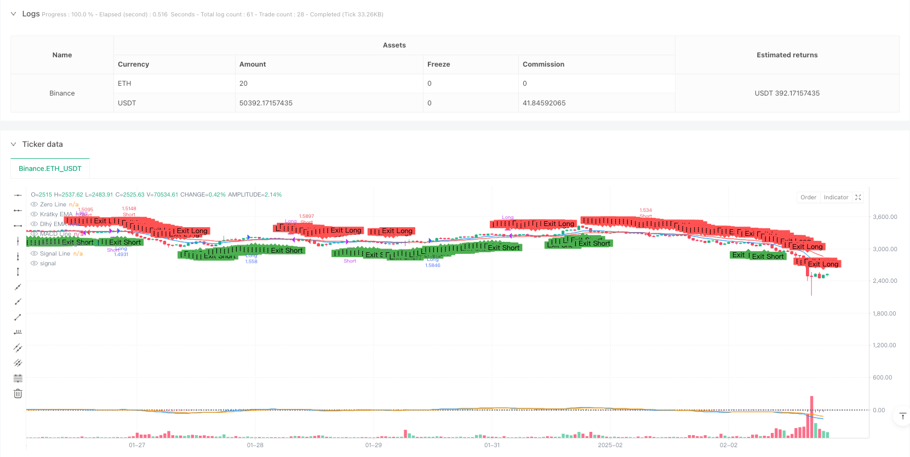
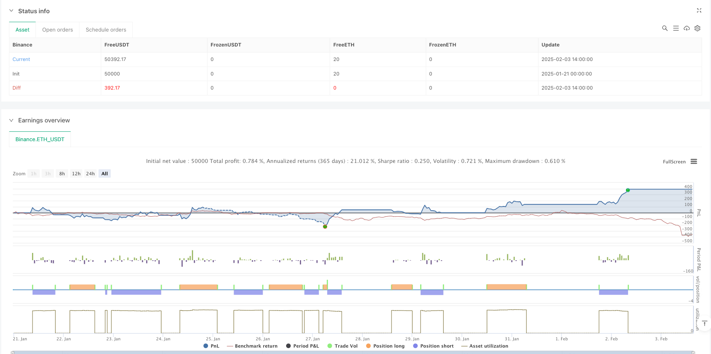

> Name

Dynamic-Trend-Momentum-Crossover-Strategy-Quantitative-Trading-System-Based-on-Dual-EMA-and-MACD-Indicators
> Author

ianzeng123

> Strategy Description





[trans]
#### Overview
This strategy is a quantitative trading system that combines the Exponential Moving Average (EMA) and Moving Average Convergence/Divergence (MACD) indicators. By integrating short-term and long-term EMA crossover signals, as well as MACD momentum confirmation, it provides traders with a comprehensive trend following solution. This strategy also includes dynamic stop-loss and take-profit mechanisms to effectively control risks while maximizing returns.
#### Strategy Principle
The core logic of the strategy is based on the synergy of two technical indicators. First, use the 12-period and 26-period EMA to identify market trends. When the short-term EMA crosses above the long-term EMA, it generates a long signal, and when it crosses below, it generates a short signal. Secondly, use the MACD indicator (12, 26, 9 settings) to confirm trend momentum, requiring the positional relationship between the MACD line and the signal line to support the trading signal generated by the EMA. The system uses a percentage method to set dynamic stop loss (default 2%) and take profit (default 5%), and trigger additional closing signals when EMA crosses or MACD reverses.
#### Strategic Advantages
1. Perfect signal confirmation mechanism: through double confirmation of EMA crossover and MACD momentum, the risk of false breakthroughs is significantly reduced
2. Flexible risk management: using percentage stop loss and stop profit to facilitate adjustments according to different market conditions and trading varieties
3. Excellent visualization: clearly display EMA lines, MACD indicators and trading signal markers on the chart
4. Strong parameter adjustability: allows adjustment of EMA cycle, MACD parameters and risk control ratio to adapt to different trading strategies
#### Strategy Risk
1. Trend reversal risk: Frequent crossovers may occur in volatile markets, leading to false signals
2. Lagging problem: EMA and MACD are both lagging indicators and may miss the best entry point in fast market conditions.
3. Money management risk: Fixed percentage stops may not be flexible enough in high volatility environments
4. Parameter optimization risk: Over-optimization may cause the strategy to perform worse than the backtest results in real trading
#### Strategy optimization direction
1. Introduce volatility indicator: It is recommended to add ATR indicator to dynamically adjust stop loss and take profit levels
2. Add market environment filtering: you can judge the strength of the trend through indicators such as ADX and avoid trading in volatile markets.
3. Optimize the signal confirmation mechanism: consider adding volume confirmation or other momentum indicators as an auxiliary
4. Improve fund management: implement a dynamic position management system based on account equity
#### Summary
This is a well designed and logical trend following strategy. By combining the advantages of EMA and MACD, a more reliable trading signal generation mechanism is achieved while keeping the strategy simple and easy to understand. The strategy is highly customizable and has a complete risk management mechanism, making it suitable as a basic framework for mid- to long-term trend trading. It is recommended that traders fully test the parameter settings before using them in real trading, and carry out targeted optimization according to specific trading varieties and market environment. ||
#### Overview
This strategy is a quantitative trading system that combines Exponential Moving Averages (EMA) and Moving Average Convergence Divergence (MACD) indicators. By integrating crossover signals from short-term and long-term EMAs with MACD momentum confirmation, it provides traders with a comprehensive trend-following solution. The strategy also includes dynamic stop-loss and take-profit mechanisms for effective risk control while maximizing potential returns.

#### Strategy Principles
The core logic is based on the synergy of two technical indicators. First, it uses 12-period and 26-period EMAs to identify market trends, generating long signals when the short-term EMA crosses above the long-term EMA, and short signals when it crosses below. Second, it uses the MACD indicator (12,26,9 settings) to confirm trend momentum, requiring the MACD line and Signal line relationship to support the EMA-generated trading signals. The system employs percentage-based dynamic stop-loss (default 2%) and take-profit (default 5%) levels, with additional exit signals triggered by EMA crossovers or MACD reversals.

#### Strategy Advantages
1. Robust signal confirmation: Dual confirmation through EMA crossovers and MACD momentum significantly reduces false breakout risks
2. Flexible risk management: Percentage-based stop-loss and take-profit levels easily adaptable to different market conditions and instruments
3. Excellent visualization: Clear display of EMA lines, MACD indicator, and trade signal markers on charts
4. Strong parameterization: Allows adjustment of EMA periods, MACD parameters, and risk control ratios to adapt to different trading strategies

#### Strategy Risks
1. Trend reversal risk: May generate frequent crossovers in ranging markets, leading to false signals
2. Lagging indicator issue: Both EMA and MACD are lagging indicators, potentially missing optimal entry points in fast-moving markets
3. Money management risk: Fixed percentage stops may not be flexible enough in high-volatility environments
4. Parameter optimization risk: Over-optimization may lead to poorer live trading performance compared to backtests

#### Optimization Directions
1. Incorporate volatility indicators: Suggest adding ATR indicator for dynamic stop-loss and take-profit adjustments
2. Add market environment filters: Consider using ADX or similar indicators to gauge trend strength and avoid ranging markets
3. Enhance signal confirmation: Consider adding volume confirmation or other momentum indicators as auxiliary signals
4. Improve money management: Implement dynamic position sizing based on account equity

#### Summary
This is a well-designed, logically sound trend-following strategy. By combining the strengths of EMA and MACD, it achieves a reliable trade signal generation mechanism while maintaining simplicity and clarity. The strategy offers strong customization options and robust risk management mechanisms, making it suitable as a foundation for medium to long-term trend trading. Traders are advised to thoroughly test parameter settings and optimize the strategy according to specific trading instruments and market conditions before live implementation.[/trans]


> Source (PineScript)

``` pinescript
/*backtest
start: 2025-01-21 00:00:00
end: 2025-02-03 15:00:00
period: 1h
basePeriod: 1h
exchanges: [{"eid":"Binance","currency":"ETH_USDT"}]
*/

//@version=5
strategy("EMA + MACD Strategy", overlay=true, default_qty_type=strategy.percent_of_equity, default_qty_value=10)

// === Inputs ===
shortEmaLength = input.int(12, title="Short EMA Period", minval=1)
longEmaLength = input.int(26, title="Long EMA Period", minval=1)
macdFastLength = input.int(12, title="MACD Fast EMA Period", minval=1)
macdSlowLength = input.int(26, title="MACD Slow EMA Period", minval=1)
macdSignalLength = input.int(9, title="MACD Signal Period", minval=1)
stopLossPerc = input.float(2.0, title="Stop-Loss (%)", minval=0.1, step=0.1)
takeProfitPerc = input.float(5.0, title="Take-Profit (%)", minval=0.1, step=0.1)

// === Indicator Calculations ===
// Exponential Moving Averages (EMA)
shortEMA = ta.ema(close, shortEmaLength)
longEMA = ta.ema(close, longEmaLength)

// MACD
[macdLine, signalLine, _] = ta.macd(close, macdFastLength, macdSlowLength, macdSignalLength)

// === Entry Conditions ===
// Buy signal: Short EMA crosses above Long EMA and MACD > Signal Line
longCondition = ta.crossover(shortEMA, longEMA) and (macdLine > signalLine)

// Sell signal: Short EMA crosses below Long EMA and MACD < Signal Line
shortCondition = ta.crossunder(shortEMA, longEMA) and (macdLine < signalLine)

// === Entry Signals with Stop-Loss and Take-Profit ===
if (longCondition)
    strategy.entry("Long", strategy.long)
    // Calculate Stop-Loss and Take-Profit
    stopPrice = close * (1 - stopLossPerc / 100)
    takePrice = close * (1 + takeProfitPerc / 100)
    strategy.exit("Long Exit", from_entry="Long", stop=stopPrice, limit=takePrice)

if (shortCondition)
    strategy.entry("Short", strategy.short)
    // Calculate Stop-Loss and Take-Profit
    stopPrice = close * (1 + stopLossPerc / 100)
    takePrice = close * (1 - takeProfitPerc / 100)
    strategy.exit("Short Exit", from_entry="Short", stop=stopPrice, limit=takePrice)

// === Exit Conditions ===
// Alternative exit conditions based on crossovers
exitLongCondition = ta.crossunder(shortEMA, longEMA) or (macdLine < signalLine)
exitShortCondition = ta.crossover(shortEMA, longEMA) or (macdLine > signalLine)

if (exitLongCondition)
    strategy.close("Long")

if (exitShortCondition)
    strategy.close("Short")

// === Indicator Plotting ===
// EMA
plot(shortEMA, color=color.blue, title="Short EMA")
plot(longEMA, color=color.red, title="Long EMA")

// MACD Indicator in separate window
hline(0, "Zero Line", color=color.gray, linestyle=hline.style_dotted)
plot(macdLine - signalLine, color=(macdLine - signalLine) >= 0 ? color.green : color.red, title="MACD Histogram", style=plot.style_histogram)
plot(macdLine, color=color.blue, title="MACD Line")
plot(signalLine, color=color.orange, title="Signal Line")

// === Signal Visualization ===
// Markers for Long and Short entries
plotshape(series=longCondition, title="Long Entry", location=location.belowbar, color=color.green, style=shape.labelup, text="Long")
plotshape(series=shortCondition, title="Short Entry", location=location.abovebar, color=color.red, style=shape.labeldown, text="Short")

// Markers for Long and Short exits
plotshape(series=exitLongCondition, title="Long Exit", location=location.abovebar, color=color.red, style=shape.labeldown, text="Exit Long")
plotshape(series=exitShortCondition, title="Short Exit", location=location.belowbar, color=color.green, style=shape.labelup, text="Exit Short")

```

> Detail

https://www.fmz.com/strategy/483121

> Last Modified

2025-02-27 16:56:29
