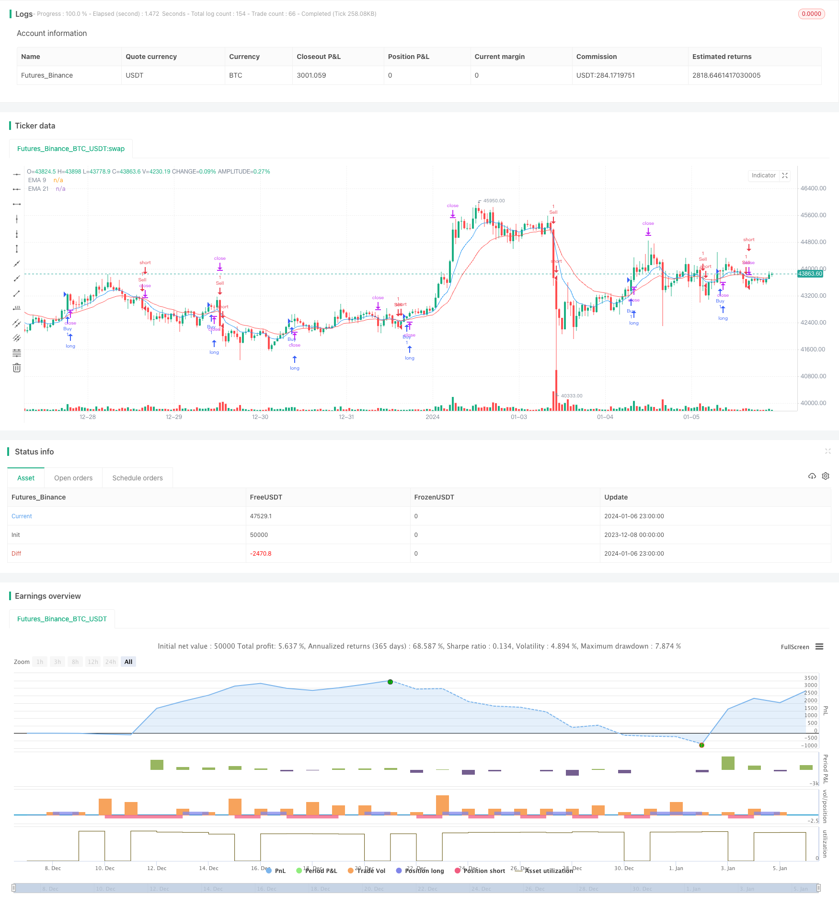

> Name

Trend following strategy EMA-Crossover-and-MACD-Signals-Trend-Following-Strategy based on EMA moving average and MACD indicator
> Author

ChaoZhang

> Strategy Description


[trans]

## Overview
This strategy uses the EMA moving average system and the MACD indicator to identify the trend direction. When the EMA moving average reaches a golden cross, it is judged to be an upward trend and a long order is established; when the EMA moving average crosses a death cross, it is judged to be a downward trend and a short order is established. To signal excessive filter volatility, the MACD indicator crosses over two time periods as an additional confirmation condition in the strategy.
## Strategy Principle
This strategy is mainly based on EMA and MACD indicators to capture medium and long-term price trends. Among them, the 9-period and 21-period EMA are used to construct the moving average system. The 9EMA responds quickly to price changes while the 21EMA is relatively stable. When the fast line crosses the slow line and a golden cross signal is generated, it is judged that the price is in an upward trend; conversely, when the fast line crosses the slow line and a death cross signal is generated, it is judged that the price has turned into a downward trend. The EMA crossover signal is affected by price fluctuations within a certain period. In order to filter out false signals, the strategy adds the crossover of the MACD indicator based on default parameters on the 1-hour and 4-hour time periods as an additional confirmation condition. Open a position after meeting the dual conditions of moving average crossover and MACD crossover.
So how to determine the timing of entry and exit after identifying the price reversal trend? This strategy determines that when the price is above the EMA moving average, it is an upward trend, and when it is below the EMA moving average, it is a downward trend. Therefore, if the closing price is higher than EMA 21 when the golden cross occurs, a long order will be opened; during the death cross, if the closing price is lower than EMA 21, a short order will be opened. The basis here is the support and pressure characteristics of the moving average price. After opening the position, set the stop loss and take profit prices to lock in profits and control risks.
## Strategic Advantages
1. Determine the medium and long-term trend direction based on the moving average, and then use the MACD indicator to filter out false signals, which can effectively identify price reversal points.
2. The combination of EMA moving average and lower rails and MACD long and short direction forms a multi-verified trading signal. This allows the strategy to trade when the trend is clear.
3. By opening a position near the EMA moving average and using the support pressure characteristics of the moving average to set stop loss and take profit, a better risk-reward ratio can be obtained.
4. Relatively long-term indicator parameter settings avoid signal interference by short-term market fluctuations and are suitable for mid- and long-term trend tracking.
## Strategy Risk
1. Neither the moving average system nor the MACD indicator can accurately predict the price reversal point, and there is a certain lag. If unexpected events lead to rapid adjustments, it may be too late to enter the market and stop the loss.
2. The crossover of EMA does not necessarily represent a real trend turning point. If the current market fluctuates greatly, the signal may not be reliable.
3. Improper setting of MACD indicator parameters may also result in false positive signals or missed signals, resulting in missed trading opportunities or wrong entry.
4. As a trend following strategy, it is easily negated by the market shock caused by unexpected events. Once the loss is stopped, the loss may be large.
## Strategy optimization direction
1. Test and adjust the long and short period values ​​of the EMA moving average to find the optimal parameter combination. For example, adjust to the 20 and 60 day EMA.
2. Test the parameters of the MACD indicator to obtain the most stable and reliable signal line combination. For example, adjust the long and short moving average periods of MACD.
3. Test and optimize stop-loss and take-profit conditions, and set the most appropriate stop-loss range. A comprehensive judgment can be made based on the benefit-risk ratio.
4. Add other indicator signals as confirmation indicators for EMA crossover. For example, the signal of KDJ indicator or Bollinger Band indicator.
5. Add an adaptive stop-loss strategy so that the stop-loss line can track the take-profit line and improve the effect of risk control.
## Summarize
This strategy integrates the advantages of the EMA moving average trading system and the MACD indicator, trying to capture the turning point of the medium and long-term price trend. After confirming the double signal, choose the best entry time to open a position, and set a stop loss and take profit to lock in profits. The accuracy of the signal can be further enhanced through parameter optimization and the addition of other indicators. However, it should be noted that as a trend following strategy, short-term market fluctuations may increase its stop loss risk. Generally speaking, this strategy is based on simple and easy-to-use technical indicators and forms a multiple verification mechanism. It is suitable for tracking medium and long-term price trends and can obtain a better profit-loss ratio.
||

## Overview  

This strategy utilizes the EMA crossover system and MACD indicator to identify trend direction. It goes long when a golden cross occurs on the EMA lines judging that an uptrend is established, and it goes short when a death cross occurs on the EMA lines judging that a downtrend has started. To filter signals with high volatility, an additional condition of MACD crossover on both the current and 4-hour timeframes is included to confirm buy or sell signals.

## Strategy Logic   

The strategy mainly relies on EMA crossover and MACD indicator to capture mid- to long-term price trends. The EMA system consists of 9-period and 21-period EMA. The 9 EMA responds quickly to price changes while the 21 EMA is relatively more stable. When the fast EMA line crosses above the slow EMA line, it generates a golden cross signal indicating an uptrend. When the fast EMA line crosses below the slow EMA line, it generates a death cross signal indicating a downtrend. EMA crossover signals can be affected by price fluctuations within certain periods. To filter false signals, this strategy utilizes MACD crossover on both 1-hour and 4-hour timeframes based on default parameters as an additional confirmation. When both EMA crossover and MACD crossover conditions are met, the strategy enters a position.

So when a trend reversal is identified, how to determine the entry and exit points? This strategy judges an uptrend when price is above EMA 21 and a downtrend when price is below EMA 21. Therefore, when a golden cross happens, a long position will be opened if the close price is higher than EMA 21. When a death cross happens, a short position will be opened if the close price is lower than EMA 21. The rationale here is the support and resistance characteristic of moving average prices. After entering a position, stop loss and take profit prices are set to lock in profits and control risks.  

## Advantages  

1. Identifying mid- to long-term trend direction based on MA lines and filtering false signals with MACD makes it effective to detect trend reversal points.

2. The combination of EMA channel and MACD crossover forms multiple layers of verification for trading signals, allowing the strategy to trade when a clear trend is established.  

3. By entering positions around EMA lines and utilizing their support/resistance levels for stop loss/profit taking, good risk reward ratios can be achieved.

4. The relatively long parameters prevent interference from short-term market fluctuations and suit for mid- to long-term trend following.

## Risks 

1. Both moving averages and MACD cannot precisely predict trend reversal points, with some lagging effect. Sudden price changes may trigger late entry with a stop loss hit. 

2. EMA crossovers do not necessarily represent real trend reversals. Signals can be unreliable if volatility of the current market cycle is high.

3. Inappropriate MACD parameter settings may cause missed or false signals, missing trading opportunities or entering in the wrong direction.

4. As a trend following strategy, it is vulnerable whipsaws in ranging markets. A stop loss hit may result in big loss in such cases.

## Enhancements

1. Test and optimize EMA period parameters to find the optimal combination, e.g. 20 and 60 days EMA. 

2. Test MACD parameters for the most reliable signal line combination, e.g. fast/slow EMA periods of MACD.

3. Test and optimize stop loss/profit taking rules to find the most appropriate stop loss percentage, judged by risk-reward ratios.

4. Incorporate other indicator signals as confirmation for EMA crossovers, e.g. KDJ indicator or Bollinger Bands. 

5. Add adaptive stop loss mechanism to trail stop loss along profit taking price, improving risk control.

## Conclusion   

This strategy combines the strengths of EMA trading system and MACD indicator in an attempt to capture mid- to long-term trend reversal points. It enters positions upon confirming dual signals and set stop loss/profit taking levels to lock in profits. Further improvements on signal accuracy can be achieved through parameter optimization and incorporating additional indicators. Note that as a trend following strategy, it is vulnerable to whipsaws in the short term. Overall, building upon simple and intuitive technical indicators while forming multi-layer signal verification, this strategy suits for mid- to long-term trend tracking and can achieve decent risk-adjusted returns.
[/trans]

> Strategy Arguments


|Argument|Default|Description|
|----|----|----|
|v_input_float_1|true|Stop Loss (%)|
|v_input_float_2|2|Take Profit (%)|


> Source (PineScript)

``` pinescript
/*backtest
start: 2023-12-08 00:00:00
end: 2024-01-07 00:00:00
period: 1h
basePeriod: 15m
exchanges: [{"eid":"Futures_Binance","currency":"BTC_USDT"}]
*/

//@version=5
strategy("EMA Crossover and Close Above/Below EMA 21", overlay=true)

// Define the EMA lengths
ema9 = ta.ema(close, 9)
ema21 = ta.ema(close, 21)

// Define Buy and Sell conditions
buyCondition = ta.crossover(ema9, ema21) and close > ema21
sellCondition = ta.crossunder(ema9, ema21) and close < ema21

// Calculate stop loss and take profit levels (adjust as needed)
stopLossPct = input.float(1, title="Stop Loss (%)") / 100
takeProfitPct = input.float(2, title="Take Profit (%)") / 100

stopLoss = close * (1 - stopLossPct)
takeProfit = close * (1 + takeProfitPct)

// Plot EMA lines
plot(ema9, color=color.blue, title="EMA 9")
plot(ema21, color=color.red, title="EMA 21")

// Strategy entry and exit
if buyCondition
    strategy.entry("Buy", strategy.long)

if sellCondition
    strategy.entry("Sell", strategy.short)

strategy.exit("Take Profit/Stop Loss", from_entry="Buy", stop=stopLoss, limit=takeProfit)

```

> Detail

https://www.fmz.com/strategy/438034

> Last Modified

2024-01-08 14:31:56
