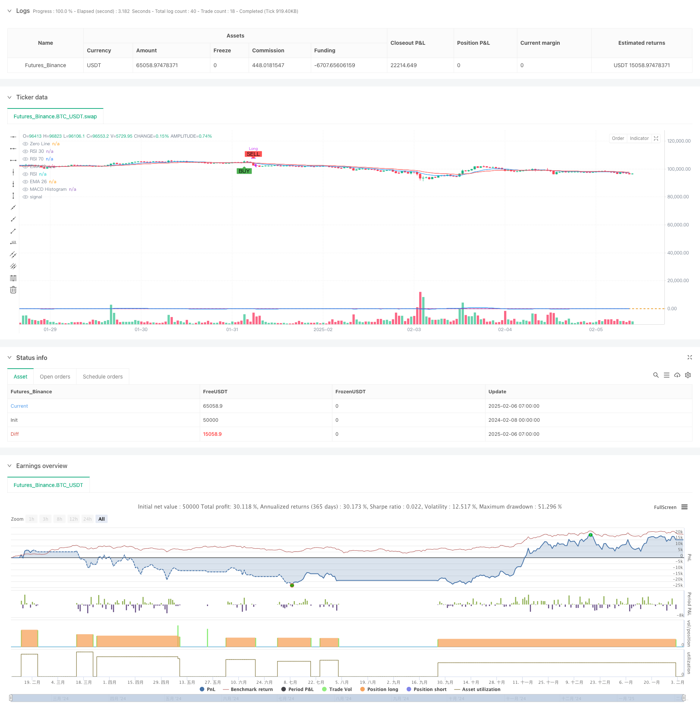

> Name

Multi-Indicator-Trend-Momentum-Crossover-Strategy-EMA-Dual-Moving-Average-with-MACD-RSI-Synergy-System
> Author

ChaoZhang

> Strategy Description



[trans]
#### Overview
This strategy is a multi-dimensional quantitative trading system that combines the exponential moving average (EMA), the moving average convergence dispersion (MACD) and the relative strength indicator (RSI). By integrating technical indicators from three dimensions: trend tracking, momentum confirmation, and overbought and oversold analysis, a complete trading decision-making framework is constructed. The core of the strategy is to capture the market trend through the intersection of the EMA double moving average, while combining the MACD momentum indicator to confirm the trend strength, and using the RSI indicator to filter extreme market conditions, thereby improving the accuracy and stability of trading.
#### Strategy Principle
The strategy adopts a triple signal confirmation mechanism:
1. EMA double moving average system: Use the 12-period and 26-period exponential moving averages as the main trend judgment indicators, and determine the change in trend direction through the intersection of the fast line and the slow line.
2. MACD indicator system: Calculate the MACD line based on 12 and 26 periods, and use the 9-period signal line to judge momentum changes by crossing the two lines.
3. RSI overbought and oversold filtering: Use the 14-period RSI indicator and set 70 and 30 as overbought and oversold thresholds to filter extreme market conditions.
Multiple signal combinations constitute trading conditions:
- Long condition: EMA12 crosses above EMA26 + MACD crosses signal line + RSI below 70
- Closing conditions: EMA12 crosses below EMA26 + MACD line crosses below signal line + RSI is above 30
#### Strategic Advantages
1. High signal reliability: Through the collaborative confirmation of multiple technical indicators, the impact of false signals is significantly reduced.
2. Improved risk control: The RSI overbought and oversold filtering mechanism effectively avoids inappropriate transactions under extreme market conditions.
3. Accurate trend grasp: The EMA double moving average system has a remarkable tracking effect on medium and long-term trends.
4. Clear execution logic: The entry and exit conditions of the strategy are clear, which facilitates programmatic implementation and backtest optimization.
5. Strong adaptability: various indicator parameters can be flexibly adjusted according to different market environments.
#### Strategy Risk
1. Signal lag: Moving average indicators inherently have a certain lag, which may lead to delayed entry opportunities.
2. Shock market risk: In range-bound market conditions, frequent cross signals may lead to over-trading.
3. Risk of signal conflict: Using multiple indicators at the same time may produce conflicting signals.
4. Parameter sensitivity: The strategy effect is more sensitive to the indicator parameter settings, and improper parameter selection may affect the strategy performance.
#### Strategy optimization direction
1. Dynamic parameter optimization: Introduce an adaptive parameter adjustment mechanism to dynamically adjust indicator parameters according to market fluctuations.
2. Market environment classification: Add a market environment identification module and use different signal weights under different market conditions.
3. Stop loss optimization: Add a dynamic stop loss mechanism based on ATR or volatility to improve the flexibility of risk control.
4. Position management: Introduce a dynamic position management system based on volatility to optimize capital utilization efficiency.
5. Signal weight system: Establish a dynamic weight system for indicator signals and adjust the signal weight according to the historical accuracy of different indicators.
#### Summary
This strategy builds a comprehensive trading decision-making system through the coordinated operation of multiple technical indicators. The strategy performs well in trending markets and effectively controls risks through the RSI filtering mechanism. It is suitable as the basic framework of a mid- to long-term trend tracking system. However, considering the hysteresis characteristics of moving average indicators, it is recommended to combine market environment analysis in practical applications and further optimize through dynamic parameter optimization and position management. ||
#### Overview
This strategy is a multi-dimensional quantitative trading system that combines Exponential Moving Averages (EMA), Moving Average Convergence Divergence (MACD), and Relative Strength Index (RSI). By integrating trend following, momentum confirmation, and overbought/oversold analysis, it establishes a comprehensive trading decision framework. The strategy's core lies in capturing market trends through EMA crossovers while confirming trend strength with MACD momentum indicators and filtering extreme market conditions using RSI.

#### Strategy Principles
The strategy employs a triple signal confirmation mechanism:
1. EMA Dual System: Uses 12-period and 26-period exponential moving averages as primary trend indicators, identifying trend changes through fast-slow line crossovers.
2. MACD System: Calculates MACD based on 12 and 26 periods, using a 9-period signal line to determine momentum changes through crossovers.
3. RSI Filter: Employs 14-period RSI with 70 and 30 as overbought/oversold thresholds to filter extreme market conditions.

Combined signals form trading conditions:
- Long Entry: EMA12 crosses above EMA26 + MACD crosses above signal line + RSI below 70
- Exit: EMA12 crosses below EMA26 + MACD crosses below signal line + RSI above 30

#### Strategy Advantages
1. High Signal Reliability: Multiple technical indicator confirmation significantly reduces false signals.
2. Comprehensive Risk Control: RSI filtering effectively prevents inappropriate trades in extreme market conditions.
3. Accurate Trend Capture: EMA dual system effectively tracks medium to long-term trends.
4. Clear Execution Logic: Well-defined entry and exit conditions facilitate programmatic implementation and backtesting.
5. High Adaptability: Indicator parameters can be flexibly adjusted for different market environments.

#### Strategy Risks
1. Signal Lag: Moving average indicators inherently have some delay, potentially causing delayed entries.
2. Sideways Market Risk: Frequent crossover signals in range-bound markets may lead to overtrading.
3. Signal Conflict Risk: Multiple indicators may generate contradictory signals.
4. Parameter Sensitivity: Strategy performance is sensitive to indicator parameter settings.

#### Optimization Directions
1. Dynamic Parameter Optimization: Introduce adaptive parameter adjustment based on market volatility.
2. Market Environment Classification: Add market state recognition to apply different signal weights in various market conditions.
3. Stop-Loss Enhancement: Implement dynamic stop-loss mechanisms based on ATR or volatility.
4. Position Management: Introduce volatility-based dynamic position sizing system.
5. Signal Weighting System: Establish dynamic indicator signal weights based on historical accuracy.

#### Summary
This strategy builds a comprehensive trading decision system through the synergistic operation of multiple technical indicators. It excels in trending markets and effectively controls risk through RSI filtering, making it suitable as a foundation for medium to long-term trend following systems. However, considering the lag inherent in moving average indicators, it's recommended to combine market environment analysis and implement further optimizations through dynamic parameter adjustment and position management in practical applications.[/trans]


> Source (PineScript)

``` pinescript
/*backtest
start: 2024-02-08 00:00:00
end: 2025-02-06 08:00:00
period: 1h
basePeriod: 1h
exchanges: [{"eid":"Futures_Binance","currency":"BTC_USDT"}]
*/

//@version=5
strategy("EMA12 + EMA26 + MACD + RSI Strategy", overlay=true, default_qty_type=strategy.percent_of_equity, default_qty_value=200)

// EMA calculations
ema12 = ta.ema(close, 12)
ema26 = ta.ema(close, 26)

// MACD calculations
[macdLine, signalLine, _] = ta.macd(close, 12, 26, 9)

// RSI calculation
rsi = ta.rsi(close, 14)

// Plot EMAs
plot(ema12, color=color.blue, title="EMA 12")
plot(ema26, color=color.red, title="EMA 26")

// Plot MACD Histogram
hline(0, "Zero Line", color=color.gray)
plot(macdLine - signalLine, color=color.blue, title="MACD Histogram")

// Plot RSI
hline(30, "RSI 30", color=color.orange)
hline(70, "RSI 70", color=color.orange)
plot(rsi, color=color.purple, title="RSI")

// Buy condition: EMA12 crosses above EMA26, MACD crosses above signal, RSI below 70
buyCondition = ta.crossover(ema12, ema26) and ta.crossover(macdLine, signalLine) and rsi < 70

// Sell condition: EMA12 crosses below EMA26, MACD crosses below signal, RSI above 30
sellCondition = ta.crossunder(ema12, ema26) and ta.crossunder(macdLine, signalLine) and rsi > 30

// Plot buy/sell signals
plotshape(series=buyCondition, title="Buy Signal", location=location.belowbar, color=color.green, style=shape.labelup, text="BUY")
plotshape(series=sellCondition, title="Sell Signal", location=location.abovebar, color=color.red, style=shape.labeldown, text="SELL")

// Execute trades
if (buyCondition)
    strategy.entry("Long", strategy.long)

if (sellCondition)
    strategy.close("Long")

```

> Detail

https://www.fmz.com/strategy/481105

> Last Modified

2025-02-08 15:15:07
