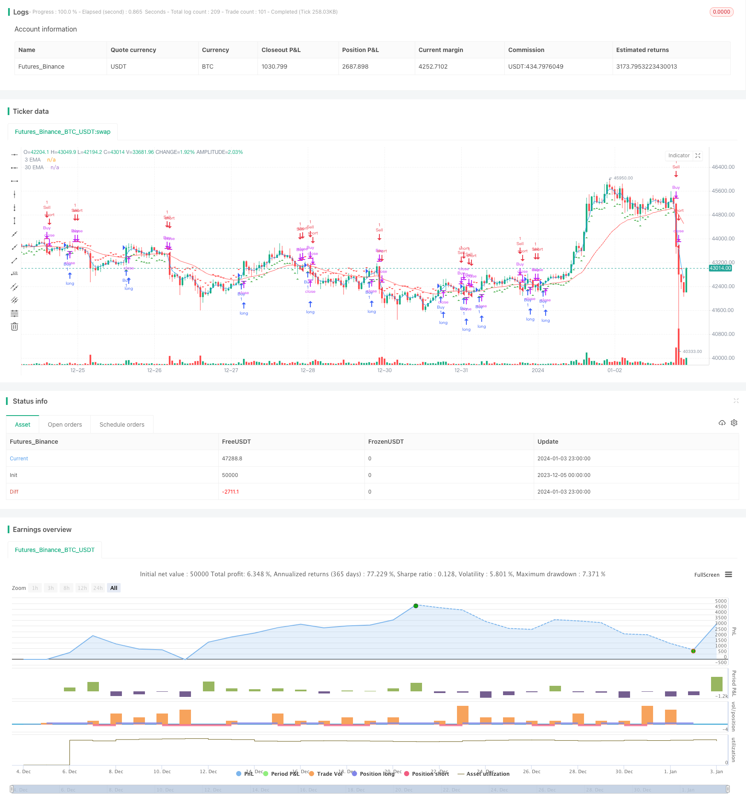

> Name

Merged-Short-Term-and-Long-Term-EMA-Decision-Strategy
> Author

ChaoZhang

> Strategy Description


[trans]

## Overview
The main idea of ​​this strategy is to use the crossover of the short-term EMA and the long-term EMA as buy and sell signals. Specifically, a buy signal is generated when the short-term EMA crosses the long-term EMA from below; a sell signal is generated when the short-term EMA crosses below the long-term EMA from above.
## Strategy Principle
This strategy first defines the short-term EMA period as 3 days and the long-term EMA period as 30 days. Then calculate the values ​​of these two EMAs. The short-term EMA reflects recent price changes, and the long-term EMA reflects the long-term price trend. When the short-term EMA crosses the long-term EMA, it means that the recent price has begun to rise and outperform the long-term trend. This is a signal to establish a long position. When the short-term EMA crosses below the long-term EMA, it means that the recent price has begun to fall and underperform the long-term trend. This is the time to establish a short position.
Specifically, the strategy defines a differential value to determine EMA crossovers. A buy signal is generated when the difference is greater than the threshold of 0.0005, and a sell signal is generated when it is less than the threshold of -0.0005. The positive or negative value of the difference indicates that the short-term EMA is above or below the long-term EMA. Traders use this to decide the direction of opening a position.
This strategy also marks triangle up and triangle down graphics on the K-line chart to visually display buy and sell signals.
## Advantage Analysis
The biggest advantage of this strategy is that it is simple and effective. It uses EMA, the most basic indicator, to judge the market structure and avoids the risk of curve fitting caused by overly complex models.
As a trend tracking indicator, EMA can effectively smooth random noise and determine the direction of long- and short-term trends. Compared with other common indicators such as long-term and short-term moving average crossovers, EMA has exponential smoothing characteristics in calculation and can respond to price changes more quickly.
In addition, this strategy combines multiple EMA periods at the same time, and can filter out false breakthroughs to a certain extent through the crossover of long and short term EMAs. This is also more robust than a single EMA cycle strategy.
## Risk Analysis
The biggest risk with this strategy is the lagging nature of the EMA itself. When a rapid gap or price reversal occurs, the EMA crossover signal often lags behind and cannot reflect market changes in a timely manner. This may result in missing the best opportunity to open a position or not stopping losses in time.
In addition, the choice of EMA period will also affect the strategy performance. If the period is not chosen properly, it will result in too many false signals. For example, if the short-term cycle is too short, it may cause you to be too sensitive to market noise; if the long-term cycle is too long, you may not be able to catch the trend turning point in time.
Finally, fixed incremental entry and exit thresholds can also lead to improper position control. When the volatility is large, the threshold should be adjusted appropriately to control the position.
## Optimization direction
This strategy can be optimized from the following aspects:
1. Dynamically optimize the EMA cycle. The best short- and long-term EMA combination can be selected or automatically optimized according to market conditions to improve the robustness of the strategy.
2. Introduce an adaptive stop loss mechanism. While ensuring stop loss, set a reasonable moving stop loss line based on market volatility to avoid overly aggressive stop loss.
3. Filter signals in combination with other indicators. For example, position control indicators, volatility indicators, etc. can avoid EMA cross signals from causing large losses when volatility is high.
4. Introduce machine learning technology. Train the model to predict the best EMA period parameter combination. In addition, you can also predict the EMA difference and get more accurate trading signals.
## Summarize
This short-term and long-term EMA decision-making merger strategy is generally very simple and straightforward. It uses EMA as a basic indicator to determine the long-short market structure and avoids over-optimization and model risks. Combining multiple EMA periods simultaneously also improves signal quality. But we must also pay attention to the risks that may be caused by the hysteresis of EMA itself, which requires subsequent appropriate optimization to solve.
|| 

## Overview

The main idea of this strategy is to use the crossovers between short-term EMA and long-term EMA as buy and sell signals. Specifically, when the short-term EMA crosses above the long-term EMA from below, a buy signal is generated. When the short-term EMA crosses below the long-term EMA from above, a sell signal is generated.  

## Strategy Principle  

The strategy first defines the short-term EMA period as 3 days and the long-term EMA period as 30 days. Then it calculates the values of these two EMAs. The short-term EMA reflects recent price changes and the long-term EMA reflects long-term price trends. When the short-term EMA crosses above the long-term EMA, it indicates that recent prices have started to rise, outperforming the long-term trend. This is the signal to establish a long position. When the short-term EMA crosses below the long-term EMA, it indicates that recent prices have started to fall, underperforming the long-term trend. This is the timing to establish a short position.

Specifically, the strategy defines a difference to judge the crossover of EMAs. When the difference is greater than the threshold of 0.0005, a buy signal is generated. When it is less than the threshold of -0.0005, a sell signal is generated. The positivity and negativity of the difference represents that the short-term EMA is above or below the long-term EMA. Traders use this to determine the opening direction.  

The strategy also marks triangle up and triangle down graphics on the candlestick chart to visually display buy and sell signals.

## Advantage Analysis

The biggest advantage of this strategy is that it is simple and effective. It uses the most basic indicator EMA to judge market structure and avoids the risk of overfitting from overly complicated models.

As a trend tracking indicator, EMA can effectively smooth random noise and determine long and short term trend directions. Compared with other common indicators such as long and short term moving average crossovers, EMA has an exponential smoothing feature in its calculation that can respond to price changes more quickly.

In addition, by combining multiple EMA cycles, the crossover between long and short term EMAs can filter false breakouts to some extent compared to single EMA cycle strategies, making it more robust.

## Risk Analysis  

The biggest risk of this strategy lies in the lag of EMA itself. When there are rapid gaps or price reversals, EMA crossover signals often lag, failing to reflect market changes in time. This may lead to missing the best opening opportunities or failing to stop loss in time.

In addition, the choice of EMA periods also affects strategy performance. If the cycles are improperly selected, it will lead to too many false signals. For example, excessively short term cycles may cause oversensitivity to market noise, while excessively long term cycles cannot capture trend turns in time.

Finally, fixed incremental entry and exit thresholds can also lead to improper position control. Thresholds should be adjusted appropriately to control positions when volatility is high.

## Optimization Directions

The strategy can be optimized in the following aspects:

1. Dynamically optimize EMA cycles. Select or automatically optimize the best short and long term EMA combinations according to market conditions to improve strategy robustness.  

2. Introduce adaptive stop loss mechanism. Set reasonable moving stop-loss lines based on market volatility while ensuring effective stop loss.

3. Combine with other indicators to filter signals. For example, position control indicators, volatility indicators, etc., to avoid significant losses caused by EMA crossover signals during high volatility.  

4. Introduce machine learning techniques. Train models to predict optimal EMA parameter combinations. Models can also be used to predict EMA differences to obtain more accurate trading signals.

## Conclusion 

In summary, this short-term and long-term EMA merged decision strategy is very simple and direct. By using the basic EMA indicator to determine bullish and bearish market structures, it avoids excessive optimization and model risks. Meanwhile, combining multiple EMA cycles also improves signal quality. However, we also need to pay attention to the lag risk EMA itself may bring, which needs subsequent proper optimization to solve.

[/trans]


> Source (PineScript)

``` pinescript
/*backtest
start: 2023-12-05 00:00:00
end: 2024-01-04 00:00:00
period: 1h
basePeriod: 15m
exchanges: [{"eid":"Futures_Binance","currency":"BTC_USDT"}]
*/

//@version=5
strategy("Merged EMA Strategy", shorttitle="MergedEMA", overlay=true)

// Define EMA periods
shortEMA = ta.ema(close, 3)
longEMA = ta.ema(close, 30)

// Plot EMAs on the chart
plot(shortEMA, color=color.blue, title="3 EMA")
plot(longEMA, color=color.red, title="30 EMA")

// Calculate the difference between short and long EMAs
emaDifference = shortEMA - longEMA

// Set threshold for buy and sell signals
buyThreshold = 0.0005
sellThreshold = -0.0005

// Define buy and sell conditions
buyCondition = emaDifference > buyThreshold
sellCondition = emaDifference < sellThreshold

// Plot buy and sell signals on the chart
plotshape(series=buyCondition, title="Buy Signal", color=color.green, style=shape.triangleup, location=location.belowbar)
plotshape(series=sellCondition, title="Sell Signal", color=color.red, style=shape.triangledown, location=location.abovebar)

// Strategy logic
strategy.entry("Buy", strategy.long, when = buyCondition)
strategy.close("Buy", when = sellCondition)

strategy.entry("Sell", strategy.short, when = sellCondition)
strategy.close("Sell", when = buyCondition)
```

> Detail

https://www.fmz.com/strategy/437794

> Last Modified

2024-01-05 16:07:58
