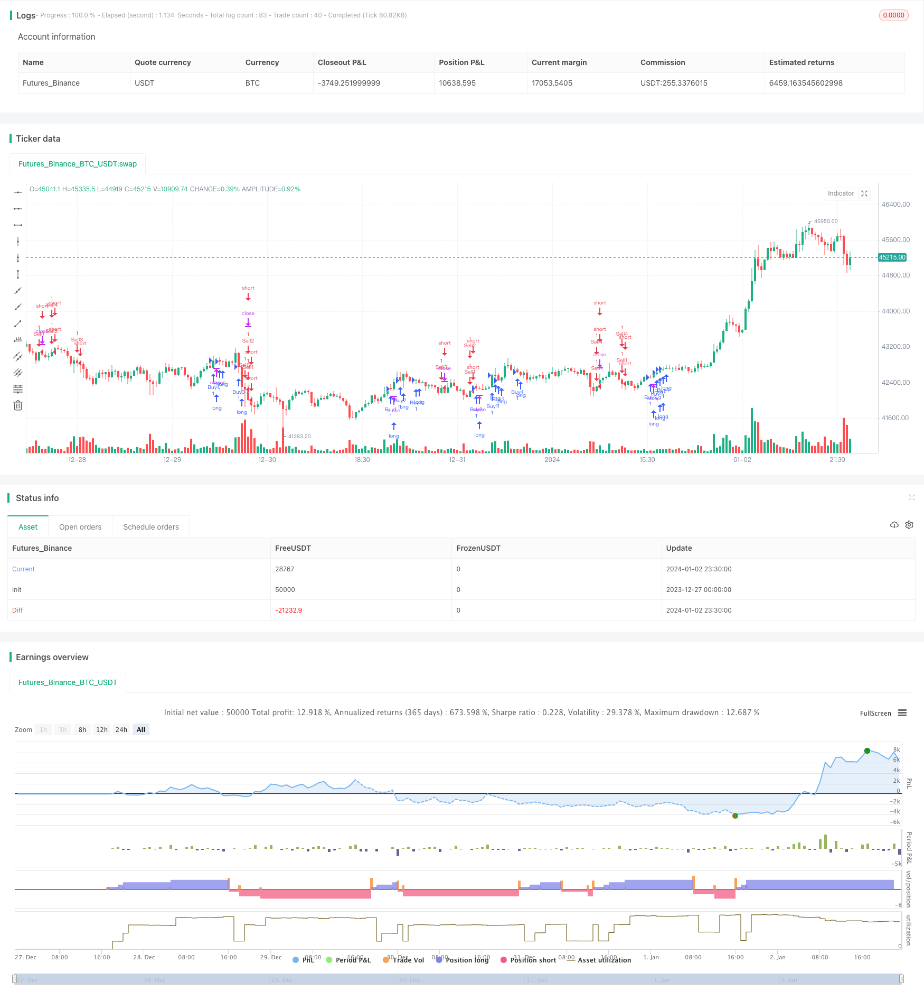

> Name

Multi-EMA-Crossover-Trend-Following-Strategy Multi-EMA-Crossover-Trend-Following-Strategy
> Author

ChaoZhang

> Strategy Description



[trans]

## Overview
The multiple EMA moving average cross trend following strategy realizes trend following trading by combining multiple sets of EMA moving averages with different parameters to go long when a golden cross forms on the shorter period EMA and short when a dead cross forms. This strategy uses 7 groups of EMA moving averages at the same time, including 12, 26, 50, 100, 200, 89 and 144 periods, and determines the trend direction by comparing the crossovers of these EMAs.
## Strategy Principle
The core logic of this strategy is based on the crossover principle of EMA. Among the EMA moving averages, the EMA with a shorter period is more sensitive to price changes and can reflect the latest price trend; while the EMA with a longer period is less sensitive to price changes and can reflect the long-term trend. When the short-period EMA crosses a long-period EMA from below, a so-called "golden cross" is formed, indicating that the short-term trend has turned bullish, and a long order can be set. On the contrary, when the short-period EMA crosses a long-period EMA from above, a "death cross" is formed, indicating that the short-term trend has turned bearish, and a short order can be set.
This strategy uses 7 groups of EMA moving averages, including 12&26, 12&50, 12&100, 12&200, 12&89 and 12&144. The strategy will compare the crossovers of these 7 groups of EMA at the same time. For example, when the 12-day EMA crosses above the 26-day EMA to form a golden cross, a long position will be opened; when a dead cross occurs, the long position will be closed. The strategy also uses the same logic for the other 6 groups of EMA moving averages.
## Advantage Analysis
The biggest advantage of this strategy is that it can capture trends on multiple time scales simultaneously. By combining multiple EMA moving averages, the strategy can capture short-term trends and track long-term trends, achieving multi-timeline trend tracking. In addition, the strategy can optimize performance by adjusting the parameters of different EMAs.
## Risk Analysis
The main risk of this strategy is that when multiple EMAs are used in combination, crossover signals may occur too frequently. For example, the number of crossovers between the 12-day EMA and the 26-day EMA is more frequent than that between the 12-day EMA and the 200-day EMA. If the frequency of opening and closing positions cannot be controlled, transaction costs and slippage losses will increase. In addition, the EMA moving average itself has a lag in price changes, which may cause signals to be generated untimely.
In order to reduce the above risks, the cycle parameters of EMA can be appropriately optimized so that the crossover frequency is within a suitable range; in addition, the number of positions opened in a single day can be appropriately limited or stop losses can be set to control risks.
## Optimization direction
The optimization space of this strategy mainly focuses on parameter adjustment of EMA moving average. You can try more parameter combinations with different periods; you can also experiment with other types of moving averages such as SMA. In addition, the strategy can add additional conditions to filter signals, such as volume indicators, volatility indicators, etc., thereby improving signal quality. Adding a stop-loss strategy can also be further optimized to reduce the impact of violent market fluctuations.
## Summarize
The multiple EMA moving average crossover trend following strategy determines the trend direction by comparing the crossover situations of multiple EMAs and achieves trend tracking on multiple time scales. It is a common trend following strategy. The advantage of this strategy is that it can flexibly adjust parameters and capture trends at different levels; the disadvantage is that the signals may be too frequent, increasing transaction costs. Strategy performance can be further improved through parameter optimization and adding auxiliary conditions.
||

## Overview

The Multi-EMA Crossover Trend Following Strategy combines multiple EMA lines with different parameters to identify trend directions based on crossover signals, aiming to follow trends in the market. It utilizes 7 EMA lines, including periods of 12, 26, 50, 100, 200, 89 and 144, by comparing their crossover situations.

## Strategy Logic  

The core logic of this strategy is based on the crossover principles of EMA lines. Among EMAs, shorter period EMAs are more sensitive to recent price changes and can reflect near-term trends, while longer period EMAs are less sensitive and represent long-term trends. When a shorter EMA crosses above a longer EMA from below, a “golden cross” is formed, indicating the short-term trend is turning bullish. A “death cross” appears when a shorter EMA crosses below a longer EMA from above, signaling a bearish trend reversal.

This strategy monitors 7 groups of EMA crossovers simultaneously, including 12&26, 12&50, 12&100, 12&200, 12&89 and 12&144 periods. For example, when the 12-day EMA crosses above the 26-day EMA, the strategy will open a long position. It will close the long position when a death cross happens. The same logic applies to other EMA pairs.

## Advantage Analysis   

The biggest advantage of this strategy is the ability to capture trends across multiple timeframes. By combining multiple EMAs, it can identify both short-term and long-term trends, realizing multi-timeframe trend following. In addition, the strategy performance can be optimized by adjusting EMA parameters.

## Risk Analysis

The main risk of this strategy is overfrequent crossover signals when using multiple EMAs together. For example, crossovers between 12-day and 26-day EMAs happen more often than those between 12-day and 200-day lines. Frequent entries and exits may increase trading costs and slippage. Also, EMAs have lagging nature, which may cause untimely trade signals. 

To mitigate the risks, EMA periods can be optimized to control crossover frequency at proper levels. Limiting max daily entry numbers or setting stop loss may also restrict risks.

## Improvement Directions

The main optimization space lies in adjusting EMA parameters, such as experimenting with more period combinations or trying other moving averages like SMA. Additional filters can also be added to improve signal quality, for example, volume or volatility indicators. Furthermore, stop loss strategies may be used to reduce the impact of market turbulence.

## Conclusion  

The Multi-EMA Crossover Trend Following Strategy identifies trend directions by comparing crossover situations among multiple EMAs, capturing trends across timeframes. Its advantage is the flexibility to tweak parameters and catch trends on different levels. The drawback is potentially overfrequent signals and increased trading costs. Further improvements can be achieved through parameter optimization and adding supplementary conditions.

[/trans]

> Strategy Arguments


|Argument|Default|Description|
|----|----|----|
|v_input_1_close|0|Source: close|high|low|open|hl2|hlc3|hlcc4|ohlc4|
|v_input_2|12|Shortest Line|
|v_input_3|26|Shorter Line|
|v_input_4|50|Short Line|
|v_input_5|100|Middle Line|
|v_input_6|200|Long Line|
|v_input_7|89|Longer Line|
|v_input_8|144|Longest Line|


> Source (PineScript)

``` pinescript
/*backtest
start: 2023-12-27 00:00:00
end: 2024-01-03 00:00:00
period: 30m
basePeriod: 15m
exchanges: [{"eid":"Futures_Binance","currency":"BTC_USDT"}]
*/

//@version=2
strategy("EMA Trades", overlay=true, pyramiding=4)

src = input(close, title="Source")

shortestLine = input(12, minval=1, title="Shortest Line")
shorterLine = input(26, minval=1, title="Shorter Line")
shortLine = input(50, minval=1, title="Short Line")
middleLine = input(100, minval=1, title="Middle Line")
longLine = input(200, minval=1, title="Long Line")
longerLine = input(89, minval=1, title="Longer Line")
longestLine = input(144, minval=1, title="Longest Line")

shortestLineOutput = ema(src, shortestLine)
shorterLineOutput = ema(src, shorterLine)
shortLineOutput = ema(src, shortLine)
middleLineOutput = ema(src, middleLine)
longLineOutput = ema(src, longLine)
longerLineOutput = ema(src, longerLine)
longestLineOutput = ema(src, longestLine)

//plot(shortestLineOutput, title="Shortest EMA", color=#ffffff)
//plot(shorterLineOutput, title="Shorter EMA", color=#e54fe6)
//plot(shortLineOutput, title="Short EMA", color=#4e6bc3)
//plot(middleLineOutput, title="Middle EMA", color=#1dd6d8)
//plot(longLineOutput, title="Long EMA", color=#d0de10)
//plot(longerLineOutput, title="Longer EMA", color=#ef6a1a)
//plot(longestLineOutput, title="Longest EMA", color=#ff0e0e)

longEnrtyCondition_1 = crossover(shortestLineOutput[1], shorterLineOutput[1]) and shortestLineOutput > shorterLineOutput
longEntryCondition_2 = crossover(shortestLineOutput[1], shortLineOutput[1]) and shortestLineOutput > shortLineOutput
longEnrtyCondition_3 = crossover(shortestLineOutput[1], middleLineOutput[1]) and shortestLineOutput > middleLineOutput
longEntryCondition_4 = crossover(shortestLineOutput[1], longLineOutput[1]) and shortestLineOutput > longLineOutput

shortEnrtyCondition_1 = crossunder(shortestLineOutput[1], shorterLineOutput[1]) and shortestLineOutput < shorterLineOutput
shortEntryCondition_2 = crossunder(shortestLineOutput[1], shortLineOutput[1]) and shortestLineOutput < shortLineOutput
shortEnrtyCondition_3 = crossunder(shortestLineOutput[1], middleLineOutput[1]) and shortestLineOutput < middleLineOutput
shortEntryCondition_4 = crossunder(shortestLineOutput[1], longLineOutput[1]) and shortestLineOutput < longLineOutput

if (longEnrtyCondition_1)
    strategy.entry("Buy1", strategy.long)
    strategy.exit("Sell1")

if (longEntryCondition_2)
    strategy.entry("Buy2", strategy.long)
    strategy.exit("Sell2")

if (longEnrtyCondition_3)
    strategy.entry("Buy3", strategy.long)
    strategy.exit("Sell3")

if (longEntryCondition_4)
    strategy.entry("Buy4", strategy.long)
    strategy.exit("Sell4")

if (shortEnrtyCondition_1)
    strategy.entry("Sell1", strategy.short)
    strategy.exit("Buy1")

if (shortEntryCondition_2)
    strategy.entry("Sell2", strategy.short)
    strategy.exit("Buy2")

if (shortEnrtyCondition_3)
    strategy.entry("Sell3", strategy.short)
    strategy.exit("Buy3")

if (shortEntryCondition_4)
    strategy.entry("Sell4", strategy.short)
    strategy.exit("Buy4")
```

> Detail

https://www.fmz.com/strategy/437665

> Last Modified

2024-01-04 16:22:07
