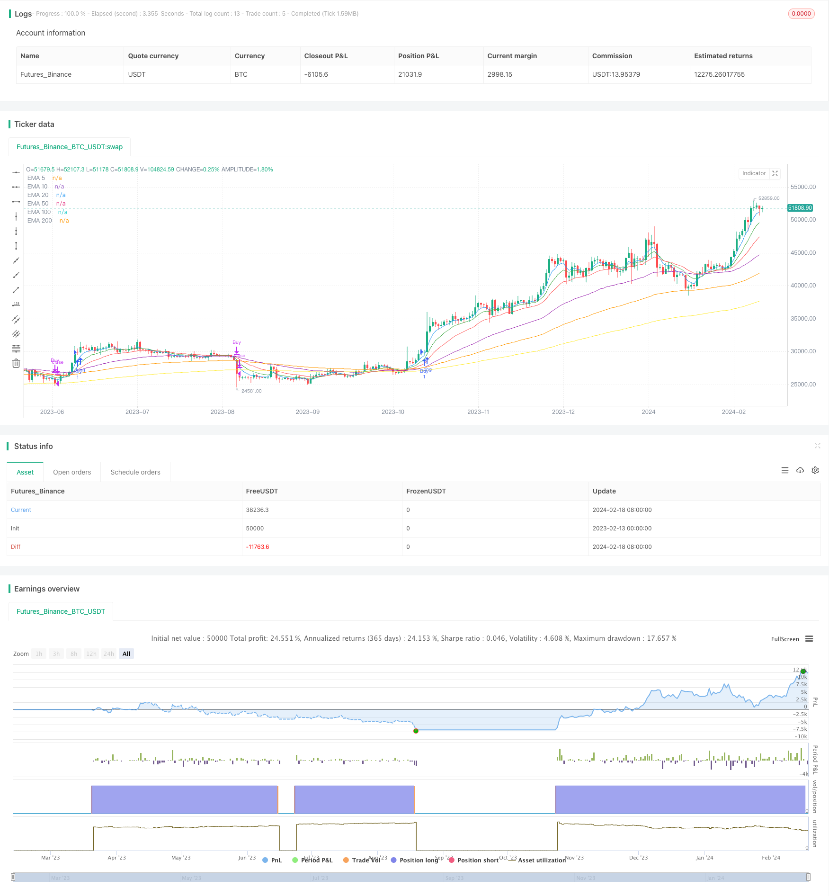

> Name

Based on multiple EMA buying strategyMultiple-EMA-Buy-Strategy
> Author

ChaoZhang

> Strategy Description


[trans]
## Overview
This strategy is a buy-only strategy based on price action and short-term trends. It uses multiple exponential moving averages (EMA) as technical indicators for buying and selling.
## Strategy Principle
This strategy uses six EMAs: 5-day, 10-day, 20-day, 50-day, 100-day and 200-day. Its buy signal is:
1. The 5-day line crosses the 10-day line
2. The 10-day line crosses the 20-day line
3. The 20-day line crosses the 50-day line
4. The 50-day line crosses the 100-day line
5. The 100-day line crosses the 200-day line
6. The closing price crosses the 5-day line
When the above six conditions are met at the same time, enter the market long.
The exit signal is to close the position when the price closes below the 200-day line.
## Advantage Analysis
This strategy has the following advantages:
1. Use six EMAs as filters to effectively identify short- and medium-term trends.
2. The configuration requirements on multiple EMAs are relatively high and can effectively filter out false breakthroughs.
3. Participation in closing prices can avoid the risk of false breakthroughs
4. Only go long and avoid the risk of shorting
5. The exit mechanism is relatively conservative and is conducive to profit taking
## Risk Analysis
There are also some risks with this strategy:
1. The probability of multiple EMAs going up continuously is low, and it is easy to miss opportunities.
2. Just go long and cannot make money by taking advantage of the decline.
3. It’s easy to get trapped in volatile market conditions
4. The exit position is relatively conservative and may give up some profits.
5. Static setting of parameters is not suitable for different varieties and market environments.
Corresponding solutions:
1. The number of EMAs can be appropriately reduced according to market conditions.
2. Consider introducing short-selling opportunities in combination with CCI and other indicators.
3. Can set up a moving stop loss or timely manual intervention
4. Parameters can be adjusted according to trend varieties
5. It is recommended to cooperate manually and adjust parameters according to the market.
## Optimization direction
This strategy can be optimized from the following aspects:
1. Introduce trading volume indicators to avoid false breakthroughs
2. Use volatility indicators to optimize parameters
3. Add dynamic optimization parameters of machine learning model
4. Add breakthrough validation mechanism
5. Use deep learning models to determine trends
6. Introduce stop-loss and take-profit mechanisms
## Summarize
Overall, this strategy is a short- to medium-term trend following strategy based on price technical indicators. It uses multiple EMA filters to identify trends and combines them with closing prices to avoid false breakouts. The advantage is that the strategic ideas are simple and clear, easy to understand and implement, and parameters can be manually adjusted according to the market environment. The disadvantage is that there are fewer opportunities and it is easy to get trapped. It is recommended to be used as an auxiliary decision-making tool in conjunction with manual work. It can be expanded from aspects such as trading volume, parameter optimization, and machine learning to make the strategy more robust.
||

## Overview  

This is a buy-only strategy based on price action and short-term trend. It uses multiple exponential moving averages (EMA) as technical indicators for entry and exit.  

## Strategy Logic  

The strategy employs six EMAs - 5-day, 10-day, 20-day, 50-day, 100-day and 200-day EMA. The buy signal is triggered when:  

1. 5-day EMA crosses above 10-day EMA  
2. 10-day EMA crosses above 20-day EMA 
3. 20-day EMA crosses above 50-day EMA  
4. 50-day EMA crosses above 100-day EMA
5. 100-day EMA crosses above 200-day EMA
6. Close price crosses above 5-day EMA  

When all six conditions are met, a long position is initiated.  

The exit signal is when close price crosses below 200-day EMA.

## Advantage Analysis

The advantages of this strategy include:

1. Using multiple EMAs as filters to identify medium-short term trends effectively 
2. Strict crossover criteria on multiple EMAs help avoid false breakouts
3. Incorporating close price avoids false breakout risks  
4. Buy-only, avoids shorting risks
5. Conservative exit mechanism favorable for profit taking  

## Risk Analysis  

There are also some risks:

1. Low probability of consecutive EMA crossovers, tends to miss opportunities  
2. Buy-only, cannot profit from drops  
3. Prone to being trapped in ranging markets
4. Exits prematurely, giving up some profits  
5. Static parameter settings not adaptive across products and markets

Solutions:

1. Reduce number of EMAs based on market conditions   
2. Consider incorporating CCI etc. to introduce shorting opportunities
3. Set trailing stop loss or manual oversight 
4. Adjust parameters based on trending products  
5. Manual oversight advised to adjust parameters

## Enhancement Opportunities

Some ways to enhance the strategy:  

1. Incorporate volume to avoid false breakouts
2. Utilize volatility measures to optimize parameters  
3. Introduce machine learning models to dynamically optimize parameters 
4. Add breakout validation mechanisms 
5. Incorporate deep learning models for trend forecast
6. Introduce stop loss and take profit

## Conclusion  

In summary, this is a medium-short term trend following strategy based on price technical indicators. It identifies trends using multiple EMA filters and incorporates close price to avoid false breakouts. The logic is simple and easy to understand. The disadvantages are fewer opportunities and prone to being trapped. It is suggested to be used as a supplementary tool combined with manual oversight. Enhancements can be made in aspects like volume, parameter optimization and machine learning to make the strategy more robust.

[/trans]


> Source (PineScript)

``` pinescript
/*backtest
start: 2023-02-13 00:00:00
end: 2024-02-19 00:00:00
period: 1d
basePeriod: 1h
exchanges: [{"eid":"Futures_Binance","currency":"BTC_USDT"}]
*/

//@version=5
strategy("Multiple EMA Buy Strategy with Price Condition", overlay=true)

// Calculate EMAs
ema5 = ta.ema(close, 5)
ema10 = ta.ema(close, 10)
ema20 = ta.ema(close, 20)
ema50 = ta.ema(close, 50)
ema100 = ta.ema(close, 100)
ema200 = ta.ema(close, 200)

// Plot EMAs
plot(ema5, color=color.blue, title="EMA 5")
plot(ema10, color=color.green, title="EMA 10")
plot(ema20, color=color.red, title="EMA 20")
plot(ema50, color=color.purple, title="EMA 50")
plot(ema100, color=color.orange, title="EMA 100")
plot(ema200, color=color.yellow, title="EMA 200")

// Entry conditions
buy_condition = ema5 > ema10 and ema10 > ema20 and ema20 > ema50 and ema50 > ema100 and ema100 > ema200 and close > ema5

// Exit conditions
exit_condition = close < ema200

// Strategy entry and exit conditions
strategy.entry("Buy", strategy.long, when = buy_condition)
strategy.close("Buy", when = exit_condition)
```

> Detail

https://www.fmz.com/strategy/442254

> Last Modified

2024-02-20 15:38:08
