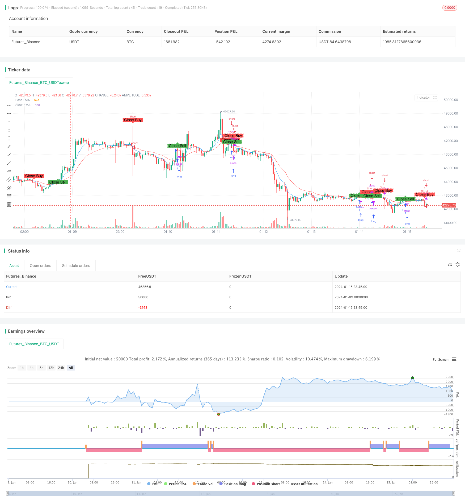

> Name

Optimized EMA golden cross strategyOptimized-EMA-Crossover-Strategy
> Author

ChaoZhang

> Strategy Description



[trans]

## Overview
The optimized EMA golden cross strategy is a simple and effective quantitative trading strategy that follows the EMA indicator. It uses the crossover between EMA moving averages of different periods as buy and sell signals, and combines risk management principles for position management.
## Strategy name and principle
The name of this strategy is **Optimized EMA Golden Cross Strategy**. The word "optimization" reflects that the strategy has optimized parameters and mechanisms based on the basic EMA strategy; "EMA" means that its core indicator is the exponential moving average; "golden cross" means that its trading signals are generated from the golden cross of different EMA moving averages.
The basic principle of this strategy is to calculate two sets of EMA moving averages with different parameters. When the shorter-period EMA breaks through the longer-period EMA from bottom to top, a buy signal is generated; when the shorter-period EMA falls below the longer-period EMA from top to bottom, a sell signal is generated. Here, 7-period and 20-period EMA are selected to combine to form fast and slow lines.
The code uses `fastEMA = ema(close, fastLength)` and `slowEMA = ema(close, slowLength)` to calculate and draw the 7-day EMA and the 20-day EMA. When the fast line crosses the slow line, that is, when the `crossover(fastEMA, slowEMA)` ​​condition is met, a buy signal is generated; when the fast line breaks below the slow line, that is, when the `crossunder(fastEMA, slowEMA)` condition is met, a sell signal is generated.
## Strategic advantage analysis
**Optimizing EMA Golden Cross Strategy** has the following advantages:
1. **Easy to operate**. Trading signals are formed based only on the golden cross of the EMA moving average, which is easy to understand and implement, and is suitable for the automation of quantitative trading.
2. **Strong reverse capture ability**. EMA is a trend tracking indicator. When the short-term and long-term EMA cross, it often means the reversal of the short-term trend and the long-term trend, which provides an opportunity to capture the reversal.
3. **Good smoothing and denoising effect**. EMA itself has smoothing and denoising characteristics, which helps filter out short-term market noise and generate high-quality trading signals.
4. **Parameter optimization design**. The periods of the FAST EMA and SLOW EMA are optimally chosen to strike a balance between capturing reversals and filtering noise, resulting in stable signals.
5. **Scientific position management**. Optimize position management based on ATR and risk-reward ratio, effectively control single transaction risks, and ensure strong fund management.
## Strategy risk analysis
**Optimizing EMA golden cross strategy** also has some risks, mainly reflected in:
1. **Not suitable for trending markets**. EMA crossover is less adaptable to markets with strong trends and may produce too many invalid signals.
2. **Parameter sensitivity is high**. The choice of FAST EMA and SLOW EMA has a significant impact on the strategy effect and requires careful testing and optimization.
3. **Signal delay problem**. The EMA cross signal itself has a certain lag and may miss the best entry point.
4. **Stop Loss Risk**. The stop-loss mechanism has not been introduced in the existing code, and there is a large risk of retracement.
The corresponding solution is:
1. Use a multi-factor model and introduce other indicators to judge trends;
2. Fully backtest to find the optimal parameter combination;
3. Combine with other leading indicators. For example, the zero axis of the incremental indicator MACD crosses;
4. Develop a reasonable stop loss strategy. Such as ATR multiple stop loss or closing stop loss.
## Strategy optimization direction
The optimization direction of **optimizing EMA golden cross strategy** mainly focuses on the following aspects:
1. **Multi-market adaptability optimization**. Introduce market status judgment, close strategies in trend markets, and reduce invalid signals.
2. **Parameter optimization**. Find the optimal parameter combination through genetic algorithms and other methods to improve the stability of the strategy.
3. **Stop loss mechanism introduced**. Set reasonable stop loss rules. For example, use ATR dynamic stop loss, trailing stop loss or closing stop loss.
4. **Backtest cycle optimization**. Analyze data at different time levels to determine the optimal strategy execution cycle.
5. **Position management optimization**. Optimize the position algorithm and find the best balance between risk and return.
These optimization measures will help reduce unnecessary signals, control retracement risks, and improve the stability and profitability of the strategy.
## Summarize
**Optimizing EMA Golden Cross Strategy** is a simple and efficient quantitative strategy. It uses the excellent characteristics of EMA to form trading signals, and carries out optimized design on this basis. This strategy has the advantages of simple operation, strong reversal capture ability, parameter optimization, scientific position management, etc.; at the same time, there are certain market adaptability risks and signal quality risks. The future optimization space lies in improving the stability and multi-market adaptability of the strategy. Through continuous optimization practice, this strategy is expected to become a reliable quantitative solution.
||

## Overview

The optimized EMA crossover strategy is a simple yet effective quantitative trading strategy that follows the EMA indicators. It utilizes the crossover between EMAs of different periods as buy and sell signals, combined with position sizing based on risk management principles.

## Strategy Name and Logic

The name of the strategy is **Optimized EMA Golden Cross Strategy**. The word "Optimized" reflects the optimization of parameters and mechanisms based on the basic EMA strategy; "EMA" represents the core indicator Exponential Moving Average; "Golden Cross" refers to the trading signals generated by the golden cross of different EMA lines.

The basic logic is: Calculate two groups of EMAs with different parameters, generate buy signals when the faster EMA crosses above the slower EMA, and generate sell signals when the faster EMA crosses below the slower EMA. The combinations of 7-period and 20-period EMAs are used here, forming the fast line and slow line.

In the code, `fastEMA = ema(close, fastLength)` and `slowEMA = ema(close, slowLength)` calculate and plot the 7-day EMA and 20-day EMA. When the fast line crosses above the slow line, i.e. the `crossover(fastEMA, slowEMA)` condition is true, a buy signal is generated. When the fast line crosses below the slow line, i.e. the `crossunder(fastEMA, slowEMA)` condition is true, a sell signal is generated.

## Advantage Analysis  

The **Optimized EMA Golden Cross Strategy** has the following advantages:

1. **Simple to operate**. Trade signals are generated simply based on golden crosses of EMA lines, which is easy to understand and implement for automated quantitative trading.

2. **Strong reversal capture capability**. As a trend following indicator, crosses of short-term and long-term EMAs often imply reversals between short-term and long-term trends, providing opportunities to capture reversals.

3. **Good smooth noise reduction effect**. EMA itself has the feature of smoothing out noises, helping filter out short-term market noises and generate high quality trading signals.  

4. **Optimized parameter design**. The periods of the FAST EMA and SLOW EMA are optimized to balance capturing reversals and filtering out noises, resulting in solid signals.

5. **Scientific position sizing**. Based on the ATR and risk-reward ratio, position sizes are optimized for effective single trade risk control and robust money management.

## Risk Analysis

The **Optimized EMA Golden Cross Strategy** also contains some risks, mainly in:  

1. **Not suitable for trending markets**. EMA crosses tend to underperform in strongly trending markets, potentially generating excessive invalid signals.

2. **Sensitive to parameters**. The choices of FAST EMA and SLOW EMA periods significantly impact strategy performance, requiring careful testing and optimization. 

3. **Signal lag**. EMA cross signals inherently have some lag, which may result in missing best entry points.  

4. **No stop loss**. The current code does not include stop loss mechanisms, leading to large drawdown risks.

The solutions are:  

1. Adopt multi-factor models with other indicators judging trends.

2. Fully backtest to find optimal parameter sets.   

3. Combine with leading indicators like MACD zero line crosses.

4. Develop reasonable stop loss strategies, e.g. ATR trailing stops or close-by stops.

## Optimization Directions

The optimization directions of the **Optimized EMA Golden Cross Strategy** mainly focus on:  

1. **Enhancing multi-market adaptiveness**. Introduce market regime judgments to disable strategy in trending markets, reducing invalid signals.  

2. **Parameter optimization**. Find optimum sets via genetic algorithms to improve stability. 

3. **Introducing stop loss mechanisms**. Apply proper stop loss rules like ATR trailing stops, moving stops or close-by stops.

4. **Optimizing backtesting periods**. Analyze data of different timeframes to find optimal execution cycles.  

5. **Improving position sizing**. Refine position sizing algorithms to find the optimum balance between risk and return.  

These measures will help reduce unnecessary signals, control drawdowns, and enhance the stability and profitability of the strategy.

## Summary

The **Optimized EMA Golden Cross Strategy** is a simple yet effective quantitative strategy. It utilizes the excellent properties of EMA to generate trading signals, and optimizes further based on that. The strategy has advantages like easy operation, strong reversal capturing capability, parameter optimization and scientific position sizing; it also has some market adaptiveness risks and signal quality risks. The future optimization spaces lie in improving stability and multi-market adaptiveness. Through constant optimization practices, this strategy has the potential to become a reliable quantitative solution.  
[/trans]

> Strategy Arguments


|Argument|Default|Description|
|----|----|----|
|v_input_1|7|Fast EMA Length|
|v_input_2|20|Slow EMA Length|
|v_input_3|2.5|Risk-Reward Ratio|


> Source (PineScript)

``` pinescript
/*backtest
start: 2024-01-09 00:00:00
end: 2024-01-16 00:00:00
period: 45m
basePeriod: 5m
exchanges: [{"eid":"Futures_Binance","currency":"BTC_USDT"}]
*/

// This Pine Script™ code is subject to the terms of the Mozilla Public License 2.0 at https://mozilla.org/MPL/2.0/
// © mayurtale972
//@version=4
strategy("Optimized EMA Crossover Strategy - 15-Min", overlay=true, shorttitle="EMA15")

// Input parameters
fastLength = input(7, title="Fast EMA Length")
slowLength = input(20, title="Slow EMA Length")
riskRewardRatio = input(2.5, title="Risk-Reward Ratio")

// Calculate EMAs
fastEMA = ema(close, fastLength)
slowEMA = ema(close, slowLength)

// Plot EMAs on the chart
plot(fastEMA, color=color.blue, title="Fast EMA")
plot(slowEMA, color=color.red, title="Slow EMA")

// Entry conditions
longCondition = crossover(fastEMA, slowEMA)
shortCondition = crossunder(fastEMA, slowEMA)

// Exit conditions
closeLongCondition = crossunder(fastEMA, slowEMA)
closeShortCondition = crossover(fastEMA, slowEMA)

// Calculate position size based on risk-reward ratio
riskAmount = 1.5
positionSize = strategy.equity * riskAmount / (riskRewardRatio * atr(14))

// Execute trades with calculated position size
strategy.entry("Long", strategy.long, when=longCondition)
strategy.entry("Short", strategy.short, when=shortCondition)

// Exit trades based on conditions
strategy.close("Long", when=closeLongCondition)
strategy.close("Short", when=closeShortCondition)

// Plot entry and exit points on the chart
plotshape(series=longCondition, title="Buy Signal", color=color.green, style=shape.labelup, text="Buy")
plotshape(series=shortCondition, title="Sell Signal", color=color.red, style=shape.labeldown, text="Sell")
plotshape(series=closeLongCondition, title="Close Buy Signal", color=color.red, style=shape.labeldown, text="Close Buy")
plotshape(series=closeShortCondition, title="Close Sell Signal", color=color.green, style=shape.labelup, text="Close Sell")

```

> Detail

https://www.fmz.com/strategy/439052

> Last Modified

2024-01-17 12:01:59
