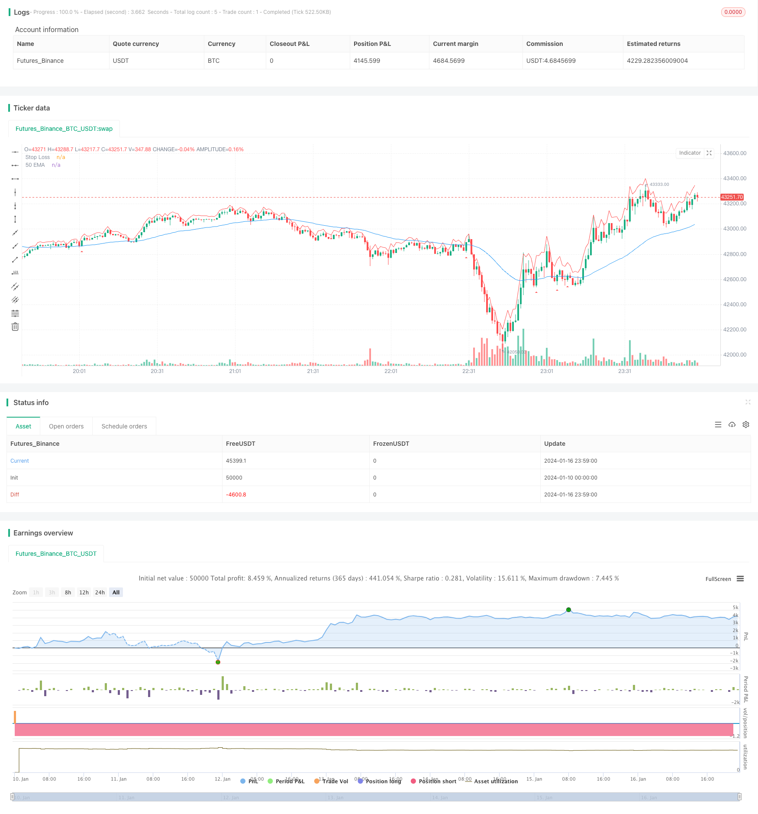

> Name

Pullback short strategy based on EMA callback Emma-Pullback-Short-Strategy
> Author

ChaoZhang

> Strategy Description


 [trans]

## Overview
This strategy uses the 50-period EMA moving average and the closing price of the K line to make judgments. When the price breaks through the EMA moving average downward, go short. Wait for the price to pull back 2-3 K lines. If a swallowing K line appears, open a short position after the K line closes and perform short-term operations.
## Strategy Principle
First calculate the 50-period EMA, and then determine whether the price breaks through the EMA from top to bottom. If it breaks through, it will be recorded as a short impulse. Then determine whether there is an upward callback on the subsequent K-line. If the correction amplitude exceeds the lowest price of the previous K-line, it will be recorded as a callback signal. After the callback, further determine whether the subsequent 1-2 K lines form a phagocytosis pattern. If a phagocytosis pattern is formed, it will be recorded as a phagocytosis signal. When the three conditions of short impulse, callback and engulfment are met at the same time, open a short position after the engulfing K line closes and perform short-term operations.
The strategy will draw a 50-period EMA, and when a short signal is issued, a downward red triangle mark will be drawn below the K line. At the same time, the stop loss level is given and a red stop loss line is drawn.
## Advantage Analysis
This strategy combines trend judgment and morphological characteristics to effectively seize trend reversal opportunities. First use EMA to identify the trend direction, and then use the engulfing pattern to send signals during the callback process to avoid being fooled by false breakthroughs. The stop loss is clear and the retracement is well controlled. Suitable for short-term operations.
## Risk Analysis
This strategy mainly relies on EMA to determine the trend direction. If there is a violent breakthrough, misjudgment may occur. There is a certain degree of subjectivity in judging the phagocytosis form, and both quantity and depth require parameter optimization. The stop loss position also needs to be adjusted according to the degree of market volatility. Generally speaking, this strategy is more suitable for a stable stock index market and suitable for short-term operations.
Better strategy effects can be obtained by optimizing parameters such as EMA parameters, the number of callback K lines, and the number of swallowing K lines. In addition, you can also consider combining other indicators to determine trends and callback signals.
## Optimization direction
1. EMA period optimization: You can test more EMA periods, such as 30, 40 or 60 periods, to find the best parameters.
2. Optimize the number of callback K lines: test different numbers such as 2-5 to find the best callback signal.
3. Optimize the number of swallowing K lines: test different numbers such as 1-3 to find the best swallowing signal.
4. Stop loss multiple optimization: You can test 0.5-2 times ATR stop loss to find the best stop loss position.
5. Consider adding other indicators to determine signals, such as MACD, KDJ, etc., to improve signal accuracy.
6. Different varieties can be tested, such as stock indexes, crude oil, precious metals, etc., to expand the scope of application.
## Summarize
This strategy first uses EMA to determine the trend direction, and then combines the callback and engulfing patterns to send out short signals. It is a typical trend reversal strategy. It combines trend judgment and morphological characteristics to effectively seize reversal opportunities. After the strategy parameters are optimized in place, good results can be obtained. Generally speaking, this strategy is simple to operate, has controllable risks, and is very suitable for short-term operations. Its advantage lies in catching the reversal market in time and having a clear stop loss point. Overall, this strategy has certain practical value.
|| 

## Overview

This strategy uses the 50-period EMA and the closing price of candlesticks to determine signals. When the price breaks through the EMA line downward, it goes short. After the price pulls back for 2-3 candlesticks, if a candlestick with engulfing pattern appears, it opens a short position after the close of that candlestick for short-term trading.

## Strategy Principle  

First, the 50-period EMA line is calculated. Then it judges if the price breaks through this EMA line downward. If broken, it records a bearish impulse signal. Next, it checks if the subsequent candlesticks have an upward pullback, if the pullback amplitude is higher than the lowest price of the previous candlestick, it records a pullback signal. After the pullback, it further judges if the next 1-2 candlesticks form an engulfing pattern. If engulfing formed, it records an engulfing signal. When the bearish impulse, pullback and engulfing signals appear together, it opens a short position after the close of the engulfing candlestick for short-term trading.

The strategy plots the 50-period EMA line. When a short signal triggers, it plots a red downward triangle below the candlestick. It also gives a stop loss level and plots a red stop loss line.

## Advantage Analysis

This strategy combines trend judgment and pattern recognition, which can effectively catch trend reversal opportunities. It first uses EMA to determine the trend direction, then uses the engulfing pattern during pullback to avoid being misguided by false breakouts. The stop loss is clear and drawdown is well controlled. It is suitable for short-term trading.

## Risk Analysis  

This strategy mainly relies on EMA to determine the trend direction. In case of violent breakout, misjudgment may occur. The engulfing pattern judgment has some subjectivity, the quantity and depth need parameter optimization. The stop loss position also needs adjustment based on market volatility. Overall, this strategy is more suitable for stable index markets and short-term trading.

Parameters like EMA period, number of pullback candles, number of engulfing candles can be optimized for better strategy performance. In addition, other indicators can be considered to determine trend and pullback signals.

## Optimization Directions

1. EMA Period Optimization: Test more EMA periods like 30, 40 or 60 to find the optimal one.  

2. Number of Pullback Candles: Test 2-5 candles to find the optimal pullback signal.

3. Number of Engulfing Candles: Test 1-3 candles to find the optimal engulfing signal.  

4. Stop Loss Multiple: Test 0.5-2 ATR for optimal stop loss position.  

5. Consider adding other indicators like MACD, KDJ to improve signal accuracy.

6. Test on different products like indexes, crude oil, gold to expand scope.

## Conclusion  

This strategy first uses EMA to determine the trend direction, then combines pullback and engulfing pattern to generate short signals, a typical trend reversal strategy. By combining trend judgment and pattern recognition, it can effectively catch reversal opportunities. After parameter optimization, good results can be achieved. Overall, this strategy has easy operation, controllable risk and is suitable for short-term trading. Its advantage lies in timely catching reversal trends, with a clear stop loss point. In general, this strategy has good practical value.

[/trans]

> Strategy Arguments


|Argument|Default|Description|
|----|----|----|
|v_input_1|50|EMA Length|
|v_input_2|3|Number of Pullback Candles|
|v_input_3|true|Number of Engulfing Candles|
|v_input_4|true|Stop Loss (in ATR)|


> Source (PineScript)

``` pinescript
/*backtest
start: 2024-01-10 00:00:00
end: 2024-01-17 00:00:00
period: 1m
basePeriod: 1m
exchanges: [{"eid":"Futures_Binance","currency":"BTC_USDT"}]
*/

//@version=4
strategy(title="Linor Pullback Short Strategy", shorttitle="EMA Pullback", overlay=true)

// Define strategy parameters
ema_length = input(50, title="EMA Length")
pullback_candles = input(3, title="Number of Pullback Candles")
engulfing_candles = input(1, title="Number of Engulfing Candles")
stop_loss = input(1, title="Stop Loss (in ATR)")

// Calculate the EMA
ema = ema(close, ema_length)

// Define bearish impulse condition
bearish_impulse = crossover(close, ema)

// Define pullback condition
pullback_condition = false
for i = 1 to pullback_candles
    if close[i] > close[i - 1]
        pullback_condition := true
    else
        pullback_condition := false

// Define engulfing condition
engulfing_condition = false
for i = 1 to engulfing_candles
    if close[i] < open[i] and close[i-1] > open[i-1]
        engulfing_condition := true
    else
        engulfing_condition := false

// Define the entry condition
entry_condition = bearish_impulse and pullback_condition and engulfing_condition

// Plot the EMA on the chart
plot(ema, color=color.blue, title="50 EMA")

// Plot shapes on the chart to mark entry points
plotshape(entry_condition, style=shape.triangleup, location=location.belowbar, color=color.red, size=size.small)

// Define and plot the stop loss level
atr_value = atr(14)
stop_loss_level = close + atr_value * stop_loss
plot(stop_loss_level, color=color.red, title="Stop Loss")

// Strategy orders
strategy.entry("Short", strategy.short, when=entry_condition)
strategy.exit("Stop Loss/Target", from_entry="Short", stop=stop_loss_level, when=strategy.position_size[1] > 0)

// Plot strategy performance on the chart

```

> Detail

https://www.fmz.com/strategy/439183

> Last Modified

2024-01-18 11:02:17
