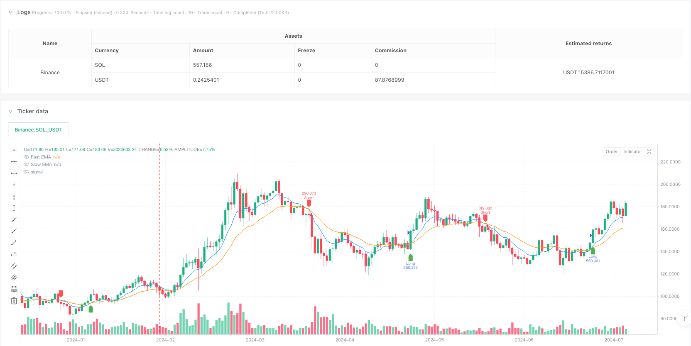
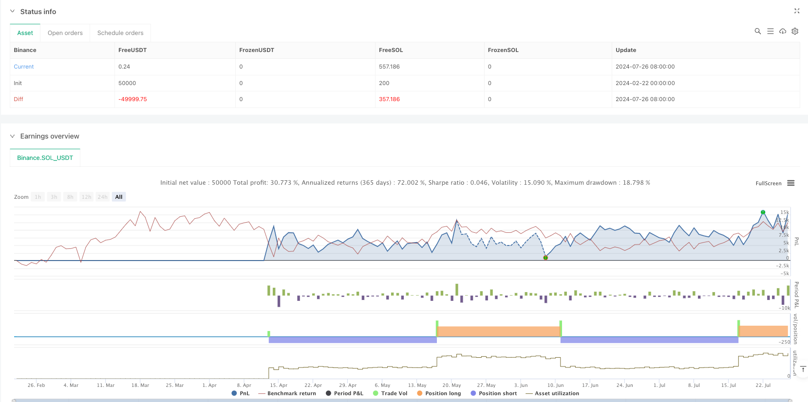

> Name

Adaptive-Dynamic-Stop-Loss-and-Take-Profit-Strategy-Based-on-EMA-Crossover-and-RSI-Filter
> Author

ianzeng123

> Strategy Description





[trans]
#### Overview
This strategy is a quantitative trading system that combines moving average crossover, RSI filtering and dynamic stop-profit and stop-loss based on ATR. The strategy uses the intersection of fast and slow exponential moving averages (EMA) to confirm trend transition points, while introducing the relative strength index (RSI) as a filter to avoid trading in overbought or sold areas. The special feature is the use of true range (ATR) to dynamically adjust the stop-profit and stop-loss positions, allowing it to adaptively adjust risk management parameters according to market volatility.
#### Strategy Principle
The core logic of the strategy is based on the following key components:
1. Trend judgment: Use the 9-period and 21-period EMA to cross to confirm the change in trend direction. If the fast line crosses the slow line, it is considered a bullish signal, and if the fast line crosses the slow line below, it is considered a bearish signal.
2. Transaction filtering: Use the 14-period RSI indicator to filter trading signals. Only long orders will be executed when RSI is higher than 30 (oversold area), and short orders will be executed only when RSI is lower than 70 (overbought area).
3. Risk management: Dynamically set the stop loss and take profit positions based on the 14-period ATR. The stop loss is set to 2.5 times ATR and the take profit is set to 5 times ATR (2 times the stop loss distance), ensuring a risk-return ratio of 1:2.
#### Strategic Advantages
1. Dynamic adaptability: Automatically adjust the stop-profit and stop-loss positions through ATR, so that the strategy can adapt to the fluctuation characteristics of different market environments.
2. Multiple confirmation mechanism: combines trend and momentum indicators to reduce the impact of false signals.
3. Risk-return ratio optimization: Adopt a risk-return ratio setting of 1:2 to pursue higher returns while managing risks.
4. Visual support: Through signal marks and moving average display, it is convenient for traders to intuitively understand market conditions.
#### Strategy Risk
1. Risk of volatile markets: In a volatile market, frequent moving average crossovers may lead to over-trading.
2. Impact of slippage: When the market fluctuates violently, the actual transaction price may deviate greatly from the signal price.
3. Parameter sensitivity: The strategy effect is sensitive to parameter settings such as EMA period, RSI threshold and ATR multiple.
#### Strategy optimization direction
1. Market environment identification: Introduce trend strength indicators (such as ADX), and use different parameter settings in strong trends and volatile markets.
2. Position management optimization: Dynamically adjust position size according to RSI and ATR values, and increase positions when signal strength is high.
3. Improvement of the exit mechanism: Consider adding a trailing stop to protect more profits when the trend continues.
4. Time filtering: Add trading time window restrictions to avoid trading during periods of lower volatility.
#### Summary
This strategy identifies trends through the moving average system, RSI filters out false signals, and ATR dynamically manages risks to build a complete trading system. The main feature of the strategy is its strong adaptability and the ability to adjust trading parameters according to market fluctuations. Through the implementation of optimization directions, the stability and profitability of the strategy can be further improved. It is recommended to conduct sufficient historical data backtesting and parameter optimization before real trading. ||
#### Overview
This strategy is a quantitative trading system that combines EMA crossovers, RSI filtering, and ATR-based dynamic stop-loss and take-profit mechanisms. The strategy confirms trend reversal points through the crossover of fast and slow Exponential Moving Averages (EMA), while incorporating the Relative Strength Index (RSI) as a filter to avoid trading in overbought or oversold zones. Its distinctive feature is the use of Average True Range (ATR) to dynamically adjust stop-loss and take-profit levels, allowing risk management parameters to adapt to market volatility.

#### Strategy Principles
The core logic is based on the following key components:
1. Trend Identification: Uses 9-period and 21-period EMA crossovers to confirm trend direction changes, with fast line crossing above slow line as bullish signal and vice versa.
2. Trade Filtering: Employs 14-period RSI to filter trading signals, executing long positions only when RSI is above 30 (oversold) and short positions when below 70 (overbought).
3. Risk Management: Dynamically sets stop-loss and take-profit levels based on 14-period ATR, with stop-loss at 2.5x ATR and take-profit at 5x ATR (2x stop-loss distance), ensuring a 1:2 risk-reward ratio.

#### Strategy Advantages
1. Dynamic Adaptability: Automatically adjusts stop-loss and take-profit levels through ATR, enabling the strategy to adapt to volatility characteristics in different market environments.
2. Multiple Confirmation Mechanism: Combines trend and momentum indicators to reduce the impact of false signals.
3. Optimized Risk-Reward Ratio: Employs a 1:2 risk-reward ratio setting, pursuing higher returns while managing risk.
4. Visual Support: Provides signal markers and moving average displays for intuitive market condition understanding.

#### Strategy Risks
1. Choppy Market Risk: Frequent EMA crossovers in ranging markets may lead to overtrading.
2. Slippage Impact: Significant differences between actual execution prices and signal prices may occur during intense market volatility.
3. Parameter Sensitivity: Strategy performance is sensitive to settings like EMA periods, RSI thresholds, and ATR multipliers.

#### Strategy Optimization Directions
1. Market Environment Recognition: Introduce trend strength indicators (like ADX) to use different parameters in strong trend and ranging markets.
2. Position Management Optimization: Dynamically adjust position sizes based on RSI and ATR values, increasing positions when signals are stronger.
3. Exit Mechanism Improvement: Consider adding trailing stops to protect more profits during trend continuation.
4. Time Filtering: Add trading time window restrictions to avoid trading during low volatility periods.

#### Summary
The strategy constructs a complete trading system by identifying trends through moving averages, filtering false signals with RSI, and managing risk dynamically with ATR. Its main characteristic is strong adaptability, capable of adjusting trading parameters according to market volatility. Through implementation of optimization directions, the strategy's stability and profitability can be further enhanced. It is recommended to conduct thorough historical data backtesting and parameter optimization before live trading.[/trans]


> Source (PineScript)

``` pinescript
//@version=6
strategy("High Win Rate Dogecoin Strategy", overlay=true, default_qty_type=strategy.percent_of_equity, default_qty_value=100)

// Input Parameters
fastLength = input(9, title="Fast EMA Length")
slowLength = input(21, title="Slow EMA Length")
atrLength = input(14, title="ATR Length")
atrMultiplier = input(2.5, title="ATR Multiplier")
rsiLength = input(14, title="RSI Length")
rsiOverbought = input(70, title="RSI Overbought")
rsiOversold = input(30, title="RSI Oversold")

// Indicators
fastEMA = ta.ema(close, fastLength)
slowEMA = ta.ema(close, slowLength)
atr = ta.atr(atrLength)
rsi = ta.rsi(close, rsiLength)

// Entry Conditions
longCondition = ta.crossover(fastEMA, slowEMA) and rsi > rsiOversold
shortCondition = ta.crossunder(fastEMA, slowEMA) and rsi < rsiOverbought

// Stop Loss & Take Profit
longStopLoss = close - (atr * atrMultiplier)
longTakeProfit = close + (atr * atrMultiplier * 2)
shortStopLoss = close + (atr * atrMultiplier)
shortTakeProfit = close - (atr * atrMultiplier * 2)

// Strategy Entries
if longCondition
    strategy.entry("Long", strategy.long)
    strategy.exit("TakeProfitLong", from_entry="Long", limit=longTakeProfit, stop=longStopLoss)

if shortCondition
    strategy.entry("Short", strategy.short)
    strategy.exit("TakeProfitShort", from_entry="Short", limit=shortTakeProfit, stop=shortStopLoss)

// Plot Signals
plotshape(series=longCondition, location=location.belowbar, color=color.green, style=shape.labelup, title="Buy Signal")
plotshape(series=shortCondition, location=location.abovebar, color=color.red, style=shape.labeldown, title="Sell Signal")

// Plot EMAs for visualization
plot(fastEMA, color=color.blue, title="Fast EMA")
plot(slowEMA, color=color.orange, title="Slow EMA")

```

> Detail

https://www.fmz.com/strategy/483063

> Last Modified

2025-02-27 17:06:29
