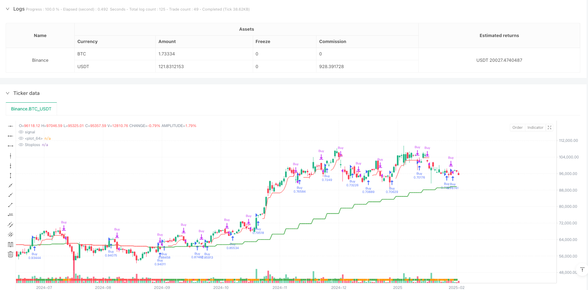
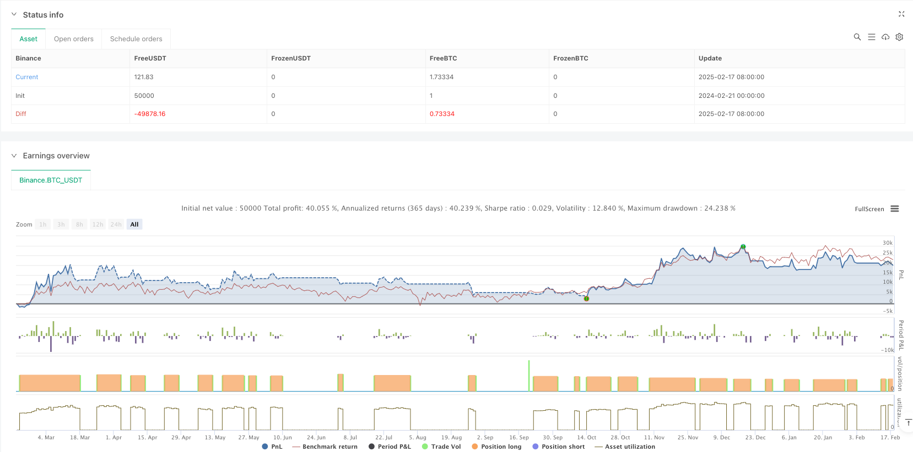

> Name

Bitcoin cross-cycle trend trading strategy based on multi-level EMA and RSI dynamic potential strength-Multi-Timeframe-Bitcoin-Trading-Strategy-Based-on-EMA-and-RSI-Dynamic-Momentum-Strength
> Author

ianzeng123

> Strategy Description





[trans]
#### Overview
This strategy is a trend following trading system based on cross-cycle analysis that combines weekly and daily EMA moving averages and RSI indicators to identify market trends and momentum. The strategy identifies trading opportunities through trend consistency across multiple time frames and uses ATR-based dynamic stops to manage risk. The system adopts a fund management model, using 100% of the account's funds for each transaction and taking into account a 0.1% transaction fee.
#### Strategy Principle
The core logic of the strategy is based on the following key elements:
1. Use the weekly EMA as the main trend filter, and combine the relationship between the daily closing price and the weekly EMA to determine the market status.
2. Dynamically adjust the threshold for trend determination through the ATR indicator to increase the adaptability of the strategy
3. Integrate RSI momentum indicator as an additional trade filter
4. Use a trailing stop loss system based on 7-day low price and ATR
5. When there is a warning signal of excessive rise, the strategy will suspend opening positions to avoid risks
#### Strategic Advantages
1. Multiple time frame analysis provides a more comprehensive market perspective and can effectively filter out false breakthroughs
2. The dynamic stop-loss mechanism adaptively adjusts according to market volatility, providing flexible risk control.
3. RSI momentum filter helps confirm trend strength and improve entry quality
4. The system contains an early warning mechanism for excessive rises, which helps to avoid the risk of retracement.
5. The parameters of the strategy are highly adjustable, making it easy to optimize according to different market environments.
#### Strategy Risk
1. Frequent entry and exit may lead to increased transaction costs in sideways markets.
2. Trading with 100% of funds involves a greater risk of retracement
3. Relying on technical indicators may not respond promptly to market emergencies.
4. Multiple time frame analysis may produce conflicting signals at different levels
5. Trailing stops may be triggered prematurely during sharp moves
#### Strategy optimization direction
1. Introduce a volatility filter to reduce trading frequency during periods of low volatility
2. Add a position management system to dynamically adjust the position ratio according to market conditions
3. Integrate fundamental indicators to provide additional market environment judgments
4. Optimize trailing stop loss parameters to better adapt to different market stages
5. Add transaction volume analysis to improve the accuracy of trend judgment.
#### Summary
This is a trend following strategy with complete structure and clear logic. Through multiple time frame analysis and dynamic indicator filtering, the strategy can better capture the main trends. Although there are some inherent risks, there is still considerable room for improvement in the strategy through parameter optimization and the addition of supplementary indicators. It is recommended to conduct sufficient backtesting before real trading and adjust parameter settings according to the specific market environment.
|| 

#### Overview
This strategy is a trend-following trading system based on cross-timeframe analysis, combining weekly and daily EMA levels with RSI indicators to identify market trends and momentum. The strategy determines trading opportunities through trend confluence across multiple timeframes and uses ATR-based dynamic stop-loss for risk management. The system employs a capital management approach, using 100% of account funds per trade, with a 0.1% trading commission consideration.

#### Strategy Principles
The core logic of the strategy is based on the following key elements:
1. Uses weekly EMA as the primary trend filter, combined with the relationship between daily closing price and weekly EMA to determine market conditions
2. Dynamically adjusts trend determination thresholds through ATR indicator, increasing strategy adaptability
3. Integrates RSI momentum indicator as additional trading filter
4. Employs a trailing stop-loss system based on 7-day low and ATR
5. Strategy pauses new positions when excessive uptrend warning signals appear to avoid risks

#### Strategy Advantages
1. Multi-timeframe analysis provides a more comprehensive market perspective, effectively filtering false breakouts
2. Dynamic stop-loss mechanism adapts to market volatility, providing flexible risk control
3. RSI momentum filter helps confirm trend strength, improving entry quality
4. System includes excessive uptrend warning mechanism, helping avoid drawdown risks
5. Strategy parameters are highly adjustable, facilitating optimization for different market environments

#### Strategy Risks
1. May result in frequent entries and exits in ranging markets, increasing trading costs
2. Using 100% funds per trade carries significant drawdown risk
3. Reliance on technical indicators may lead to delayed responses to market events
4. Multi-timeframe analysis may produce conflicting signals at different levels
5. Trailing stop-loss may be triggered prematurely during severe volatility

#### Strategy Optimization Directions
1. Introduce volatility filter to reduce trading frequency during low volatility periods
2. Add position management system to dynamically adjust holding ratios based on market conditions
3. Integrate fundamental indicators for additional market environment assessment
4. Optimize trailing stop-loss parameters for better adaptation to different market phases
5. Include volume analysis to improve trend determination accuracy

#### Summary
This is a well-structured trend-following strategy with clear logic. Through multi-timeframe analysis and dynamic indicator filtering, the strategy can effectively capture major trends. While inherent risks exist, there is significant room for improvement through parameter optimization and supplementary indicators. It is recommended to conduct thorough backtesting before live trading and adjust parameters according to specific market conditions.[/trans]


> Source (PineScript)

``` pinescript
/*backtest
start: 2024-02-21 00:00:00
end: 2025-02-18 08:00:00
period: 1d
basePeriod: 1d
exchanges: [{"eid":"Binance","currency":"BTC_USDT"}]
*/

// @version=6
strategy("Bitcoin Regime Filter Strategy",         // Strategy name
     overlay=true,                                 // The strategy will be drawn directly on the price chart
     initial_capital=10000,                        // Initial capital of 10000 USD
     currency=currency.USDT,                       // Defines the currency used, USDT
     default_qty_type=strategy.percent_of_equity,  // Position size will be calculated as a percentage of equity
     default_qty_value=100,                        // The strategy uses 100% of available capital for each trade
     commission_type=strategy.commission.percent,  // The strategy uses commission as a percentage
     commission_value=0.1)                         // Transaction fee is 0.1%

// User input 
res = input.timeframe(title = "Timeframe", defval = "W")                     // Higher timeframe for reference
len = input.int(title = "EMA Length", defval = 20)                           // EMA length input
marketTF = input.timeframe(title = "Market Timeframe", defval = "D")         // Current analysis timeframe (D)
useRSI = input.bool(title = "Use RSI Momentum Filter", defval = false)       // Option to use RSI filter
rsiMom = input.int(title = "RSI Momentum Threshold", defval = 70)            // RSI momentum threshold (default 70)

// Custom function to output data
f_sec(_market, _res, _exp) => request.security(_market, _res, _exp[barstate.isrealtime ? 1 : 0])[barstate.isrealtime ? 0: 1]

// The f_sec function has three input parameters: _market, _res, _exp
// request.security = a Pine Script function to fetch market data, accessing OHLC data
// _exp[barstate.isrealtime ? 1 : 0] checks if the current bar is real-time, and retrieves the previous bar (1) or the current bar (0)
// [barstate.isrealtime ? 0 : 1] returns the value of request.security, with a real-time check on the bar

// Define time filter
dateFilter(int st, int et) => time >= st and time <= et
// The dateFilter function has two input parameters: st (start time) and et (end time)
// It checks if the current bar's time is between st and et

// Fetch EMA value
ema = ta.ema(close, len)                                   // Calculate EMA with close prices and input length
htfEmaValue = f_sec(syminfo.tickerid, res, ema)            // EMA value for high time frame, using f_sec function

// Fetch ATR value
atrValue = ta.atr(5)

// Check if price is above or below EMA
marketPrice = f_sec(syminfo.tickerid, marketTF, close)
regimeFilter = marketPrice > (htfEmaValue + (atrValue * 0.25))       // Compare current price with EMA in higher timeframe (with ATR dependency)

// Calculate RSI value
rsiValue = ta.rsi(close, 7)

// Bullish momentum filter
bullish = regimeFilter and (rsiValue > rsiMom or not useRSI)

// Set caution alert
caution = bullish and (ta.highest(high, 7) - low) > (atrValue * 1.5)

// Set momentum background color
bgCol = color.red
if bullish[1]
    bgCol := color.green
if caution[1]
    bgCol := color.orange

// Plot background color
plotshape(1, color = bgCol, style = shape.square, location = location.bottom, size = size.auto, title = "Momentum Strength")
plot(htfEmaValue, color = close > htfEmaValue ? color.green : color.red, linewidth = 2)

// Initialize trailing stop variable
var float trailStop = na

// Entry logic
if bullish and strategy.position_size == 0 and not caution
    strategy.entry(id = "Buy", direction = strategy.long)
    trailStop := na

// Trailing stop logic
temp_trailStop = ta.highest(low, 7) - (caution[1] ? atrValue * 0.2 : atrValue)
if strategy.position_size > 0
    if temp_trailStop > trailStop or na(trailStop)
        trailStop := temp_trailStop

// Exit logic
if (close < trailStop or close < htfEmaValue)
    strategy.close("Buy", comment = "Sell")

// Plot stop loss line
plot(strategy.position_size[1] > 0 ? trailStop : na, style = plot.style_linebr, color = color.red, title = "Stoploss")

```

> Detail

https://www.fmz.com/strategy/482904

> Last Modified

2025-02-27 17:24:26
