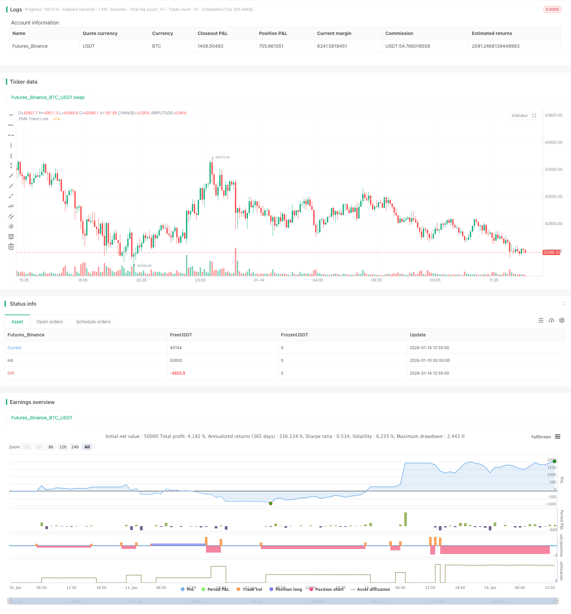

> Name

Dual-EMA-and-RSI-Combined-Trend-Tracking-Strategy
> Author

ChaoZhang

> Strategy Description


 [trans]
## Overview
This strategy uses a combination of dual EMA and RSI indicators to identify price trends and timely enter the market when the trend direction changes. Specifically, the strategy uses the longer-period EMA to determine the direction of the general trend, while using the RSI indicator to determine short-term overbought and oversold phenomena. When the price pulls back in the direction of the main trend, a trading signal is sent through the RSI indicator to go long or short according to the direction of the trend.
## Strategy Principle
1. Use the 200-period EMA to determine the general trend direction. A price crossing above the EMA line is a bullish signal, while a price crossing below the EMA line is a bearish signal.
2. The RSI indicator parameters are set to 10 periods. The RSI crosses above 40, which is an oversold signal, and when it crosses below 60, it is an overbought signal.
3. When the general trend is upward (the price is above the EMA line), if an oversold signal occurs when the RSI indicator crosses 40, enter the market long.
4. When the general trend is downward (the price is below the EMA line), if an overbought signal occurs when the RSI indicator crosses 60, enter the market short.
5. The stop loss is set to 4 times the ATR indicator. The take-profit is set to 2 times the stop-loss to achieve a risk-reward ratio of 2:1.
## Advantage Analysis
The biggest advantage of this strategy is that it combines trend and reversal indicators at the same time, and can enter the market in time when the trend pulls back, so it can achieve better performance. The specific advantages are as follows:
1. Use the double EMA system to determine the main trend direction, which can effectively track the price trend.
2. The RSI indicator can identify overbought and oversold conditions in the short term and assist in determining the timing of entry.
3. The stop loss is set through the ATR indicator, and the stop loss range can be adjusted according to market volatility, which is conducive to risk control.
4. Strictly following trend trading principles can reduce unnecessary transactions and reduce systemic risks.
## Risk Analysis
This strategy mainly involves the following risks:
1. In the process of trend oscillation and weakening, wrong trading signals may be generated. At this time, you need to assess the situation and enter the market cautiously.
2. In extreme market conditions, the stop loss set by the ATR indicator may be too large or too small and needs to be adjusted dynamically. You can also consider replacing it with other stop loss methods.
3. The frequency of trading signals may be high, so you need to pay attention to whether it meets your own trading frequency preference.
4. Pay attention to whether the RSI parameters are set appropriately and optimize the parameters in a timely manner.
## Optimization direction
The main optimization directions of this strategy are as follows:
1. You can test and add other trend indicators, such as MACD, etc., to assist in judging the trend direction.
2. You can test other reversal indicators, such as KDJ, Bollinger Bands, etc. and combine them with RSI to find better trading signals.
3. Machine learning algorithms can be introduced to realize dynamic stop loss and take profit by adaptively adjusting parameters.
4. Judgments can be made based on sentiment indicators, news and other factors to improve the overall robustness of the system.
## Summarize
This strategy is generally a very typical short-term strategy that combines trend following and reversal indicators. By using double EMA to determine the general trend, and at the same time using the reversal characteristics of the RSI indicator to capture pullback opportunities in the trend. In principle, this strategy combines the advantages of different indicators and creates a good complementary effect. If improvements are made later through parameter optimization, model fusion and other means, the effect of this strategy still has a lot of room for improvement.
||

## Overview

This strategy combines the use of dual EMA and RSI indicators to identify price trends and take timely positions when trend reversals occur. Specifically, the strategy uses a longer cycle EMA to judge the major trend direction, while using the RSI indicator to determine short-term overbought and oversold conditions. It generates trading signals through the RSI indicator when prices pull back within the major trend direction for long or short entries accordingly.   

## Strategy Logic

1. Use a 200 period EMA to determine the major trend direction. Price crossing above the EMA line signals bullish view, while crossing below signals bearish view.

2. RSI indicator parameter set to 10 periods. RSI crossing above 40 signals oversold condition, while crossing below 60 signals overbought condition.  

3. When major trend is up (price above EMA line) and RSI crossing below 40 oversold signal occurs, go long.  

4. When major trend is down (price below EMA line) and RSI crossing above 60 overbought signal occurs, go short.

5. Stop loss set to 4 times of ATR indicator. Take profit set to 2 times of stop loss for 2:1 risk reward ratio.

## Advantage Analysis 

The biggest advantage of this strategy is the combination of both trend and reversal indicators, which allows timely entries when pullbacks occur within trends, hence better performance can be obtained. Specific advantages include:

1. Using dual EMA system to determine primary trend direction for effective trend tracking. 

2. RSI indicator identifies short-term overbought/oversold conditions, assisting entry timing.

3. Stop loss set via ATR indicator adapts to market volatility for better risk control.

4. Strictly following trend trading principles reduces unnecessary trades and system risk. 

## Risk Analysis

Main risks of this strategy includes:

1. False trading signals may occur when trend weakens and prices oscillate. Trade cautiously during these times.

2. Stop loss set by ATR may be too wide or too tight in extreme market conditions. Dynamic adjustments or other stop loss mechanisms should be considered.  

3. Potentially high signal frequency requires matching personal trading frequency preference.  

4. RSI parameter appropriateness needs to be monitored for timely optimization. 

## Optimization Directions

Main optimization directions include:

1. Test adding other trend indicators like MACD to assist trend judgment.  

2. Test combining RSI with other reversal indicators like KDJ, Bollinger Bands for better signals.   

3. Introduce machine learning algorithms for dynamic parameter adjustments and adaptive stop loss/profit taking. 

4. Incorporate more factors like sentiments, news for higher system robustness.  

## Conclusion

Overall this is a very typical short-term strategy combining trend tracking and reversal indicators. It judges major trend with dual EMA and captures pullback opportunities within trends using the reversal characteristics of RSI. In principle, this strategy combines the strengths of different indicators for very good complementary effects. Further improvements on parameters optimization, model fusion etc. can significantly enhance its performance.

[/trans]

> Strategy Arguments


|Argument|Default|Description|
|----|----|----|
|v_input_int_1|200|(?Indicators: Settings)EMA Length          |
|v_input_int_2|10|RSI Length            |
|v_input_int_3|60|(?Strategy: Conditions)RSI Overbought        |
|v_input_int_4|40|RSI Oversold          |
|v_input_int_5|14|(?Strategy: Exit Conditions)Stop Loss ATR Length      |
|v_input_float_1|4|Stop Loss ATR Multiplier     |
|v_input_float_2|2|(?Strategy: Risk Management)Risk : Reward        1 :|
|v_input_float_3|true|Portfolio Risk %         |
|v_input_int_6|2022|(?Strategy: Date Range)Start Date       |
|v_input_int_7|0|startMonth: 1|2|3|4|5|6|7|8|9|10|11|12|
|v_input_int_8|0|startDate: 1|2|3|4|5|6|7|8|9|10|11|12|13|14|15|16|17|18|19|20|21|22|23|24|25|26|27|28|29|30|31|
|v_input_int_9|2100|End Date      |
|v_input_int_10|0|endMonth: 1|2|3|4|5|6|7|8|9|10|11|12|
|v_input_int_11|0|endDate: 1|2|3|4|5|6|7|8|9|10|11|12|13|14|15|16|17|18|19|20|21|22|23|24|25|26|27|28|29|30|31|
|v_input_bool_1|false|(?Strategy: Drawings)Show TP / SL Boxes|
|v_input_bool_2|false|Show Trade Exit Labels|


> Source (PineScript)

``` pinescript
/*backtest
start: 2024-01-10 00:00:00
end: 2024-01-14 13:00:00
period: 5m
basePeriod: 1m
exchanges: [{"eid":"Futures_Binance","currency":"BTC_USDT"}]
*/

// This source code is subject to the terms of the Mozilla Public License 2.0 at https://mozilla.org/MPL/2.0/
// © kevinmck100

// @description
// This strategy is intended to be used as a base template for building new strategies.
//
// It incorporates the following features:
//
//      - Risk management:  Configurable X% loss per stop loss
//                          Configurable R:R ratio
//
//      - Trade entry:      Calculated position size based on risk tolerance
//
//      - Trade exit:       Stop Loss currently configurable ATR multiplier but can be replaced based on strategy
//                          Take Profit calculated from Stop Loss using R:R ratio
//
//      - Backtesting:      Configurable backtesting range by date
//
//      - Trade drawings:   TP/SL boxes drawn for all trades. Can be turned on and off
//                          Trade exit information labels. Can be turned on and off
//                          NOTE: Trade drawings will only be applicable when using overlay strategies
//
//      - Debugging:        Includes section with useful debugging techniques
//
// Strategy conditions:
//
//      - Trade entry:      LONG:   C1: Price is above EMA line
//                                  C2: RSI is crossing out of oversold area
//                          SHORT:  C1: Price is below EMA line
//                                  C2: RSI is crossing out of overbought area
//
//      - Trade exit:       Stop Loss:      Stop Loss ATR multiplier is hit
//                          Take Profit:    R:R multiplier * Stop Loss is hit
//
// The idea is to use RSI to catch pullbacks within the main trend. Note that
// this strategy is intended to be a simple base strategy for building upon.
// It was not designed to be traded in its current form.

//@version=5
INITIAL_CAPITAL = 1000
DEFAULT_COMMISSION = 0.02
MAX_DRAWINGS = 500
IS_OVERLAY = true

strategy("Risk Management Strategy Template", "Strategy Template", overlay = IS_OVERLAY, initial_capital = INITIAL_CAPITAL, currency = currency.NONE, max_labels_count = MAX_DRAWINGS, max_boxes_count = MAX_DRAWINGS, max_lines_count = MAX_DRAWINGS, default_qty_type = strategy.cash, commission_type = strategy.commission.percent, commission_value = DEFAULT_COMMISSION)

// =============================================================================
// INPUTS
// =============================================================================

// ------------------------ Replacable section - Start -------------------------
// ------------------
// Indicator Settings
// ------------------
emaLength           = input.int (200,   "EMA Length          ",             group = "Indicators: Settings",         inline = "IS1", minval = 1,                 tooltip = "EMA line to identify trend direction. Above EMA trend line is bullish. Below EMA trend line is bearish")
rsiLength           = input.int (10,    "RSI Length            ",           group = "Indicators: Settings",         inline = "IS2", minval = 1)

// ----------------------
// Trade Entry Conditions
// ----------------------
rsiOverbought       = input.int (60,    "RSI Overbought        ",           group = "Strategy: Conditions",         inline = "SC1", minval = 50, maxval = 100,  tooltip = "RSI overbought level used to identify pullbacks within the main trend. RSI crossing BELOW this level triggers a SHORT when in a DOWN trend")
rsiOversold         = input.int (40,    "RSI Oversold          ",           group = "Strategy: Conditions",         inline = "SC2", minval = 0,  maxval = 50,   tooltip = "RSI overbought level used to identify pullbacks within the main trend. RSI crossing ABOVE this level triggers a LONG when in an UP trend")

// ---------------------
// Trade Exit Conditions
// ---------------------
atrLength           = input.int  (14,   "Stop Loss ATR Length      ",       group = "Strategy: Exit Conditions",    inline = "EC1", minval = 0,                 tooltip = "Length of ATR used to calculate Stop Loss.")
slAtrMultiplier     = input.float(4,    "Stop Loss ATR Multiplier     ",    group = "Strategy: Exit Conditions",    inline = "EC2", minval = 0, step = 0.1,     tooltip = "Size of StopLoss is determined by multiplication of ATR value. Take Profit is derived from this also by multiplying the StopLoss value by the Risk:Reward multiplier.")
// ------------------------- Replacable section - End --------------------------

// ---------------
// Risk Management
// ---------------
riskReward          = input.float(2,    "Risk : Reward        1 :",         group = "Strategy: Risk Management",    inline = "RM1", minval = 0, step = 0.1,     tooltip = "Previous high or low (long/short dependant) is used to determine TP level. 'Risk : Reward' ratio is then used to calculate SL based of previous high/low level.\n\nIn short, the higher the R:R ratio, the smaller the SL since TP target is fixed by previous high/low price data.")
accountRiskPercent  = input.float(1,    "Portfolio Risk %         ",        group = "Strategy: Risk Management",    inline = "RM1", minval = 0, step = 0.1,     tooltip = "Percentage of portfolio you lose if trade hits SL.\n\nYou then stand to gain\n  Portfolio Risk % * Risk : Reward\nif trade hits TP.")

// ----------
// Date Range
// ----------
startYear           = input.int (2022,  "Start Date       ",                group = 'Strategy: Date Range',         inline = 'DR1', minval    = 1900, maxval = 2100)
startMonth          = input.int (1,     "",                                 group = 'Strategy: Date Range',         inline = 'DR1', options   = [1, 2, 3, 4, 5, 6, 7, 8, 9, 10, 11, 12])
startDate           = input.int (1,     "",                                 group = 'Strategy: Date Range',         inline = 'DR1', options   = [1, 2, 3, 4, 5, 6, 7, 8, 9, 10, 11, 12, 13, 14, 15, 16, 17, 18, 19, 20, 21, 22, 23, 24, 25, 26, 27, 28, 29, 30, 31])
endYear             = input.int (2100,  "End Date      ",                   group = 'Strategy: Date Range',         inline = 'DR2', minval    = 1900, maxval = 2100)
endMonth            = input.int (1,     "",                                 group = 'Strategy: Date Range',         inline = 'DR2', options   = [1, 2, 3, 4, 5, 6, 7, 8, 9, 10, 11, 12])
endDate             = input.int (1,     "",                                 group = 'Strategy: Date Range',         inline = 'DR2', options   = [1, 2, 3, 4, 5, 6, 7, 8, 9, 10, 11, 12, 13, 14, 15, 16, 17, 18, 19, 20, 21, 22, 23, 24, 25, 26, 27, 28, 29, 30, 31])

// ----------------
// Drawing Settings
// ----------------
showTpSlBoxes       = input.bool(false,  "Show TP / SL Boxes",               group = "Strategy: Drawings",           inline = "D1",  tooltip = "Show or hide TP and SL position boxes.\n\nNote: TradingView limits the maximum number of boxes that can be displayed to 500 so they may not appear for all price data under test.")
showLabels          = input.bool(false, "Show Trade Exit Labels",           group = "Strategy: Drawings",           inline = "D2",  tooltip = "Useful labels to identify Profit/Loss and cumulative portfolio capital after each trade closes.\n\nAlso note that TradingView limits the max number of 'boxes' that can be displayed on a chart (max 500). This means when you lookback far enough on the chart you will not see the TP/SL boxes. However you can check this option to identify where trades exited.")

// =============================================================================
// INDICATORS
// =============================================================================

// ------------------------ Replacable section - Start -------------------------
// ---
// EMA
// ---
ema = ta.ema(close, emaLength)
plot(ema, "EMA Trend Line", color.white)

// ---
// RSI
// ---
rsi = ta.rsi(close, rsiLength)
// ------------------------- Replacable section - End --------------------------


// =============================================================================
// STRATEGY LOGIC
// =============================================================================

// ---------
// FUNCTIONS
// ---------

percentAsPoints(pcnt) =>
    math.round(pcnt / 100 * close / syminfo.mintick)
    
calcStopLossPrice(pointsOffset, isLong) =>
    priceOffset = pointsOffset * syminfo.mintick
    if isLong
        close - priceOffset
    else 
        close + priceOffset

calcProfitTrgtPrice(pointsOffset, isLong) =>
    calcStopLossPrice(-pointsOffset, isLong)
    
        
printLabel(barIndex, msg) => label.new(barIndex, close, msg)

printTpSlHitBox(left, right, slHit, tpHit, entryPrice, slPrice, tpPrice) => 
    if showTpSlBoxes
        box.new (left = left,   top = entryPrice,   right = right,  bottom = slPrice,   bgcolor = slHit ? color.new(color.red, 60)   : color.new(color.gray, 90), border_width = 0)
        box.new (left = left,   top = entryPrice,   right = right,  bottom = tpPrice,   bgcolor = tpHit ? color.new(color.green, 60) : color.new(color.gray, 90), border_width = 0)
        line.new(x1 = left,     y1 = entryPrice,    x2 = right,     y2 = entryPrice,    color = color.new(color.yellow, 20))
        line.new(x1 = left,     y1 = slPrice,       x2 = right,     y2 = slPrice,       color = color.new(color.red, 20))
        line.new(x1 = left,     y1 = tpPrice,       x2 = right,     y2 = tpPrice,       color = color.new(color.green, 20))
        
printTpSlNotHitBox(left, right, entryPrice, slPrice, tpPrice) => 
    if showTpSlBoxes
        box.new (left = left,   top = entryPrice,   right = right,  bottom = slPrice,   bgcolor = color.new(color.gray, 90), border_width = 0)
        box.new (left = left,   top = entryPrice,   right = right,  bottom = tpPrice,   bgcolor = color.new(color.gray, 90), border_width = 0)
        line.new(x1 = left,     y1 = entryPrice,    x2 = right,     y2 = entryPrice,    color = color.new(color.yellow, 20))
        line.new(x1 = left,     y1 = slPrice,       x2 = right,     y2 = slPrice,       color = color.new(color.red, 20))
        line.new(x1 = left,     y1 = tpPrice,       x2 = right,     y2 = tpPrice,       color = color.new(color.green, 20))
        
printTradeExitLabel(x, y, posSize, entryPrice, pnl) => 
    if showLabels
        labelStr = "Position Size: " + str.tostring(math.abs(posSize), "#.##") + "\nPNL: " + str.tostring(pnl, "#.##") + "\nCapital: " + str.tostring(strategy.equity, "#.##") + "\nEntry Price: " + str.tostring(entryPrice, "#.##")
        label.new(x = x, y = y, text = labelStr, color = pnl > 0 ? color.new(color.green, 60) : color.new(color.red, 60), textcolor = color.white, style = label.style_label_down)

// ----------
// CONDITIONS
// ----------

inDateRange         = time >= timestamp(syminfo.timezone, startYear, startMonth, startDate, 0, 0) and time < timestamp(syminfo.timezone, endYear, endMonth, endDate, 0, 0)

// ------------------------ Replacable section - Start -------------------------
// Condition 1: Price above EMA indicates bullish trend, price below EMA indicates bearish trend
bullEma             = close > ema
bearEma             = close < ema

// Condition 2: RSI crossing back from overbought/oversold indicates pullback within trend
bullRsi             = ta.crossover  (rsi, rsiOversold)
bearRsi             = ta.crossunder (rsi, rsiOverbought)

// Combine all entry conditions
goLong              = inDateRange and bullEma and bullRsi
goShort             = inDateRange and bearEma and bearRsi
// ------------------------- Replacable section - End --------------------------

// Trade entry and exit variables
var tradeEntryBar   = bar_index
var profitPoints    = 0.
var lossPoints      = 0.
var slPrice         = 0.
var tpPrice         = 0.
var inLong          = false
var inShort         = false

// Entry decisions
openLong            = (goLong and not inLong)
openShort           = (goShort and not inShort)
flippingSides       = (goLong and inShort) or (goShort and inLong)
enteringTrade       = openLong or openShort
inTrade             = inLong or inShort

// ------------------------ Replacable section - Start -------------------------
// Exit calculations
atr                 = ta.atr(atrLength)
slAmount            = atr * slAtrMultiplier
slPercent           = math.abs((1 - (close - slAmount) / close) * 100)
tpPercent           = slPercent * riskReward
// ------------------------- Replacable section - End --------------------------

// Risk calculations
riskAmt             = strategy.equity * accountRiskPercent / 100
entryQty            = math.abs(riskAmt / slPercent * 100)  / close

if openLong
    if strategy.position_size < 0
        printTpSlNotHitBox(tradeEntryBar + 1, bar_index + 1, strategy.position_avg_price, slPrice, tpPrice)
        printTradeExitLabel(bar_index + 1, math.max(tpPrice, slPrice), strategy.position_size, strategy.position_avg_price, strategy.openprofit)
    strategy.entry("Long", strategy.long, qty = entryQty, alert_message = "Long Entry")
    enteringTrade   := true
    inLong          := true
    inShort         := false

if openShort
    if strategy.position_size > 0
        printTpSlNotHitBox(tradeEntryBar + 1, bar_index + 1, strategy.position_avg_price, slPrice, tpPrice)
        printTradeExitLabel(bar_index + 1, math.max(tpPrice, slPrice), strategy.position_size, strategy.position_avg_price, strategy.openprofit)
    strategy.entry("Short", strategy.short, qty = entryQty, alert_message = "Short Entry")
    enteringTrade   := true
    inShort         := true
    inLong          := false

if enteringTrade
    profitPoints    := percentAsPoints(tpPercent)
    lossPoints      := percentAsPoints(slPercent)
    slPrice         := calcStopLossPrice(lossPoints, openLong)
    tpPrice         := calcProfitTrgtPrice(profitPoints, openLong)
    tradeEntryBar   := bar_index

strategy.exit("TP/SL", profit = profitPoints, loss = lossPoints, comment_profit = "TP Hit", comment_loss = "SL Hit", alert_profit = "TP Hit Alert", alert_loss = "SL Hit Alert")

// =============================================================================
// DRAWINGS
// =============================================================================

// -----------
// TP/SL Boxes
// -----------

slHit           = (inShort and high >= slPrice) or (inLong  and low <= slPrice)
tpHit           = (inLong  and high >= tpPrice) or (inShort and low <= tpPrice)
exitTriggered   = slHit or tpHit
entryPrice      = strategy.closedtrades.entry_price (strategy.closedtrades - 1)
pnl             = strategy.closedtrades.profit      (strategy.closedtrades - 1)
posSize         = strategy.closedtrades.size        (strategy.closedtrades - 1)

// Print boxes for trades closed at profit or loss
if (inTrade and exitTriggered) 
    inShort    := false
    inLong     := false 
    printTpSlHitBox(tradeEntryBar + 1, bar_index, slHit, tpHit, entryPrice, slPrice, tpPrice)
    printTradeExitLabel(bar_index, math.max(tpPrice, slPrice), posSize, entryPrice, pnl)

// Print TP/SL box for current open trade
if barstate.islastconfirmedhistory and strategy.position_size != 0
    printTpSlNotHitBox(tradeEntryBar + 1, bar_index + 1, strategy.position_avg_price, slPrice, tpPrice)
    
// =============================================================================
// DEBUGGING
// =============================================================================

// Data window plots
plotchar(slPrice,    "Stop Loss Price",     "")
plotchar(tpPrice,    "Take Profit Price",   "")

// Label plots
plotDebugLabels = false
if plotDebugLabels
    if bar_index == tradeEntryBar 
        printLabel(bar_index, "Position size: " + str.tostring(entryQty * close, "#.##"))

```

> Detail

https://www.fmz.com/strategy/439244

> Last Modified

2024-01-18 15:51:06
